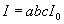
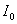
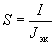
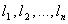
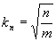

## Глава 1.3

# ВЫБОР ПРОВОДНИКОВ ПО НАГРЕВУ, ЭКОНОМИЧЕСКОЙ ПЛОТНОСТИ ТОКА И ПО УСЛОВИЯМ КОРОНЫ

# ОБЛАСТЬ ПРИМЕНЕНИЯ

1.3.1. Настоящая глава Правил распространяется на выбор сечений электрических проводников (неизолированные и изолированные провода, кабели и шины) по нагреву, экономической плотности тока и по условиям короны. Если сечение проводника, определенное по этим условиям, получается меньше сечения, требуемого по другим условиям (термическая и электродинамическая стойкость при токах КЗ, потери и отклонения напряжения, механическая прочность, защита от перегрузки), то должно приниматься наибольшее сечение, требуемое этими условиями.

# ВЫБОР СЕЧЕНИЙ ПРОВОДНИКОВ ПО НАГРЕВУ

1.3.2. Проводники любого назначения должны удовлетворять требованиям в отношении предельно допустимого нагрева с учетом не только нормальных, но и послеаварийных режимов, а также режимов в период ремонта и возможных неравномерностей распределения токов между линиями, секциями шин и т. п. При проверке на нагрев принимается получасовой максимум тока, наибольший из средних получасовых токов данного элемента сети.

1.3.3. При повторно-кратковременном и кратковременном режимах работы электроприемников (с общей длительностью цикла до 10 мин и длительностью рабочего периода не более 4 мин) в качестве расчетного тока для проверки сечения проводников по нагреву следует принимать ток, приведенный к длительному режиму. При этом:

1) для медных проводников сечением до 6 мм, а для алюминиевых проводников до 10 мм ток принимается как для установок с длительным режимом работы;

2) для медных проводников сечением более 6 мм, а для алюминиевых проводников более 10 мм ток определяется умножением допустимого длительного тока на коэффициент , где  - выраженная в относительных единицах длительность рабочего периода (продолжительность включения по отношению к продолжительности цикла).

1.3.4. Для кратковременного режима работы с длительностью включения не более 4 мин и перерывами между включениями, достаточными для охлаждения проводников до температуры окружающей среды, наибольшие допустимые токи следует определять по нормам повторно - кратковременного режима (см. 1.3.3). При длительности включения более 4 мин, а также при перерывах недостаточной длительности между включениями наибольшие допустимые токи следует определять как для установок с длительным режимом работы.

1.3.5. Для кабелей напряжением до 10 кВ с бумажной пропитанной изоляцией, несущих нагрузки меньше номинальных, может допускаться кратковременная перегрузка, указанная в табл. 1.3.1.

1.3.6. На период ликвидации послеаварийного режима для кабелей с полиэтиленовой изоляцией допускается перегрузка до 10%, а для кабелей с поливинилхлоридной изоляцией до 15% номинальной на время максимумов нагрузки продолжительностью не более 6 ч в сутки в течение 5 сут., если нагрузка в остальные периоды времени этих суток не превышает номинальной.

На период ликвидации послеаварийного режима для кабелей напряжением до 10 кВ с бумажной изоляцией допускаются перегрузки в течение 5 сут. в пределах, указанных в табл. 1.3.2.

# Таблица 1.3.1. Допустимая кратковременная перегрузка для кабелей напряжением до 10 кВ с бумажной пропитанной изоляцией

|  |  |  |  |  |
| --- | --- | --- | --- | --- |
|Коэффициент предварительной  нагрузки | Вид прокладки | Допустимая перегрузка по отношению к номинальной в течение, ч | | |
|  |  | 0,5 | 1,0 | 3,0 | |
| 0,6 | В земле | 1,35 | 1,30 | 1,15 | |
|  | В воздухе | 1,25 | 1,15 | 1,10 | |
|  | В трубах (в земле) | 1,20 | 1,0 | 1,0 | |
| 0,8 | В земле | 1,20 | 1,15 | 1,10 | |
|  | В воздухе | 1,15 | 1,10 | 1,05 | |
|  | В трубах (в земле) | 1,10 | 1,05 | 1,00 | |

#

#

# Таблица 1.3.2. Допустимая на период ликвидации послеаварийного режима перегрузка для кабелей напряжением до 10 кВ с бумажной изоляцией

|  |  |  |  |  |  |
| --- | --- | --- | --- | --- | --- |
|Коэффициент предварительной  нагрузки | Вид прокладки | Допустимая перегрузка по отношению к номинальной при длительности максимума, ч | | | |
|  |  | 1 | 3 | 6 |
| 0,6 | В земле | 1,5 | 1,35 | 1,25 |
|  | В воздухе | 1,35 | 1,25 | 1,25 |
|  | В трубах (в земле) | 1,30 | 1,20 | 1,15 |
| 0,8 | В земле | 1,35 | 1,25 | 1,20 |
|  | В воздухе | 1,30 | 1,25 | 1,25 |
|  | В трубах (в земле) | 1,20 | 1,15 | 1,10 |

Для кабельных линий, находящихся в эксплуатации более 15 лет, перегрузки должны быть понижены на 10%.

Перегрузка кабельных линий напряжением 20-35 кВ не допускается.

1.3.7. Требования к нормальным нагрузкам и послеаварийным перегрузкам относятся к кабелям и установленным на них соединительным и концевым муфтам и концевым заделкам.

1.3.8. Нулевые рабочие проводники в четырехпроводной системе трехфазного тока должны иметь проводимость не менее 50% проводимости фазных проводников; в необходимых случаях она должна быть увеличена до 100% проводимости фазных проводников.

1.3.9. При определении допустимых длительных токов для кабелей, неизолированных и изолированных проводов и шин, а также для жестких и гибких токопроводов, проложенных в среде, температура которой существенно отличается от приведенной в 1.3.12-1.3.15 и 1.3.22, следует применять коэффициенты, приведенные в табл. 1.3.3.

# Таблица 1.3.3. Поправочные коэффициенты на токи для кабелей, неизолированных и изолированных проводов и шин в зависимости от температуры земли и воздуха

|  |  |  |  |  |  |  |  |  |  |  |  |  |  |
| --- | --- | --- | --- | --- | --- | --- | --- | --- | --- | --- | --- | --- | --- |
|Условная температура среды, °С | Нормированная температура жил, °С | Поправочные коэффициенты на токи  при расчетной температуре среды, °С | | | | | | | | | | | |
|  |  | -5 и ниже | 0 | +5 | +10 | +15 | +20 | +25 | +30 | +35 | +40 | +45 | +50 |
| 15 | 80 | 1,14 | 1,11 | 1,08 | 1,04 | 1,00 | 0,96 | 0,92 | 0,88 | 0,83 | 0,78 | 0,73 | 0,68 |
| 25 | 80 | 1,24 | 1,20 | 1,17 | 1,13 | 1,09 | 1,04 | 1,00 | 0,95 | 0,90 | 0,85 | 0,80 | 0,74 |
| 25 | 70 | 1,29 | 1,24 | 1,20 | 1,15 | 1,11 | 1,05 | 1,00 | 0,94 | 0,88 | 0,81 | 0,74 | 0,67 |
| 15 | 65 | 1,18 | 1,14 | 1,10 | 1,05 | 1,00 | 0,95 | 0,89 | 0,84 | 0,77 | 0,71 | 0,63 | 0,55 |
| 25 | 65 | 1,32 | 1,27 | 1,22 | 1,17 | 1,12 | 1,06 | 1,00 | 0,94 | 0,87 | 0,79 | 0,71 | 0,61 |
| 15 | 60 | 1,20 | 1,15 | 1,12 | 1,06 | 1,00 | 0,94 | 0,88 | 0,82 | 0,75 | 0,67 | 0,57 | 0,47 |
| 25 | 60 | 1,36 | 1,31 | 1,25 | 1,20 | 1,13 | 1,07 | 1,00 | 0,93 | 0,85 | 0,76 | 0,66 | 0,54 |
| 15 | 55 | 1,22 | 1,17 | 1,12 | 1,07 | 1,00 | 0,93 | 0,86 | 0,79 | 0,71 | 0,61 | 0,50 | 0,36 |
| 25 | 55 | 1,41 | 1,35 | 1,29 | 1,23 | 1,15 | 1,08 | 1,00 | 0,91 | 0,82 | 0,71 | 0,58 | 0,41 |
| 15 | 50 | 1,25 | 1,20 | 1,14 | 1,07 | 1,00 | 0,93 | 0,84 | 0,76 | 0,66 | 0,54 | 0,37 | - |
| 25 | 50 | 1,48 | 1,41 | 1,34 | 1,26 | 1,18 | 1,09 | 1,00 | 0,89 | 0,78 | 0,63 | 0,45 | - |

#

#

# ДОПУСТИМЫЕ ДЛИТЕЛЬНЫЕ ТОКИ ДЛЯ ПРОВОДОВ, ШНУРОВ И КАБЕЛЕЙ С РЕЗИНОВОЙ ИЛИ ПЛАСТМАССОВОЙ ИЗОЛЯЦИЕЙ

1.3.10. Допустимые длительные токи для проводов с резиновой или поливинилхлоридной изоляцией, шнуров с резиновой изоляцией и кабелей с резиновой или пластмассовой изоляцией в свинцовой, поливинилхлоридной и резиновой оболочках приведены в табл. 1.3.4-1.3.11. Они приняты для температур: жил +65, окружающего воздуха +25 и земли + 15°С.

При определении количества проводов, прокладываемых в одной трубе (или жил многожильного проводника), нулевой рабочий проводник четырехпроводной системы трехфазного тока, а также заземляющие и нулевые защитные проводники в расчет не принимаются.

Данные, содержащиеся в табл. 1.3.4 и 1.3.5, следует применять независимо от количества труб и места их прокладки (в воздухе, перекрытиях, фундаментах).

Допустимые длительные токи для проводов и кабелей, проложенных в коробах, а также в лотках пучками, должны приниматься: для проводов - по табл. 1.3.4 и 1.3.5 как для проводов, проложенных в трубах, для кабелей - по табл. 1.3.6-1.3.8 как для кабелей, проложенных в воздухе. При количестве одновременно нагруженных проводов более четырех, проложенных в трубах, коробах, а также в лотках пучками, токи для проводов должны приниматься по табл. 1.3.4 и 1.3.5 как для проводов, проложенных открыто (в воздухе), с введением снижающих коэффициентов 0,68 для 5 и 6; 0,63 для 7-9 и 0,6 для 10-12 проводников.

Для проводов вторичных цепей снижающие коэффициенты не вводятся.

# Таблица 1.3.4. Допустимый длительный ток для проводов и шнуров с резиновой и поливинилхлоридной изоляцией с медными жилами

|  |  |  |  |  |  |  |
| --- | --- | --- | --- | --- | --- | --- |
|| Ток, А, для проводов, проложенных | | | | | |
| Сечение токо-  проводящей жилы, мм|  | в одной трубе | | | | |
|  | открыто | двух одно-  жильных | трех одно-  жильных | четырех одно-  жильных | одного  двух-  жильного | одного трех-  жильного |
| 0,5 | 11 | - | - | - | - | - |
| 0,75 | 15 | - | - | - | - | - |
| 1 | 17 | 16 | 15 | 14 | 15 | 14 |
| 1,2 | 20 | 18 | 16 | 15 | 16 | 14,5 |
| 1,5 | 23 | 19 | 17 | 16 | 18 | 15 |
| 2 | 26 | 24 | 22 | 20 | 23 | 19 |
| 2,5 | 30 | 27 | 25 | 25 | 25 | 21 |
| 3 | 34 | 32 | 28 | 26 | 28 | 24 |
| 4 | 41 | 38 | 35 | 30 | 32 | 27 |
| 5 | 46 | 42 | 39 | 34 | 37 | 31 |
| 6 | 50 | 46 | 42 | 40 | 40 | 34 |
| 8 | 62 | 54 | 51 | 46 | 48 | 43 |
| 10 | 80 | 70 | 60 | 50 | 55 | 50 |
| 16 | 100 | 85 | 80 | 75 | 80 | 70 |
| 25 | 140 | 115 | 100 | 90 | 100 | 85 |
| 35 | 170 | 135 | 125 | 115 | 125 | 100 |
| 50 | 215 | 185 | 170 | 150 | 160 | 135 |
| 70 | 270 | 225 | 210 | 185 | 195 | 175 |
| 95 | 330 | 275 | 255 | 225 | 245 | 215 |
| 120 | 385 | 315 | 290 | 260 | 295 | 250 |
| 150 | 440 | 360 | 330 | - | - | - |
| 185 | 510 | - | - | - | - | - |
| 240 | 605 | - | - | - | - | - |
| 300 | 695 | - | - | - | - | - |
| 400 | 830 | - | - | - | - | - |

#

#

# Таблица 1.3.5. Допустимый длительный ток для проводов с резиновой и поливинилхлоридной изоляцией с алюминиевыми жилами

|  |  |  |  |  |  |  |
| --- | --- | --- | --- | --- | --- | --- |
|| Ток, А, для проводов, проложенных | | | | | |
| Сечение токо-  проводящей жилы , мм|  | в одной трубе | | | | |
|  | открыто | двух одно-  жильных | трех одно-  жильных | четырех одно-  жильных | одного  двух-  жильного | одного трех-  жильного |
| 2 | 21 | 19 | 18 | 15 | 17 | 14 |
| 2,5 | 24 | 20 | 19 | 19 | 19 | 16 |
| 3 | 27 | 24 | 22 | 21 | 22 | 18 |
| 4 | 32 | 28 | 28 | 23 | 25 | 21 |
| 5 | 36 | 32 | 30 | 27 | 28 | 24 |
| 6 | 39 | 36 | 32 | 30 | 31 | 26 |
| 8 | 46 | 43 | 40 | 37 | 38 | 32 |
| 10 | 60 | 50 | 47 | 39 | 42 | 38 |
| 16 | 75 | 60 | 60 | 55 | 60 | 55 |
| 25 | 105 | 85 | 80 | 70 | 75 | 65 |
| 35 | 130 | 100 | 95 | 85 | 95 | 75 |
| 50 | 165 | 140 | 130 | 120 | 125 | 105 |
| 70 | 210 | 175 | 165 | 140 | 150 | 135 |
| 95 | 255 | 215 | 200 | 175 | 190 | 165 |
| 120 | 295 | 245 | 220 | 200 | 230 | 190 |
| 150 | 340 | 275 | 255 | - | - | - |
| 185 | 390 | - | - | - | - | - |
| 240 | 465 | - | - | - | - | - |
| 300 | 535 | - | - | - | - | - |
| 400 | 645 | - | - | - | - | - |

#

#

# Таблица 1.3.6. Допустимый длительный ток для проводов с медными жилами с резиновой изоляцией в металлических защитных оболочках и кабелей с медными жилами с резиновой изоляцией в свинцовой, поливинилхлоридной, найритовой или резиновой оболочке, бронированных и небронированных

|  |  |  |  |  |  |
| --- | --- | --- | --- | --- | --- |
|| Ток \*, А, для проводов и кабелей | | | | |
| Сечение токопроводящей жилы, мм| одно-  жильных | двух-  жильных | | трех-  жильных | |
|  | при прокладке | | | | |
|  | в воздухе | в воздухе | в земле | в воздухе | в земле |
| 1,5 | 23 | 19 | 33 | 19 | 27 |
| 2,5 | 30 | 27 | 44 | 25 | 38 |
| 4 | 41 | 38 | 55 | 35 | 49 |
| 6 | 50 | 50 | 70 | 42 | 60 |
| 10 | 80 | 70 | 105 | 55 | 90 |
| 16 | 100 | 90 | 135 | 75 | 115 |
| 25 | 140 | 115 | 175 | 95 | 150 |
| 35 | 170 | 140 | 210 | 120 | 180 |
| 50 | 215 | 175 | 265 | 145 | 225 |
| 70 | 270 | 215 | 320 | 180 | 275 |
| 95 | 325 | 260 | 385 | 220 | 330 |
| 120 | 385 | 300 | 445 | 260 | 385 |
| 150 | 440 | 350 | 505 | 305 | 435 |
| 185 | 510 | 405 | 570 | 350 | 500 |
| 240 | 605 | - | - | - | - |
| \_\_\_\_\_\_\_\_\_\_\_  \* Токи относятся к проводам и кабелям как с нулевой жилой, так и без нее. | | | | | |
#

#

# Таблица 1.3.7. Допустимый длительный ток для кабелей с алюминиевыми жилами с резиновой или пластмассовой изоляцией в свинцовой, поливинилхлоридной и резиновой оболочках, бронированных и небронированных

|  |  |  |  |  |  |
| --- | --- | --- | --- | --- | --- |
|| Ток, А, для кабелей | | | | |
| Сечение токопро-  водящей | одно-  жильных | двух-  жильных | | трех-  жильных | |
| жилы, мм| при прокладке | | | | |
|  | в воздухе | в воздухе | в земле | в воздухе | в земле |
| 2,5 | 23 | 21 | 34 | 19 | 29 |
| 4 | 31 | 29 | 42 | 27 | 38 |
| 6 | 38 | 38 | 55 | 32 | 46 |
| 10 | 60 | 55 | 80 | 42 | 70 |
| 16 | 75 | 70 | 105 | 60 | 90 |
| 25 | 105 | 90 | 135 | 75 | 115 |
| 35 | 130 | 105 | 160 | 90 | 140 |
| 50 | 165 | 135 | 205 | 110 | 175 |
| 70 | 210 | 165 | 245 | 140 | 210 |
| 95 | 250 | 200 | 295 | 170 | 255 |
| 120 | 295 | 230 | 340 | 200 | 295 |
| 150 | 340 | 270 | 390 | 235 | 335 |
| 185 | 390 | 310 | 440 | 270 | 385 |
| 240 | 465 | - | - | - | - |

Примечание. Допустимые длительные токи для четырехжильных кабелей с пластмассовой изоляцией на напряжение до 1 кВ могут выбираться по табл. 1.3.7, как для трехжильных кабелей, но с коэффициентом 0,92.

# Таблица 1.3.8. Допустимый длительный ток для переносных шланговых легких и средних шнуров, переносных шланговых тяжелых кабелей, шахтных гибких шланговых, прожекторных кабелей и переносных проводов с медными жилами

|  |  |  |  |
| --- | --- | --- | --- |
|Сечение токопроводящей жилы, мм | Ток \*, А, для шнуров, проводов и кабелей | | |
|  | одножильных | двухжильных | трехжильных |
| 0,5 | - | 12 | - |
| 0,75 | - | 16 | 14 |
| 1,0 | - | 18 | 16 |
| 1,5 | - | 23 | 20 |
| 2,5 | 40 | 33 | 28 |
| 4 | 50 | 43 | 36 |
| 6 | 65 | 55 | 45 |
| 10 | 90 | 75 | 60 |
| 16 | 120 | 95 | 80 |
| 25 | 160 | 125 | 105 |
| 35 | 190 | 150 | 130 |
| 50 | 235 | 185 | 160 |
| 70 | 290 | 235 | 200 |
| \_\_\_\_\_\_\_\_\_\_\_\_\_\_\_\_  \* Токи относятся к шнурам, проводам и кабелям с нулевой жилой и без нее. | | | |
#

#

# Таблица 1.3.9. Допустимый длительный ток для переносных шланговых с медными жилами с резиновой изоляцией кабелей для торфопредприятий

|  |  |  |  |
| --- | --- | --- | --- |
|Сечение токопроводящей жилы, мм | Ток \*, А, для кабелей напряжением, кВ | | |
|  | 0,5 | 3 | 6 |
| 6 | 44 | 45 | 47 |
| 10 | 60 | 60 | 65 |
| 16 | 80 | 80 | 85 |
| 25 | 100 | 105 | 105 |
| 35 | 125 | 125 | 130 |
| 50 | 155 | 155 | 160 |
| 70 | 190 | 195 | - |
| \_\_\_\_\_\_\_\_\_\_\_\_\_\_\_\_\_\_  \* Токи относятся к кабелям с нулевой жилой и без нее. | | | |
#

#

# Таблица 1.3.10. Допустимый длительный ток для шланговых с медными жилами с резиновой изоляцией кабелей для передвижных электроприемников

|  |  |  |  |  |  |
| --- | --- | --- | --- | --- | --- |
|Сечение токопро-  водящей жилы, мм | Ток \*, А, для кабелей напряжением, кВ | | Сечение токопро-  водящей жилы, мм | Ток \*, А, для кабелей напряжением, кВ | |
|  | 3 | 6 |  | 3 | 6 |
| 16 | 85 | 90 | 70 | 215 | 220 |
| 25 | 115 | 120 | 95 | 260 | 265 |
| 35 | 140 | 145 | 120 | 305 | 310 |
| 50 | 175 | 180 | 150 | 345 | 350 |
| \_\_\_\_\_\_\_\_\_\_\_\_\_\_\_\_\_\_  \* Токи относятся к кабелям с нулевой жилой и без нее. | | | | | |
#

#

# Таблица 1.3.11. Допустимый длительный ток для проводов с медными жилами с резиновой изоляцией для электрифицированного транспорта 1,3 и 4 кВ

|  |  |  |  |  |  |
| --- | --- | --- | --- | --- | --- |
|Сечение токопрово-  дящей жилы, мм | Ток, А | Сечение токопрово-  дящей жилы, мм | Ток, А | Сечение токопрово-  дящей жилы, мм | Ток, А |
| 1 | 20 | 16 | 115 | 120 | 390 |
| 1,5 | 25 | 25 | 150 | 150 | 445 |
| 2,5 | 40 | 35 | 185 | 185 | 505 |
| 4 | 50 | 50 | 230 | 240 | 590 |
| 6 | 65 | 70 | 285 | 300 | 670 |
| 10 | 90 | 95 | 340 | 350 | 745 |

#

#

# Таблица 1.3.12. Снижающий коэффициент для проводов и кабелей, прокладываемых в коробах

|  |  |  |  |  |
| --- | --- | --- | --- | --- |
|| Количество проложенных проводов и кабелей | | Снижающий коэффициент для проводов, питающих | |
| Способ прокладки | одно-  жильных | много-  жильных | отдельные электро-  приемники с коэффициен-  том использова-  ния до 0,7 | группы электро-  приемников и отдельные приемники с коэф-  фициентом исполь-  зования более 0,7 |
| Многослойно и пучками . . . | - | До 4 | 1,0 | - |
|  | 2 | 5-6 | 0,85 | - |
|  | 3-9 | 7-9 | 0,75 | - |
|  | 10-11 | 10-11 | 0,7 | - |
|  | 12-14 | 12-14 | 0,65 | - |
|  | 15-18 | 15-18 | 0,6 | - |
| Однослойно | 2-4 | 2-4 | - | 0,67 |
|  | 5 | 5 | - | 0,6 |

1.3.11. Допустимые длительные токи для проводов, проложенных в лотках, при однорядной прокладке (не в пучках) следует принимать, как для проводов, проложенных в воздухе.

Допустимые длительные токи для проводов и кабелей, прокладываемых в коробах, следует принимать по табл. 1.3.4-1.3.7 как для одиночных проводов и кабелей, проложенных открыто (в воздухе), с применением снижающих коэффициентов, указанных в табл. 1.3.12.

При выборе снижающих коэффициентов контрольные и резервные провода и кабели не учитываются.

# ДОПУСТИМЫЕ ДЛИТЕЛЬНЫЕ ТОКИ ДЛЯ КАБЕЛЕЙ С БУМАЖНОЙ ПРОПИТАННОЙ ИЗОЛЯЦИЕЙ

1.3.12. Допустимые длительные токи для кабелей напряжением до 35 кВ с изоляцией из пропитанной кабельной бумаги в свинцовой, алюминиевой или поливинилхлоридной оболочке приняты в соответствии с допустимыми температурами жил кабелей:

|  |  |  |  |  |
| --- | --- | --- | --- | --- |
|Номинальное напряжение, кВ . . . | До 3 | 6 | 10 | 20 и 35 |
| Допустимая температура жилы кабеля, °С ............... | +80 | +65 | +60 | +50 |

1.3.13. Для кабелей, проложенных в земле, допустимые длительные токи приведены в табл. 1.3.13, 1.3.16, 1.3.19-1.3.22. Они приняты из расчета прокладки в траншее на глубине 0,7-1,0 м не более одного кабеля при температуре земли +15°С и удельном сопротивлении земли 120 см·К/Вт.

# Таблица 1.3.13. Допустимый длительный ток для кабелей с медными жилами с бумажной пропитанной маслоканифольной и нестекающей массами изоляцией в свинцовой оболочке, прокладываемых в земле

|  |  |  |  |  |  |  |  |
| --- | --- | --- | --- | --- | --- | --- | --- |
|Сечение токопро-  водящей жилы, мм | Ток, А, для кабелей | | | | | | |
|  | одно-  жильных до 1 кВ | двух-  жильных до 1 кВ | трехжильных напряжением, кВ | | | | четырех- жильных до 1 кВ |
|  |  |  | до 3 | 6 | 10 |  | |
| 6 | - | 80 | 70 | - | - | - | |
| 10 | 140 | 105 | 95 | 80 | - | 85 | |
| 16 | 175 | 140 | 120 | 105 | 95 | 115 | |
| 25 | 235 | 185 | 160 | 135 | 120 | 150 | |
| 35 | 285 | 225 | 190 | 160 | 150 | 175 | |
| 50 | 360 | 270 | 235 | 200 | 180 | 215 | |
| 70 | 440 | 325 | 285 | 245 | 215 | 265 | |
| 95 | 520 | 380 | 340 | 295 | 265 | 310 | |
| 120 | 595 | 435 | 390 | 340 | 310 | 350 | |
| 150 | 675 | 500 | 435 | 390 | 355 | 395 | |
| 185 | 755 | - | 490 | 440 | 400 | 450 | |
| 240 | 880 | - | 570 | 510 | 460 | - | |
| 300 | 1000 | - | - | - | - | - | |
| 400 | 1220 | - | - | - | - | - | |
| 500 | 1400 | - | - | - | - | - | |
| 625 | 1520 | - | - | - | - | - | |
| 800 | 1700 | - | - | - | - | - | |

#

#

# Таблица 1.3.14. Допустимый длительный ток для кабелей с медными жилами с бумажной пропитанной маслоканифольной и нестекающей массами изоляцией в свинцовой оболочке, прокладываемых в воде

|  |  |  |  |  |  |  |  |
| --- | --- | --- | --- | --- | --- | --- | --- |
|| Ток, А, для кабелей | | | | | | |
| Сечение токопро-  водящей жилы, мм | трехжильных напряжением, кВ | | | | четырех-  жильных  до 1 кВ | |
|  | до 3 | 6 | 10 |  | |
| 16 | - | 135 | 120 | - | |
| 25 | 210 | 170 | 150 | 195 | |
| 35 | 250 | 205 | 180 | 230 | |
| 50 | 305 | 255 | 220 | 285 | |
| 70 | 375 | 310 | 275 | 350 | |
| 95 | 440 | 375 | 340 | 410 | |
| 120 | 505 | 430 | 395 | 470 | |
| 150 | 565 | 500 | 450 | - | |
| 185 | 615 | 545 | 510 | - | |
| 240 | 715 | 625 | 585 | - | |

#

#

# Таблица 1.3.15. Допустимый длительный ток для кабелей с медными жилами с бумажной пропитанной маслоканифольной и нестекающей массами изоляцией в свинцовой оболочке, прокладываемых в воздухе

|  |  |  |  |  |  |  |  |  |  |
| --- | --- | --- | --- | --- | --- | --- | --- | --- | --- |
|Сечение токопро-  водящей жилы, мм | Ток, А, для кабелей | | | | | | | | |
|  | одно- жильных до 1кВ | двух- жильных до 1кВ | трехжильных  напряжением, кВ | | | | четырех- жильных до 1 кВ | |
|  |  |  | до 3 | 6 | 10 |  | |
| 6 | - | 55 | 45 | - | - | - | |
| 10 | 95 | 75 | 60 | 55 | - | 60 | |
| 16 | 120 | 95 | 80 | 65 | 60 | 80 | |
| 25 | 160 | 130 | 105 | 90 | 85 | 100 | |
| 35 | 200 | 150 | 125 | 110 | 105 | 120 | |
| 50 | 245 | 185 | 155 | 145 | 135 | 145 | |
| 70 | 305 | 225 | 200 | 175 | 165 | 185 | |
| 95 | 360 | 275 | 245 | 215 | 200 | 215 | |
| 120  150 | 415  470 | 320  375 | 285  330 | 250  290 | 240  270 | 260  300 | |
| 185 | 525 | - | 375 | 325 | 305 | 340 | |
| 240 | 610 | - | 430 | 375 | 350 | - | |
| 300 | 720 | - | - | - | - | - | |
| 400 | 880 | - | - | - | - | - | |
| 500 | 1020 | - | - | - | - | - | |
| 625 | 1180 | - | - | - | - | - | |
| 800 | 1400 | - | - | - | - | - | |

#

#

# Таблица 1.3.16. Допустимый длительный ток для кабелей с алюминиевыми жилами с бумажной пропитанной маслоканифольной и нестекающей массами изоляцией в свинцовой или алюминиевой оболочке, прокладываемых в земле

|  |  |  |  |  |  |  |  |  |  |
| --- | --- | --- | --- | --- | --- | --- | --- | --- | --- |
|Сечение токопро-  водящей жилы, мм | Ток, А, для кабелей | | | | | | | | |
|  | одно- жильных до 1кВ | двух- жильных до 1кВ | трехжильных  напряжением, кВ | | | | четырех- жильных до 1 кВ | |
|  |  |  | до 3 | 6 | 10 |  | |
| 6 | - | 60 | 55 | - | - | - | |
| 10 | 110 | 80 | 75 | 60 | - | 65 | |
| 16 | 135 | 110 | 90 | 80 | 75 | 90 | |
| 25 | 180 | 140 | 125 | 105 | 90 | 115 | |
| 35 | 220 | 175 | 145 | 125 | 115 | 135 | |
| 50 | 275 | 210 | 180 | 155 | 140 | 165 | |
| 70 | 340 | 250 | 220 | 190 | 165 | 200 | |
| 95 | 400 | 290 | 260 | 225 | 205 | 240 | |
| 120 | 460 | 335 | 300 | 260 | 240 | 270 | |
| 150 | 520 | 385 | 335 | 300 | 275 | 305 | |
| 185 | 580 | - | 380 | 340 | 310 | 345 | |
| 240 | 675 | - | 440 | 390 | 355 | - | |
| 300 | 770 | - | - | - | - | - | |
| 400 | 940 | - | - | - | - | - | |
| 500 | 1080 | - | - | - | - | - | |
| 625 | 1170 | - | - | - | - | - | |
| 800 | 1310 | - | - | - | - | - | |

#

#

# Таблица 1.3.17. Допустимый длительный ток для кабелей с алюминиевыми жилами с бумажной пропитанной маслоканифольной и нестекающей массами изоляцией в свинцовой оболочке, прокладываемых в воде

|  |  |  |  |  |  |  |  |
| --- | --- | --- | --- | --- | --- | --- | --- |
|| Ток, А, для кабелей | | | | | | |
| Сечение токопро-  водящей  жилы, мм | трехжильных напряжением, кВ | | | | четырех-  жильных  до 1 кВ | |
|  | до 3 | 6 | 10 |  | |
| 16 | - | 105 | 90 | - | |
| 25 | 160 | 130 | 115 | 150 | |
| 35 | 190 | 160 | 140 | 175 | |
| 50 | 235 | 195 | 170 | 220 | |
| 70 | 290 | 240 | 210 | 270 | |
| 95 | 340 | 290 | 260 | 315 | |
| 120 | 390 | 330 | 305 | 360 | |
| 150 | 435 | 385 | 345 | - | |
| 185 | 475 | 420 | 390 | - | |
| 240 | 550 | 480 | 450 | - | |

#

#

# Таблица 1.3.18. Допустимый длительный ток для кабелей с алюминиевыми жилами с бумажной пропитанной маслоканифольной и нестекающей массами изоляцией в свинцовой или алюминиевой оболочке, прокладываемых в воздухе

|  |  |  |  |  |  |  |  |  |  |
| --- | --- | --- | --- | --- | --- | --- | --- | --- | --- |
|| Ток, А, для кабелей | | | | | | | | |
| Сечение токопро-  водящей  жилы, мм | одно-  жильных до 1 кВ | двух-  жильных до 1 кВ | трехжильных  напряжением, кВ | | | | четырех-  жильных до 1 кВ | |
|  |  |  | до 3 | 6 | 10 |  | |
| 6 | - | 42 | 35 | - | - | - | |
| 10 | 75 | 55 | 46 | 42 | - | 45 | |
| 16 | 90 | 75 | 60 | 50 | 46 | 60 | |
| 25 | 125 | 100 | 80 | 70 | 65 | 75 | |
| 35 | 155 | 115 | 95 | 85 | 80 | 95 | |
| 50 | 190 | 140 | 120 | 110 | 105 | 110 | |
| 70 | 235 | 175 | 155 | 135 | 130 | 140 | |
| 95 | 275 | 210 | 190 | 165 | 155 | 165 | |
| 120 | 320 | 245 | 220 | 190 | 185 | 200 | |
| 150 | 360 | 290 | 255 | 225 | 210 | 230 | |
| 185 | 405 | - | 290 | 250 | 235 | 260 | |
| 240 | 470 | - | 330 | 290 | 270 | - | |
| 300 | 555 | - | - | - | - | - | |
| 400 | 675 | - | - | - | - | - | |
| 500 | 785 | - | - | - | - | - | |
| 625 | 910 | - | - | - | - | - | |
| 800 | 1080 | - | - | - | - | - | |

#

#

# Таблица 1.3.19. Допустимый длительный ток для трехжильных кабелей напряжением 6 кВ с медными жилами с обедненнопропитанной изоляцией в общей свинцовой оболочке, прокладываемых в земле и воздухе

|  |  |  |  |  |  |  |  |
| --- | --- | --- | --- | --- | --- | --- | --- |
|Сечение токопро-  водящей  жилы, мм | Ток, А, для кабелей проложенных | | Сечение токопро-  водящей  жилы, мм | | Ток, А, для кабелей проложенных | | |
|  | в земле | в воздухе | |  | | в земле | в воздухе |
| 16 | 90 | 65 | | 70 | | 220 | 170 |
| 25 | 120 | 90 | | 95 | | 265 | 210 |
| 35 | 145 | 110 | | 120 | | 310 | 245 |
| 50 | 180 | 140 | | 150 | | 355 | 290 |

#

#

# Таблица 1.3.20. Допустимый длительный ток для трехжильных кабелей напряжением 6 кВ с алюминиевыми жилами с обедненнопропитанной изоляцией в общей свинцовой оболочке, прокладываемых в земле и воздухе

|  |  |  |  |  |  |
| --- | --- | --- | --- | --- | --- |
|Сечение токопро-  водящей  жилы, мм | Ток, А, для кабелей проложенных | | Сечение токопро-  водящей  жилы, мм | Ток, А, для кабелей проложенных | |
|  | в земле | в воздухе |  | в земле | в воздухе | |
| 16 | 70 | 50 | 70 | 170 | 130 | |
| 25 | 90 | 70 | 95 | 205 | 160 | |
| 35 | 110 | 85 | 120 | 240 | 190 | |
| 50 | 140 | 110 | 150 | 275 | 225 | |

#

#

# Таблица 1.3.21. Допустимый длительный ток для кабелей с отдельно освинцованными медными жилами с бумажной пропитанной маслоканифольной и нестекающей массами изоляцией, прокладываемых в земле, воде, воздухе

|  |  |  |  |  |  |  |
| --- | --- | --- | --- | --- | --- | --- |
|| Ток, А, для трехжильных кабелей напряжением, кВ | | | | | |
| Сечение токопро- | 20 | | | 35 | | |
| водящей  жилы, мм | при прокладке | | | | | |
|  | в земле | в воде | в воздухе | в земле | в воде | в воздухе |
| 25 | 110 | 120 | 85 | - | - | - |
| 35 | 135 | 145 | 100 | - | - | - |
| 50 | 165 | 180 | 120 | - | - | - |
| 70 | 200 | 225 | 150 | - | - | - |
| 95 | 240 | 275 | 180 | - | - | - |
| 120 | 275 | 315 | 205 | 270 | 290 | 205 |
| 150 | 315 | 350 | 230 | 310 | - | 230 |
| 185 | 355 | 390 | 265 | - | - | - |

#

#

# Таблица 1.3.22. Допустимый длительный ток для кабелей с отдельно освинцованными алюминиевыми жилами с бумажной пропитанной маслоканифольной и нестекающей массами изоляцией, прокладываемых в земле, воде, воздухе

|  |  |  |  |  |  |  |
| --- | --- | --- | --- | --- | --- | --- |
|| Ток, А, для трехжильных кабелей напряжением, кВ | | | | | |
| Сечение токопро- | 20 | | | 35 | | |
| водящей  жилы, ммimg_29eb624d_26.png | при прокладке | | | | | |
|  | в земле | в воде | в воздухе | в земле | в воде | в воздухе |
| 25 | 85 | 90 | 65 | - | - | - |
| 35 | 105 | 110 | 75 | - | - | - |
| 50 | 125 | 140 | 90 | - | - | - |
| 70 | 155 | 175 | 115 | - | - | - |
| 95 | 185 | 210 | 140 | - | - | - |
| 120 | 210 | 245 | 160 | 210 | 225 | 160 |
| 150 | 240 | 270 | 175 | 240 | - | 175 |
| 185 | 275 | 300 | 205 | - | - | - |

#

#

# Таблица 1.3.23. Поправочный коэффициент на допустимый длительный ток для кабелей, проложенных в земле, в зависимости от удельного сопротивления земли

|  |  |  |
| --- | --- | --- |
|Характеристика земли | Удельное сопротивление см·К/Вт | Поправочный коэффициент |
| Песок влажностью более 9% песчано-глинистая почва влажностью более 1% | 80 | 1,05 |
| Нормальные почва и песок влажностью 7-9%, песчано-глинистая почва влажностью 12-14% | 120 | 1,00 |
| Песок влажностью более 4 и менее 7%, песчано-глинистая почва влажностью 8-12% | 200 | 0,87 |
| Песок влажностью до 4%, каменистая почва | 300 | 0,75 |

При удельном сопротивлении земли, отличающемся от 120 см·К/Вт, необходимо к токовым нагрузкам, указанным в упомянутых ранее таблицах, применять поправочные коэффициенты, указанные в табл. 1.3.23.

1.3.14. Для кабелей, проложенных в воде, допустимые длительные токи приведены в табл. 1.3.14, 1.3.17, 1.3.21, 1.3.22. Они приняты из расчета температуры воды +15°С.

1.3.15. Для кабелей, проложенных в воздухе, внутри и вне зданий, при любом количестве кабелей и температуре воздуха +25°С допустимые длительные токи приведены в табл. 1.3.15, 1.3.18-1.3.22, 1.3.24, 1.3.25.

1.3.16. Допустимые длительные токи для одиночных кабелей, прокладываемых в трубах в земле, должны приниматься как для тех же кабелей, прокладываемых в воздухе, при температуре, равной температуре земли.

# Таблица 1.3.24. Допустимый длительный ток для одножильных кабелей с медной жилой с бумажной пропитанной маслоканифольной и нестекающей массами изоляцией в свинцовой оболочке, небронированных, прокладываемых в воздухе

|  |  |  |  |
| --- | --- | --- | --- |
|Сечение токопроводящей жилы, ммimg_29eb624d_27.png | Ток \*, А, для кабелей напряжением, кВ | | |
|  | до 3 | 20 | 35 |
| \_\_\_\_\_\_\_\_\_\_\_\_\_\_\_\_\_\_\_\_\_\_  \* В числителе указаны токи для кабелей, расположенных в одной плоскости с расстоянием в свету 35-125 мм, в знаменателе - для кабелей, расположенных вплотную треугольником. | | | |
| 10 | 85/- | - | - |
| 16 | 120/- | - | - |
| 25 | 145/- | 105/110 | - |
| 35 | 170/- | 125/135 | - |
| 50 | 215/- | 155/165 | - |
| 70 | 260/- | 185/205 | - |
| 95 | 305/- | 220/255 | - |
| 120 | 330/- | 245/290 | 240/265 |
| 150 | 360/- | 270/330 | 265/300 |
| 185 | 385/- | 290/360 | 285/335 |
| 240 | 435/- | 320/395 | 315/380 |
| 300 | 460/- | 350/425 | 340/420 |
| 400 | 485/- | 370/450 | - |
| 500 | 505/- | - | - |
| 625 | 525/- | - | - |
| 800 | 550/- | - | - |

1.3.17. При смешанной прокладке кабелей допустимые длительные токи должны приниматься для участка трассы с наихудшими условиями охлаждения, если длина его более 10 м. Рекомендуется применять в указанных случаях кабельные вставки большего сечения.

1.3.18. При прокладке нескольких кабелей в земле (включая прокладку в трубах) допустимые длительные токи должны быть уменьшены путем введения коэффициентов, приведенных в табл. 1.3.26. При этом не должны учитываться резервные кабели.

Прокладка нескольких кабелей в земле с расстояниями между ними менее 100 мм в свету не рекомендуется.

1.3.19. Для масло- и газонаполненных одножильных бронированных кабелей, а также других кабелей новых конструкций допустимые длительные токи устанавливаются заводами-изготовителями.

1.3.20. Допустимые длительные токи для кабелей, прокладываемых в блоках, следует определять по эмпирической формуле

,

где  - допустимый длительный ток для трехжильного кабеля напряжением 10 кВ с медными или алюминиевыми жилами, определяемый по табл. 1.3.27;  - коэффициент, выбираемый по табл. 1.3.28 в зависимости от сечения и расположения кабеля в блоке;  - коэффициент, выбираемый в зависимости от напряжения кабеля:

|  |  |  |  |
| --- | --- | --- | --- |
|Номинальное напряжение кабеля, кВ +.. | До 3 | 6 | 10 |
| Коэффициент img_c5beef66_1.png ..........++++++... | 1,09 | 1,05 | 1,0 |

 - коэффициент, выбираемый в зависимости от среднесуточной загрузки всего блока:

|  |  |  |  |
| --- | --- | --- | --- |
|Среднесуточная загрузка img_05bfe005.png........... | 1 | 0,85 | 0,7 |
| Коэффициент img_7fe93ba9_1.png+++++++++..+ | 1 | 1,07 | 1,16 |

#

#

# Таблица 1.3.25. Допустимый длительный ток для одножильных кабелей с алюминиевой жилой с бумажной пропитанной маслоканифольной и нестекающей массами изоляцией в свинцовой или алюминиевой оболочке, небронированных, прокладываемых в воздухе

|  |  |  |  |
| --- | --- | --- | --- |
|Сечение токопроводящей жилы, ммimg_29eb624d_28.png | Ток \*, А, для кабелей напряжением, кВ | | |
|  | до 3 | 20 | 35 |
| \_\_\_\_\_\_\_\_\_\_\_\_\_\_\_  \* В числителе указаны токи для кабелей, расположенных в одной плоскости с расстоянием в свету 35-125 мм, в знаменателе - для кабелей, расположенных вплотную треугольником. | | | |
| 10 | 65/- | - | - |
| 16 | 90/- | - | - |
| 25 | 110/- | 80/85 | - |
| 35 | 130/- | 95/105 | - |
| 50 | 165/- | 120/130 | - |
| 70 | 200/- | 140/160 | - |
| 95 | 235/- | 170/195 | - |
| 120 | 255/- | 190/225 | 185/205 |
| 150 | 275/- | 210/255 | 205/230 |
| 185 | 295/- | 225/275 | 220/255 |
| 240 | 335/- | 245/305 | 245/290 |
| 300 | 355/- | 270/330 | 260/330 |
| 400 | 375/- | 285/350 | - |
| 500 | 390/- | - | - |
| 625 | 405/- | - | - |
| 800 | 425/- | - | - |

# Таблица 1.3.26. Поправочный коэффициент на количество работающих кабелей, лежащих рядом в земле (в трубах или без труб)

|  |  |  |  |  |  |  |  |
| --- | --- | --- | --- | --- | --- | --- | --- |
|Расстояние  между кабелями в свету, мм | Коэффициент при количестве кабелей | | | | | | |
|  | 1 | 2 | 3 | 4 | 5 | 6 |
| 100 | 1,00 | 0,90 | 0,85 | 0,80 | 0,78 | 0,75 |
| 200 | 1,00 | 0,92 | 0,87 | 0,84 | 0,82 | 0,81 |
| 300 | 1,00 | 0,93 | 0,90 | 0,87 | 0,86 | 0,85 |

#

#

# Таблица 1.3.27. Допустимый длительный ток для кабелей, кВ с медными или алюминиевыми жилами сечением 95 ммimg_29eb624d_29.png, прокладываемых в блоках

# Таблица 1.3.28. Поправочный коэффициент img_b2bfc2e9_1.png на сечение кабеля

|  |  |  |  |  |
| --- | --- | --- | --- | --- |
|Сечение токопро-  водящей  жилы, ммimg_29eb624d_30.png | Коэффициент для номера канала в блоке | | | |
|  | 1 | 2 | 3 | 4 |
| 25 | 0,44 | 0,46 | 0,47 | 0,51 |
| 35 | 0,54 | 0,57 | 0,57 | 0,60 |
| 50 | 0,67 | 0,69 | 0,69 | 0,71 |
| 70 | 0,81 | 0,84 | 0,84 | 0,85 |
| 95 | 1,00 | 1,00 | 1,00 | 1,00 |
| 120 | 1,14 | 1,13 | 1,13 | 1,12 |
| 150 | 1,33 | 1,30 | 1,29 | 1,26 |
| 185 | 1,50 | 1,46 | 1,45 | 1,38 |
| 240 | 1,78 | 1,70 | 1,68 | 1,55 |

Резервные кабели допускается прокладывать в незанумерованных каналах блока, если они работают, когда рабочие кабели отключены.

1.3.21. Допустимые длительные токи для кабелей, прокладываемых в двух параллельных блоках одинаковой конфигурации, должны уменьшаться путем умножения на коэффициенты, выбираемые в зависимости от расстояния между блоками:

|  |  |  |  |  |  |  |
| --- | --- | --- | --- | --- | --- | --- |
|Расстояние между блоками, мм | 500 | 1000 | 1500 | 2000 | 2500 | 3000 |
| Коэффициент ......... | 0,85 | 0,89 | 0,91 | 0,93 | 0,95 | 0,96 |

# ДОПУСТИМЫЕ ДЛИТЕЛЬНЫЕ ТОКИ ДЛЯ НЕИЗОЛИРОВАННЫХ ПРОВОДОВ И ШИН

1.3.22. Допустимые длительные токи для неизолированных проводов и окрашенных шин приведены в табл. 1.3.29-1.3.35. Они приняты из расчета допустимой температуры их нагрева +70°С при температуре воздуха +25°С.

Для полых алюминиевых проводов марок ПА500 и ПА600 допустимый длительный ток следует принимать:

|  |  |  |
| --- | --- | --- |
|Марка провода ......... | ПА500 | Па6000 |
| Ток, А .............. | 1340 | 1680 |

1.3.23. При расположении шин прямоугольного сечения плашмя токи, приведенные в табл. 1.3.33, должны быть уменьшены на 5% для шин с шириной полос до 60 мм и на 8% для шин с шириной полос более 60 мм.

1.3.24. При выборе шин больших сечений необходимо выбирать наиболее экономичные по условиям пропускной способности конструктивные решения, обеспечивающие наименьшие добавочные потери от поверхностного эффекта и эффекта близости и наилучшие условия охлаждения (уменьшение количества полос в пакете, рациональная конструкция пакета, применение профильных шин и т.п.).

# Таблица 1.3.29. Допустимый длительный ток для неизолированных проводов по ГОСТ 839-80

|  |  |  |  |  |  |  |  |  |  |  |  |
| --- | --- | --- | --- | --- | --- | --- | --- | --- | --- | --- | --- |
||  | Ток, А, для проводов марок | | | | | | | | | |
| Номи  нальное сечение, | Сечение (алюми-  ний/ | АС, АСКС,  АСК, АСКП | | М | | А и АКП | | М | | А и АКП | |
| ммimg_29eb624d_31.png | сталь), ммimg_29eb624d_32.png | вне помещений | внутри помещений | | вне помещений | | | внутри помещений | | | |
| 10 | 10/1,8 | 84 | 53 | | 95 | | - | | 60 | | - |
| 16 | 16/2,7 | 111 | 79 | | 133 | | 105 | | 102 | | 75 |
| 25 | 25/4,2 | 142 | 109 | | 183 | | 136 | | 137 | | 106 |
| 35 | 35/6,2 | 175 | 135 | | 223 | | 170 | | 173 | | 130 |
| 50 | 50/8 | 210 | 165 | | 275 | | 215 | | 219 | | 165 |
| 70 | 70/11 | 265 | 210 | | 337 | | 265 | | 268 | | 210 |
| 95 | 95/16 | 330 | 260 | | 422 | | 320 | | 341 | | 255 |
|  | 120/19 | 390 | 313 | | 485 | | 375 | | 395 | | 300 |
| 120 | 120/27 | 375 | - | |  | |  | |  | |  |
|  | 150/19 | 450 | 365 | | 570 | | 440 | | 465 | | 355 |
| 150 | 150/24 | 450 | 365 | |  | |  | |  | |  |
|  | 150/34 | 450 | - | |  | |  | |  | |  |
|  | 185/24 | 520 | 430 | | 650 | | 500 | | 540 | | 410 |
| 185 | 185/29 | 510 | 425 | |  | |  | |  | |  |
|  | 185/43 | 515 | - | |  | |  | |  | |  |
|  | 240/32 | 605 | 505 | | 760 | | 590 | | 685 | | 490 |
| 240 | 240/39 | 610 | 505 | |  | |  | |  | |  |
|  | 240/56 | 610 | - | |  | |  | |  | |  |
|  | 300/39 | 710 | 600 | | 880 | | 680 | | 740 | | 570 |
| 300 | 300/48 | 690 | 585 | |  | |  | |  | |  |
|  | 300/66 | 680 | - | |  | |  | |  | |  |
| 330 | 330/27 | 730 | - | | - | | - | | - | | - |
|  | 400/22 | 830 | 713 | | 1050 | | 815 | | 895 | | 690 |
| 400 | 400/51 | 825 | 705 | |  | |  | |  | |  |
|  | 400/64 | 860 | - | |  | |  | |  | |  |
|  | 500/27 | 960 | 830 | | - | | 980 | | - | | 820 |
| 500 | 500/64 | 945 | 815 | |  | |  | |  | |  |
| 600 | 600/72 | 1050 | 920 | | - | | 1100 | | - | | 955 |
| 700 | 700/86 | 1180 | 1040 | | - | | - | | - | | - |

# Таблица 1.3.30. Допустимый длительный ток для шин круглого и трубчатого сечений

|  |  |  |  |  |  |  |  |  |  |  |  |  |  |  |  |  |  |  |
| --- | --- | --- | --- | --- | --- | --- | --- | --- | --- | --- | --- | --- | --- | --- | --- | --- | --- | --- |
|| Круглые шины | | Медные трубы | | Алюминиевые  трубы | | | | Стальные трубы | | | | | | | | | |
|  | Ток \*, А | |  |  |  | |  | |  | |  | |  | | Переменный ток, А | | | |
| Диаметр, мм | медные | алюми-  ниевые | Внутрен-  ний и наруж-  ный диаметры, мм | Ток, А | Внутрен-  ний и наруж-  ный диа-  метры, мм | | Ток, А | | Условный проход, мм | | Толщина стенки, мм | | Наруж-  ный диаметр, мм | | без разреза | | с про-  дольным разрезом | |
| \_\_\_\_\_\_\_\_\_\_\_\_\_\_\_\_\_\_\_\_  \* В числителе приведены нагрузки при переменном токе, в знаменателе - при постоянном. | | | | | | | | | | | | | | | | | | |
| 6 | 155/155 | 120/120 | 12/15 | 340 | | 13/16 | | 295 | | 8 | | 2,8 | | 13,5 | | 75 | | - | |
| 7 | 195/195 | 150/150 | 14/18 | 460 | | 17/20 | | 345 | | 10 | | 2,8 | | 17,0 | | 90 | | - | |
| 8 | 235/235 | 180/180 | 16/20 | 505 | | 18/22 | | 425 | | 15 | | 3,2 | | 21.3 | | 118 | | - | |
| 10 | 320/320 | 245/245 | 18/22 | 555 | | 27/30 | | 500 | | 20 | | 3,2 | | 26,8 | | 145 | | - | |
| 12 | 415/415 | 320/320 | 20/24 | 600 | | 26/30 | | 575 | | 25 | | 4,0 | | 33,5 | | 180 | | - | |
| 14 | 505/505 | 390/390 | 22/26 | 650 | | 25/30 | | 640 | | 32 | | 4,0 | | 42,3 | | 220 | | - | |
| 15 | 565/565 | 435/435 | 25/30 | 830 | | 36/40 | | 765 | | 40 | | 4,0 | | 48,0 | | 255 | | - | |
| 16 | 610/615 | 475/475 | 29/34 | 925 | | 35/40 | | 850 | | 50 | | 4,5 | | 60,0 | | 320 | | - | |
| 18 | 720/725 | 560/560 | 35/40 | 1100 | | 40/45 | | 935 | | 65 | | 4,5 | | 75,5 | | 390 | | - | |
| 19 | 780/785 | 605/610 | 40/45 | 1200 | | 45/50 | | 1040 | | 80 | | 4,5 | | 88,5 | | 455 | | - | |
| 20 | 835/840 | 650/655 | 45/50 | 1330 | | 50/55 | | 1150 | | 100 | | 5,0 | | 114 | | 670 | | 770 | |
| 21 | 900/905 | 695/700 | 49/55 | 1580 | | 54/60 | | 1340 | | 125 | | 5,5 | | 140 | | 800 | | 890 | |
| 22 | 955/965 | 740/745 | 53/60 | 1860 | | 64/70 | | 1545 | | 150 | | 5,5 | | 165 | | 900 | | 1000 | |
| 25 | 1140/1165 | 885/900 | 62/70 | 2295 | | 74/80 | | 1770 | | - | | - | | - | | - | | - | |
| 27 | 1270/1290 | 980/1000 | 72/80 | 2610 | | 72/80 | | 2035 | | - | | - | | - | | - | | - | |
| 28 | 1325/1360 | 1025/1050 | 75/85 | 3070 | | 75/85 | | 2400 | | - | | - | | - | | - | | - | |
| 30 | 1450/1490 | 1120/1155 | 90/95 | 2460 | | 90/95 | | 1925 | | - | | - | | - | | - | | - | |
| 35 | 1770/1865 | 1370/1450 | 95/100 | 3060 | | 90/100 | | 2840 | | - | | - | | - | | - | | - | |
| 38 | 1960/2100 | 1510/1620 | - | - | | - | | - | | - | | - | | - | | - | | - | |
| 40 | 2080/2260 | 1610/1750 | - | - | | - | | - | | - | | - | | - | | - | | - | |
| 42 | 2200/2430 | 1700/1870 | - | - | | - | | - | | - | | - | | - | | - | | - | |
| 45 | 2380/2670 | 1850/2060 | - | - | | - | | - | | - | | - | | - | | - | | - | |

#

#

# Таблица 1.3.31. Допустимый длительный ток для шин прямоугольного сечения

|  |  |  |  |  |  |  |  |  |  |  |  |  |
| --- | --- | --- | --- | --- | --- | --- | --- | --- | --- | --- | --- | --- |
|| Медные шины | | | | Алюминиевые шины | | | | | Стальные шины | | |
| Размеры,  мм | Ток \*, А, при количестве полос на полюс или фазу | | | | | | | | | | Размеры, мм | Ток \*, А |
|  | 1 | 2 | 3 | 4 | | 1 | 2 | 3 | 4 | |  |  |
| \_\_\_\_\_\_\_\_\_\_\_\_\_\_\_\_  \* В числителе приведены значения переменного тока, в знаменателе - постоянного. | | | | | | | | | | | | |
| 15х3 | 210 | - | - | - | | 165 | - | - | - | | 16х2,5 | 55/70 |
| 20х3 | 275 | - | - | - | | 215 | - | - | - | | 20х2,5 | 60/90 |
| 25х3 | 340 | - | - | - | | 265 | - | - | - | | 25х2,5 | 75/110 |
| 30х4 | 475 | - | - | - | | 365/370 | - | - | - | | 20х3 | 65/100 |
| 40х4 | 625 | -/1090 | - | - | | 480 | -/855 | - | - | | 25х3 | 80/120 |
| 40х5 | 700/705 | -/1250 | - | - | | 540/545 | -/965 | - | - | | 30х3 | 95/140 |
| 50х5 | 860/870 | -/1525 | -/1895 | - | | 665/670 | -/1180 | -/1470 | - | | 40х3 | 125/190 |
| 50х6 | 955/960 | -/1700 | -/2145 | - | | 740/745 | -/1315 | -/1655 | - | | 50х3 | 155/230 |
| 60х6 | 1125/1145 | 1740/1990 | 2240/2495 | - | | 870/880 | 1350/1555 | 1720/1940 | - | | 60х3 | 185/280 |
| 80х6 | 1480/1510 | 2110/2630 | 2720/3220 | - | | 1150/1170 | 1630/2055 | 2100/2460 | - | | 70х3 | 215/320 |
| 100х6 | 1810/1875 | 2470/3245 | 3170/3940 | - | | 1425/1455 | 1935/2515 | 2500/3040 | - | | 75х3 | 230/345 |
| 60х8 | 1320/1345 | 2160/2485 | 2790/3020 | - | | 1025/1040 | 1680/1840 | 2180/2330 | - | | 80х3 | 245/365 |
| 80х8 | 1690/1755 | 2620/3095 | 3370/3850 | - | | 1320/1355 | 2040/2400 | 2620/2975 | - | | 90х3 | 275/410 |
| 100х8 | 2080/2180 | 3060/3810 | 3930/4690 | - | | 1625/1690 | 2390/2945 | 3050/3620 | - | | 100х3 | 305/460 |
| 120х8 | 2400/2600 | 3400/4400 | 4340/5600 | - | | 1900/2040 | 2650/3350 | 3380/4250 | - | | 20х4 | 70/115 |
| 60х10 | 1475/1525 | 2560/2725 | 3300/3530 | - | | 1155/1180 | 2010/2110 | 2650/2720 | - | | 22х4 | 75/125 |
| 80х10 | 1900/1990 | 3100/3510 | 3990/4450 | - | | 1480/1540 | 2410/2735 | 3100/3440 | - | | 25х4 | 85/140 |
| 100х10 | 2310/2470 | 3610/4325 | 4650/5385 | 5300/6060 | | 1820/1910 | 2860/3350 | 3650/4160 | 4150/4400 | | 30х4 | 100/165 |
| 120х10 | 2650/2950 | 4100/5000 | 5200/6250 | 5900/6800 | | 2070/2300 | 3200/3900 | 4100/4860 | 4650/5200 | | 40х4 | 130/220 |
|  |  |  |  |  | |  |  |  |  | | 50х4 | 165/270 |
|  |  |  |  |  | |  |  |  |  | | 60х4 | 195/325 |
|  |  |  |  |  | |  |  |  |  | | 70х4 | 225/375 |
|  |  |  |  |  | |  |  |  |  | | 80х4 | 260/430 |
|  |  |  |  |  | |  |  |  |  | | 90х4 | 290/480 |
|  |  |  |  |  | |  |  |  |  | | 100х4 | 325/535 |

#

# Таблица 1.3.32. Допустимый длительный ток для неизолированных бронзовых и сталебронзовых проводов

|  |  |  |
| --- | --- | --- |
|Провод | Марка провода | Ток \*, А |
| \_\_\_\_\_\_\_\_\_\_\_\_\_\_\_\_  \* Токи даны для бронзы с удельным сопротивлением img_98d27e0f.png=0,03 Ом·ммimg_29eb624d_33.png/м. | | |
| Бронзовый | Б-50 | 215 |
|  | Б-70 | 265 |
|  | Б-95 | 330 |
|  | Б-120 | 380 |
|  | Б-150 | 430 |
|  | Б-185 | 500 |
|  | Б-240 | 600 |
|  | Б-300 | 700 |
| Сталебронзовый | БС-185 | 515 |
|  | БС-240 | 640 |
|  | БС-300 | 750 |
|  | БС-400 | 890 |
|  | БС-500 | 980 |

#

#

# Таблица 1.3.33. Допустимый длительный ток для неизолированных стальных проводов

|  |  |  |  |
| --- | --- | --- | --- |
|Марка провода | Ток, А | Марка провода | Ток, А |
| ПСО-3 | 23 | ПС-25 | 60 |
| ПСО-3,5 | 26 | ПС-35 | 75 |
| ПСО-4 | 30 | ПС-50 | 90 |
| ПСО-5 | 35 | ПС-70 | 125 |
|  |  | ПС-95 | 135 |

#

#

# Таблица 1.3.34. Допустимый длительный ток для четырехполосных шин с расположением полос но сторонам квадрата ("полый пакет")

|  |  |  |  |  |  |  |  |  |  |
| --- | --- | --- | --- | --- | --- | --- | --- | --- | --- |
|Размеры, мм | | | | | Попереч-  ное сечение | | Ток, А, на пакет шин | | |
| img_10364d33.png | img_c5beef66_2.png | img_9da30bf8.png | img_379ec9b1.png | четырех-  полосной шины, ммimg_29eb624d_34.png | | медных | | алюминиевых |
| 80 | 8 | 140 | 157 | 2560 | | 5750 | | 4550 |
| 80 | 10 | 144 | 160 | 3200 | | 6400 | | 5100 |
| 100 | 8 | 160 | 185 | 3200 | | 7000 | | 5550 |
| 100 | 10 | 164 | 188 | 4000 | | 7700 | | 6200 |
| 120 | 10 | 184 | 216 | 4800 | | 9050 | | 7300 |

# Таблица 1.3.35. Допустимый длительный ток для шин коробчатого сечения

|  |  |  |  |  |  |  |  |  |  |
| --- | --- | --- | --- | --- | --- | --- | --- | --- | --- |
|Размеры, мм | | | | | Попе-  речное сечение | | Ток, А, на две шины | | |
| img_b2bfc2e9_2.png | img_c5beef66_3.png | img_7fe93ba9_2.png | img_3a93ac3d.png | одной шины, ммimg_29eb624d_35.png | | медные | | алюми-  ниевые |
| 75 | 35 | 4 | 6 | 520 | | 2730 | | - |
| 75 | 35 | 5,5 | 6 | 695 | | 3250 | | 2670 |
| 100 | 45 | 4,5 | 8 | 775 | | 3620 | | 2820 |
| 100 | 45 | 6 | 8 | 1010 | | 4300 | | 3500 |
| 125 | 55 | 6,5 | 10 | 1370 | | 5500 | | 4640 |
| 150 | 65 | 7 | 10 | 1785 | | 7000 | | 5650 |
| 175 | 80 | 8 | 12 | 2440 | | 8550 | | 6430 |
| 200 | 90 | 10 | 14 | 3435 | | 9900 | | 7550 |
| 200 | 90 | 12 | 16 | 4040 | | 10500 | | 8830 |
| 225 | 105 | 12,5 | 16 | 4880 | | 12500 | | 10300 |
| 250 | 115 | 12,5 | 16 | 5450 | | - | | 10800 |

# ВЫБОР СЕЧЕНИЯ ПРОВОДНИКОВ ПО ЭКОНОМИЧЕСКОЙ ПЛОТНОСТИ ТОКА

1.3.25. Сечения проводников должны быть проверены по экономической плотности тока. Экономически целесообразное сечение , мм, определяется из соотношения

,

где  - расчетный ток в час максимума энергосистемы, А;  - нормированное значение экономической плотности тока, А/мм, для заданных условий работы, выбираемое по табл. 1.3.36.

Сечение, полученное в результате указанного расчета, округляется до ближайшего стандартного сечения. Расчетный ток принимается для нормального режима работы, т. е. увеличение тока в послеаварийных и ремонтных режимах сети не учитывается.

1.3.26. Выбор сечений проводов линий электропередачи постоянного и переменного тока напряжением 330 кВ и выше, а также линий межсистемных связей и мощных жестких и гибких токопроводов, работающих с большим числом часов использования максимума, производится на основе технико-экономических расчетов.

1.3.27. Увеличение количества линий или цепей сверх необходимого по условиям надежности электроснабжения в целях удовлетворения экономической плотности тока производится на основе технико-экономического расчета. При этом во избежание увеличения количество линий или цепей допускается двукратное превышение нормированных значений, приведенных в табл. 1.3.36.

# Таблица 1.3.36. Экономическая плотность тока

|  |  |  |  |
| --- | --- | --- | --- |
|Проводники | Экономическая плотность тока, А/ммimg_29eb624d_38.png, при числе часов использования максимума нагрузки в год | | |
|  | более 1000 до 3000 | более 3000 до 5000 | более 5000 |
| Неизолированные провода и шины: |  |  |  |
| медные | 2,5 | 2,1 | 1,8 |
| алюминиевые | 1,3 | 1,1 | 1,0 |
| Кабели с бумажной и провода с резиновой и поливинилхлоридной изоляцией с жилами: |  |  |  |
| медными | 3,0 | 2,5 | 2,0 |
| алюминиевыми | 1,6 | 1,4 | 1,2 |
| Кабели с резиновой и пластмассовой изоляцией с жилами: |  |  |  |
| медными | 3,5 | 3,1 | 2,7 |
| алюминиевыми | 1,9 | 1,7 | 1,6 |

В технико-экономических расчетах следует учитывать все вложения в дополнительную линию, включая оборудование и камеры распределительных устройств на обоих концах линий. Следует также проверять целесообразность повышения напряжения линии.

Данными указаниями следует руководствоваться также при замене существующих проводов проводами большего сечения или при прокладке дополнительных линий для обеспечения экономической плотности тока при росте нагрузки. В этих случаях должна учитываться также полная стоимость всех работ по демонтажу и монтажу оборудования линии, включая стоимость аппаратов и материалов.

1.3.28. Проверке по экономической плотности тока не подлежат:

сети промышленных предприятий и сооружений напряжением до 1 кВ при числе часов использования максимума нагрузки предприятий до 4000-5000;

ответвления к отдельным электроприемникам напряжением до 1 кВ, а также осветительные сети промышленных предприятий, жилых и общественных зданий;

сборные шины электроустановок и ошиновка в пределах открытых и закрытых распределительных устройств всех напряжений;

проводники, идущие к резисторам, пусковым реостатам и т. п.;

сети временных сооружений, а также устройства со сроком службы 3-5 лет.

1.3.29. При пользовании табл. 1.3.36 необходимо руководствоваться следующим (см. также 1.3.27):

1. При максимуме нагрузки в ночное время экономическая плотность тока увеличивается на 40%.

2. Для изолированных проводников сечением 16 мм и менее экономическая плотность тока увеличивается на 40%.

3. Для линий одинакового сечения с  ответвляющимися нагрузками экономическая плотность тока в начале линии может быть увеличена в  раз, причем  определяется из выражения

,

где  - нагрузки отдельных участков линии;  - длины отдельных участков линии;  - полная длина линии.

4. При выборе сечений проводников для питания  однотипных, взаиморезервируемых электроприемников (например, насосов водоснабжения, преобразовательных агрегатов и т. д.), из которых  одновременно находятся в работе, экономическая плотность тока может быть увеличена против значений, приведенных в табл. 1.3.36, в  раз, где равно:

.

1.3.30. Сечение проводов ВЛ 35 кВ в сельской местности, питающих понижающие подстанции 35/6 - 10 кВ с трансформаторами с регулированием напряжения под нагрузкой, должно выбираться по экономической плотности тока. Расчетную нагрузку при выборе сечений проводов рекомендуется принимать на перспективу в 5 лет, считая от года ввода ВЛ в эксплуатацию. Для ВЛ 35 кВ, предназначенных для резервирования в сетях 35 кВ в сельской местности, должны применяться минимальные по длительно допустимому току сечения проводов, исходя из обеспечения питания потребителей электроэнергии в послеаварийных и ремонтных режимах.

1.3.31. Выбор экономических сечений проводов воздушных и жил кабельных линий, имеющих промежуточные отборы мощности, следует производить для каждого из участков, исходя из соответствующих расчетных токов участков. При этом для соседних участков допускается принимать одинаковое сечение провода, соответствующее экономическому для наиболее протяженного участка, если разница между значениями экономического сечения для этих участков находится в пределах одной ступени по шкале стандартных сечений. Сечения проводов на ответвлениях длиной до 1 км принимаются такими же, как на ВЛ, от которой производится ответвление. При большей длине ответвления экономическое сечение определяется по расчетной нагрузке этого ответвления.

1.3.32. Для линий электропередачи напряжением 6-20 кВ приведенные в табл. 1.3.36 значения плотности тока допускается применять лишь тогда, когда они не вызывают отклонения напряжения у приемников электроэнергии сверх допустимых пределов с учетом применяемых средств регулирования напряжения и компенсации реактивной мощности.

# ПРОВЕРКА ПРОВОДНИКОВ ПО УСЛОВИЯМ КОРОНЫ И РАДИОПОМЕХ

1.3.33. При напряжении 35 кВ и выше проводники должны быть проверены по условиям образования короны с учетом среднегодовых значений плотности и температуры воздуха на высоте расположения данной электроустановки над уровнем моря, приведенного радиуса проводника, а также коэффициента негладкости проводников.

При этом наибольшая напряженность поля у поверхности любого из проводников, определенная при среднем эксплуатационном напряжении, должна быть не более 0,9 начальной напряженности электрического поля, соответствующей появлению общей короны.

Проверку следует проводить в соответствии с действующими руководящими указаниями.

Кроме того, для проводников необходима проверка по условиям допустимого уровня радиопомех от короны.