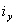

### Глава 1.4

# ВЫБОР ЭЛЕКТРИЧЕСКИХ АППАРАТОВ И ПРОВОДНИКОВ

# ПО УСЛОВИЯМ КОРОТКОГО ЗАМЫКАНИЯ

# ОБЛАСТЬ ПРИМЕНЕНИЯ

1.4.1. Настоящая глава Правил распространяется на выбор и применение по условиям КЗ электрических аппаратов и проводников в электроустановках переменного тока частотой 50 Гц, напряжением до и выше 1 кВ.

# ОБЩИЕ ТРЕБОВАНИЯ

1.4.2. По режиму КЗ должны проверяться (исключения см. в 1.4.3):

1. В электроустановках выше 1 кВ:

а) электрические аппараты, токопроводы, кабели и другие проводники, а также опорные и несущие конструкции для них;

б) воздушные линии электропередачи при ударном токе КЗ 50 кА и более для предупреждения схлестывания проводов при динамическом действии токов КЗ.

Кроме того, для линий с расщепленными проводами должны быть проверены расстояния между распорками расщепленных проводов для предупреждения повреждения распорок и проводов при схлестывании.

Провода ВЛ, оборудованные устройствами быстродействующего автоматического повторного включения, следует проверять и на термическую стойкость.

2. В электроустановках до 1 кВ - только распределительные щиты, токопроводы и силовые шкафы. Трансформаторы тока по режиму КЗ не проверяются.

Аппараты, которые предназначены для отключения токов КЗ или могут по условиям своей работы включать короткозамкнутую цепь, должны, кроме того, обладать способностью производить эти операции при всех возможных токах КЗ.

Стойкими при токах КЗ являются те аппараты и проводники, которые при расчетных условиях выдерживают воздействия этих токов, не подвергаясь электрическим, механическим и иным разрушениям или деформациям, препятствующим их дальнейшей нормальной эксплуатации.

1.4.3. По режиму КЗ при напряжении выше 1 кВ не проверяются:

1. Аппараты и проводники, защищенные плавкими предохранителями с вставками на номинальный ток до 60 А, - по электродинамической стойкости.

2. Аппараты и проводники, защищенные плавкими предохранителями независимо от их номинального тока и типа, - по термической стойкости.

Цепь считается защищенной плавким предохранителем, если его отключающая способность выбрана в соответствии с требованиями настоящих Правил и он способен отключить наименьший возможный аварийный ток в данной цепи.

3. Проводники в цепях к индивидуальным электроприемникам, в том числе к цеховым трансформаторам общей мощностью до 2,5 МВ·А и с высшим напряжением до 20 кВ, если соблюдены одновременно следующие условия:

а) в электрической или технологической части предусмотрена необходимая степень резервирования, выполненного так, что отключение указанных электроприемников не вызывает расстройства технологического процесса;

б) повреждение проводника при КЗ не может вызвать взрыва или пожара;

в) возможна замена проводника без значительных затруднений.

4. Проводники к индивидуальным электроприемникам, указанным в п. 3, а также к отдельным небольшим распределительным пунктам, если такие электроприемники и распределительные пункты являются неответственными по своему назначению и если для них выполнено хотя бы только условие, приведенное в п. 3, б.

5. Трансформаторы тока в цепях до 20 кВ, питающих трансформаторы или реактированные линии, в случаях, когда выбор трансформаторов тока по условиям КЗ требует такого завышения коэффициентов трансформации, при котором не может быть обеспечен необходимый класс точности присоединенных измерительных приборов (например, расчетных счетчиков); при этом на стороне высшего напряжения в цепях силовых трансформаторов рекомендуется избегать применения трансформаторов тока, не стойких к току КЗ, а приборы учета рекомендуется присоединять к трансформаторам тока на стороне низшего напряжения.

6. Провода ВЛ (см. также 1.4.2, п. 1, б).

7. Аппараты и шины цепей трансформаторов напряжения при расположении их в отдельной камере или за добавочным резистором, встроенным в предохранитель или установленным отдельно.

1.4.4. При выборе расчетной схемы для определения токов КЗ следует исходить из предусматриваемых для данной электроустановки условий длительной ее работы и не считаться с кратковременными видоизменениями схемы этой электроустановки, которые не предусмотрены для длительной эксплуатации (например, при переключениях). Ремонтные и послеаварийные режимы работы электроустановки к кратковременным изменениям схемы не относятся.

Расчетная схема должна учитывать перспективу развития внешних сетей и генерирующих источников, с которыми электрически связывается рассматриваемая установка, не менее чем на 5 лет от запланированного срока ввода ее в эксплуатацию.

При этом допустимо вести расчет токов КЗ приближенно для начального момента КЗ.

1.4.5. В качестве расчетного вида КЗ следует принимать:

1. Для определения электродинамической стойкости аппаратов и жестких шин с относящимися к ним поддерживающими и опорными конструкциями - трехфазное КЗ.

2. Для определения термической стойкости аппаратов и проводников - трехфазное КЗ; на генераторном напряжении электростанций - трехфазное или двухфазное в зависимости от того, какое из них приводит к большему нагреву.

3. Для выбора аппаратов по коммутационной способности - по большему из значений, получаемых для случаев трехфазного и однофазного КЗ на землю (в сетях с большими токами замыкания на землю); если выключатель характеризуется двумя значениями коммутационной способности - трехфазной и однофазной - соответственно по обоим значениям.

1.4.6. Расчетный ток КЗ следует определять, исходя из условия повреждения в такой точке рассматриваемой цепи, при КЗ в которой аппараты и проводники этой цепи находятся в наиболее тяжелых условиях (исключения см. в 1.4.7 и 1.4.17, п. 3). Со случаями одновременного замыкания на землю различных фаз в двух разных точках схемы допустимо не считаться.

1.4.7. На реактированных линиях в закрытых распределительных устройствах проводники и аппараты, расположенные до реактора и отделенные от питающих сборных шин (на ответвлениях от линий - от элементов основной цепи) разделяющими полками, перекрытиями и т. п., набираются по току КЗ за реактором, если последний расположен в том же здании и соединение выполнено шинами.

Шинные ответвления от сборных шин до разделяющих полок и проходные изоляторы в последних должны быть выбраны исходя из КЗ до реактора.

1.4.8. При расчете термической стойкости в качестве расчетного времени следует принимать сумму времен, получаемую от сложения времени действия основной защиты (с учетом действия АПВ), установленной у ближайшего к месту КЗ выключателя, и полного времени отключения этого выключателя (включая время горения дуги).

При наличии зоны нечувствительности у основной защиты (по току, напряжению, сопротивлению и т. п.) термическую стойкость необходимо дополнительно проверять, исходя из времени действия защиты, реагирующей на повреждение в этой зоне, плюс полное время отключения выключателя. При этом в качестве расчетного тока КЗ следует принимать то значение его, которое соответствует этому месту повреждения.

Аппаратура и токопроводы, применяемые в цепях генераторов мощностью 60 МВт и более, а также в цепях блоков генератор - трансформатор такой же мощности, должны проверяться по термической стойкости, исходя из времени прохождения тока КЗ 4 с.

# ОПРЕДЕЛЕНИЕ ТОКОВ КОРОТКОГО ЗАМЫКАНИЯ

# ДЛЯ ВЫБОРА АППАРАТОВ И ПРОВОДНИКОВ

1.4.9. В электроустановках до 1 кВ и выше при определении токов КЗ для выбора аппаратов и проводников и определения воздействия на несущие конструкции следует исходить из следующего:

1. Все источники, участвующие в питании рассматриваемой точки КЗ, работают одновременно с номинальной нагрузкой.

2. Все синхронные машины имеют автоматические регуляторы напряжения и устройства форсировки возбуждения.

3. Короткое замыкание наступает в такой момент времени, при котором ток КЗ будет иметь наибольшее значение.

4. Электродвижущие силы всех источников питания совпадают по фазе.

5. Расчетное напряжение каждой ступени принимается на 5% выше номинального напряжения сети.

6. Должно учитываться влияние на токи КЗ присоединенных к данной сети синхронных компенсаторов, синхронных и асинхронных электродвигателей. Влияние асинхронных электродвигателей на токи КЗ не учитывается при мощности электродвигателей до 100 кВт в единице, если электродвигатели отделены от места КЗ одной ступенью трансформации, а также при любой мощности, если они отделены от места КЗ двумя или более ступенями трансформации либо если ток от них может поступать к месту КЗ только через те элементы, через которые проходит основной ток КЗ от сети и которые имеют существенное сопротивление (линии, трансформаторы и т. п.).

1.4.10. В электроустановках выше 1 кВ в качестве расчетных сопротивлений следует принимать индуктивные сопротивления электрических машин, силовых трансформаторов и автотрансформаторов, реакторов, воздушных и кабельных линий, а также токопроводов. Активное сопротивление следует учитывать только для ВЛ с проводами малых сечений и стальными проводами, а также для протяженных кабельных сетей малых сечений с большим активным сопротивлением.

1.4.11. В электроустановках до 1 кВ в качестве расчетных сопротивлений следует принимать индуктивные и активные сопротивления всех элементов цепи, включая активные сопротивления переходных контактов цепи. Допустимо пренебречь сопротивлениями одного вида (активными или индуктивными), если при этом полное сопротивление цепи уменьшается не более чем на 10%.

1.4.12. В случае питания электрических сетей до 1 кВ от понижающих трансформаторов при расчете токов КЗ следует исходить из условия, что подведенное к трансформатору напряжение неизменно и равно его номинальному напряжению.

1.4.1З. Элементы цепи, защищенной плавким предохранителем с токоограничивающим действием, следует проверять на электродинамическую стойкость по наибольшему мгновенному значению тока КЗ, пропускаемого предохранителем.

# ВЫБОР ПРОВОДНИКОВ И ИЗОЛЯТОРОВ, ПРОВЕРКА НЕСУЩИХ

# КОНСТРУКЦИЙ ПО УСЛОВИЯМ ДИНАМИЧЕСКОГО ДЕЙСТВИЯ

# ТОКОВ КОРОТКОГО ЗАМЫКАНИЯ

1.4.14. Усилия, действующие на жесткие шины и передающиеся ими на изоляторы и поддерживающие жесткие конструкции, следует рассчитывать по наибольшему мгновенному значению тока трехфазного КЗ  с учетом сдвига между токами в фазах и без учета механических колебаний шинной конструкции. В отдельных случаях (например, при предельных расчетных механических напряжениях) могут быть учтены механические колебания шин и шинных конструкций.

Импульсы силы, действующие на гибкие проводники и поддерживающие их изоляторы, выводы и конструкции, рассчитываются по среднеквадратическому (за время прохождения) току двухфазного замыкания между соседними фазами. При расщепленных проводниках и гибких токопроводах взаимодействие токов КЗ в проводниках одной и той же фазы определяется по действующему значению тока трехфазного КЗ.

Гибкие токопроводы должны проверяться на схлестывание.

1.4.15. Найденные расчетом в соответствии с 1.4.14 механические усилия, передающиеся при КЗ жесткими шинами на опорные и проходные изоляторы, должны составить в случае применения одиночных изоляторов не более 60% соответствующих гарантийных значений наименьшего разрушающего усилия; при спаренных опорных изоляторах - не более 100% разрушающего усилия одного изолятора.

При применении шин составных профилей (многополосные, из двух швеллеров и т. д.) механические напряжения находятся как арифметическая сумма напряжений от взаимодействия фаз и взаимодействия элементов каждой шины между собой.

Наибольшие механические напряжения в материале жестких шин не должны превосходить 0,7 временного сопротивления разрыву по ГОСТ.

# ВЫБОР ПРОВОДНИКОВ ПО УСЛОВИЯМ НАГРЕВА ПРИ КОРОТКОМ ЗАМЫКАНИИ

1.4.16. Температура нагрева проводников при КЗ должна быть не выше следующих предельно допустимых значений, °С:

Шины:

|  |  |
| --- | --- |
|медные +++++.................................. | 300 |
| алюминиевые ++++............................. | 200 |
| стальные, не имеющие непосредственного соединения с аппаратами .. | 400 |
| стальные с непосредственным присоединением к аппаратам ...++++ | 300 |

Кабели с бумажной пропитанной изоляцией на напряжение, кВ:

|  |  |
| --- | --- |
|до 10 ......+++++++++++.. | 200 |
| 20-220 ++++++++++++.. | 125 |

Кабели и изолированные провода с медными и алюминиевыми жилами и изоляцией:

|  |  |
| --- | --- |
|поливинилхлоридной и резиновой ..+++++++ | 150 |
| полиэтиленовой ++++++++++++ | 120 |

Медные неизолированные провода при тяжениях, Н/мм:

|  |  |
| --- | --- |
|менее 20 +++++++++++++++++++ | 250 |
| 20 и более +++++++++++++++++. | 200 |

Алюминиевые неизолированные провода при тяжениях, Н/мм:

|  |  |
| --- | --- |
|менее 10 +++++++++++ | 200 |
| 10 и более ++++++++++++. | 160 |
| Алюминиевая часть сталеалюминиевых проводов ...... | 200 |

1.4.17. Проверка кабелей на нагрев токами КЗ в тех случаях, когда это требуется в соответствии с 1.4.2 и 1.4.3, должна производиться для:

1) одиночных кабелей одной строительной длины, исходя из КЗ в начале кабеля;

2) одиночных кабелей со ступенчатыми сечениями по длине, исходя из КЗ в начале каждого участка нового сечения;

3) пучка из двух и более параллельно включенных кабелей, исходя из КЗ непосредственно за пучком (по сквозному току КЗ).

1.4.18. При проверке на термическую стойкость аппаратов и проводников линий, оборудованных устройствами быстродействующего АПВ, должно учитываться повышение нагрева из-за увеличения суммарной продолжительности прохождения тока КЗ по таким линиям.

Расщепленные провода ВЛ при проверке на нагрев в условиях КЗ рассматриваются как один провод суммарного сечения.

# ВЫБОР АППАРАТОВ ПО КОММУТАЦИОННОЙ

# СПОСОБНОСТИ

1.4.19. Выключатели выше 1 кВ следует выбирать:

1) по отключающей способности с учетом параметров восстанавливающегося напряжения;

2) по включающей способности. При этом выключатели генераторов, установленные на стороне генераторного напряжения, проверяются только на несинхронное включение в условиях противофазы.

1.4.20. Предохранители следует выбирать по отключающей способности. При этом в качестве расчетного тока следует принимать действующее значение периодической составляющей начального тока КЗ без учета токоограничивающей способности предохранителей.

1.4.21. Выключатели нагрузки и короткозамыкатели следует выбирать по предельно допустимому току, возникающему при включении на КЗ.

1.4.22. Отделители и разъединители не требуется проверять по коммутационной способности при КЗ. При использовании отделителей и разъединителей для отключения-включения ненагруженных линий, ненагруженных трансформаторов или уравнительных токов параллельных цепей отделители и разъединители следует проверять по режиму такого отключения-включения.