## Глава 1.7

# ЗАЗЕМЛЕНИЕ И ЗАЩИТНЫЕ МЕРЫ ЭЛЕКТРОБЕЗОПАСНОСТИ

#

Дата введения 2003-01-01

# Предисловие

РАЗРАБОТАНО с учетом требований государственных стандартов, строительных норм и правил, рекомендаций научно-технических советов по рассмотрению проектов глав. Проекты глав рассмотрены рабочими группами Координационного совета по пересмотру ПУЭ.

ПОДГОТОВЛЕНО ОАО "НИИпроектэлектромонтаж" совместно с Ассоциацией "Росэлектромонтаж", а подглава "Передвижные электроустановки" - при участии ЦНИИИ N 15 МО РФ, подглава "Электроустановки помещений для содержания животных" - при участии ВИЭСХ.

СОГЛАСОВАНО в установленном порядке с Госстроем России, Госгортехнадзором России, РАО "ЕЭС России" (ОАО "ВНИИЭ") и представлено к утверждению Госэнергонадзором Минэнерго России.

УТВЕРЖДЕНО Министерством энергетики Российской Федерации, приказ от 8 июля 2002 г. N 204.Глава 1.7 Правил устройства электроустановок шестого изданияс 1 января 2003 г. утрачивает силу.

"Правила устройства электроустановок" (ПУЭ) седьмого издания в связи с длительным сроком переработки выпускаются и вводятся в действие отдельными разделами и главами по мере завершения работ по их пересмотру, согласованию и утверждению.

Требования Правил устройства электроустановок обязательны для всех организаций независимо от форм собственности и организационно-правовых форм, а также для физических лиц, занятых предпринимательской деятельностью без образования юридического лица.

# Область применения. Термины и определения

1.7.1. Настоящая глава Правил распространяется на все электроустановки переменного и постоянного тока напряжением до 1 кВ и выше и содержит общие требования к их заземлению и защите людей и животных от поражения электрическим током как в нормальном режиме работы электроустановки, так и при повреждении изоляции.

Дополнительные требования приведены в соответствующих главах ПУЭ.

1.7.2. Электроустановки в отношении мер электробезопасности разделяются на:

электроустановки напряжением выше 1 кВ в сетях с глухозаземленной или эффективно заземленной нейтралью (см. 1.2.16);

электроустановки напряжением выше 1 кВ в сетях с изолированной или заземленной через дугогасящий реактор или резистор нейтралью;

электроустановки напряжением до 1 кВ в сетях с глухозаземленной нейтралью;

электроустановки напряжением до 1 кВ в сетях с изолированной нейтралью.

1.7.3. Для электроустановок напряжением до 1 кВ приняты следующие обозначения:

система $$TN$ - система, в которой нейтраль источника питания глухо заземлена, а открытые проводящие части электроустановки присоединены к глухозаземленной нейтрали источника посредством нулевых защитных проводников;

система $TN-C$ - система $TN$, в которой нулевой защитный и нулевой рабочий проводники совмещены в одном проводнике на всем ее протяжении (рис.1.7.1);

Рис.1.7.1. Система $TN-C$ переменного ($a$) и постоянного ($b$) тока.

Нулевой защитный и нулевой рабочий проводники совмещены в одном проводнике:

*1* - заземлитель нейтрали (средней точки) источника питания; *2* - открытые

проводящие части; *3* - источник питания постоянного тока

система - система $TN-S$, в которой нулевой защитный и нулевой рабочий проводники разделены на всем ее протяжении (рис.1.7.2);

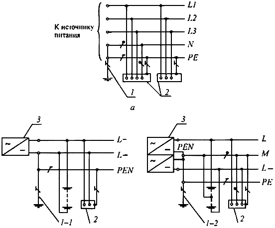

Рис.1.7.2. Система $TN-S$ переменного ($a$) и постоянного ($b$) тока.

Нулевой защитный и нулевой рабочий проводники разделены:

*1* - заземлитель нейтрали источника переменного тока; *1-1*- заземлитель

вывода источника постоянного тока; *1-2* - заземлитель средней точки источника

постоянного тока; *2* - открытые проводящие части; *3* - источник питания

система  - система , в которой функции нулевого защитного и нулевого рабочего проводников совмещены в одном проводнике в какой-то ее части, начиная от источника питания (рис.1.7.3);

Рис.1.7.3. Система  переменного () и постоянного () тока.

Нулевой защитный и нулевой рабочий проводники совмещены в одном

проводнике в части системы:

*1* - заземлитель нейтрали источника переменного тока; *1-1* - заземлитель

вывода источника постоянного тока; *1-2* - заземлитель средней точки источника

постоянного тока; *2* - открытые проводящие части; *3* - источник питания

система  - система, в которой нейтраль источника питания изолирована от земли или заземлена через приборы или устройства, имеющие большое сопротивление, а открытые проводящие части электроустановки заземлены (рис.1.7.4);

Рис.1.7.4. Система  переменного () и постоянного () тока.

Открытые проводящие части электроустановки заземлены. Нейтраль

источника питания изолирована от земли или заземлена через большое

сопротивление:

*1* - сопротивление заземления нейтрали источника питания (если имеется);

*2* - заземлитель; *3* - открытые проводящие части; *4* - заземляющее устройство

электроустановки; *5* - источник питания

система  - система, в которой нейтраль источника питания глухо заземлена, а открытые проводящие части электроустановки заземлены при помощи заземляющего устройства, электрически независимого от глухозаземленной нейтрали источника (рис.1.7.5).

Рис.1.7.5. Система  переменного () и постоянного () тока.

Открытые проводящие части электроустановки заземлены при помощи

заземления, электрически независимого от заземлителя нейтрали:

*1* - заземлитель нейтрали источника переменного тока; *1-1* - заземлитель

вывода источника постоянного тока; *1-2* - заземлитель средней точки источника

постоянного тока; *2* - открытые проводящие части; *3* - заземлитель открытых

проводящих частей электроустановки; *4* - источник питания

Первая буква - состояние нейтрали источника питания относительно земли:

 - заземленная нейтраль;

 - изолированная нейтраль.

Вторая - буква - состояние открытых проводящих частей относительно земли:

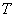 - открытые проводящие части заземлены, независимо от отношения к земле нейтрали источника питания или какой-либо точки питающей сети;

 - открытые проводящие части присоединены к глухозаземленной нейтрали источника питания.

Последующие (после ) буквы - совмещение в одном проводнике или разделение функций нулевого рабочего и нулевого защитного проводников:

 - нулевой рабочий () и нулевой защитный () проводники разделены;

 - функции нулевого защитного и нулевого рабочего проводников совмещены в одном проводнике (-проводник);

 -  - нулевой рабочий (нейтральный) проводник;

 -  - защитный проводник (заземляющий проводник, нулевой защитный проводник, защитный проводник системы уравнивания потенциалов);

 -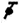 - совмещенный нулевой защитный и нулевой рабочий проводники.

1.7.4. Электрическая сеть с эффективно заземленной нейтралью - трехфазная электрическая сеть напряжением выше 1 кВ, в которой коэффициент замыкания на землю не превышает 1,4.

Коэффициент замыкания на землю в трехфазной электрической сети - отношение разности потенциалов между неповрежденной фазой и землей в точке замыкания на землю другой или двух других фаз к разности потенциалов между фазой и землей в этой точке до замыкания.

1.7.5. Глухозаземленная нейтраль - нейтраль трансформатора или генератора, присоединенная непосредственно к заземляющему устройству. Глухозаземленным может быть также вывод источника однофазного переменного тока или полюс источника постоянного тока в двухпроводных сетях, а также средняя точка в трехпроводных сетях постоянного тока.

1.7.6. Изолированная нейтраль - нейтраль трансформатора или генератора, неприсоединенная к заземляющему устройству или присоединенная к нему через большое сопротивление приборов сигнализации, измерения, защиты и других аналогичных им устройств.

1.7.7. Проводящая часть - часть, которая может проводить электрический ток.

1.7.8. Токоведущая часть - проводящая часть электроустановки, находящаяся в процессе ее работы под рабочим напряжением, в том числе нулевой рабочий проводник (но не -проводник).

1.7.9. Открытая проводящая часть - доступная прикосновению проводящая часть электроустановки, нормально не находящаяся под напряжением, но которая может оказаться под напряжением при повреждении основной изоляции.

1.7.10. Сторонняя проводящая часть - проводящая часть, не являющаяся частью электроустановки.

1.7.11. Прямое прикосновение - электрический контакт людей или животных с токоведущими частями, находящимися под напряжением.

1.7.12. Косвенное прикосновение - электрический контакт людей или животных с открытыми проводящими частями, оказавшимися под напряжением при повреждении изоляции.

1.7.13. Защита от прямого прикосновения - защита для предотвращения прикосновения к токоведущим частям, находящимся под напряжением.

1.7.14. Защита при косвенном прикосновении - защита от поражения электрическим током при прикосновении к открытым проводящим частям, оказавшимся под напряжением при повреждении изоляции.

Термин повреждение изоляции следует понимать как единственное повреждение изоляции.

1.7.15. Заземлитель - проводящая часть или совокупность соединенных между собой проводящих частей, находящихся в электрическом контакте с землей непосредственно или через промежуточную проводящую среду.

1.7.16. Искусственный заземлитель - заземлитель, специально выполняемый для целей заземления.

1.7.17. Естественный заземлитель - сторонняя проводящая часть, находящаяся в электрическом контакте с землей непосредственно или через промежуточную проводящую среду, используемая для целей заземления.

1.7.18. Заземляющий проводник - проводник, соединяющий заземляемую часть (точку) с заземлителем.

1.7.19. Заземляющее устройство - совокупность заземлителя и заземляющих проводников.

1.7.20. Зона нулевого потенциала (относительная земля) - часть земли, находящаяся вне зоны влияния какого-либо заземлителя, электрический потенциал которой принимается равным нулю.

1.7.21. Зона растекания (локальная земля) - зона земли между заземлителем и зоной нулевого потенциала.

Термин земля, используемый в главе, следует понимать как земля в зоне растекания.

1.7.22. Замыкание на землю - случайный электрический контакт между токоведущими частями, находящимися под напряжением, и землей.

1.7.23. Напряжение на заземляющем устройстве - напряжение, возникающее при стекании тока с заземлителя в землю между точкой ввода тока в заземлитель и зоной нулевого потенциала.

1.7.24. Напряжение прикосновения - напряжение между двумя проводящими частями или между проводящей частью и землей при одновременном прикосновении к ним человека или животного.

Ожидаемое напряжение прикосновения - напряжение между одновременно доступными прикосновению проводящими частями, когда человек или животное их не касается.

1.7.25. Напряжение шага - напряжение между двумя точками на поверхности земли, на расстоянии 1 м одна от другой, которое принимается равным длине шага человека.

1.7.26. Сопротивление заземляющего устройства - отношение напряжения на заземляющем устройстве к току, стекающему с заземлителя в землю.

1.7.27. Эквивалентное удельное сопротивление земли с неоднородной структурой - удельное электрическое сопротивление земли с однородной структурой, в которой сопротивление заземляющего устройства имеет то же значение, что и в земле с неоднородной структурой.

Термин удельное сопротивление, используемый в главе для земли с неоднородной структурой, следует понимать как эквивалентное удельное сопротивление.

1.7.28. Заземление - преднамеренное электрическое соединение какой-либо точки сети, электроустановки или оборудования с заземляющим устройством.

1.7.29. Защитное заземление - заземление, выполняемое в целях электробезопасности.

1.7.30. Рабочее (функциональное) заземление - заземление точки или точек токоведущих частей электроустановки, выполняемое для обеспечения работы электроустановки (не в целях электробезопасности).

1.7.31. Защитное зануление в электроустановках напряжением до 1 кВ - преднамеренное соединение открытых проводящих частей с глухозаземленной нейтралью генератора или трансформатора в сетях трехфазного тока, с глухозаземленным выводом источника однофазного тока, с заземленной точкой источника в сетях постоянного тока, выполняемое в целях электробезопасности.

1.7.32. Уравнивание потенциалов - электрическое соединение проводящих частей для достижения равенства их потенциалов.

Защитное уравнивание потенциалов - уравнивание потенциалов, выполняемое в целях электробезопасности.

Термин уравнивание потенциалов, используемый в главе, следует понимать как защитное уравнивание потенциалов.

1.7.33. Выравнивание потенциалов - снижение разности потенциалов (шагового напряжения) на поверхности земли или пола при помощи защитных проводников, проложенных в земле, в полу или на их поверхности и присоединенных к заземляющему устройству, или путем применения специальных покрытий земли.

1.7.34. Защитный () проводник - проводник, предназначенный для целей электробезопасности.

Защитный заземляющий проводник - защитный проводник, предназначенный для защитного заземления.

Защитный проводник уравнивания потенциалов - защитный проводник, предназначенный для защитного уравнивания потенциалов.

Нулевой защитный проводник - защитный проводник в электроустановках до 1 кВ, предназначенный для присоединения открытых проводящих частей к глухозаземленной нейтрали источника питания.

1.7.35. Нулевой рабочий (нейтральный) проводник () - проводник в электроустановках до 1 кВ, предназначенный для питания электроприемников и соединенный с глухозаземленной нейтралью генератора или трансформатора в сетях трехфазного тока, с глухозаземленным выводом источника однофазного тока, с глухозаземленной точкой источника в сетях постоянного тока.

1.7.36. Совмещенные нулевой защитный и нулевой рабочий () проводники - проводники в элетроустановках напряжением до 1 кВ, совмещающие функции нулевого защитного и нулевого рабочего проводников.

1.7.37. Главная заземляющая шина - шина, являющаяся частью заземляющего устройства электроустановки до 1 кВ и предназначенная для присоединения нескольких проводников с целью заземления и уравнивания потенциалов.

1.7.38. Защитное автоматическое отключение питания - автоматическое размыкание цепи одного или нескольких фазных проводников (и, если требуется, нулевого рабочего проводника), выполняемое в целях электробезопасности.

Термин автоматическое отключение питания, используемый в главе, следует понимать как защитное автоматическое отключение питания.

1.7.39. Основная изоляция - изоляция токоведущих частей, обеспечивающая в том числе защиту от прямого прикосновения.

1.7.40. Дополнительная изоляция - независимая изоляция в электроустановках напряжением до 1 кВ, выполняемая дополнительно к основной изоляции для защиты при косвенном прикосновении.

1.7.41. Двойная изоляция - изоляция в электроустановках напряжением до 1 кВ, состоящая из основной и дополнительной изоляций.

1.7.42. Усиленная изоляция - изоляция в электроустановках напряжением до 1 кВ, обеспечивающая степень защиты от поражения электрическим током, равноценную двойной изоляции.

1.7.43. Сверхнизкое (малое) напряжение (СНН) - напряжение, не превышающее 50 В переменного и 120 В постоянного тока.

1.7.44. Разделительный трансформатор - трансформатор, первичная обмотка которого отделена от вторичных обмоток при помощи защитного электрического разделения цепей.

1.7.45. Безопасный разделительный трансформатор - разделительный трансформатор, предназначенный для питания цепей сверхнизким напряжением.

1.7.46. Защитный экран - проводящий экран, предназначенный для отделения электрической цепи и/или проводников от токоведущих частей других цепей.

1.7.47. Защитное электрическое разделение цепей - отделение одной электрической цепи от других цепей в электроустановках напряжением до 1 кВ с помощью:

двойной изоляции;

основной изоляции и защитного экрана;

усиленной изоляции.

1.7.48. Непроводящие (изолирующие) помещения, зоны, площадки - помещения, зоны, площадки, в которых (на которых) защита при косвенном прикосновении обеспечивается высоким сопротивлением пола и стен и в которых отсутствуют заземленные проводящие части.

# Общие требования

1.7.49. Токоведущие части электроустановки не должны быть доступны для случайного прикосновения, а доступные прикосновению открытые и сторонние проводящие части не должны находиться под напряжением, представляющим опасность поражения электрическим током как в нормальном режиме работы электроустановки, так и при повреждении изоляции.

1.7.50. Для защиты от поражения электрическим током в нормальном режиме должны быть применены по отдельности или в сочетании следующие меры защиты от прямого прикосновения:

основная изоляция токоведущих частей;

ограждения и оболочки;

установка барьеров;

размещение вне зоны досягаемости;

применение сверхнизкого (малого) напряжения.

Для дополнительной защиты от прямого прикосновения в электроустановках напряжением до 1 кВ, при наличии требований других глав ПУЭ, следует применять устройства защитного отключения (УЗО) с номинальным отключающим дифференциальным током не более 30 мА.

1.7.51. Для защиты от поражения электрическим током в случае повреждения изоляции должны быть применены по отдельности или в сочетании следующие меры защиты при косвенном прикосновении:

защитное заземление;

автоматическое отключение питания;

уравнивание потенциалов;

выравнивание потенциалов;

двойная или усиленная изоляция;

сверхнизкое (малое) напряжение;

защитное электрическое разделение цепей;

изолирующие (непроводящие) помещения, зоны, площадки.

1.7.52. Меры защиты от поражения электрическим током должны быть предусмотрены в электроустановке или ее части либо применены к отдельным электроприемникам и могут быть реализованы при изготовлении электрооборудования, либо в процессе монтажа электроустановки, либо в обоих случаях.

Применение двух и более мер защиты в электроустановке не должно оказывать взаимного влияния, снижающего эффективность каждой из них.

1.7.53. Защиту при косвенном прикосновении следует выполнять во всех случаях, если напряжение в электроустановке превышает 50 В переменного и 120 В постоянного тока.

В помещениях с повышенной опасностью, особо опасных и в наружных установках выполнение защиты при косвенном прикосновении может потребоваться при более низких напряжениях, например, 25 В переменного и 60 В постоянного тока или 12 В переменного и 30 В постоянного тока при наличии требований соответствующих глав ПУЭ.

Защита от прямого прикосновения не требуется, если электрооборудование находится в зоне системы уравнивания потенциалов, а наибольшее рабочее напряжение не превышает 25 В переменного или 60 В постоянного тока в помещениях без повышенной опасности и 6 В переменного или 15 В постоянного тока во всех случаях.

Примечание. Здесь и далее в главе напряжение переменного тока означает среднеквадратичное значение напряжения переменного тока; напряжение постоянного тока - напряжение постоянного или выпрямленного тока с содержанием пульсаций не более 10% от среднеквадратичного значения.

1.7.54. Для заземления электроустановок могут быть использованы искусственные и естественные заземлители. Если при использовании естественных заземлителей сопротивление заземляющих устройств или напряжение прикосновения имеет допустимое значение, а также обеспечиваются нормированные значения напряжения на заземляющем устройстве и допустимые плотности токов в естественных заземлителях, выполнение искусственных заземлителей в электроустановках до 1 кВ не обязательно. Использование естественных заземлителей в качестве элементов заземляющих устройств не должно приводить к их повреждению при протекании по ним токов короткого замыкания или к нарушению работы устройств, с которыми они связаны.

1.7.55. Для заземления в электроустановках разных назначений и напряжений, территориально сближенных, следует, как правило, применять одно общее заземляющее устройство.

Заземляющее устройство, используемое для заземления электроустановок одного или разных назначений и напряжений, должно удовлетворять всем требованиям, предъявляемым к заземлению этих электроустановок: защиты людей от поражения электрическим током при повреждении изоляции, условиям режимов работы сетей, защиты электрооборудования от перенапряжения и т.д. в течение всего периода эксплуатации.

В первую очередь должны быть соблюдены требования, предъявляемые к защитному заземлению.

Заземляющие устройства защитного заземления электроустановок зданий и сооружений и молниезащиты 2-й и 3-й категорий этих зданий и сооружений, как правило, должны быть общими.

При выполнении отдельного (независимого) заземлителя для рабочего заземления по условиям работы информационного или другого чувствительного к воздействию помех оборудования должны быть приняты специальные меры защиты от поражения электрическим током, исключающие одновременное прикосновение к частям, которые могут оказаться под опасной разностью потенциалов при повреждении изоляции.

Для объединения заземляющих устройств разных электроустановок в одно общее заземляющее устройство могут быть использованы естественные и искусственные заземляющие проводники. Их число должно быть не менее двух.

1.7.56. Требуемые значения напряжений прикосновения и сопротивления заземляющих устройств при стекании с них токов замыкания на землю и токов утечки должны быть обеспечены при наиболее неблагоприятных условиях в любое время года.

При определении сопротивления заземляющих устройств должны быть учтены искусственные и естественные заземлители.

При определении удельного сопротивления земли в качестве расчетного следует принимать его сезонное значение, соответствующее наиболее неблагоприятным условиям.

Заземляющие устройства должны быть механически прочными, термически и динамически стойкими к токам замыкания на землю.

1.7.57. Электроустановки напряжением до 1 кВ жилых, общественных и промышленных зданий и наружных установок должны, как правило, получать питание от источника с глухозаземленной нейтралью с применением системы .

Для защиты от поражения электрическим током при косвенном прикосновении в таких электроустановках должно быть выполнено автоматическое отключение питания в соответствии с 1.7.78-1.7.79.

Требования к выбору систем , , 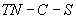 для конкретных электроустановок приведены в соответствующих главах Правил.

1.7.58. Питание электроустановок напряжением до 1 кВ переменного тока от источника с изолированной нейтралью с применением системы  следует выполнять, как правило, при недопустимости перерыва питания при первом замыкании на землю или на открытые проводящие части, связанные с системой уравнивания потенциалов. В таких электроустановках для защиты при косвенном прикосновении при первом замыкании на землю должно быть выполнено защитное заземление в сочетании с контролем изоляции сети или применены УЗО с номинальным отключающим дифференциальным током не более 30 мА. При двойном замыкании на землю должно быть выполнено автоматическое отключение питания в соответствии с 1.7.81.

1.7.59. Питание электроустановок напряжением до 1 кВ от источника с глухозаземленной нейтралью и с заземлением открытых проводящих частей при помощи заземлителя, не присоединенного к нейтрали (система ), допускается только в тех случаях, когда условия электробезопасности в системе  не могут быть обеспечены. Для защиты при косвенном прикосновении в таких электроустановках должно быть выполнено автоматическое отключение питания с обязательным применением УЗО. При этом должно быть соблюдено условие:

 В,

где 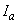 - ток срабатывания защитного устройства;

 - суммарное сопротивление заземлителя и заземляющего проводника, при применении УЗО для защиты нескольких электроприемников - заземляющего проводника наиболее удаленного электроприемника.

1.7.60. При применении защитного автоматического отключения питания должна быть выполнена основная система уравнивания потенциалов в соответствии с 1.7.82, а при необходимости также дополнительная система уравнивания потенциалов в соответствии с 1.7.83.

1.7.61. При применении системы  рекомендуется выполнять повторное заземление - и -проводников на вводе в электроустановки зданий, а также в других доступных местах. Для повторного заземления в первую очередь следует использовать естественные заземлители. Сопротивление заземлителя повторного заземления не нормируется.

Внутри больших и многоэтажных зданий аналогичную функцию выполняет уравнивание потенциалов посредством присоединения нулевого защитного проводника к главной заземляющей шине.

Повторное заземление электроустановок напряжением до 1 кВ, получающих питание по воздушным линиям, должно выполняться в соответствии с 1.7.102-1.7.103.

1.7.62. Если время автоматического отключения питания не удовлетворяет условиям 1.7.78-1.7.79 для системы  и 1.7.81 для системы , то защита при косвенном прикосновении для отдельных частей электроустановки или отдельных электроприемников может быть выполнена применением двойной или усиленной изоляции (электрооборудование класса II), сверхнизкого напряжения (электрооборудование класса III), электрического разделения цепей изолирующих (непроводящих) помещений, зон, площадок.

1.7.63. Система  напряжением до 1 кВ, связанная через трансформатор с сетью напряжением выше 1 кВ, должна быть защищена пробивным предохранителем от опасности, возникающей при повреждении изоляции между обмотками высшего и низшего напряжений трансформатора. Пробивной предохранитель должен быть установлен в нейтрали или фазе на стороне низкого напряжения каждого трансформатора.

1.7.64. В электроустановках напряжением выше 1 кВ с изолированной нейтралью для защиты от поражения электрическим током должно быть выполнено защитное заземление открытых проводящих частей.

В таких электроустановках должна быть предусмотрена возможность быстрого обнаружения замыканий на землю. Защита от замыканий на землю должна устанавливаться с действием на отключение по всей электрически связанной сети в тех случаях, в которых это необходимо по условиям безопасности (для линий, питающих передвижные подстанции и механизмы, торфяные разработки и т.п.).

1.7.65. В электроустановках напряжением выше 1 кВ с эффективно заземленной нейтралью для защиты от поражения электрическим током должно быть выполнено защитное заземление открытых проводящих частей.

1.7.66. Защитное зануление в системе  и защитное заземление в системе  электрооборудования, установленного на опорах ВЛ (силовые и измерительные трансформаторы, разъединители, предохранители, конденсаторы и другие аппараты), должно быть выполнено с соблюдением требований, приведенных в соответствующих главах ПУЭ, а также в настоящей главе.

Сопротивление заземляющего устройства опоры ВЛ, на которой установлено электрооборудование, должно соответствовать требованиям гл.2.4 и 2.5.

# Меры защиты от прямого прикосновения

1.7.67. Основная изоляция токоведущих частей должна покрывать токоведущие части и выдерживать все возможные воздействия, которым она может подвергаться в процессе ее эксплуатации. Удаление изоляции должно быть возможно только путем ее разрушения. Лакокрасочные покрытия не являются изоляцией, защищающей от поражения электрическим током, за исключением случаев, специально оговоренных техническими условиями на конкретные изделия. При выполнении изоляции во время монтажа она должна быть испытана в соответствии с требованиями гл.1.8.

В случаях, когда основная изоляция обеспечивается воздушным промежутком, защита от прямого прикосновения к токоведущим частям или приближения к ним на опасное расстояние, в том числе в электроустановках напряжением выше 1 кВ, должна быть выполнена посредством оболочек, ограждений, барьеров или размещением вне зоны досягаемости.

1.7.68. Ограждения и оболочки в электроустановках напряжением до 1 кВ должны иметь степень защиты не менее IP 2X, за исключением случаев, когда большие зазоры необходимы для нормальной работы электрооборудования.

Ограждения и оболочки должны быть надежно закреплены и иметь достаточную механическую прочность.

Вход за ограждение или вскрытие оболочки должны быть возможны только при помощи специального ключа или инструмента либо после снятия напряжения с токоведущих частей. При невозможности соблюдения этих условий должны быть установлены промежуточные ограждения со степенью защиты не менее IP 2X, удаление которых также должно быть возможно только при помощи специального ключа или инструмента.

1.7.69. Барьеры предназначены для защиты от случайного прикосновения к токоведущим частям в электроустановках напряжением до 1 кВ или приближения к ним на опасное расстояние в электроустановках напряжением выше 1 кВ, но не исключают преднамеренного прикосновения и приближения к токоведущим частям при обходе барьера. Для удаления барьеров не требуется применения ключа или инструмента, однако они должны быть закреплены так, чтобы их нельзя было снять непреднамеренно. Барьеры должны быть из изолирующего материала.

1.7.70. Размещение вне зоны досягаемости для защиты от прямого прикосновения к токоведущим частям в электроустановках напряжением до 1 кВ или приближения к ним на опасное расстояние в электроустановках напряжением выше 1 кВ может быть применено при невозможности выполнения мер, указанных в 1.7.68-1.7.69, или их недостаточности. При этом расстояние между доступными одновременному прикосновению проводящими частями в электроустановках напряжением до 1 кВ должно быть не менее 2,5 м. Внутри зоны досягаемости не должно быть частей, имеющих разные потенциалы и доступных одновременному прикосновению.

В вертикальном направлении зона досягаемости в электроустановках напряжением до 1 кВ должна составлять 2,5 м от поверхности, на которой находятся люди (рис.1.7.6).

Рис.1.7.6. Зона досягаемости в электроустановках до 1 кВ:

 - поверхность, на которой может находиться человек;

 - основание поверхности ;

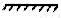 - граница зоны досягаемости токоведущих частей рукой человека,

находящегося на поверхности ;

0,75; 1,25; 2,50 м - расстояния от края поверхности  до границы зоны

досягаемости

Указанные размеры даны без учета применения вспомогательных средств (например, инструмента, лестниц, длинных предметов).

1.7.71. Установка барьеров и размещение вне зоны досягаемости допускается только в помещениях, доступных квалифицированному персоналу.

1.7.72. В электропомещениях электроустановок напряжением до 1 кВ не требуется защита от прямого прикосновения при одновременном выполнении следующих условий:

эти помещения отчетливо обозначены, и доступ в них возможен только с помощью ключа;

обеспечена возможность свободного выхода из помещения без ключа, даже если оно заперто на ключ снаружи;

минимальные размеры проходов обслуживания соответствуют гл.4.1.

# Меры защиты от прямого и косвенного прикосновений

1.7.73. Сверхнизкое (малое) напряжение (СНН) в электроустановках напряжением до 1 кВ может быть применено для защиты от поражения электрическим током при прямом и/или косвенном прикосновениях в сочетании с защитным электрическим разделением цепей или в сочетании с автоматическим отключением питания.

В качестве источника питания цепей СНН в обоих случаях следует применять безопасный разделительный трансформатор в соответствии с ГОСТ"Трансформаторы разделительные и безопасные разделительные трансформаторы"или другой источник СНН, обеспечивающий равноценную степень безопасности.

Токоведущие части цепей СНН должны быть электрически отделены от других цепей так, чтобы обеспечивалось электрическое разделение, равноценное разделению между первичной и вторичной обмотками разделительного трансформатора.

Проводники цепей СНН, как правило, должны быть проложены отдельно от проводников более высоких напряжений и защитных проводников, либо отделены от них заземленным металлическим экраном (оболочкой), либо заключены в неметаллическую оболочку дополнительно к основной изоляции.

Вилки и розетки штепсельных соединителей в цепях СНН не должны допускать подключение к розеткам и вилкам других напряжений.

Штепсельные розетки должны быть без защитного контакта.

При значениях СНН выше 25 В переменного или 60 В постоянного тока должна быть также выполнена защита от прямого прикосновения при помощи ограждений или оболочек или изоляции, соответствующей испытательному напряжению 500 В переменного тока в течение 1 мин.

1.7.74. При применении СНН в сочетании с электрическим разделением цепей открытые проводящие части не должны быть преднамеренно присоединены к заземлителю, защитным проводникам или открытым проводящим частям других цепей и к сторонним проводящим частям, кроме случая, когда соединение сторонних проводящих частей с электрооборудованием необходимо, а напряжение на этих частях не может превысить значение СНН.

СНН в сочетании с электрическим разделением цепей следует применять, когда при помощи СНН необходимо обеспечить защиту от поражения электрическим током при повреждении изоляции не только в цепи СНН, но и при повреждении изоляции в других цепях, например, в цепи, питающей источник.

При применении СНН в сочетании с автоматическим отключением питания один из выводов источника СНН и его корпус должны быть присоединены к защитному проводнику цепи, питающей источник.

1.7.75. В случаях, когда в электроустановке применено электрооборудование с наибольшим рабочим (функциональным) напряжением, не превышающим 50 В переменного или 120 В постоянного тока, такое напряжение может быть использовано в качестве меры защиты от прямого и косвенного прикосновения, если при этом соблюдены требования 1.7.73-1.7.74.

# Меры защиты при косвенном прикосновении

1.7.76. Требования защиты при косвенном прикосновении распространяются на:

1) корпуса электрических машин, трансформаторов, аппаратов, светильников и т.п.;

2) приводы электрических аппаратов;

3) каркасы распределительных щитов, щитов управления, щитков и шкафов, а также съемных или открывающихся частей, если на последних установлено электрооборудование напряжением выше 50 В переменного или 120 В постоянного тока (в случаях, предусмотренных соответствующими главами ПУЭ - выше 25 В переменного или 60 В постоянного тока);

4) металлические конструкции распределительных устройств, кабельные конструкции, кабельные муфты, оболочки и броню контрольных и силовых кабелей, оболочки проводов, рукава и трубы электропроводки, оболочки и опорные конструкции шинопроводов (токопроводов), лотки, короба, струны, тросы и полосы, на которых укреплены кабели и провода (кроме струн, тросов и полос, по которым проложены кабели с зануленной или заземленной металлической оболочкой или броней), а также другие металлические конструкции, на которых устанавливается электрооборудование;

5) металлические оболочки и броню контрольных и силовых кабелей и проводов на напряжения, не превышающие указанные в 1.7.53, проложенные на общих металлических конструкциях, в том числе в общих трубах, коробах, лотках и т.п., с кабелями и проводами на более высокие напряжения;

6) металлические корпуса передвижных и переносных электроприемников;

7) электрооборудование, установленное на движущихся частях станков, машин и механизмов.

При применении в качестве защитной меры автоматического отключения питания указанные открытые проводящие части должны быть присоединены к глухозаземленной нейтрали источника питания в системе  и заземлены в системах  и .

1.7.77. Не требуется преднамеренно присоединять к нейтрали источника в системе  и заземлять в системах  и :

1) корпуса электрооборудования и аппаратов, установленных на металлических основаниях: конструкциях, распределительных устройствах, щитах, шкафах, станинах станков, машин и механизмов, присоединенных к нейтрали источника питания или заземленных, при обеспечении надежного электрического контакта этих корпусов с основаниями;

2) конструкции, перечисленные в 1.7.76, при обеспечении надежного электрического контакта между этими конструкциями и установленным на них электрооборудованием, присоединенным к защитному проводнику;

3) съемные или открывающиеся части металлических каркасов камер распределительных устройств, шкафов, ограждений и т.п., если на съемных (открывающихся) частях не установлено электрооборудование или если напряжение установленного электрооборудования не превышает значений, указанных в 1.7.53;

4) арматуру изоляторов воздушных линий электропередачи и присоединяемые к ней крепежные детали;

5) открытые проводящие части электрооборудования с двойной изоляцией;

6) металлические скобы, закрепы, отрезки труб механической защиты кабелей в местах их прохода через стены и перекрытия и другие подобные детали электропроводок площадью до 100 см, в том числе протяжные и ответвительные коробки скрытых электропроводок.

1.7.78. При выполнении автоматического отключения питания в электроустановках напряжением до 1 кВ все открытые проводящие части должны быть присоединены к глухозаземленной нейтрали источника питания, если применена система , и заземлены, если применены системы  или . При этом характеристики защитных аппаратов и параметры защитных проводников должны быть согласованы, чтобы обеспечивалось нормированное время отключения поврежденной цепи защитно-коммутационным аппаратом в соответствии с номинальным фазным напряжением питающей сети.

В электроустановках, в которых в качестве защитной меры применено автоматическое отключение питания, должно быть выполнено уравнивание потенциалов.

Для автоматического отключения питания могут быть применены защитно-коммутационные аппараты, реагирующие на сверхтоки или на дифференциальный ток.

1.7.79. В системе  время автоматического отключения питания не должно превышать значений, указанных в табл.1.7.1.

# Таблица 1.7.1. Наибольшее допустимое время защитного автоматического отключения для системы img_3827ff0b_2.png

|  |  |
| --- | --- |
|Номинальное фазное напряжение img_0b6e899e.png, В | Время отключения, с |
| 127 | 0,8 |
| 220 | 0,4 |
| 380 | 0,2 |
| Более 380 | 0,1 |

Приведенные значения времени отключения считаются достаточными для обеспечения электробезопасности, в том числе в групповых цепях, питающих передвижные и переносные электроприемники и ручной электроинструмент класса 1.

В цепях, питающих распределительные, групповые, этажные и др. щиты и щитки, время отключения не должно превышать 5 с.

Допускаются значения времени отключения более указанных в табл.1.7.1, но не более 5 с в цепях, питающих только стационарные электроприемники от распределительных щитов или щитков при выполнении одного из следующих условий:

1) полное сопротивление защитного проводника между главной заземляющей шиной и распределительным щитом или щитком не превышает значения, Ом:

,

где 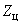 - полное сопротивление цепи "фаза-нуль", Ом;

 - номинальное фазное напряжение цепи, В;

50 - падение напряжения на участке защитного проводника между главной заземляющей шиной и распределительным щитом или щитком. В;

2) к шине  распределительного щита или щитка присоединена дополнительная система уравнивания потенциалов, охватывающая те же сторонние проводящие части, что и основная система уравнивания потенциалов.

Допускается применение УЗО, реагирующих на дифференциальный ток.

1.7.80. Не допускается применять УЗО, реагирующие на дифференциальный ток, в четырехпроводных трехфазных цепях (система ). В случае необходимости применения УЗО для защиты отдельных электроприемников, получающих питание от системы , защитный -проводник электроприемника должен быть подключен к -проводнику цепи, питающей электроприемник, до защитно-коммутационного аппарата.

1.7.81. В системе  время автоматического отключения питания при двойном замыкании на открытые проводящие части должно соответствовать табл.1.7.2.

# Таблица 1.7.2. Наибольшее допустимое время защитного автоматического отключения для системы img_b40b0c5d_10.png

|  |  |
| --- | --- |
|Номинальное линейное напряжение img_0b6e899e_2.png, В | Время отключения, с |
| 220 | 0,8 |
| 380 | 0,4 |
| 660 | 0,2 |
| Более 660 | 0,1 |

1.7.82. Основная система уравнивания потенциалов в электроустановках до 1 кВ должна соединять между собой следующие проводящие части (рис.1.7.7):

1) нулевой защитный - или -проводник питающей линии в системе ;

2) заземляющий проводник, присоединенный к заземляющему устройству электроустановки, в системах  и ;

3) заземляющий проводник, присоединенный к заземлителю повторного заземления на вводе в здание (если есть заземлитель);

4) металлические трубы коммуникаций, входящих в здание: горячего и холодного водоснабжения, канализации, отопления, газоснабжения и т.п.

Если трубопровод газоснабжения имеет изолирующую вставку на вводе в здание, к основной системе уравнивания потенциалов присоединяется только та часть трубопровода, которая находится относительно изолирующей вставки со стороны здания;

5) металлические части каркаса здания;

6) металлические части централизованных систем вентиляции и кондиционирования. При наличии децентрализованных систем вентиляции и кондиционирования металлические воздуховоды следует присоединять к шине  щитов питания вентиляторов и кондиционеров;

7) заземляющее устройство системы молниезащиты 2-й и 3-й категорий;

8) заземляющий проводник функционального (рабочего) заземления, если такое имеется и отсутствуют ограничения на присоединение сети рабочего заземления к заземляющему устройству защитного заземления;

9) металлические оболочки телекоммуникационных кабелей.

Рис.1.7.7. Система уравнивания потенциалов в здании:

 - открытая проводящая часть;  - металлические трубы водопровода, входящие в здание;

 - металлические трубы канализации, входящие в здание;  - металлические трубы газоснабжения

с изолирующей вставкой на вводе, входящие в здание;  - воздуховоды вентиляции и кондиционирования;

 - система отопления;  - металлические водопроводные трубы в ванной комнате;  - металлическая

ванна;  - сторонняя проводящая часть в пределах досягаемости от открытых проводящих частей;

 - арматура железобетонных конструкций; Г3Ш - главная заземляющая шина;  - естественный

заземлитель;  - заземлитель молниезащиты (если имеется);

*1* - нулевой защитный проводник; *2* - проводник основной системы уравнивания потенциалов;

*3* - проводник дополнительной системы уравнивания потенциалов; *4* - токоотвод системы молниезащиты;

*5* - контур (магистраль) рабочего заземления в помещении информационного вычислительного оборудования;

*6* - проводник рабочего (функционального) заземления; *7* - проводник уравнивания потенциалов

в системе рабочего (функционального) заземления; *8* - заземляющий проводник

Проводящие части, входящие в здание извне, должны быть соединены как можно ближе к точке их ввода в здание.

Для соединения с основной системой уравнивания потенциалов все указанные части должны быть присоединены к главной заземляющей шине (1.7.119-1.7.120) при помощи проводников системы уравнивания потенциалов.

1.7.83. Система дополнительного уравнивания потенциалов должна соединять между собой все одновременно доступные прикосновению открытые проводящие части стационарного электрооборудования и сторонние проводящие части, включая доступные прикосновению металлические части строительных конструкций здания, а также нулевые защитные проводники в системе  и защитные заземляющие проводники в системах  и , включая защитные проводники штепсельных розеток.

Для уравнивания потенциалов могут быть использованы специально предусмотренные проводники либо открытые и сторонние проводящие части, если они удовлетворяют требованиям 1.7.122 к защитным проводникам в отношении проводимости и непрерывности электрической цепи.

1.7.84. Защита при помощи двойной или усиленной изоляции может быть обеспечена применением электрооборудования класса II или заключением электрооборудования, имеющего только основную изоляцию токоведущих частей, в изолирующую оболочку.

Проводящие части оборудования с двойной изоляцией не должны быть присоединены к защитному проводнику и к системе уравнивания потенциалов.

1.7.85. Защитное электрическое разделение цепей следует применять, как правило, для одной цепи.

Наибольшее рабочее напряжение отделяемой цепи не должно превышать 500 В.

Питание отделяемой цепи должно быть выполнено от разделительного трансформатора, соответствующегоГОСТ 30030 "Трансформаторы разделительные и безопасные разделительные трансформаторы", или от другого источника, обеспечивающего равноценную степень безопасности.

Токоведущие части цепи, питающейся от разделительного тpaнсформатора, не должны иметь соединений с заземленными частями и защитными проводниками других цепей.

Проводники цепей, питающихся от разделительного трансфоматора, рекомендуется прокладывать отдельно от других цепей. Если это невозможно, то для таких цепей необходимо использовать кабели без металлической оболочки, брони, экрана или изолированные провода, проложенные в изоляционных трубах, коробах и каналах при условии, что номинальное напряжение этих кабелей и проводов соответствует наибольшему напряжению совместно проложенных цепей, а каждая цепь защищена от сверхтоков.

Если от разделительного трансформатора питается только один электроприемник, то его открытые проводящие части не должны быть присоединены ни к защитному проводнику, ни к открытым проводящим частям других цепей.

Допускается питание нескольких электроприемников от одного разделительного трансформатора при одновременном выполнении следующих условий:

1) открытые проводящие части отделяемой цепи не должны иметь электрической связи с металлическим корпусом источника питания;

2) открытые проводящие части отделяемой цепи должны быть соединены между собой изолированными незаземленными проводниками местной системы уравнивания потенциалов, не имеющей соединений с защитными проводниками и открытыми проводящими частями других цепей;

3) все штепсельные розетки должны иметь защитный контакт, присоединенный к местной незаземленной системе уравнивания потенциалов;

4) все гибкие кабели, за исключением питающих оборудование класса II, должны иметь защитный проводник, применяемый в качестве проводника уравнивания потенциалов;

5) время отключения устройством защиты при двухфазном замыкании на открытые проводящие части не должно превышать время, указанное в табл.1.7.2.

1.7.86. Изолирующие (непроводящие) помещения, зоны и площадки могут быть применены в электроустановках напряжением до 1 кВ, когда требования к автоматическому отключению питания не могут быть выполнены, а применение других защитных мер невозможно либо нецелесообразно.

Сопротивление относительно локальной земли изолирующего пола и стен таких помещений, зон и площадок в любой точке должно быть не менее:

50 кОм при номинальном напряжении электроустановки до 500 В включительно, измеренное мегаомметром на напряжение 500 В;

100 кОм при номинальном напряжении электроустановки более 500 В, измеренное мегаомметром на напряжение 1000 В.

Если сопротивление в какой-либо точке меньше указанных, такие помещения, зоны, площадки не должны рассматриваться в качестве меры защиты от поражения электрическим током.

Для изолирующих (непроводящих) помещений, зон, площадок допускается использование электрооборудования класса 0 при соблюдении, по крайней мере, одного из трех следующих условий:

1) открытые проводящие части удалены одна от другой и от сторонних проводящих частей не менее чем на 2 м. Допускается уменьшение этого расстояния вне зоны досягаемости до 1,25 м;

2) открытые проводящие части отделены от сторонних проводящих частей барьерами из изоляционного материала. При этом расстояния, не менее указанных в пп.1, должны быть обеспечены с одной стороны барьера;

3) сторонние проводящие части покрыты изоляцией, выдерживающей испытательное напряжение не менее 2 кВ в течение 1 мин.

В изолирующих помещениях (зонах) не должен предусматриваться защитный проводник.

Должны быть предусмотрены меры против заноса потенциала на сторонние проводящие части помещения извне.

Пол и стены таких помещений не должны подвергаться воздействию влаги.

1.7.87. При выполнении мер защиты в электроустановках напряжением до 1 кВ классы применяемого электрооборудования по способу защиты человека от поражения электрическим током поГОСТ 12.2.007.0 "ССБТ. Изделия электротехнические. Общие требования безопасности"следует принимать в соответствии с табл.1.7.3.

# Таблица 1.7.3. Применение электрооборудования в электроустановках напряжением до 1 кВ

|  |  |  |  |
| --- | --- | --- | --- |
|Класс поГОСТ 12.2.007.0Р МЭК536 | Маркировка | Назначение защиты | Условия применения электрооборудования в электроустановке |
| Класс 0 | - | При косвенном прикосновении | 1. Применение в непроводящих помещениях.  2. Питание от вторичной обмотки разделительного трансформатора только одного электроприемника |
| Класс I | Защитный зажим - знак img_620104e3.png или буквы img_58b512c4_8.png, или желто-зеленые полосы | При косвенном прикосновении | Присоединение заземляющего зажима электрооборудова- ния к защитному проводнику электроустановки |
| Класс II | Знак img_5ef14bbb.png | При косвенном прикосновении | Независимо от мер защиты, принятых в электроустановке |
| Класс III | Знак img_91218a52.png | От прямого и косвенного прикосновения | Питание от безопасного разделительного трансформатора |

# Заземляющие устройства электроустановок напряжением выше 1 кВ в сетях с эффективно заземленной нейтралью

1.7.88. Заземляющие устройства электроустановок напряжением выше 1 кВ в сетях с эффективно заземленной нейтралью следует выполнять с соблюдением требований либо к их сопротивлению (1.7.90), либо к напряжению прикосновения (1.7.91), а также с соблюдением требований к конструктивному выполнению (1.7.92-1.7.93) и к ограничению напряжения на заземляющем устройстве (1.7.89). Требования 1.7.89-1.7.93 не распространяются на заземляющие устройства опор ВЛ.

1.7.89. Напряжение на заземляющем устройстве при стекании с него тока замыкания на землю не должно, как правило, превышать 10 кВ. Напряжение выше 10 кВ допускается на заземляющих устройствах, с которых исключен вынос потенциалов за пределы зданий и внешних ограждений электроустановок. При напряжении на заземляющем устройстве более 5 кВ должны быть предусмотрены меры по защите изоляции отходящих кабелей связи и телемеханики и по предотвращению выноса опасных потенциалов за пределы электроустановки.

1.7.90. Заземляющее устройство, которое выполняется с соблюдением требований к его сопротивлению, должно иметь в любое время года сопротивление не более 0,5 Ом с учетом сопротивления естественных и искусственных заземлителей.

В целях выравнивания электрического потенциала и обеспечения присоединения электрооборудования к заземлителю на территории, занятой оборудованием, следует прокладывать продольные и поперечные горизонтальные заземлители и объединять их между собой в заземляющую сетку.

Продольные заземлители должны быть проложены вдоль осей электрооборудования со стороны обслуживания на глубине 0,5-0,7 м от поверхности земли и на расстоянии 0,8-1,0 м от фундаментов или оснований оборудования. Допускается увеличение расстояний от фундаментов или оснований оборудования до 1,5 м с прокладкой одного заземлителя для двух рядов оборудования, если стороны обслуживания обращены друг к другу, а расстояние между основаниями или фундаментами двух рядов не превышает 3,0 м.

Поперечные заземлители следует прокладывать в удобных местах между оборудованием на глубине 0,5-0,7 м от поверхности земли. Расстояние между ними рекомендуется принимать увеличивающимся от периферии к центру заземляющей сетки. При этом первое и последующие расстояния, начиная от периферии, не должны превышать соответственно 4,0; 5,0; 6,0; 7,5; 9,0; 11,0; 13,5; 16,0; 20,0 м. Размеры ячеек заземляющей сетки, примыкающих к местам присоединения нейтралей силовых трансформаторов и короткозамыкателей к заземляющему устройству, не должны превышать 66 м.

Горизонтальные заземлители следует прокладывать по кpaю территории, занимаемой заземляющим устройством так, чтобы они в совокупности образовывали замкнутый контур.

Если контур заземляющего устройства располагается в пределах внешнего ограждения электроустановки, то у входов и въездов на ее территорию следует выравнивать потенциал путем установки двух вертикальных заземлителей, присоединенных к внешнему горизонтальному заземлителю напротив входов и въездов. Вертикальные заземлители должны быть длиной 3-5 м, а расстояние между ними должно быть равно ширине входа или въезда.

1.7.91. Заземляющее устройство, которое выполняется с соблюдением требований, предъявляемых к напряжению прикосновения, должно обеспечивать в любое время года при стекании с него тока замыкания на землю значения напряжений прикосновения, не превышающие нормированных (см.ГОСТ 12.1.038). Сопротивление заземляющего устройства при этом определяется по допустимому напряжению на заземляющем устройстве и току замыкания на землю.

При определении значения допустимого напряжения прикосновения в качестве расчетного времени воздействия следует принимать сумму времени действия защиты и полного времени отключения выключателя. При определении допустимых значений напряжений прикосновения у рабочих мест, где при производстве оперативных переключений могут возникнуть КЗ на конструкции, доступные для прикосновения производящему переключения персоналу, следует принимать время действия резервной защиты, а для остальной территории - основной защиты.

Примечание. Рабочее место следует понимать как место оперативного обслуживания электрических аппаратов.

Размещение продольных и поперечных горизонтальных заземлителей должно определяться требованиями ограничения напряжений прикосновения до нормированных значений и удобством присоединения заземляемого оборудования. Расстояние между продольными и поперечными горизонтальными искусственными заземлителями не должно превышать 30 м, а глубина их заложения в грунт должна быть не менее 0,3 м. Для снижения напряжения прикосновения у рабочих мест в необходимых случаях может быть выполнена подсыпка щебня слоем толщиной 0,1-0,2 м.

В случае объединения заземляющих устройств разных напряжений в одно общее заземляющее устройство напряжение прикосновения должно определяться по наибольшему току короткого замыкания на землю объединяемых ОРУ.

1.7.92. При выполнении заземляющего устройства с соблюдением требований, предъявляемых к его сопротивлению или к напряжению прикосновения, дополнительно к требованиям 1.7.90-1.7.91 следует:

прокладывать заземляющие проводники, присоединяющие оборудование или конструкции к заземлителю, в земле на глубине не менее 0,3 м;

прокладывать продольные и поперечные горизонтальные заземлители (в четырех направлениях) вблизи мест расположения заземляемых нейтралей силовых трансформаторов, короткозамыкателей.

При выходе заземляющего устройства за пределы ограждения электроустановки горизонтальные заземлители, находящиеся вне территории электроустановки, следует прокладывать на глубине не менее 1 м. Внешний контур заземляющего устройства в этом случае рекомендуется выполнять в виде многоугольника с тупыми или скругленными углами.

1.7.93. Внешнюю ограду электроустановок не рекомендуется присоединять к заземляющему устройству.

Если от электроустановки отходят ВЛ 110 кВ и выше, то ограду следует заземлить с помощью вертикальных заземлителей длиой 2-3 м, установленных у стоек ограды по всему ее периметру через 20-50 м. Установка таких заземлителей не требуется для ограды с металлическими стойками и с теми стойками из железобетона, арматура которых электрически соединена с металлическими звеньями ограды.

Для исключения электрической связи внешней ограды с заземляющим устройством расстояние от ограды до элементов заземляющего устройства, расположенных вдоль нее с внутренней, внешней или с обеих сторон, должно быть не менее 2 м. Выходящие за пределы ограды горизонтальные заземлители, трубы и кабели с металлической оболочкой или броней и другие металлические коммуникации должны быть проложены посередине между стойками ограды на глубине не менее 0,5 м. В местах примыкания внешней ограды к зданиям и сооружениям, а также в местах примыкания к внешней ограде внутренних металлических ограждений должны быть выполнены кирпичные или деревянные вставки длиной не менее 1 м.

Питание электроприемников, установленных на внешней ограде, следует осуществлять от разделительных трансформаторов. Эти трансформаторы не допускается устанавливать на ограде. Линия, соединяющая вторичную обмотку разделительного трансформатора с электроприемником, расположенным на ограде, должна быть изолирована от земли на расчетное значение напряжения на заземляющем устройстве.

Если выполнение хотя бы одного из указанных мероприятий невозможно, то металлические части ограды следует присоединить к заземляющему устройству и выполнить выравнивание потенциалов так, чтобы напряжение прикосновения с внешней и внутренней сторон ограды не превышало допустимых значений. При выполнении заземляющего устройства по допустимому сопротивлению с этой целью должен быть проложен горизонтальный заземлитель с внешней стороны ограды на расстоянии 1 м от нее и на глубине 1 м. Этот заземлитель следует присоединять к заземляющему устройству не менее чем в четырех точках.

1.7.94. Если заземляющее устройство электроустановки напряжением выше 1 кВ сети с эффективно заземленной нейтралью соединено с заземляющим устройством другой электроустановки при помощи кабеля с металлической оболочкой или броней или других металлических связей, то для выравнивания потенциалов вокруг указанной другой электроустановки или здания, в котором она размещена, необходимо соблюдение одного из следующих условий:

1) прокладка в земле на глубине 1 м и на расстоянии 1 м от фундамента здания или от периметра территории, занимаемой оборудованием, заземлителя, соединенного с системой уравнивания потенциалов этого здания или этой территории, а у входов и у въездов в здание - укладка проводников на расстоянии 1 и 2 м от заземлителя на глубине 1 и 1,5 м соответственно и соединение этих проводников с заземлителем;

2) использование железобетонных фундаментов в качестве заземлителей в соответствии с 1.7.109, если при этом обеспечивается допустимый уровень выравнивания потенциалов. Обеспечение условий выравнивания потенциалов посредством железобетонных фундаментов, используемых в качестве заземлителей, определяется в соответствии сГОСТ 12.1.030 "Электробезопасность. Защитное заземление, зануление".

Не требуется выполнение условий, указанных в пп.1 и 2, если вокруг зданий имеются асфальтовые отмостки, в том числе у входов и у въездов. Если у какого-либо входа (въезда) отмостка отсутствует, у этого входа (въезда) должно быть выполнено выравнивание потенциалов путем укладки двух проводников, как указано в пп.1, или соблюдено условие по пп.2. При этом во всех случаях должны выполняться требования 1.7.95.

1.7.95. Во избежание выноса потенциала не допускается питание электроприемников, находящихся за пределами заземляющих устройств электроустановок напряжением выше 1 кВ сети с эффективно заземленной нейтралью, от обмоток до 1 кВ с заземленной нейтралью трансформаторов, находящихся в пределах контура заземляющего устройства электроустановки напряжением выше 1 кВ.

При необходимости питание таких электроприемников может осуществляться от трансформатора с изолированной нейтралью на стороне напряжением до 1 кВ по кабельной линии, выполненной кабелем без металлической оболочки и без брони, или по ВЛ.

При этом напряжение на заземляющем устройстве не должно превышать напряжение срабатывания пробивного предохранителя, установленного на стороне низшего напряжения трансформатора с изолированной нейтралью.

Питание таких электроприемников может также осуществляться от разделительного трансформатора. Разделительный трансформатор и линия от его вторичной обмотки к электроприемнику, если она проходит по территории, занимаемой заземляющим устройством электроустановки напряжением выше 1 кВ, должны иметь изоляцию от земли на расчетное значение напряжения на заземляющем устройстве.

# Заземляющие устройства электроустановок напряжением выше 1 кВ в сетях с изолированной нейтралью

1.7.96. В электроустановках напряжением выше 1 кВ сети с изолированной нейтралью сопротивление заземляющего устройства при прохождении расчетного тока замыкания на землю в любое время года с учетом сопротивления естественных заземлителей должно быть

,

но не более 10 Ом, где  - расчетный ток замыкания на землю, А.

В качестве расчетного тока принимается:

1) в сетях без компенсации емкостных токов - ток замыкания на землю;

2) в сетях с компенсацией емкостных токов:

для заземляющих устройств, к которым присоединены компенсирующие аппараты, - ток, равный 125% номинального тока наиболее мощного из этих аппаратов;

для заземляющих устройств, к которым не присоединены компенсирующие аппараты, - ток замыкания на землю, проходящий в данной сети при отключении наиболее мощного из компенсирующих аппаратов.

Расчетный ток замыкания на землю должен быть определен для той из возможных в эксплуатации схем сети, при которой этот ток имеет наибольшее значение.

1.7.97. При использовании заземляющего устройства одновременно для электроустановок напряжением до 1 кВ с изолированной нейтралью должны быть выполнены условия 1.7.104.

При использовании заземляющего устройства одновременно для электроустановок напряжением до 1 кВ с глухозаземленной нейтралью сопротивление заземляющего устройства должно быть не более указанного в 1.7.101 либо к заземляющему устройству должны быть присоединены оболочки и броня не менее двух кабелей на напряжение до или выше 1 кВ или обоих напряжений, при общей протяженности этих кабелей не менее 1 км.

1.7.98. Для подстанций напряжением 6-10/0,4 кВ должно быть выполнено одно общее заземляющее устройство, к которому должны быть присоединены:

1) нейтраль трансформатора на стороне напряжением до 1 кВ;

2) корпус трансформатора;

3) металлические оболочки и броня кабелей напряжением до 1 кВ и выше;

4) открытые проводящие части электроустановок напряжением до 1 кВ и выше;

5) сторонние проводящие части.

Вокруг площади, занимаемой подстанцией, на глубине не менее 0,5 м и на расстоянии не более 1 м от края фундамента здания подстанции или от края фундаментов открыто установленного оборудования должен быть проложен замкнутый горизонтальный заземлитель (контур), присоединенный к заземляющему устройству.

1.7.99. Заземляющее устройство сети напряжением выше 1 кВ с изолированной нейтралью, объединенное с заземляющим устройством сети напряжением выше 1 кВ с эффективно заземленной нейтралью в одно общее заземляющее устройство, должно удовлетворять также требованиям 1.7.89-1.7.90.

# Заземляющие устройства электроустановок напряжением до 1 кВ в сетях с глухозаземленной нейтралью

1.7.100. В электроустановках с глухозаземленной нейтралью нейтраль генератора или трансформатора трехфазного переменного тока, средняя точка источника постоянного тока, один из выводов источника однофазного тока должны быть присоединены к заземлителю при помощи заземляющего проводника.

Искусственный заземлитель, предназначенный для заземления нейтрали, как правило, должен быть расположен вблизи генератора или трансформатора. Для внутрицеховых подстанций допускается располагать заземлитель около стены здания.

Если фундамент здания, в котором размещается подстанция, используется в качестве естественных заземлителей, нейтраль трансформатора следует заземлять путем присоединения не менее чем к двум металлическим колоннам или к закладным деталям, приваренным к арматуре не менее двух железобетонных фундаментов.

При расположении встроенных подстанций на разных этажах многоэтажного здания заземление нейтрали трансформаторов таких подстанций должно быть выполнено при помощи специально проложенного заземляющего проводника. В этом случае заземляющий проводник должен быть дополнительно присоединен к колонне здания, ближайшей к трансформатору, а его сопротивление учтено при определении сопротивления растеканию заземляющего устройства, к которому присоединена нейтраль трансформатора.

Во всех случаях должны быть приняты меры по обеспечении непрерывности цепи заземления и защите заземляющего проводника от механических повреждений.

Если в -проводнике, соединяющем нейтраль трансформатора или генератора с шиной  распределительного устройства напряжением до 1 кВ, установлен трансформатор тока, то заземляющий проводник должен быть присоединен не к нейтрали трансферматора или генератора непосредственно, а к -проводнику, по возможности сразу за трансформатором тока. В таком случае разделение -проводника на - и -проводники в системе  должно быть выполнено также за трансформатором тока. Трансформатор тока следует размещать как можно ближе к выводу нейтрали генератора или трансформатора.

1.7.101. Сопротивление заземляющего устройства, к которому присоединены нейтрали генератора или трансформатора или выводы источника однофазного тока, в любое время года должно быть не более 2, 4 и 8 Ом соответственно при линейных напряжениях 660, 380 и 220 В источника трехфазного тока или 380, 220 и 127 В источника однофазного тока. Это сопротивление должно быть обеспечено с учетом использования естественных заземлителей, а также заземлителей повторных заземлений - или -проводника ВЛ напряжением до 1 кВ при количестве отходящих линий не менее двух. Сопротивление заземлителя, расположенного в непосредственной близости от нейтрали генератора или трансформатора или вывода источника однофазного тока, должно быть не более 15, 30 и 60 Ом соответственно при линейных напряжениях 660, 380 и 220 В источника трехфазного тока или 380, 220 и 127 В источника однофазного тока.

При удельном сопротивлении земли >100 Ом·м допускается увеличивать указанные нормы в 0,01  раз, но не более десятикратного.

1.7.102. На концах ВЛ или ответвлений от них длиной более 200 м, а также на вводах ВЛ к электроустановкам, в которых в качестве защитной меры при косвенном прикосновении применено автоматическое отключение питания, должны быть выполнены повторные заземления -проводника. При этом в первую очередь следует использовать естественные заземлители, например, подземные части опор, а также заземляющие устройства, предназначенные для грозовых перенапряжений (см. гл.2.4).

Указанные повторные заземления выполняются, если более частые заземления по условиям защиты от грозовых перенапряжений не требуются.

Повторные заземления -проводника в сетях постоянного тока должны быть выполнены при помощи отдельных искусственных заземлителей, которые не должны иметь металлических соединений с подземными трубопроводами.

Заземляющие проводники для повторных заземлений -проводника должны иметь размеры не менее приведенных в табл.1.7.4.

# Таблица 1.7.4. Наименьшие размеры заземлителей и заземляющих проводников, проложенных в земле

|  |  |  |  |  |
| --- | --- | --- | --- | --- |
|Материал | Профиль сечения | Диаметр, мм | Площадь поперечного сечения, ммimg_85e43c10_1.png | Толщина стенки, мм |
| Сталь черная | Круглый: |  |  |  |
|  | для вертикальных заземлителей; | 16 | - | - |
|  | для горизонтальных заземлителей | 10 | - | - |
|  | Прямоугольный | - | 100 | 4 |
|  | Угловой | - | 100 | 4 |
|  | Трубный | 32 | - | 3,5 |
| Сталь оцинкованная | Круглый: |  |  |  |
|  | для вертикальных заземлителей; | 12 | - | - |
|  | для горизонтальных заземлителей | 10 | - | - |
|  | Прямоугольный | - | 75 | 3 |
|  | Трубный | 25 | - | 2 |
| Медь | Круглый | 12 | - | - |
|  | Прямоугольный | - | 50 | 2 |
|  | Трубный | 20 | - | 2 |
|  | Канат многопроволочный | 1,8\* | 35 | - |

\_\_\_\_\_\_\_\_\_\_\_\_\_\_\_\_\_\_\_\_\_\_

\* Диаметр каждой проволоки.

1.7.103. Общее сопротивление растеканию заземлителей (в том числе естественных) всех повторных заземлений  -проводника каждой ВЛ в любое время года должно быть не более 5, 10 и 20 Ом соответственно при линейных напряжениях 660, 380 и 220 В источника трехфазного тока или 380, 220 и 127 В источника однофазного тока. При этом сопротивление растеканию заземлителя каждого из повторных заземлений должно быть не более 15, 30 и 60 Ом соответственно при тех же напряжениях.

При удельном сопротивлении земли >100 Ом·м допускается увеличивать указанные нормы в 0,01  раз, но не более десятикратного.

# Заземляющие устройства электроустановок напряжением до 1 кВ в сетях с изолированной нейтралью

1.7.104. Сопротивление заземляющего устройства, используемого для защитного заземления открытых проводящих частей, в системе  должно соответствовать условию:

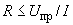,

где  - сопротивление заземляющего устройства, Ом;

 - напряжение прикосновения, значение которого принимается равным 50 В (см. также 1.7.53);

 - полный ток замыкания на землю, А.

Как правило, не требуется принимать значение сопротивления заземляющего устройства менее 4 Ом. Допускается сопротивление заземляющего устройства до 10 Ом, если соблюдено приведенное выше условие, а мощность генераторов или трансформаторов не превышает 100 кВ·А, в том числе суммарная мощность генераторов или трансформаторов, работающих параллельно.

# Заземляющие устройства в районах с большим удельным сопротивлением земли

1.7.105. Заземляющие устройства электроустановок напряжением выше 1 кВ с эффективно заземленной нейтралью в районах с большим удельным сопротивлением земли, в том числе в районах многолетней мерзлоты, рекомендуется выполнять с соблюдением требований, предъявляемых к напряжению прикосновения (1.7.91).

В скальных структурах допускается прокладывать горизонтальные заземлители на меньшей глубине, чем этого требуют 1.7.91-1.7.93, но не менее чем 0,15 м. Кроме того, допускается не выполнять требуемые 1.7.90 вертикальные заземлители у входов и у въездов.

1.7.106. При сооружении искусственных заземлителей в районах с большим удельным сопротивлением земли рекомендуются следующие мероприятия:

1) устройство вертикальных заземлителей увеличенной длины, если с глубиной удельное сопротивление земли снижается, а естественные углубленные заземлители (например, скважины с металлическими обсадными трубами) отсутствуют;

2) устройство выносных заземлителей, если вблизи (до 2 км) от электроустановки есть места с меньшим удельным сопротивлением земли;

3) укладка в траншеи вокруг горизонтальных заземлителей в скальных структурах влажного глинистого грунта с последующей трамбовкой и засыпкой щебнем до верха траншеи;

4) применение искусственной обработки грунта с целью снижения его удельного сопротивления, если другие способы не могут быть применены или не дают необходимого эффекта.

1.7.107. В районах многолетней мерзлоты, кроме рекомендаций, приведенных в 1.7.106, следует:

1) помещать заземлители в непромерзающие водоемы и талые зоны;

2) использовать обсадные трубы скважин;

3) в дополнение к углубленным заземлителям применять протяженные заземлители на глубине около 0,5 м, предназначенные для работы в летнее время при оттаивании поверхностного слоя земли;

4) создавать искусственные талые зоны.

1.7.108. В электроустановках напряжением выше 1 кВ, а также до 1 кВ с изолированной нейтралью для земли с удельным сопротивлением более 500 Ом·м, если мероприятия, предусмотренные 1.7.105-1.7.107, не позволяют получить приемлемые по экономическим соображениям заземлители, допускается повысить требуемые настоящей главой значения сопротивлений заземляющих устройств в 0,002  раз, где  - эквивалентное удельное сопротивление земли, Ом·м. При этом увеличение требуемых настоящей главой сопротивлений заземляющих устройств должно быть не более десятикратного.

# Заземлители

1.7.109. В качестве естественных заземлителей могут быть использованы:

1) металлические и железобетонные конструкции зданий и сооружений, находящиеся в соприкосновении с землей, в том числе железобетонные фундаменты зданий и сооружений, имеющие защитные гидроизоляционные покрытия в неагрессивных, слабоагрессивных и среднеагрессивных средах;

2) металлические трубы водопровода, проложенные в земле;

3) обсадные трубы буровых скважин;

4) металлические шпунты гидротехнических сооружений, водоводы, закладные части затворов и т.п.;

5) рельсовые пути магистральных неэлектрифицированных и железных дорог и подъездные пути при наличии преднамеренного устройства перемычек между рельсами;

6) другие находящиеся в земле металлические конструкции сооружения;

7) металлические оболочки бронированных кабелей, проложенных в земле. Оболочки кабелей могут служить единственными заземлителями при количестве кабелей не менее двух. Алюминиевые оболочки кабелей использовать в качестве заземлителей не допускается.

1.7.110. Не допускается использовать в качестве заземлителей трубопроводы горючих жидкостей, горючих или взрывоопасных газов и смесей и трубопроводов канализации и центрального отопления. Указанные ограничения не исключают необходимости присоединения таких трубопроводов к заземляющему устройству с целью уравнивания потенциалов в соответствии с 1.7.82.

Не следует использовать в качестве заземлителей железобетонные конструкции зданий и сооружений с предварительно напряженной арматурой, однако это ограничение не распространяется на опоры ВЛ и опорные конструкции ОРУ.

Возможность использования естественных заземлителей по условию плотности протекающих по ним токов, необходимость сварки арматурных стержней железобетонных фундаментов и конструкций, приварки анкерных болтов стальных колонн к арматурным стержням железобетонных фундаментов, а также возможность пользования фундаментов в сильноагрессивных средах должны быть определены расчетом.

1.7.111. Искусственные заземлители могут быть из черной или оцинкованной стали или медными.

Искусственные заземлители не должны иметь окраски.

Материал и наименьшие размеры заземлителей должны соответствовать приведенным в табл.1.7.4.

1.7.112. Сечение горизонтальных заземлителей для электроустановок напряжением выше 1 кВ следует выбирать по условию термической стойкости при допустимой температуре нагрева 400 °С (кратковременный нагрев, соответствующий времени действия защиты и отключения выключателя).

В случае опасности коррозии заземляющих устройств следует выполнить одно из следующих мероприятий:

увеличить сечения заземлителей и заземляющих проводников с учетом расчетного срока их службы;

применить заземлители и заземляющие проводники с гальваническим покрытием или медные.

При этом следует учитывать возможное увеличение сопротивления заземляющих устройств, обусловленное коррозией.

Траншеи для горизонтальных заземлителей должны заполняться однородным грунтом, не содержащим щебня и строительного мусора.

Не следует располагать (использовать) заземлители в местах, где земля подсушивается под действием тепла трубопроводов и т.п.

# Заземляющие проводники

1.7.113. Сечения заземляющих проводников в электроустановках напряжением до 1 кВ должны соответствовать требованиям 1.7.126 к защитным проводникам.

Наименьшие сечения заземляющих проводников, проложенных в земле, должны соответствовать приведенным в табл. 1.7.4.

Прокладка в земле алюминиевых неизолированных проводников не допускается.

1.7.114. В электроустановках напряжением выше 1 кВ сечения заземляющих проводников должны быть выбраны такими, чтобы при протекании по ним наибольшего тока однофазного КЗ в электроустановках с эффективно заземленной нейтралью или тока двухфазного КЗ в электроустановках с изолированной нейтралью температура заземляющих проводников не превысила 400 °С (кратповременный нагрев, соответствующий полному времени действия защиты и отключения выключателя).

1.7.115. В электроустановках напряжением выше 1 кВ с изолированной нейтралью проводимость заземляющих проводников сечением до 25 мм по меди или равноценное ему из других материалов должна составлять не менее 1/3 проводимости фазных проводников. Как правило, не требуется применение медных проводников сечением более 25 мм, алюминиевых - 35 мм, стальных - 120 мм.

1.7.116. Для выполнения измерений сопротивления заземляющего устройства в удобном месте должна быть предусмотрена возможность отсоединения заземляющего проводника. В электроустановках напряжением до 1 кВ таким местом, как правило, является главная заземляющая шина. Отсоединение заземляющего проводника должно быть возможно только при помощи инструмента.

1.7.117. Заземляющий проводник, присоединяющий заземлитель рабочего (функционального) заземления к главной заземляющей шине в электроустановках напряжением до 1 кВ, должен иметь сечение не менее: медный - 10 мм, алюминиевый - 16 мм, стальной - 75 мм.

1.7.118. У мест ввода заземляющих проводников в здания должен быть предусмотрен опознавательный знак .

# Главная заземляющая шина

1.7.119. Главная заземляющая шина может быть выполнена внутри вводного устройства электроустановки напряжением до 1 кВ или отдельно от него.

Внутри вводного устройства в качестве главной заземляющей шины следует использовать шину .

При отдельной установке главная заземляющая шина должна быть расположена в доступном, удобном для обслуживания месте вблизи вводного устройства.

Сечение отдельно установленной главной заземляющей шины должно быть не менее сечения  ()-проводника питающей линии.

Главная заземляющая шина должна быть, как правило, медной. Допускается применение главной заземляющей шины из стали. Применение алюминиевых шин не допускается.

В конструкции шины должна быть предусмотрена возможность индивидуального отсоединения присоединенных к ней проводников. Отсоединение должно быть возможно только с использованием инструмента.

В местах, доступных только квалифицированному персоналу (например, щитовых помещениях жилых домов), главную заземляющую шину следует устанавливать открыто. В местах, доступных посторонним лицам (например, подъездах или подвалах домов), она должна иметь защитную оболочку - шкаф или ящик с запирающейся на ключ дверцей. На дверце или на стене над шиной должен быть нанесен знак .

1.7.120. Если здание имеет несколько обособленных вводов, главная заземляющая шина должна быть выполнена для каждого вводного устройства. При наличии встроенных трансформаторных подстанций главная заземляющая шина должна устанавливаться возле каждой из них. Эти шины должны соединяться проводником уравнивания потенциалов, сечение которого должно быть не менее половины сечения  ()-проводника той линии среди отходящих от щитов низкого напряжения подстанций, которая имеет наибольшее сечение. Для соединения нескольких главных заземляющих шин могут использоваться сторонние проводящие части, если они соответствуют требованиям 1.7.122 к непрерывности и проводимости электрической цепи.

# Защитные проводники (img_58b512c4_14.png-проводники)

1.7.121. В качестве -проводников в электроустановках напряжением до 1 кВ могут использоваться:

1) специально предусмотренные проводники:

жилы многожильных кабелей;

изолированные или неизолированные провода в общей оболочке с фазными проводами;

стационарно проложенные изолированные или неизолированные проводники;

2) открытые проводящие части электроустановок:

алюминиевые оболочки кабелей;

стальные трубы электропроводок;

металлические оболочки и опорные конструкции шинопроводов и комплектных устройств заводского изготовления.

Металлические короба и лотки электропроводок можно использовать в качестве защитных проводников при условии, что конструкцией коробов и лотков предусмотрено такое использование, о чем имеется указание в документации изготовителя, а их расположение исключает возможность механического повреждения;

3) некоторые сторонние проводящие части:

металлические строительные конструкции зданий и сооружений (фермы, колонны и т.п.);

арматура железобетонных строительных конструкций зданий при условии выполнения требований 1.7.122;

металлические конструкции производственного назначения (подкрановые рельсы, галереи, площадки, шахты лифтов, подъемников, элеваторов, обрамления каналов и т.п.).

1.7.122. Использование открытых и сторонних проводящих частей в качестве -проводников допускается, если они отвечают требованиям настоящей главы к проводимости и непрерывности электрической цепи.

Сторонние проводящие части могут быть использованы в качестве -проводников, если они, кроме того, одновременно отвечают следующим требованиям:

1) непрерывность электрической цепи обеспечивается либо их конструкцией, либо соответствующими соединениями, защищенными от механических, химических и других повреждений;

2) их демонтаж невозможен, если не предусмотрены меры по сохранению непрерывности цепи и ее проводимости.

1.7.123. Не допускается использовать в качестве -проводников:

металлические оболочки изоляционных трубок и трубчатых проводов, несущие тросы при тросовой электропроводке, металлорукава, а также свинцовые оболочки проводов и кабелей;

трубопроводы газоснабжения и другие трубопроводы горючих и взрывоопасных веществ и смесей, трубы канализации и центрального отопления;

водопроводные трубы при наличии в них изолирующих вставок.

1.7.124. Нулевые защитные проводники цепей не допускается использовать в качестве нулевых защитных проводников электрооборудования, питающегося по другим цепям, а также использовать открытые проводящие части электрооборудования в качестве нулевых защитных проводников для другого электрооборудования, за исключением оболочек и опорных конструкций шинопроводов и комплектных устройств заводского изготовления, обеспечивающих возможность подключения к ним защитных проводников в нужном месте.

1.7.125. Использование специально предусмотренных защитных проводников для иных целей не допускается.

1.7.126. Наименьшие площади поперечного сечения защитных проводников должны соответствовать табл.1.7.5.

# Таблица 1.7.5. Наименьшие сечения защитных проводников

|  |  |
| --- | --- |
|Сечение фазных проводников, ммimg_85e43c10_9.png | Наименьшее сечение защитных проводников, ммimg_85e43c10_10.png |
| img_3286db7c.png16 | img_1bf0d4c6_5.png |
| 16img_19e0af0c.png35 | 16 |
| img_58d32081.png35 | img_1bf0d4c6_6.png/2 |

Площади сечений приведены для случая, когда защитные проводники изготовлены из того же материала, что и фазные проводники. Сечения защитных проводников из других материалов должны быть эквивалентны по проводимости приведенным.

Допускается, при необходимости, принимать сечение защитного проводника менее требуемых, если оно рассчитано по формуле (только для времени отключения 5 с):

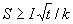,

где  - площадь поперечного сечения защитного проводника, мм;

 - ток короткого замыкания, обеспечивающий время отключения поврежденной цепи защитным аппаратом в соответствии с табл.1.7.1 и 1.7.2 или за время не более 5 с в соответствии с 1.7.79, А;

 - время срабатывания защитного аппарата, с;

 - коэффициент, значение которого зависит от материала защитного проводника, его изоляции, начальной и конечной температур. Значение  для защитных проводников в различных условиях приведены в табл.1.7.6-1.7.9.

# Таблица 1.7.6. Значение коэффициента img_0ca2ce55_2.png для изолированных защитных проводников, не входящих в кабель, и для неизолированных проводников, касающихся оболочки кабелей (начальная температура проводника принята равной 30 °С)

|  |  |  |  |
| --- | --- | --- | --- |
|Параметр | Материал изоляции | | |
|  | Поливинил хлорид (ПВХ) | Поливинил хлорид (ПВХ) | Бутиловая резина |
| Конечная температура, °С | 160 | 250 | 220 |
| img_0ca2ce55_3.png проводника: |  |  |  |
| медного | 143 | 176 | 166 |
| алюминиевого | 95 | 116 | 110 |
| стального | 52 | 64 | 60 |

# Таблица 1.7.7. Значение коэффициента img_0ca2ce55_4.png для защитного проводника, входящего в многожильный кабель

|  |  |  |  |
| --- | --- | --- | --- |
|Параметр | Материал изоляции | | |
|  | Поливинил хлорид (ПВХ) | Сшитый полиэтилен, этиленпропиленовая резина | Бутиловая резина |
| Начальная температура, °С | 70 | 90 | 85 |
| Конечная температура, °С | 160 | 250 | 220 |
| img_0ca2ce55_5.png проводника: |  |  |  |
| медного | 115 | 143 | 134 |
| алюминиевого | 76 | 94 | 89 |

# Таблица 1.7.8. Значение коэффициента img_0ca2ce55_6.png при использовании в качестве защитного проводника алюминиевой оболочки кабеля

|  |  |  |  |
| --- | --- | --- | --- |
|Параметр | Материал изоляции | | |
|  | Поливинил хлорид (ПВХ) | Сшитый полиэтилен, этиленпропиленовая резина | Бутиловая резина |
| Начальная температура, °С | 60 | 80 | 75 |
| Конечная температура, °С | 160 | 250 | 220 |
| img_0ca2ce55_7.png | 81 | 98 | 93 |

# Таблица 1.7.9. Значение коэффициента img_0ca2ce55_8.png для неизолированных проводников, когда указанные температуры не создают опасности повреждения находящихся вблизи материалов (начальная температура проводника принята равной 30 °С)

|  |  |  |  |  |
| --- | --- | --- | --- | --- |
||  | Проводники | | |
| Материал проводника | Условия | Проложенные открыто и в специально отведенных местах | Эксплуатируемые | |
|  |  |  | в нормальной среде | в пожароопасной среде |
| Медь | Максимальная температура, °С | 500\* | 200 | 150 |
|  | img_0ca2ce55_9.png | 228 | 159 | 138 |
| Алюминий | Максимальная температура, °С | 300\* | 200 | 150 |
|  | img_0ca2ce55_10.png | 125 | 105 | 91 |
| Сталь | Максимальная температура, °С | 500\* | 200 | 150 |
|  | img_0ca2ce55_11.png | 82 | 58 | 50 |

\_\_\_\_\_\_\_\_\_\_\_\_\_\_\_\_\_\_\_\_\_

\* Указанные температуры допускаются, если они не ухудшают качество соединений.

Если при расчете получается сечение, отличное от приведенного в табл.1.7.5, то следует выбирать ближайшее большее значение, а при получении нестандартного сечения - применять проводники ближайшего большего стандартного сечения.

Значения максимальной температуры при определении сечения защитного проводника не должны превышать предельно допустимых температур нагрева проводников при КЗ в соответствии с гл.1.4, а для электроустановок во взрывоопасных зонах должны соответствоватьГОСТ 22782.0 "Электрооборудование взрывозащищенное. Общие технические требования и методы испытаний".

1.7.127. Во всех случаях сечение медных защитных проводников, не входящих в состав кабеля или проложенных не в общей оболочке (трубе, коробе, на одном лотке) с фазными проводниками, должно быть не менее:

2,5 мм - при наличии механической защиты;

4 мм - при отсутствии механической защиты.

Сечение отдельно проложенных защитных алюминиевых проводников должно быть не менее 16 мм.

1.7.128. В системе  для обеспечения требований 1.7.88 нулевые защитные проводники рекомендуется прокладывать совместно или в непосредственной близости с фазными проводниками.

1.7.129. В местах, где возможно повреждение изоляции фазных проводников в результате искрения между неизолированным нулевым защитным проводником и металлической оболочкой или конструкцией (например, при прокладке проводов в трубах, коробах, лотках), нулевые защитные проводники должны иметь изоляцию, равноценную изоляции фазных проводников.

1.7.130. Неизолированные -проводники должны быть защищены от коррозии. В местах пересечения -проводников с кабелями, трубопроводами, железнодорожными путями, в местах их ввода в здания и в других местах, где возможны механические повреждения -проводников, эти проводники должны быть защищены.

В местах пересечения температурных и осадочных швов должна быть предусмотрена компенсация длины -проводников.

# Совмещенные нулевые защитные и нулевые рабочие проводники (img_20a33a3e_18.png-проводники)

1.7.131. В многофазных цепях в системе  для стационарно проложенных кабелей, жилы которых имеют площадь поперечного сечения не менее 10 мм по меди или 16 мм по алюминию, функции нулевого защитного () и нулевого рабочего () проводников могут быть совмещены в одном проводнике (-проводник).

1.7.132. Не допускается совмещение функций нулевого защитного и нулевого рабочего проводников в цепях однофазного и постоянного тока. В качестве нулевого защитного проводника в таких цепях должен быть предусмотрен отдельный третий проводник. Это требование не распространяется на ответвления от ВЛ напряжением до 1 кВ к однофазным потребителям электроэнергии.

1.7.133. Не допускается использование сторонних проводящих частей в качестве единственного -проводника.

Это требование не исключает использования открытых и сторонних проводящих частей в качестве дополнительного  -проводника при присоединении их к системе уравнивания потенциалов.

1.7.134. Специально предусмотренные -проводники должны соответствовать требованиям 1.7.126 к сечению защитных проводников, а также требованиям гл.2.1 к нулевому рабочему проводнику.

Изоляция -проводников должна быть равноценна изоляции фазных проводников. Не требуется изолировать шину  сборных шин низковольтных комплектных устройств.

1.7.135. Когда нулевой рабочий и нулевой защитный проводники разделены, начиная с какой-либо точки электроустановки, не допускается объединять их за этой точкой по ходу распределения энергии. В месте разделения -проводника на нулевой защитный и нулевой рабочий проводники необходимо предусмотреть отдельные зажимы или шины для проводников, соединенные между собой. -проводник питающей линии должен быть подключен к зажиму или шине нулевого защитного -проводника.

# Проводники системы уравнивания потенциалов

1.7.136. В качестве проводников системы уравнивания потенциалов могут быть использованы открытые и сторонние проводящие части, указанные в 1.7.121, или специально проложенные проводники, или их сочетание.

1.7.137. Сечение проводников основной системы уравнивания потенциалов должно быть не менее половины наибольшего сечения защитного проводника электроустановки, если сечение проводника уравнивания потенциалов при этом не превышает 25 мм по меди или равноценное ему из других материалов. Применение проводников большего сечения, как правило, не требуется. Сечение проводников основной системы уравнивания потенциалов в любом случае должно быть не менее: медных - 6 мм, алюминиевых - 16 мм, стальных - 50 мм.

1.7.138. Сечение проводников дополнительной системы уравнивания потенциалов должно быть не менее:

при соединении двух открытых проводящих частей - сечения меньшего из защитных проводников, подключенных к этим частям;

при соединении открытой проводящей части и сторонней проводящей части - половины сечения защитного проводника, подключенного к открытой проводящей части.

Сечения проводников дополнительного уравнивания потенциалов, не входящих в состав кабеля, должны соответствовать требованиям 1.7.127.

# Соединения и присоединения заземляющих, защитных проводников и проводников системы уравнивания и выравнивания потенциалов

1.7.139. Соединения и присоединения заземляющих, защитных проводников и проводников системы уравнивания и выравнивания потенциалов должны быть надежными и обеспечивать непрервывность электрической цепи. Соединения стальных проводников рекомендуется выполнять посредством сварки. Допускается в помещениях и в наружных установках без агрессивных сред соединять заземляющие и нулевые защитные проводники другими способами, обеспечивающими требованияГОСТ 10434 "Соединения контактные электрические. Общие технические требования"ко 2-му классу соединений.

Соединения должны быть защищены от коррозии и механических повреждений.

Для болтовых соединений должны быть предусмотрены меры против ослабления контакта.

1.7.140. Соединения должны быть доступны для осмотра и выполнения испытаний за исключением соединений, заполненных компаундом или герметизированных, а также сварных, паяных и опрессованных присоединений к нагревательным элементам в системах обогрева и их соединений, находящихся в полах, стенах, перекрытиях и в земле.

1.7.141. При применении устройств контроля непрерывности цепи заземления не допускается включать их катушки последовательно (в рассечку) с защитными проводниками.

1.7.142. Присоединения заземляющих и нулевых защитных проводников и проводников уравнивания потенциалов к открытым проводящим частям должны быть выполнены при помощи болтовых соединений или сварки.

Присоединения оборудования, подвергающегося частому демонтажу или установленного на движущихся частях или частях, подверженных сотрясениям и вибрации, должны выполняться при помощи гибких проводников.

Соединения защитных проводников электропроводок и ВЛ следует выполнять теми же методами, что и соединения фазных проводников.

При использовании естественных заземлителей для заземления электроустановок и сторонних проводящих частей в качестве защитных проводников и проводников уравнивания потенциалов контактные соединения следует выполнять методами, предусмотреннымиГОСТ 12.1.030 "ССБТ. Электробезопасность. Защитное заземление, зануление".

1.7.143. Места и способы присоединения заземляющих проводников к протяженным естественным заземлителям (например, к трубопроводам) должны быть выбраны такими, чтобы при разъединении заземлителей для ремонтных работ ожидаемые напряжения прикосновения и расчетные значения сопротивления заземляющего устройства не превышали безопасных значений.

Шунтирование водомеров, задвижек и т.п. следует выполнять лри помощи проводника соответствующего сечения в зависимости от того, используется ли он в качестве защитного проводника системы уравнивания потенциалов, нулевого защитного проводника или защитного заземляющего проводника.

1.7.144. Присоединение каждой открытой проводящей части электроустановки к нулевому защитному или защитному заземляющему проводнику должно быть выполнено при помощи отдельного ответвления. Последовательное включение в защитный проводник открытых проводящих частей не допускается.

Присоединение проводящих частей к основной системе уравнивания потенциалов должно быть выполнено также при помощи отдельных ответвлений.

Присоединение проводящих частей к дополнительной системе уравнивания потенциалов может быть выполнено при помощи как отдельных ответвлений, так и присоединения к одному общему неразъемному проводнику.

1.7.145. Не допускается включать коммутационные аппараты в цепи - и -проводников, за исключением случаев питания электроприемников при помощи штепсельных соединителей.

Допускается также одновременное отключение всех проводников на вводе в электроустановки индивидуальных жилых, дачных и садовых домов и аналогичных им объектов, питающихся по однофазным ответвлениям от ВЛ. При этом разделение  -проводника на - и -проводники должно быть выполнено до вводного защитно-коммутационного аппарата.

1.7.146. Если защитные проводники и/или проводники уравнивания потенциалов могут быть разъединены при помощи того же штепсельного соединителя, что и соответствующие фазные проводники, розетка и вилка штепсельного соединителя должны иметь специальные защитные контакты для присоединения к ним защитных проводников или проводников уравнивания потенциалов.

Если корпус штепсельной розетки выполнен из металла, oн должен быть присоединен к защитному контакту этой розетки.

# Переносные электроприемники

1.7.147. К переносным электроприемникам в Правилах отнесены электроприемники, которые могут находиться в руках человека в процессе их эксплуатации (ручной электроинструмент, переносные бытовые электроприборы, переносная радиоэлектронная аппаратура и т.п.).

1.7.148. Питание переносных электроприемников переменного тока следует выполнять от сети напряжением не выше 380/220 В.

В зависимости от категории помещения по уровню опасности поражения людей электрическим током (см. гл.1.1) для защиты при косвенном прикосновении в цепях, питающих переносные электроприемники, могут быть применены автоматическое отключение питания, защитное электрическое разделение цепей, сверхнизкое напряжение, двойная изоляция.

1.7.149. При применении автоматического отключения питания металлические корпуса переносных электроприемников, за исключением электроприемников с двойной изоляцией, должны быть присоединены к нулевому защитному проводнику в системе  или заземлены в системе , для чего должен быть предусмотрен специальный защитный () проводник, расположенный в одной оболочке с фазными проводниками (третья жила кабеля или провода - для электроприемников однофазного и постоянного тока, четвертая или пятая жила - для электроприемников трехфазного тока), присоединяемый к корпусу электроприемника и к защитному контакту вилки штепсельного соединителя. -проводник должен быть медным, гибким, его сечение должно быть равно сечению фазных проводников. Использование для этой цели нулевого рабочего () проводника, в том числе расположенного в общей оболочке с фазными проводниками, не допускается.

1.7.150. Допускается применять стационарные и отдельные переносные защитные проводники и проводники уравнивания потенциалов для переносных электроприемников испытательных лабораторий и экспериментальных установок, перемещение которых в период их работы не предусматривается. При этом стационарные проводники должны удовлетворять требованиям 1.7.121-1.7.130, а переносные проводники должны быть медными, гибкими и иметь сечение не меньше чем у фазных проводников. При прокладке таких проводников не в составе общего с фазными проводниками кабеля их сечения должны быть не менее указанных в 1.7.127.

1.7.151. Для дополнительной защиты от прямого прикосновения и при косвенном прикосновении штепсельные розетки с номинальным током не более 20 А наружной установки, а также внутренней установки, но к которым могут быть подключены переносные электроприемники, используемые вне зданий либо в помещениях с повышенной опасностью и особо опасных, должны быть защищены устройствами защитного отключения с номинальным отключающим дифференциальным током не более 30 мА. Допускается применение ручного электроинструмента, оборудованного УЗО-вилками.

При применении защитного электрического разделения цепей в стесненных помещениях с проводящим полом, стенами и потолком, а также при наличии требований в соответствующих главах ПУЭ в других помещениях с особой опасностью, каждая розетка должна питаться от индивидуального разделительного трансформатора или от его отдельной обмотки.

При применении сверхнизкого напряжения питание переносных электроприемников напряжением до 50 В должно осуществляться от безопасного разделительного трансформатора.

1.7.152. Для присоединения переносных электроприемников к питающей сети следует применять штепсельные соединители, соответствующие требованиям 1.7.146.

В штепсельных соединителях переносных электроприемников, удлинительных проводов и кабелей проводник со стороны источника питания должен быть присоединен к розетке, а со стороны электроприемника - к вилке.

1.7.153. УЗО защиты розеточных цепей рекомендуется размещать в распределительных (групповых, квартирных) щитках.

Допускается применять УЗО-розетки.

1.7.154. Защитные проводники переносных проводов и кабелей должны быть обозначены желто-зелеными полосами.

# Передвижные электроустановки

1.7.155. Требования к передвижным электроустановкам не распространяются на:

судовые электроустановки;

электрооборудование, размещенное на движущихся частях станков, машин и механизмов;

электрифицированный транспорт;

жилые автофургоны.

Для испытательных лабораторий должны также выполняться требования других соответствующих нормативных документов.

1.7.156. Автономный передвижной источник питания электроэнергией - такой источник, который позволяет осуществлять питание потребителей независимо от стационарных источников электроэнергии (энергосистемы).

1.7.157. Передвижные электроустановки могут получать питание от стационарных или автономных передвижных источников электроэнергии.

Питание от стационарной электрической сети должно, как правило, выполняться от источника с глухозаземленной нейтралью с применением систем  или . Объединение функций нулевого защитного проводника  и нулевого рабочего проводника  в одном общем проводнике  внутри передвижной электроустановки не допускается. Разделение -проводника питающей линии на - и -проводники должно быть выполнено в точке подключения установки к источнику питания.

При питании от автономного передвижного источника его нейтраль, как правило, должна быть изолирована.

1.7.158. При питании стационарных электроприемников от автономных передвижных источников питания режим нейтрали источника питания и меры защиты должны соответствовать режиму нейтрали и мерам защиты, принятым для стационарных электроприемников.

1.7.159. В случае питания передвижной электроустановки от стационарного источника питания для защиты при косвенном прикосновении должно быть выполнено автоматическое отключение питания в соответствии с 1.7.79 с применением устройства защиты от сверхтоков. При этом время отключения, приведенное в табл.1.7.1, должно быть уменьшено вдвое либо дополнительно к устройству защиты от сверхтоков должно быть применено устройство защитного отключения, реагирующее на дифференциальный ток.

В специальных электроустановках допускается применение УЗО, реагирующих на потенциал корпуса относительно земли.

При применении УЗО, реагирующего на потенциал корпуса относительно земли, уставка по значению отключающего напряжения должна быть равной 25 В при времени отключения не более 5 с.

1.7.160. В точке подключения передвижной электроустановки к источнику питания должно быть установлено устройство защиты от сверхтоков и УЗО, реагирующее на дифференциальный ток, номинальный отключающий дифференциальный ток которого должен быть на 1-2 ступени больше соответствующего тока УЗО, установленного на вводе в передвижную электроустановку.

При необходимости на вводе в передвижную электроустановку может быть применено защитное электрическое разделение цепей в соответствии с 1.7.85. При этом разделительный трансформатор, а также вводное защитное устройство должны быть помещены в изолирующую оболочку.

Устройство присоединения ввода питания в передвижную электроустановку должно иметь двойную изоляцию.

1.7.161. При применении автоматического отключения питания в системе  для защиты при косвенном прикосновении должны быть выполнены:

защитное заземление в сочетании с непрерывным контролем изоляции, действующим на сигнал;

автоматическое отключение питания, обеспечивающее время отключения при двухфазном замыкании на открытые проводящие части в соответствии с табл.1.7.10.

# Таблица 1.7.10. Наибольшее допустимое время защитного автоматического отключения для системы img_b40b0c5d_16.png в передвижных электроустановках, питающихся от автономного передвижного источника

|  |  |
| --- | --- |
|Номинальное линейное напряжение, img_d2bbdc7d.png, В | Время отключения, с |
| 220 | 0,4 |
| 380 | 0,2 |
| 660 | 0,06 |
| Более 600 | 0,02 |

Для обеспечения автоматического отключения питания должно быть применено: устройство защиты от сверхтоков в сочетании с УЗО, реагирующим на дифференциальный ток, или устройством непрерывного контроля изоляции, действующим на отключение, или, в соответствии с 1.7.159, УЗО, реагирующим на потенциал корпуса относительно земли.

1.7.162. На вводе в передвижную электроустановку должна быть предусмотрена главная шина уравнивания потенциалов, соответствующая требованиям 1.7.119 к главной заземляющей шине, к которой должны быть присоединены:

нулевой защитный проводник  или защитный проводник  питающей линии;

защитный проводник передвижной электроустановки с присоединенными к нему защитными проводниками открытых проводящих частей;

проводники уравнивания потенциалов корпуса и других сторонних проводящих частей передвижной электроустановки;

заземляющий проводник, присоединенный к местному заземлителю передвижной электроустановки (при его наличии).

При необходимости открытые и сторонние проводящие части должны быть соединены между собой посредством проводников дополнительного уравнивания потенциалов.

1.7.163. Защитное заземление передвижной электроустановки в системе  должно быть выполнено с соблюдением требований либо к его сопротивлению, либо к напряжению прикосновения при однофазном замыкании на открытые проводящие части.

При выполнении заземляющего устройства с соблюдением требований к его сопротивлению значение его сопротивления не должно превышать 25 Ом. Допускается повышение указанного сопротивления в соответствии с 1.7.108.

При выполнении заземляющего устройства с соблюдением требований к напряжению прикосновения сопротивление заземляющего устройства не нормируется. В этом случае должно быть выполнено условие:

,

где 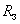 - сопротивление заземляющего устройства передвижной электроустановки, Ом;

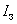 - полный ток однофазного замыкания на открытые проводящие части передвижной электроустановки, А.

1.7.164. Допускается не выполнять местный заземлитель для защитного заземления передвижной электроустановки, питающейся от автономного передвижного источника питания с изолированной нейтралью, в следующих случаях:

1) автономный источник питания и электроприемники расположены непосредственно на передвижной электроустановке, их корпуса соединены между собой при помощи защитного проводника, а от источника не питаются другие электроустановки;

2) автономный передвижной источник питания имеет свое заземляющее устройство для защитного заземления, все открытые проводящие части передвижной электроустановки, ее корпус и другие сторонние проводящие части надежно соединены с корпусом автономного передвижного источника при помощи защитного проводника, а при двухфазном замыкании на разные корпуса электрооборудования в передвижной электроустановке обеспечивается время автоматического отключения питания в соответствии с табл.1.7.10.

1.7.165. Автономные передвижные источники питания с изолированной нейтралью должны иметь устройство непрерывного контроля сопротивления изоляции относительно корпуса (земли) со световым и звуковым сигналами. Должна быть обеспечена возможность проверки исправности устройства контроля изоляции и его отключения.

Допускается не устанавливать устройство непрерывного контроля изоляции с действием на сигнал на передвижной электроустановке, питающейся от такого автономного передвижного источника, если при этом выполняется условие 1.7.164, пп.2.

1.7.166. Защита от прямого прикосновения в передвижных электроустановках должна быть обеспечена применением изоляции токоведущих частей, ограждений и оболочек со степенью защиты не менее IP 2X. Применение барьеров и размещение вне пределов досягаемости не допускается.

В цепях, питающих штепсельные розетки для подключения электрооборудования, используемого вне помещения передвижной установки, должна быть выполнена дополнительная защита в соответствии с 1.7.151.

1.7.167. Защитные и заземляющие проводники и проводники уравнивания потенциалов должны быть медными, гибкими, как правило, находиться в общей оболочке с фазными проводниками. Сечение проводников должно соответствовать требованиям:

защитных - 1.7.126-1.7.127;

заземляющих -1.7.113;

уравнивания потенциалов - 1.7.136-1.7.138.

При применении системы  допускается прокладка защитных и заземляющих проводников и проводников уравнивания потенциалов отдельно от фазных проводников.

1.7.168. Допускается одновременное отключение всех проводников линии, питающей передвижную электроустановку, включая защитный проводник при помощи одного коммутационного аппарата (разъема).

1.7.169. Если передвижная электроустановка питается с использованием штепсельных соединителей, вилка штепсельного соединителя должна быть подключена со стороны передвижной электроустановки и иметь оболочку из изолирующего материала.

# Электроустановки помещений для содержания животных

1.7.170. Питание электроустановок животноводческих помещений следует, как правило, выполнять от сети напряжением 380/220 В переменного тока.

1.7.171. Для защиты людей и животных при косвенном прикосновении должно быть выполнено автоматическое отключение питания с применением системы . Разделение -проводника на нулевой защитный () и нулевой рабочий () проводники следует выполнять на вводном щитке. При питании таких электроустановок от встроенных и пристроенных подстанций должна быть применена система , при этом нулевой рабочий проводник должен иметь изоляцию, равноценную изоляции фазных проводников на всем его протяжении.

Время защитного автоматического отключения питания в помещениях для содержания животных, а также в помещениях, связанных с ними при помощи сторонних проводящих частей, должно соответствовать табл.1.7.11.

# Таблица 1.7.11.Наибольшее допустимое время защитного автоматического отключения для системы img_f4be5908_14.png в помещениях для содержания животных

|  |  |
| --- | --- |
|Номинальное фазное напряжение, img_0b6e899e_3.png, В | Время отключения, с |
| 127 | 0,35 |
| 220 | 0,2 |
| 380 | 0,05 |

Если указанное время отключения не может быть гарантировано, необходимы дополнительные защитные меры, например дополнительное уравнивание потенциалов.

1.7.172. -проводник на вводе в помещение должен быть повторно заземлен. Значение сопротивления повторного заземления должно соответствовать 1.7.103.

1.7.173. В помещениях для содержания животных необходимо предусматривать защиту не только людей, но и животных, для чего должна быть выполнена дополнительная система уравнивания потенциалов, соединяющая все открытые и сторонние проводящие части, доступные одновременному прикосновению (трубы водопровода, вакуумпровода, металлические ограждения стойл, металлические привязи и др.).

1.7.174. В зоне размещения животных в полу должно быть выполнено выравнивание потенциалов при помощи металлической сетки или другого устройства, которое должно быть соединено с дополнительной системой уравнивания потенциалов.

1.7.175. Устройство выравнивания и уравнивания электрических потенциалов должно обеспечивать в нормальном режиме работы электрооборудования напряжение прикосновения не более 0,2 В, а в аварийном режиме при времени отключения более указанного в табл.1.7.11 для электроустановок в помещениях с повышенной опасностью, особо опасных и в наружных установках - не более 12 В.

1.7.176. Для всех групповых цепей, питающих штепсельные розетки, должна быть дополнительная защита от прямого прикосновения при помощи УЗО с номинальным отключающим дифференциальным током не более 30 мА.

1.7.177. В животноводческих помещениях, в которых отсутствуют условия, требующие выполнения выравнивания потенциалов, должна быть выполнена защита при помощи УЗО с номинальным отключающим дифференциальным током не менее 100 мА, устанавливаемых на вводном щитке.

Текст документа сверен по:  
нормативно-производственное издание  
М.: Издательство НЦ ЭНАС, 2002  