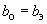

# Глава 2.4

# ВОЗДУШНЫЕ ЛИНИИ ЭЛЕКТРОПЕРЕДАЧИ НАПРЯЖЕНИЕМ ДО 1 КВ

Дата введения 2003-10-01

# Предисловие

РАЗРАБОТАНА с учетом требований государственных стандартов, строительных норм и правил, рекомендаций научно-технических советов по рассмотрению проектов глав. Проекты глав рассмотрены рабочими группами Координационного совета по пересмотру ПУЭ

ПОДГОТОВЛЕНА АООТ "РОСЭП", соисполнитель - АО "Фирма ОРГРЭС"

СОГЛАСОВАНА в установленном порядке с Госстроем России, Госгортехнадзором России, РАО "ЕЭС России" (ОАО "ВНИИЭ") и представлена к утверждению Госэнергонадзором Минэнерго России

УТВЕРЖДЕНАприказом Минэнерго России от 20 мая 2003 г. N 187С 1 октября 2003 г. утрачивают силуглава 2.4 "Правил устройства электроустановок" шестого изданияТребованияПравил устройства электроустановокобязательны для всех организаций независимо от форм собственности и организационно-правовых форм, а также для физических лиц, занятых предпринимательской деятельностью без образования юридического лица.

# Область применения. Определения

2.4.1. Настоящая глава Правил распространяется на воздушные линии электропередачи переменного тока напряжением до 1 кВ, выполняемые с применением изолированных или неизолированных проводов.

Дополнительные требования к ВЛ до 1 кВ приведены в гл.2.5, 6.3 и 7.7.

Кабельные вставки в линию и кабельные ответвления от линии должны выполняться в соответствии с требованиями гл.2.3.

2.4.2. Воздушная линия (ВЛ) электропередачи напряжением до 1 кВ - устройство для передачи и распределения электроэнергии по изолированным или неизолированным проводам, расположенным на открытом воздухе и прикрепленным линейной арматурой к опорам, изоляторам или кронштейнам, к стенам зданий и к инженерным сооружениям.

Воздушная линия электропередачи напряжением до 1 кВ с применением самонесущих изолированных проводов (СИП) обозначается ВЛИ.

Самонесущий изолированный провод - скрученные в жгут изолированные жилы, причем несущая жила может быть как изолированной, так и неизолированной. Механическая нагрузка может восприниматься или несущей жилой, или всеми проводниками жгута.

2.4.3. Магистраль ВЛ - участок линии от питающей трансформаторной подстанции до концевой опоры.

К магистрали ВЛ могут быть присоединены линейные ответвления или ответвления к вводу.

Линейное ответвление от ВЛ - участок линии, присоединенной к магистрали ВЛ, имеющий более двух пролетов.

Ответвление от ВЛ к вводу - участок от опоры магистрали или линейного ответвления до зажима (изолятора ввода).

Ответвление от ВЛИ допускается выполнять в пролете.

2.4.4. Состояние ВЛ в расчетах механической части:

нормальный режим - режим при необорванных проводах;

аварийный режим - режим при оборванных проводах;

монтажный режим - режим в условиях монтажа опор и проводов.

Механический расчет ВЛ до 1 кВ в аварийном режиме не производится.

# Общие требования

2.4.5. Механический расчет элементов ВЛ должен производиться по методам, изложенным в гл.2.5.

2.4.6. Воздушные линии электропередачи должны размещаться так, чтобы опоры не загораживали входы в здания и въезды во дворы и не затрудняли движения транспорта и пешеходов. В местах, где имеется опасность наезда транспорта (у въездов во дворы, вблизи съездов с дорог, при пересечении дорог), опоры должны быть защищены от наезда (например, отбойными тумбами).

2.4.7. На опорах ВЛ на высоте не менее 2 м от земли через 250 м на магистрали ВЛ должны быть установлены (нанесены): порядковый номер опоры; плакаты, на которых указаны расстояния от опоры ВЛ до кабельной линии связи (на опорах, установленных на расстоянии менее 4 м до кабелей связи), ширина охранной зоны и телефон владельца ВЛ.

2.4.8. При прохождении ВЛИ по лесным массивам и зеленым насаждениям вырубка просек не требуется. При этом расстояние от проводов до деревьев и кустов при наибольшей стреле провеса СИП и наибольшем их отклонении должно быть не менее 0,3 м.

При прохождении ВЛ с неизолированными проводами по лесным массивам и зеленым насаждениям вырубка просеки не обязательна. При этом расстояние от проводов при наибольшей стреле провеса или наибольшем отклонении до деревьев и кустов должно быть не менее 1 м.

Расстояние от изолированных проводов до зеленых насаждений должно быть не менее 0,5 м.

2.4.9. Конструкции опор ВЛ должны быть защищены от коррозии с учетом требований 2.5.25, 2.5.26 и строительных норм и правил.

2.4.10. Защиту ВЛ от электрических перегрузок следует выполнять в соответствии с требованиями гл.3.1.

# Климатические условия

2.4.11. Климатические условия для расчета ВЛ до 1 кВ в нормальном режиме должны приниматься как для ВЛ до 20 кВ в соответствии с 2.5.38-2.5.74. При этом для ВЛ до 1 кВ следует принимать:

при расчете по 2.5.52: = 1,1 - для СИП, свободных или покрытых гололедом;

при расчете по 2.5.54 и 2.5.55:

0,8 - для одноцепных ВЛ;

0,9 - для одноцепных ВЛ с подвеской на опорах ПВ;

1,0 и 1,2 - для двухцепных и многоцепных ВЛ, а также при подвеске на опорах ВЛ самонесущего неметаллического оптического кабеля (ОКСН);

1,0 и 1,0 - во всех случаях.

2.4.12. Расчет длины пролета ответвления от ВЛ к вводу по 2.4.20 должен выполняться в гололедном режиме для двух случаев:

1) направление ветра под углом 90° к оси ВЛ, провода ВЛ покрыты гололедом , толщина стенки гололеда на проводах ответвления ;

2) направление ветра вдоль ВЛ (угол 0°), толщина стенки гололеда на проводах ответвления *.*

При этом в обоих случаях следует учитывать редукцию тяжения проводов ответвления при отклонении верха опоры.

# Провода. Линейная арматура

2.4.13. На ВЛ должны, как правило, применяться самонесущие изолированные провода (СИП).

СИП должен относиться к категории защищенных, иметь изоляцию из трудносгораемого светостабилизированного синтетического материала, стойкого к ультрафиолетовому излучению и воздействию озона.

2.4.14. По условиям механической прочности на магистралях ВЛ, на линейном ответвлении от ВЛ и на ответвлениях к вводам следует применять провода с минимальными сечениями, указанными в табл.2.4.1 и 2.4.2.

Таблица 2.4.1

Минимально допустимые сечения изолированных проводов

|  |  |  |
| --- | --- | --- |
|Нормативная толщина стенки гололеда img_5475ef91_1.png, мм | Сечение несущей жилы, ммimg_85e43c10.png, на магистрали ВЛИ, на линейном ответвлении от ВЛИ | Сечение жилы на ответвлениях от ВЛИ и от ВЛ к вводам, ммimg_85e43c10_1.png |
| 10 | 35 (25)\* | 16 |
| 15 и более | 50 (25)\* | 16 |

\_\_\_\_\_\_\_\_\_\_\_\_\_\_\_\_

\* В скобках дано сечение жилы самонесущих изолированных проводов, скрученных в жгут, без несущего провода.

Таблица 2.4.2

Минимально допустимые сечения неизолированных и изолированных проводов

|  |  |  |
| --- | --- | --- |
|Нормативная толщина стенки гололеда img_5475ef91_2.png, мм | Материал провода | Сечение провода на магистрали и линейном ответвлении, мм |
| 10 | Алюминий (А),  нетермообработанный  алюминиевый сплав (АН) | 25 |
|  | Сталеалюминий (АС),  термообработанный  алюминиевый сплав (АЖ) | 25 |
|  | Медь (М) | 16 |
|  |  | 35 |
| 15 и более | А, АН  АС, АЖ  М | 25 |
|  |  | 16 |

2.4.15. При сооружении ВЛ в местах, где опытом эксплуатации установлено разрушение проводов от коррозии (побережья морей, соленых озер, промышленные районы и районы засоленных песков), а также в местах, где на основании данных изысканий оно возможно, следует применять самонесущие изолированные провода с изолированной жилой.

2.4.16. Магистраль ВЛ, как правило, следует выполнять проводами неизменного сечения.

Сечения фазных проводов магистрали ВД рекомендуется принимать не менее 50 мм.

2.4.17. Механический расчет проводов должен производиться по методу допускаемых напряжений для условий, указанных в 2.5.38-2.5.74. При этом напряжения в проводах не должны превышать допускаемых напряжений, приведенных в табл.2.4.3, а расстояния от проводов до поверхности земли, пересекаемых сооружений и заземленных элементов опор должны отвечать требованиям настоящей главы.

Таблица 2.4.3

Допустимое механическое напряжение в проводах ВЛ до 1 кВ

|  |  |  |
| --- | --- | --- |
|| Допустимое напряжение, % предела прочности при растяжении | |
| Провод | при наибольшей нагрузке и низшей температуре  img_2e797193.png | при среднегодовой температуре  img_736f8c63.png |
| СИП сечением 25-120 ммimg_85e43c10_3.png | 40 | 30 |
| Алюминиевый сечением, ммimg_85e43c10_4.png: |  |  |
| 25-95 | 35 | 30 |
| 120 | 40 | 30 |
| Из термообработанного и нетермообработанного алюминиевого сплава сечением, ммimg_85e43c10_5.png: |  |  |
| 25-95 | 40 | 30 |
| 120 | 45 | 30 |
| Сталеалюминиевый сечением, ммimg_85e43c10_6.png: |  |  |
| 25 | 35 | 30 |
| 35-95 | 40 | 30 |

При расчете используются параметры проводов, приведенные в табл.2.5.8.

2.4.18. Все виды механических нагрузок и воздействий на СИП с несущей жилой должна воспринимать эта жила, а на СИП без несущего провода - должны воспринимать все жилы скрученного жгута.

2.4.19. Длина пролета ответвления от ВЛ к вводу должна определяться расчетом в зависимости от прочности опоры, на которой выполняется ответвление, высоты подвески проводов ответвления на опоре и на вводе, количества и сечения жил проводов ответвления.

При расстояниях от магистрали ВЛ до здания, превышающих расчетные значения пролета ответвления, устанавливается необходимое число дополнительных опор.

2.4.20. Выбор сечения токоведущих проводников по длительно допустимому току следует выполнять с учетом требований гл.1.3.

Сечение токоведущих проводников должно проверяться по условию нагрева при коротких замыканиях (КЗ) и на термическую стойкость.

2.4.21. Крепление, соединение СИП и присоединение к СИП следует производить следующим образом:

1) крепление провода магистрали ВЛИ на промежуточных и угловых промежуточных опорах - с помощью поддерживающих зажимов;

2) крепление провода магистрали ВЛИ на опорах анкерного типа, а также концевое крепление проводов ответвления на опоре ВЛИ и на вводе - с помощью натяжных зажимов;

3) соединение провода ВЛИ в пролете - с помощью специальных соединительных зажимов; в петлях опор анкерного типа допускается соединение неизолированного несущего провода с помощью плашечного зажима. Соединительные зажимы, предназначенные для соединения несущего провода в пролете, должны иметь механическую прочность не менее 90% разрывного усилия провода;

4) соединение фазных проводов магистрали ВЛИ - с помощью соединительных зажимов, имеющих изолирующее покрытие или защитную изолирующую оболочку;

5) соединение проводов в пролете ответвления к вводу не допускается;

6) соединение заземляющих проводников - с помощью плашечных зажимов;

7) ответвительные зажимы следует применять в случаях:

ответвления от фазных жил, за исключением СИП со всеми несущими проводниками жгута;

ответвления от несущей жилы.

2.4.22. Крепление поддерживающих и натяжных зажимов к опорам ВЛИ, стенам зданий и сооружениям следует выполнять с помощью крюков и кронштейнов.

2.4.23. Расчетные усилия в поддерживающих и натяжных зажимах, узлах крепления и кронштейнах в нормальном режиме не должны превышать 40% их механической разрушающей нагрузки.

2.4.24. Соединения проводов в пролетах ВЛ следует производить при помощи соединительных зажимов, обеспечивающих механическую прочность не менее 90% разрывного усилия провода.

В одном пролете ВЛ допускается не более одного соединения на каждый провод.

В пролетах пересечения ВЛ с инженерными сооружениями соединение проводов ВЛ не допускается.

Соединение проводов в петлях анкерных опор должно производиться при помощи зажимов или сваркой.

Провода разных марок или сечений должны соединяться только в петлях анкерных опор.

2.4.25. Крепление неизолированных проводов к изоляторам и изолирующим траверсам на опорах ВЛ, за исключением опор для пересечений, рекомендуется выполнять одинарным.

Крепление неизолированных проводов к штыревым изоляторам на промежуточных опорах следует выполнять, как правило, на шейке изолятора с внутренней его стороны по отношению к стойке опоры.

2.4.26. Крюки и штыри должны рассчитываться в нормальном режиме работы ВЛ по методу разрушающих нагрузок.

При этом усилия не должны превышать значений, приведенных в 2.5.101.

# Расположение проводов на опорах

2.4.27. На опорах допускается любое расположение изолированных и неизолированных проводов ВЛ независимо от района климатических условий. Нулевой провод ВЛ с неизолированными проводами, как правило, следует располагать ниже фазных проводов. Изолированные провода наружного освещения, прокладываемые на опорах ВЛИ, могут размещаться выше или ниже СИП, а также быть скрученными в жгут СИП. Неизолированные и изолированные провода наружного освещения, прокладываемые на опорах ВЛ, должны располагаться, как правило, над *PEN (РЕ)* проводником ВЛ.

2.4.28. Устанавливаемые на опорах аппараты для подключения электроприемников должны размещаться на высоте не менее 1,6 м от поверхности земли.

Устанавливаемые на опорах защитные и секционирующие устройства должны размещаться ниже проводов ВЛ.

2.4.29. Расстояния между неизолированными проводами на опоре и в пролете по условиям их сближения в пролете при наибольшей стреле провеса до 1,2 м должны быть не менее:

при вертикальном расположении проводов и расположении проводов с горизонтальным смещением не более 20 см: 40 см в I, II и III районах по гололеду, 60 см в IV и особом районах по гололеду;

при других расположениях проводов во всех районах по гололеду при скорости ветра при гололеде: до 18 м/с - 40 см, более 18 м/с - 60 см.

При наибольшей стреле провеса более 1,2 м указанные расстояния должны быть увеличены пропорционально отношению наибольшей стрелы провеса к стреле провеса, равной 1,2 м.

2.4.30. Расстояние по вертикали между изолированными и неизолированными проводами ВЛ разных фаз на опоре при ответвлении от ВЛ и при пересечении разных ВЛ на общей опоре должно быть не менее 10 см.

Расстояния от проводов ВЛ до любых элементов опоры должно быть не менее 5 см.

2.4.31. При совместной подвеске на общих опорах ВЛИ и ВЛ до 1 кВ расстояние по вертикали между ними на опоре и в пролете при температуре окружающего воздуха плюс 15 °С без ветра должно быть не менее 0,4 м.

2.4.32. При совместной подвеске на общих опорах двух или более ВЛИ расстояние между жгутами СИП должно быть не менее 0,3 м.

2.4.33. При совместной подвеске на общих опорах проводов ВЛ до 1 кВ и проводов ВЛ до 20 кВ расстояние по вертикали между ближайшими проводами ВЛ разных напряжений на общей опоре, а также в середине пролета при температуре окружающего воздуха плюс 15 °С без ветра должно быть не менее:

1,0 м - при подвеске СИП с изолированным несущим и со всеми несущими проводами;

1,75 м - при подвеске СИП с неизолированным несущим проводом;

2,0 м - при подвеске неизолированных и изолированных проводов ВЛ до 1 кВ.

2.4.34. При подвеске на общих опорах проводов ВЛ до 1 кВ и защищенных проводов ВЛЗ 6-20 кВ (см. 2.5.1) расстояние по вертикали между ближайшими проводами ВЛ до 1 кВ и ВЛЗ 6-20 кВ на опоре и в пролете при температуре плюс 15 °С без ветра должно быть не менее 0,3 м для СИП и 1,5 м для неизолированных и изолированных проводов ВЛ до 1 кВ.

# Изоляция

2.4.35. Самонесущий изолированный провод крепится к опорам без применения изоляторов.

2.4.36. На ВЛ с неизолированными и изолированными проводами независимо от материала опор, степени загрязнения атмосферы и интенсивности грозовой деятельности следует применять изоляторы либо траверсы из изоляционных материалов.

Выбор и расчет изоляторов и арматуры выполняются в соответствии с 2.5.100.

2.4.37. На опорах ответвлений от ВЛ с неизолированными и изолированными проводами следует, как правило, применять многошейковые или дополнительные изоляторы.

# Заземление. Защита от перенапряжений

2.4.38. На опорах ВЛ должны быть выполнены заземляющие устройства, предназначенные для повторного заземления, защиты от грозовых перенапряжений, заземления электрооборудования, установленного на опорах ВЛ. Сопротивление заземляющего устройства должно быть не более 30 Ом.

2.4.39. Металлические опоры, металлические конструкции и арматура железобетонных элементов опор должны быть присоединены к *РЕN*-проводнику.

2.4.40. На железобетонных опорах *РЕN*-проводник следует присоединять к арматуре железобетонных стоек и подкосов опор.

2.4.41. Крюки и штыри деревянных опор ВЛ, а также металлических и железобетонных опор при подвеске на них СИП с изолированным несущим проводником или со всеми несущими проводниками жгута заземлению не подлежат, за исключением крюков и штырей на опорах, где выполнены повторные заземления и заземления для защиты от атмосферных перенапряжений.

2.4.42. Крюки, штыри и арматура опор ВЛ напряжением до 1 кВ, ограничивающих пролет пересечения, а также опор, на которых производится совместная подвеска, должны быть заземлены.

2.4.43. На деревянных опорах ВЛ при переходе в кабельную линию заземляющий проводник должен быть присоединен к *РЕN*-проводнику ВЛ и к металлической оболочке кабеля.

2.4.44. Защитные аппараты, устанавливаемые на опорах ВЛ для защиты от грозовых перенапряжений, должны быть присоединены к заземлителю отдельным спуском.

2.4.45. Соединение заземляющих проводников между собой, присоединение их к верхним заземляющим выпускам стоек железобетонных опор, к крюкам и кронштейнам, а также к заземляемым металлоконструкциям и к заземляемому электрооборудованию, установленному на опорах ВЛ, должны выполняться сваркой или болтовыми соединениями.

Присоединение заземляющих проводников (спусков) к заземлителю в земле также должно выполняться сваркой или иметь болтовые соединения.

2.4.46. В населенной местности с одно- и двухэтажной застройкой ВЛ должны иметь заземляющие устройства, предназначенные для защиты от атмосферных перенапряжений. Сопротивления этих заземляющих устройств должны быть не более 30 Ом, а расстояния между ними должны быть не более 200 м для районов с числом грозовых часов в году до 40, 100 м - для районов с числом грозовых часов в году более 40.

Кроме того, заземляющие устройства должны быть выполнены:

1) на опорах с ответвлениями к вводам в здания, в которых может быть сосредоточено большое количество людей (школы, ясли, больницы) или которые представляют большую материальную ценность (животноводческие и птицеводческие помещения, склады);

2) на концевых опорах линий, имеющих ответвления к вводам, при этом наибольшее расстояние от соседнего заземления этих же линий должно быть не более 100 м для районов с числом грозовых часов в году до 40 и 50 м - для районов с числом грозовых часов в году более 40.

2.4.47. В начале и конце каждой магистрали ВЛИ на проводах рекомендуется устанавливать зажимы для присоединения приборов контроля напряжения и переносного заземления.

Заземляющие устройства защиты от грозовых перенапряжений рекомендуется совмещать с повторным заземлением *РЕN*-проводника.

2.4.48. Требования к заземляющим устройствам повторного заземления и защитным проводникам приведены в 1.7.102, 1.7.103, 1.7.126. В качестве заземляющих проводников на опорах ВЛ допускается применять круглую сталь, имеющую антикоррозионное покрытие диаметром не менее 6 мм.

2.4.49. Оттяжки опор ВЛ должны быть присоединены к заземляющему проводнику.

# Опоры

2.4.50. На ВЛ могут применяться опоры из различного материала.

Для ВЛ следует применять следующие типы опор:

1) промежуточные, устанавливаемые на прямых участках трассы ВЛ. Эти опоры в нормальных режимах работы не должны воспринимать усилий, направленных вдоль ВЛ;

2) анкерные, устанавливаемые для ограничения анкерного пролета, а также в местах изменения числа, марок и сечений проводов ВЛ. Эти опоры должны воспринимать в нормальных режимах работы усилия от разности тяжения проводов, направленные вдоль ВЛ;

3) угловые, устанавливаемые в местах изменения направления трассы ВЛ. Эти опоры при нормальных режимах работы должны воспринимать результирующую нагрузку от тяжения проводов смежных пролетов. Угловые опоры могут быть промежуточными и анкерного типа;

4) концевые, устанавливаемые в начале и конце ВЛ, а также в местах, ограничивающих кабельные вставки. Они являются опорами анкерного типа и должны воспринимать в нормальных режимах работы ВЛ одностороннее тяжение всех проводов.

Опоры, на которых выполняются ответвления от ВЛ, называются ответвительными; опоры, на которых выполняется пересечение ВЛ разных направлений или пересечение ВЛ с инженерными сооружениями, - перекрестными. Эти опоры могут быть всех указанных типов.

2.4.51. Конструкции опор должны обеспечивать возможность установки:

светильников уличного освещения всех типов;

концевых кабельных муфт;

защитных аппаратов;

секционирующих и коммутационных аппаратов;

шкафов и щитков для подключения электроприемников.

2.4.52. Опоры независимо от их типа могут быть свободностоящими, с подкосами или оттяжками.

Оттяжки опор могут прикрепляться к анкерам, установленным в земле, или к каменным, кирпичным, железобетонным и металлическим элементам зданий и сооружений. Сечение оттяжек определяется расчетом. Они могут быть многопроволочными или из круглой стали. Сечение однопроволочных стальных оттяжек должно быть не менее 25 мм.

2.4.53. Опоры ВЛ должны рассчитываться по первому и второму предельному состоянию в нормальном режиме работы ВЛ на климатические условия по 2.4.11 и 2.4.12.

Промежуточные опоры должны быть рассчитаны на следующие сочетания нагрузок:

одновременное воздействие поперечной ветровой нагрузки на провода, свободные или покрытые гололедом, и на конструкцию опоры, а также нагрузки от тяжения проводов ответвлений к вводам, свободных от гололеда или частично покрытых гололедом (по 2.4.12);

на нагрузку от тяжения проводов ответвлений к вводам, покрытых гололедом, при этом допускается учет отклонения опоры под действием нагрузки;

на условную расчетную нагрузку, равную 1,5 кН, приложенную к вершине опоры и направленную вдоль оси ВЛ.

Угловые опоры (промежуточные и анкерные) должны быть рассчитаны на результирующую нагрузку от тяжения проводов и ветровую нагрузку на провода и конструкцию опоры.

Анкерные опоры должны быть рассчитаны на разность тяжения проводов смежных пролетов и поперечную нагрузку от давления ветра при гололеде и без гололеда на провода и конструкцию опоры. За наименьшее значение разности тяжения следует принимать 50% наибольшего значения одностороннего тяжения всех проводов.

Концевые опоры должны быть рассчитаны на одностороннее тяжение всех проводов.

Ответвительные опоры рассчитываются на результирующую нагрузку от тяжения всех проводов.

2.4.54. При установке опор на затапливаемых участках трассы, где возможны размывы грунта или воздействие ледохода, опоры должны быть укреплены (подсыпка земли, замощение, устройство банкеток, установка ледорезов).

# Габариты, пересечения и сближения

2.4.55. Расстояние по вертикали от проводов ВЛИ до поверхности земли в населенной и ненаселенной местности до земли и проезжей части улиц должно быть не менее 5 м. Оно может быть уменьшено в труднодоступной местности до 2,5 м и в недоступной (склоны гор, скалы, утесы) - до 1 м.

При пересечении непроезжей части улиц ответвлениями от ВЛИ к вводам в здания расстояния от СИП до тротуаров пешеходных дорожек допускается уменьшить до 3,5 м.

Расстояние от СИП и изолированных проводов до поверхности земли на ответвлениях к вводу должно быть не менее 2,5 м.

Расстояние от неизолированных проводов до поверхности земли на ответвлениях к вводам должно быть не менее 2,75 м.

2.4.56. Расстояние от проводов ВЛ в населенной и ненаселенной местности при наибольшей стреле провеса проводов до земли и проезжей части улиц должно быть не менее 6 м. Расстояние от проводов до земли может быть уменьшено в труднодоступной местности до 3,5 м и в недоступной местности (склоны гор, скалы, утесы) - до 1 м.

2.4.57. Расстояние по горизонтали от СИП при наибольшем их отклонении до элементов зданий и сооружений должно быть не менее:

1,0 м - до балконов, террас и окон;

0,2 м - до глухих стен зданий, сооружений.

Допускается прохождение ВЛИ и ВЛ с изолированными проводами над крышами зданий и сооружениями (кроме оговоренных в гл.7.3 и 7.4), при этом расстояние от них до проводов по вертикали должно быть не менее 2,5 м.

2.4.58. Расстояние по горизонтали от проводов ВЛ при наибольшем их отклонении до зданий и сооружений должно быть не менее:

1,5 м - до балконов, террас и окон;

1,0 м - до глухих стен.

Прохождение ВЛ с неизолированными проводами над зданиями и сооружениями не допускается.

2.4.59. Наименьшее расстояние от СИП и проводов ВЛ до поверхности земли или воды, а также до различных сооружений при прохождении ВЛ над ними определяется при высшей температуре воздуха без учета нагрева проводов ВЛ электрическим током.

2.4.60. При прокладке по стенам зданий и сооружениям минимальное расстояние от СИП должно быть:

при горизонтальной прокладке

над окном, входной дверью - 0,3 м;

под балконом, окном, карнизом - 0,5 м;

до земли - 2,5 м;

при вертикальной прокладке

до окна - 0,5 м;

до балкона, входной двери - 1,0 м.

Расстояние в свету между СИП и стеной здания или сооружением должно быть не менее 0,06 м.

2.4.61. Расстояния по горизонтали от подземных частей опор или заземлителей опор до подземных кабелей, трубопроводов и наземных колонок различного назначения должны быть не менее приведенных в табл.2.4.4.

Таблица 2.4.4

Наименьшее допустимое расстояние по горизонтали от подземных частей опор или заземляющих устройств опор до подземных кабелей, трубопроводов и наземных колонок

|  |  |
| --- | --- |
|Объект сближения | Расстояние, м |
| Водо-, паро- и теплопроводы, распределительные газопроводы, канализационные трубы | 1 |
| Пожарные гидранты, колодцы, люки канализации, водоразборные колонки | 2 |
| Кабели (кроме кабелей связи, сигнализации и проводного вещания, см. также 2.4.77) | 1 |
| То же, но при прокладке их в изолирующей трубе | 0,5 |

2.4.62. При пересечении ВЛ с различными сооружениями, а также с улицами и площадями населенных пунктов угол пересечения не нормируется.

2.4.63. Пересечение ВЛ с судоходными реками и каналами не рекомендуется. При необходимости выполнения такого пересечения ВЛ должны сооружаться в соответствии с требованиями 2.5.268-2.5.272. При пересечении несудоходных рек и каналов наименьшие расстояния от проводов ВЛ до наибольшего уровня воды должно быть не менее 2 м, а до уровня льда - не менее 6 м.

2.4.64. Пересечения и сближения ВЛ напряжением до 1 кВ с ВЛ напряжением выше 1 кВ, а также совместная подвеска их проводов на общих опорах должны выполняться с соблюдением требований, приведенных в 2.5.220-2.5.230.

2.4.65. Пересечение ВЛ (ВЛИ) до 1 кВ между собой рекомендуется выполнять на перекрестных опорах; допускается также их пересечение в пролете. Расстояние по вертикали между проводами пересекающихся ВЛ (ВЛИ) должно быть не менее: 0,1 м на опоре, 1 м в пролете.

2.4.66. В местах пересечения ВЛ до 1 кВ между собой могут применяться промежуточные опоры и опоры анкерного типа.

При пересечении ВЛ до 1 кВ между собой в пролете место пересечения следует выбирать возможно ближе к опоре верхней пересекающей ВЛ, при этом расстояние по горизонтали от опор пересекающей ВЛ до проводов пересекаемой ВЛ при наибольшем их отклонении должно быть не менее 2 м.

2.4.67. При параллельном прохождении и сближении ВЛ до 1 кВ и ВЛ выше 1 кВ расстояние между ними по горизонтали должно быть не менее указанных в 2.5.230.

2.4.68. Совместная подвеска проводов ВЛ до 1 кВ и неизолированных проводов ВЛ до 20 кВ на общих опорах допускается при соблюдении следующих условий:

1) ВЛ до 1 кВ должны выполняться по расчетным климатическим условиям ВЛ до 20 кВ;

2) провода ВЛ до 20 кВ должны располагаться выше проводов ВЛ до 1 кВ;

3) провода ВЛ до 20 кВ, закрепляемые на штыревых изоляторах, должны иметь двойное крепление.

2.4.69. При подвеске на общих опорах проводов ВЛ до 1 кВ и защищенных проводов ВЛЗ 6-20 кВ должны соблюдаться следующие требования:

1) ВЛ до 1 кВ должны выполняться по расчетным климатическим условиям ВЛ до 20 кВ;

2) провода ВЛЗ 6-20 кВ должны располагаться, как правило, выше проводов ВЛ до 1 кВ;

3) крепление проводов ВЛЗ 6-20 кВ на штыревых изоляторах должно выполняться усиленным.

2.4.70. При пересечении ВЛ (ВЛИ) с ВЛ напряжением выше 1 кВ расстояние от проводов пересекающей ВЛ до пересекаемой ВЛ (ВЛИ) должно соответствовать требованиям, приведенным в 2.5.221 и 2.5.227.

Сечение проводов пересекаемой ВЛ должно приниматься в соответствии с 2.5.223.

# Пересечения, сближения, совместная подвеска ВЛ с линиями связи, проводного вещания и РК

2.4.71. Угол пересечения ВЛ с ЛС\* и ЛПВ должен быть по возможности близок к 90°. Для стесненных условий угол пересечения не нормируется.

\_\_\_\_\_\_\_\_\_\_\_\_\_\_\_

\* Под ЛС следует понимать линии связи Министерства связи РФ и других ведомств, а также линии сигнализации Министерства путей сообщения.

Под ЛПВ следует понимать линии проводного вещания.

Воздушные линии связи по своему назначению разделяются на линии междугородной телефонной связи (МТС), линии сельской телефонной связи (СТС), линии городской телефонной связи (ГТС), линии проводного вещания (ЛПВ).

По значимости воздушные линии связи и проводного вещания подразделяются на классы:

линии МТС и СТС: магистральные линии МТС, соединяющие Москву с республиканскими, краевыми и областными центрами и последние между собой, и линии Министерства путей сообщения, проходящие вдоль железных дорог и по территории железнодорожных станций (класс I); внутризоновые линии МТС, соединяющие республиканские, краевые и областные центры с районными центрами и последние между собой, и соединительные линии СТС (класс II); абонентские линии СТС (класс III);

линии ГТС на классы не подразделяются;

линии проводного вещания: фидерные линии с номинальным напряжением выше 360 В (класс I); фидерные линии с номинальным напряжением до 360 В и абонентские линии с напряжением 15 и 30 В (класс II).

2.4.72. Расстояние по вертикали от проводов ВЛ до проводов или подвесных кабелей ЛС и ЛПВ в пролете пересечения при наибольшей стреле провеса провода ВЛ должно быть:

от СИП и изолированных проводов - не менее 1 м;

от неизолированных проводов - не менее 1,25 м.

2.4.73. Расстояние по вертикали от проводов ВЛ до 1 кВ до проводов или подвесных кабелей ЛС или ЛПВ при пересечении на общей опоре должно быть:

между СИП и ЛС или ЛПВ - не менее 0,5 м;

между неизолированным проводом ВЛ и ЛПВ - не менее 1,5 м.

2.4.74. Место пересечения проводов ВЛ с проводами или подвесными кабелями ЛС и ЛПВ в пролете должно находиться по возможности ближе к опоре ВЛ, но не менее 2 м от нее.

2.4.75. Пересечение ВЛ с ЛС и ЛПВ может быть выполнено по одному из следующих вариантов:

1) проводами ВЛ и изолированными проводами ЛС и ЛПВ;

2) проводами ВЛ и подземным или подвесным кабелем ЛС и ЛПВ;

3) проводами ВЛ и неизолированными проводами ЛС и ЛПВ;

4) подземной кабельной вставкой в ВЛ с изолированными и неизолированными проводами ЛС и ЛПВ.

2.4.76. При пересечении проводов ВЛ с изолированными проводами ЛС и ЛПВ должны соблюдаться следующие требования:

1) пересечение ВЛИ с ЛС и ЛПВ может выполняться в пролете и на опоре;

2) пересечение неизолированных проводов ВЛ с проводами ЛС, а также с проводами ЛПВ напряжением выше 360 В должно выполняться только в пролете. Пересечение неизолированных проводов ВЛ с проводами ЛПВ напряжением до 360 В может выполняться как в пролете, так и на общей опоре;

3) опоры ВЛ, ограничивающие пролет пересечения с ЛС магистральных и внутризоновых сетей связи и соединительными линиями СТС, а также ЛПВ напряжением выше 360 В, должны быть анкерного типа. При пересечении всех остальных ЛС и ЛПВ допускаются опоры ВЛ промежуточного типа, усиленные дополнительной приставкой или подкосом;

4) провода ВЛ должны располагаться над проводами ЛС и ЛПВ. На опорах, ограничивающих пролет пересечения, неизолированные и изолированные провода ВЛ должны иметь двойное крепление, СИП закрепляется анкерными зажимами. Провода ЛС и ЛПВ на опорах, ограничивающих пролет пересечения, должны иметь двойное крепление. В городах и поселках городского типа вновь строящиеся ЛС и ЛПВ допускается располагать над проводами ВЛ напряжением до 1 кВ.

2.4.77. При пересечении проводов ВЛ с подземным или подвесным кабелем ЛС и ЛПВ должны выполняться следующие требования:

1) расстояние от подземной части металлической или железобетонной опоры и заземлителя деревянной опоры до подземного кабеля ЛС и ЛПВ в населенной местности должно быть, как правило, не менее 3 м. В стесненных условиях допускается уменьшение этих расстояний до 1 м (при условии допустимости мешающих влияний на ЛС и ЛПВ); при этом кабель должен быть проложен в стальной трубе или покрыт швеллером или угловой сталью по длине в обе стороны от опоры не менее 3 м;

2) в ненаселенной местности расстояние от подземной части или заземлителя опоры ВЛ до подземного кабеля ЛС и ЛПВ должно быть не менее значений, приведенных в табл.2.4.5;

Таблица 2.4.5

Наименьшее расстояние от подземной части и заземлителя опоры ВЛ до подземного кабеля ЛС и ЛПВ

в ненаселенной местности

|  |  |  |
| --- | --- | --- |
|Эквивалентное удельное сопротивление земли, Ом·м | Наименьшее расстояние, м, от подземного кабеля ЛС и ЛПВ | |
|  | до заземлителя или подземной части железобетонной и металлической опоры | до подземной части деревянной опоры, не имеющей заземляющего устройства |
| До 100 | 10 | 5 |
| Более 100 до 500 | 15 | 10 |
| Более 500 до 1000 | 20 | 15 |
| Более 1000 | 30 | 25 |

3) провода ВЛ должны располагаться, как правило, над подвесным кабелем ЛС и ЛПВ (см. также 2.4.76, п.4);

4) соединение проводов ВЛ в пролете пересечения с подвесным кабелем ЛС и ЛПВ не допускается. Сечение несущей жилы СИП должно быть не менее 35 мм. Провода ВЛ должны быть многопроволочными сечением не менее: алюминиевые - 35 мм, сталеалюминиевые - 25 мм; сечение жилы СИП со всеми несущими проводниками жгута - не менее 25 мм;

5) металлическая оболочка подвесного кабеля и трос, на котором подвешен кабель, должны быть заземлены на опорах, ограничивающих пролет пересечения;

6) расстояние по горизонтали от основания кабельной опоры ЛС и ЛПВ до проекции ближайшего провода ВЛ на горизонтальную плоскость должно быть не менее наибольшей высоты опоры пролета пересечения.

2.4.78. При пересечении ВЛИ с неизолированными проводами ЛС и ЛПВ должны соблюдаться следующие требования:

1) пересечение ВЛИ с ЛС и ЛПВ может выполняться в пролете и на опоре;

2) опоры ВЛИ, ограничивающие пролет пересечения с ЛС магистральных и внутризоновых сетей связи и с соединительными линиями СТС, должны быть анкерного типа. При пересечении всех остальных ЛС и ЛПВ на ВЛИ допускается применение промежуточных опор, усиленных дополнительной приставкой или подкосом;

3) несущая жила СИП или жгута со всеми несущими проводниками на участке пересечения должна иметь коэффициент запаса прочности на растяжение при наибольших расчетных нагрузках не менее 2,5;

4) провода ВЛИ должны располагаться над проводами ЛС и ЛПВ. На опорах, ограничивающих пролет пересечения, несущие провода СИП должны закрепляться натяжными зажимами. Провода ВЛИ допускается располагать под проводами ЛПВ. При этом провода ЛПВ на опорах, ограничивающих пролет пересечения, должны иметь двойное крепление;

5) соединение несущей жилы и несущих проводников жгута СИП, а также проводов ЛС и ЛПВ в пролетах пересечения не допускается.

2.4.79. При пересечении изолированных и неизолированных проводов ВЛ с неизолированными проводами ЛС и ЛПВ должны соблюдаться следующие требования:

1) пересечение проводов ВЛ с проводами ЛС, а также проводами ЛПВ напряжением выше 360 В должно выполняться только в пролете.

Пересечение проводов ВЛ с абонентскими и фидерными линиями ЛПВ напряжением до 360 В допускается выполнять на опорах ВЛ;

2) опоры ВЛ, ограничивающие пролет пересечения, должны быть анкерного типа;

3) провода ЛС, как стальные, так и из цветного металла, должны иметь коэффициент запаса прочности на растяжение при наибольших расчетных нагрузках не менее 2,2;

4) провода ВЛ должны располагаться над проводами ЛС и ЛПВ. На опорах, ограничивающих пролет пересечения, провода ВЛ должны иметь двойное крепление. Провода ВЛ напряжением 380/220 В и ниже допускается располагать под проводами ЛПВ и линий ГТС. При этом провода ЛПВ и линий ГТС на опорах, ограничивающих пролет пересечения, должны иметь двойное крепление;

5) соединение проводов ВЛ, а также проводов ЛС и ЛПВ в пролетах пересечения не допускается. Провода ВЛ должны быть многопроволочными с сечениями не менее: алюминиевые - 35 мм, сталеалюминиевые - 25 мм.

2.4.80. При пересечении подземной кабельной вставки в ВЛ с неизолированными и изолированными проводами ЛС и ЛПВ должны соблюдаться следующие требования:

1) расстояние от подземной кабельной вставки в ВЛ до опоры ЛС и ЛПВ и ее заземлителя должно быть не менее 1 м, а при прокладке кабеля в изолирующей трубе - не менее 0,5 м;

2) расстояние по горизонтали от основания кабельной опоры ВЛ до проекции ближайшего провода ЛС и ЛПВ на горизонтальную плоскость должно быть не менее наибольшей высоты опоры пролета пересечения.

2.4.81. Расстояние по горизонтали между проводами ВЛИ и проводами ЛС и ЛПВ при параллельном прохождении или сближении должно быть не менее 1 м.

При сближении ВЛ с воздушными ЛС и ЛПВ расстояние по горизонтали между изолированными и неизолированными проводами ВЛ и проводами ЛС и ЛПВ должно быть не менее 2 м. В стесненных условиях это расстояние допускается уменьшить до 1,5 м. Во всех остальных случаях расстояние между линиями должно быть не менее высоты наиболее высокой опоры ВЛ, ЛС и ЛПВ.

При сближении ВЛ с подземными или подвесными кабелями ЛС и ЛПВ расстояния между ними должны приниматься в соответствии с 2.4.77 пп.1 и 5.

2.4.82. Сближение ВЛ с антенными сооружениями передающих радиоцентров, приемными радиоцентрами, выделенными приемными пунктами проводного вещания и местных радиоузлов не нормируется.

2.4.83. Провода от опоры ВЛ до ввода в здание не должны пересекаться с проводами ответвлений от ЛС и ЛПВ, и их следует располагать на одном уровне или выше ЛС и ЛПВ. Расстояние по горизонтали между проводами ВЛ и проводами ЛС и ЛПВ, телевизионными кабелями и спусками от радиоантенн на вводах должно быть не менее 0,5 м для СИП и 1,5 м для неизолированных проводов ВЛ.

2.4.84. Совместная подвеска подвесного кабеля сельской телефонной связи и ВЛИ допускается при выполнении следующих требований:

1) нулевая жила СИП должна быть изолированной;

2) расстояние от СИП до подвесного кабеля СТС в пролете и на опоре ВЛИ должно быть не менее 0,5 м;

3) каждая опора ВЛИ должна иметь заземляющее устройство, при этом сопротивление заземления должно быть не более 10 Ом;

4) на каждой опоре ВЛИ должно быть выполнено повторное заземление *PEN*-проводника;

5) несущий канат телефонного кабеля вместе с металлическим сетчатым наружным покровом кабеля должен быть присоединен к заземлителю каждой опоры отдельным самостоятельным проводником (спуском).

2.4.85. Совместная подвеска на общих опорах неизолированных проводов ВЛ, ЛС и ЛПВ не допускается.

На общих опорах допускается совместная подвеска неизолированных проводов ВЛ и изолированных проводов ЛПВ. При этом должны соблюдаться следующие условия:

1) номинальное напряжение ВЛ должно быть не более 380 В;

2) номинальное напряжение ЛПВ должно быть не более 360 В;

3) расстояние от нижних проводов ЛПВ до земли, между цепями ЛПВ и их проводами должно соответствовать требованиям действующих правил Минсвязи России;

4) неизолированные провода ВЛ должны располагаться над проводами ЛПВ; при этом расстояние по вертикали от нижнего провода ВЛ до верхнего провода ЛПВ должно быть на опоре не менее 1,5 м, а в пролете - не менее 1,25 м; при расположении проводов ЛПВ на кронштейнах это расстояние принимается от нижнего провода ВЛ, расположенного на той же стороне, что и провода ЛПВ.

2.4.86. На общих опорах допускается совместная подвеска СИП ВЛИ с неизолированными или изолированными проводами ЛС и ЛПВ. При этом должны соблюдаться следующие условия:

1) номинальное напряжение ВЛИ должно быть не более 380 В;

2) номинальное напряжение ЛПВ должно быть не более 360 В;

3) номинальное напряжение ЛС, расчетное механическое напряжение в проводах ЛС, расстояния от нижних проводов ЛС и ЛПВ до земли, между цепями и их проводами должны соответствовать требованиям действующих правил Минсвязи России;

4) провода ВЛИ до 1 кВ должны располагаться над проводами ЛС и ЛПВ; при этом расстояние по вертикали от СИП до верхнего провода ЛС и ЛПВ независимо от их взаимного расположения должно быть не менее 0,5 м на опоре и в пролете. Провода ВЛИ и ЛС и ЛПВ рекомендуется располагать по разным сторонам опоры.

2.4.87. Совместная подвеска на общих опорах неизолированных проводов ВЛ и кабелей ЛС не допускается. Совместная подвеска на общих опорах проводов ВЛ напряжением не более 380 В и кабелей ЛПВ допускается при соблюдении условий, оговоренных в 2.4.85.

Оптические волокна ОКНН должны удовлетворять требованиям 2.5.192 и 2.5.193.

2.4.88. Совместная подвеска на общих опорах проводов ВЛ напряжением не более 380 В и проводов телемеханики допускается при соблюдении требований, приведенных в 2.4.85 и 2.4.86, а также если цепи телемеханики не используются как каналы проводной телефонной связи.

2.4.89. На опорах ВЛ (ВЛИ) допускается подвеска волоконно-оптических кабелей связи (ОК):

неметаллических самонесущих (ОКСН);

неметаллических, навиваемых на фазный провод или жгут СИП (ОКНН).

Механические расчеты опор ВЛ (ВЛИ) с ОКСН и ОКНН должны производиться для исходных условий, указанных в 2.4.11 и 2.4.12.

Опоры ВЛ, на которых подвешивают ОК, и их закрепления в грунте должны быть рассчитаны с учетом дополнительных нагрузок, возникающих при этом.

Расстояние от ОКСН до поверхности земли в населенной и ненаселенной местностях должно быть не менее 5 м.

Расстояния между проводами ВЛ до 1 кВ и ОКСН на опоре и в пролете должны быть не менее 0,4 м.

# Пересечения и сближения ВЛ с инженерными сооружениями

2.4.90. При пересечении и параллельном следовании ВЛ с железными и автомобильными дорогами должны выполняться требования, изложенные в гл.2.5.

Пересечения могут выполняться также при помощи кабельной вставки в ВЛ.

2.4.91. При сближении ВЛ с автомобильными дорогами расстояние от проводов ВЛ до дорожных знаков и их несущих тросов должно быть не менее 1 м. Несущие тросы должны быть заземлены с сопротивлением заземляющего устройства не более 10 Ом.

2.4.92. При пересечении и сближении ВЛ с контактными проводами и несущими тросами трамвайных и троллейбусных линий должны быть выполнены следующие требования:

1) ВЛ должны, как правило, располагаться вне зоны, занятой сооружениями контактных сетей, включая опоры.

В этой зоне опоры ВЛ должны быть анкерного типа, а неизолированные провода иметь двойное крепление;

2) провода ВЛ должны быть расположены над несущими тросами контактных проводов. Провода ВЛ должны быть многопроволочными с сечением не менее: алюминиевые - 35 мм, сталеалюминиевые - 25 мм, несущая жила СИП - 35 мм, сечение жилы СИП со всеми несущими проводниками жгута - не менее 25 мм. Соединение проводов ВЛ в пролетах пересечения не допускается;

3) расстояние от проводов ВЛ при наибольшей стреле провеса должно быть не менее 8 м до головки рельса трамвайной линии и 10,5 м до проезжей части улицы в зоне троллейбусной линии.

При этом во всех случаях расстояние от проводов ВЛ до несущего троса или контактного провода должно быть не менее 1,5 м;

4) пересечение ВЛ с контактными проводами в местах расположения поперечин запрещается;

5) совместная подвеска на опорах троллейбусных линий контактных проводов и проводов ВЛ напряжением не более 380 В допускается при соблюдении следующих условий: опоры троллейбусных линий должны иметь механическую прочность, достаточную для подвески проводов ВЛ, расстояние между проводами ВЛ и кронштейном или устройством крепления несущего троса контактных проводов должно быть не менее 1,5 м.

2.4.93. При пересечении и сближении ВЛ с канатными дорогами и надземными металлическими трубопроводами должны выполняться следующие требования:

1) ВЛ должна проходить под канатной дорогой; прохождение ВЛ над канатной дорогой не допускается;

2) канатные дороги должны иметь снизу мостки или сетки для ограждения проводов ВЛ;

3) при прохождении ВЛ под канатной дорогой или под трубопроводом провода ВЛ должны находиться от них на расстоянии: не менее 1 м - при наименьшей стреле провеса проводов до мостков или ограждающих сеток канатной дороги или до трубопровода; не менее 1 м - при наибольшей стреле провеса и наибольшем отклонении проводов до элементов канатной дороги или до трубопровода;

4) при пересечении ВЛ с трубопроводом расстояние от проводов ВЛ при их наибольшей стреле провеса до элементов трубопровода должно быть не менее 1 м. Опоры ВЛ, ограничивающие пролет пересечения с трубопроводом, должны быть анкерного типа. Трубопровод в пролете пересечения должен быть заземлен, сопротивление заземлителя - не более 10 Ом;

5) при параллельном следовании ВЛ с канатной дорогой или трубопроводом расстояние по горизонтали от проводов ВЛ до канатной дороги или трубопровода должно быть не менее высоты опоры, а на стесненных участках трассы при наибольшем отклонении проводов - не менее 1 м.

2.4.94. При сближении ВЛ с пожаро- и взрывоопасными установками и с аэродромами следует руководствоваться требованиями, приведенными в 2.5.278, 2.5.291 и 2.5.292.

2.4.95. Прохождение ВЛ до 1 кВ с изолированными и неизолированными проводами не допускается по территориям спортивных сооружений, школ (общеобразовательных и интернатов), технических училищ, детских дошкольных учреждений (детских яслей, детских садов, детских комбинатов), детских домов, детских игровых площадок, а также по территориям детских оздоровительных лагерей.

По вышеуказанным территориям (кроме спортивных и игровых площадок) допускается прохождение ВЛИ при условии, что нулевая жила СИП должна быть изолированной, а полная ее проводимость должна быть не менее проводимости фазной жилы СИП.

Текст документа сверен по:

официальное издание

Правила устройства электроустановок.

Раздел 2. Передача электроэнергии.

Главы 2.4, 2,5. - 7-е изд. -

М.: Издательство НЦ ЭНАС, 2003