## Глава 2.5

# ВОЗДУШНЫЕ ЛИНИИ ЭЛЕКТРОПЕРЕДАЧИ НАПРЯЖЕНИЕМ ВЫШЕ 1 КВ

Дата введения 2003-10-01

# Предисловие

РАЗРАБОТАНА с учетом требований государственных стандартов, строительных норм и правил, рекомендаций научно-технических советов по рассмотрению проектов глав. Проекты глав рассмотрены рабочими группами Координационного совета по пересмотру ПУЭ

ПОДГОТОВЛЕНА ОАО Институт "Энергосетьпроект" совместно с ОАО "ВНИИЭ", АО "Фирма ОРГРЭС", АООТ "РОСЭП"

СОГЛАСОВАНА в установленном порядке с Госстроем России, Госгортехнадзором России, РАО "ЕЭС России" (ОАО "ВНИИЭ") и представлена к утверждению Госэнергонадзором Минэнерго России

УТВЕРЖДЕНА приказом Минэнерго России от 20 мая 2003 г. N 187С 1 октября 2003 г. утрачивает силу глава 2.5 "Правил устройства электроустановок" шестого изданияТребованияПравил устройства электроустановокобязательны для всех организаций независимо от форм собственности и организационно-правовых форм, а также для физических лиц, занятых предпринимательской деятельностью без образования юридического лица.

# Область применения. Определения

2.5.1. Настоящая глава Правил распространяется на воздушные линии электропередачи напряжением выше 1 кВ и до 750 кВ, выполняемые неизолированными проводами (ВЛ), и напряжением выше 1 кВ и до 20 кВ, выполняемые проводами с защитной изолирующей оболочкой - защищенными проводами (ВЛЗ).

Требования к ВЛ с неизолированными проводами распространяются и на ВЛ соответствующего напряжения, выполняемые проводами с защитной изолирующей оболочкой, кроме требований, специально оговоренных в настоящих Правилах.

Настоящая глава не распространяется на электрические воздушные линии, сооружение которых определяется специальными правилами, нормами и постановлениями (контактные сети электрифицированных железных дорог, трамвая, троллейбуса; ВЛ для электроснабжения сигнализации, централизации и блокировки (СЦБ); ВЛ напряжением 6-35 кВ, смонтированные на опорах контактной сети и т.п.).

Кабельные вставки в ВЛ должны выполняться в соответствии с требованиями, приведенными в 2.5.124 и гл.2.3.

2.5.2. Воздушная линия электропередачи выше 1 кВ - устройство для передачи электроэнергии по проводам, расположенным на открытом воздухе и прикрепленным при помощи изолирующих конструкций и арматуры к опорам, несущим конструкциям, кронштейнам и стойкам на инженерных сооружениях (мостах, путепроводах и т.п.).

За начало и конец ВЛ (ВЛЗ) принимаются:

у 3РУ - место выхода провода из аппаратного зажима, присоединяемого к проходному изолятору;

у ОРУ с линейными порталами - место выхода провода из зажима натяжной гирлянды изоляторов на линейном портале в сторону ВЛ;

у КТП - место крепления провода к изолятору КТП или место выхода провода из аппаратного зажима;

у ТП с выносным разъединителем - место выхода провода из аппаратного зажима, присоединяемого к разъединителю.

2.5.3. Пролет ВЛ - участок ВЛ между двумя опорами или конструкциями, заменяющими опоры.

Длина пролета - горизонтальная проекция этого участка ВЛ.

Габаритный пролет  - пролет, длина которого определяется нормированным вертикальным расстоянием от проводов до земли при установке опор на идеально ровной поверхности.

Ветровой пролет  - длина участка ВЛ, с которого давление ветра на провода и грозозащитные тросы\* воспринимается опорой.

\_\_\_\_\_\_\_\_\_\_\_\_\_\_\_

\* Далее тросы.

Весовой пролет  - длина участка ВЛ, вес проводов (тросов) которого воспринимается опорой.

Стрела провеса провода  - расстояние по вертикали от прямой, соединяющей точки крепления провода, до провода.

Габаритная стрела провеса провода  - наибольшая стрела провеса провода в габаритном пролете.

Анкерный пролет - участок ВЛ между двумя ближайшими анкерными опорами.

Подвесной изолятор - изолятор, предназначенный для подвижного крепления токоведущих элементов к опорам, несущим конструкциям и различным элементам инженерных сооружений.

Гирлянда изоляторов - устройство, состоящее из нескольких подвесных изоляторов и линейной арматуры, подвижно соединенных между собой.

Тросовое крепление - устройство для прикрепления грозозащитных тросов к опоре; если в состав тросового крепления входит один или несколько изоляторов, то оно называется изолированным.

Штыревой изолятор - изолятор, состоящий из изоляционной детали, закрепляемой на штыре или крюке опоры.

Усиленное крепление провода с защитной оболочкой - крепление провода на штыревом изоляторе или к гирлянде изоляторов, которое не допускает проскальзывания проводов при возникновении разности тяжений в смежных пролетах в нормальном и аварийном режимах ВЛЗ.

Пляска проводов (тросов) - устойчивые периодические низкочастотные (0,2-2 Гц) колебания провода (троса) в пролете с односторонним или асимметричным отложением гололеда (мокрого снега, изморози, смеси), вызываемые ветром скоростью 3-25 м/с и образующие стоячие волны (иногда в сочетании с бегущими) с числом полуволн от одной до двадцати и амплитудой 0,3-5 м.

Вибрация проводов (тросов) - периодические колебания провода (троса) в пролете с частотой от 3 до 150 Гц, происходящие в вертикальной плоскости при ветре и образующие стоячие волны с размахом (двойной амплитудой), который может превышать диаметр провода (троса).

2.5.4. Состояние ВЛ в расчетах механической части:

нормальный режим - режим при необорванных проводах, тросах, гирляндах изоляторов и тросовых креплениях;

аварийный режим - режим при оборванных одном или нескольких проводах или тросах, гирляндах изоляторов и тросовых креплений;

монтажный режим - режим в условиях монтажа опор, проводов и тросов.

2.5.5. Населенная местность - земли городов в пределах городской черты в границах их перспективного развития на 10 лет, курортные и пригородные зоны, зеленые зоны вокруг городов и других населенных пунктов, земли поселков городского типа в пределах поселковой черты и сельских населенных пунктов в пределах черты этих пунктов, а также территории садово-огородных участков.

Труднодоступная местность - местность, недоступная для транспорта и сельскохозяйственных машин.

Ненаселенная местность - земли, не отнесенные к населенной и труднодоступной местности.

Застроенная местность - территории городов, поселков, сельских населенных пунктов в границах фактической застройки.

Трасса ВЛ в стесненных условиях - участки трассы ВЛ, проходящие по территориям, насыщенным надземными и (или) подземными коммуникациями, сооружениями, строениями.

2.5.6. По условиям воздействия ветра на ВЛ различают три типа местности:

А - открытые побережья морей, озер, водохранилищ, пустыни, степи, лесостепи, тундра;

В - городские территории, лесные массивы и другие местности, равномерно покрытые препятствиями высотой не менее 2/3 высоты опор;

С - городские районы с застройкой зданиями высотой более 25 м, просеки в лесных массивах с высотой деревьев более высоты опор, орфографически защищенные извилистые и узкие склоновые долины и ущелья.

Воздушная линия считается расположенной в местности данного типа, если эта местность сохраняется с наветренной стороны ВЛ на расстоянии, равном тридцатикратной высоте опоры при высоте опор до 60 м и 2 км при большей высоте.

2.5.7. Большими переходами называются пересечения судоходных участков рек, каналов, озер и водохранилищ, на которых устанавливаются опоры высотой 50 м и более, а также пересечения ущелий, оврагов, водных пространств и других препятствий с пролетом пересечения более 700 м независимо от высоты опор ВЛ.

# Общие требования

2.5.8. Все элементы ВЛ должны соответствовать государственным стандартам, строительным нормам и правилам Российской Федерации и настоящей главе Правил.

При проектировании, строительстве, реконструкции и эксплуатации ВЛ должны соблюдаться требования "Правил охраны электрических сетей напряжением свыше 1000 В" и действующих санитарно-эпидемиологических правил и нормативов.

2.5.9. Механический расчет проводов и тросов ВЛ производится по методу допускаемых напряжений, расчет изоляторов и арматуры - по методу разрушающих нагрузок. По обоим методам расчеты производятся на расчетные нагрузки.

Расчет строительных конструкций ВЛ (опор, фундаментов и оснований) производится по методу предельных состояний на расчетные нагрузки для двух групп предельных состояний (2.5.137) в соответствии с государственными стандартами и строительными нормами и правилами.

Применение других методов расчета в каждом отдельном случае должно быть обосновано в проекте.

2.5.10. Элементы ВЛ рассчитываются на сочетания нагрузок, действующих в нормальных, аварийных и монтажных режимах.

Сочетания климатических и других факторов в различных режимах работы ВЛ (наличие ветра, гололеда, значение температуры, количество оборванных проводов или тросов и пр.) определяются в соответствии с требованиями 2.5.71-2.5.74, 2.5.141, 2.5.144-2.5.147.

2.5.11. Основными характеристиками нагрузок являются их нормативные значения, которые устанавливаются настоящими Правилами, а для нагрузок, не регламентированных ими, - в соответствии со строительными нормами и правилами.

Расчетные значения нагрузок определяются как произведение их нормативных значений на коэффициенты надежности по нагрузке , надежности по ответственности , условий работы , региональные .

При расчете элементов ВЛ расчетные нагрузки могут дополнительно умножаться на коэффициент сочетаний.

Необходимость применения коэффициентов и их значения устанавливаются настоящими Правилами.

При отсутствии указаний о значениях коэффициентов они принимаются равными единице.

2.5.12. Нормативные значения нагрузок от веса оборудования, материалов, от тяжения проводов, грозозащитных тросов принимаются на основании государственных стандартов или в соответствии с указаниями настоящих Правил.

2.5.13. Основной характеристикой сопротивления материала элементов ВЛ являются:

разрывное усилие (для проводов и тросов), механическая (электромеханическая) разрушающая нагрузка (для изоляторов), механическая разрушающая нагрузка (для линейной арматуры), указанные в стандартах или технических условиях на эти изделия;

нормативные и расчетные сопротивления материала опор и фундаментов, устанавливаемые нормами проектирования строительных конструкций.

2.5.14. На ВЛ 110 кВ и выше длиной более 100 км для ограничения несимметрии токов и напряжений должен выполняться один полный цикл транспозиции.

Двухцепные ВЛ 110 кВ и выше рекомендуется выполнять с противоположным чередованием фаз цепей (смежные фазы разных цепей должны быть разноименными). Схемы транспозиции обеих цепей рекомендуется выполнять одинаковыми.

Допускаются увеличение длины нетранспонированной ВЛ, выполнение неполных циклов транспозиции, различные длины участков в цикле и увеличение числа циклов. Вносимая при этом данной ВЛ расчетная несимметрия по условиям обеспечения надежной работы релейной защиты не должна превышать 0,5% по напряжению и 2% по току обратной последовательности.

Шаг транспозиции по условию влияния на линии связи не нормируется.

Для ВЛ с горизонтальным расположением фаз рекомендуется упрощенная схема транспозиции (в месте транспозиции поочередно меняются местами только две смежные фазы).

2.5.15. На ВЛ с горизонтальным расположением фаз и двумя тросами, используемыми для высокочастотной связи, для снижения потерь от токов в тросах в нормальном режиме рекомендуется выполнять скрещивание (транспозицию) тросов. Количество скрещиваний должно выбираться из условий самопогасания дуги сопровождающего тока промышленной частоты при грозовых перекрытиях искровых промежутков на изоляторах тросов.

Схема скрещивания должна быть симметрична относительно каждого шага транспозиции фаз и точек заземления тросов, при этом крайние участки рекомендуется принимать равными половине длины остальных участков.

2.5.16. Для ВЛ, проходящих в районах с толщиной стенки гололеда 25 мм и более, а также с частыми образованиями гололеда или изморози в сочетании с сильными ветрами и в районах с частой и интенсивной пляской проводов, рекомендуется предусматривать плавку гололеда на проводах и тросах.

Для сетевых предприятий, у которых свыше 50% ВЛ проходят в указанных районах, рекомендуется разрабатывать общую схему плавки гололеда.

При обеспечении плавки гололеда без перерыва электроснабжения потребителей толщина стенки гололеда может быть снижена на 15 мм, при этом нормативная толщина стенки гололеда должна быть не менее 20 мм.

На ВЛ с плавкой гололеда должно быть организовано наблюдение за гололедом, при этом предпочтительно применение сигнализаторов появления гололеда и устройств контроля окончания плавки гололеда.

Требования настоящего параграфа не распространяются на ВЛЗ.

2.5.17. Интенсивность электрической и магнитной составляющих электромагнитного поля, создаваемого ВЛ при максимальных рабочих параметрах (напряжении и токе) и при абсолютной максимальной температуре воздуха для населенной местности, не должна превышать предельно допустимых значений, установленных в действующих санитарно-эпидемиологических правилах и нормативах.

Для ненаселенной и труднодоступной местности температура воздуха при предельно допустимой напряженности электрического поля принимается равной температуре воздуха теплого периода с обеспеченностью 0,99.

2.5.18. По окончании сооружения или реконструкции ВЛ необходимо выполнять:

землевание земель, отводимых в постоянное пользование;

рекультивацию земель, отводимых во временное пользование;

природоохранительные мероприятия, направленные на минимальное нарушение естественных форм рельефа и сохранение зеленых насаждений и естественного состояния грунта;

противоэрозионные мероприятия.

# Требования к проектированию ВЛ, учитывающие особенности их ремонта и технического обслуживания

2.5.19. Ремонт и техническое обслуживание ВЛ должны предусматриваться централизованно, специализированными бригадами с производственных баз предприятия (структурной единицы).

Размещение производственных баз, состав необходимых помещений, оснащение средствами механизации работ, транспортом и складами аварийного резерва, оборудование средствами связи должны производиться на основании перспективных схем организации эксплуатации с учетом существующей материальной базы энергопредприятия.

Обеспечение ВЛ аварийным запасом материалов и оборудования предусматривается в объеме действующих нормативов.

Для эксплуатации ВЛ в труднодоступной местности, участков ВЛ, доступ к которым наземным транспортом невозможен, а также ВЛ, проходящих в безлюдной местности с суровыми климатическими условиями, следует предусматривать пункты временного пребывания персонала или использование вертолетов. Расположение пунктов временного пребывания персонала и вертолетных площадок, состав помещений для персонала и экипажа вертолетов, механизмов обосновывается в проекте. Вертолетные площадки должны удовлетворять действующим нормативным требованиям.

2.5.20. Численность ремонтно-эксплуатационного персонала и площадь производственно-жилых помещений ремонтных баз, а также количество транспортных средств и механизмов, необходимых для эксплуатации ВЛ, определяются в соответствии с действующими нормативами.

2.5.21. При проектировании ВЛ должна быть предусмотрена технологическая связь между ремонтными бригадами и диспетчерскими пунктами, базами, с которых осуществляется ремонт и техническое обслуживание ВЛ, а также между бригадами и отдельными монтерами. Если ВЛ обслуживается с нескольких баз, необходимо предусмотреть связь между последними. Технологической связью должны быть обеспечены и пункты временного пребывания на трассе ВЛ.

2.5.22. К ВЛ должен быть обеспечен в любое время года подъезд на возможно близкое расстояние, но не далее чем на 0,5 км от трассы ВЛ. Для проезда вдоль трассы ВЛ и для подъезда к ним должна быть расчищена от насаждений, пней, камней и т.п. полоса земли шириной не менее 2,5 м.

Исключения допускаются на участках ВЛ, проходящих:

по топким болотам и сильно пересеченной местности, где проезд невозможен. В этих случаях необходимо выполнять вдоль трассы ВЛ пешеходные тропки с мостиками шириной 0,8-1,0 м, оборудованные перилами, или насыпные земляные дорожки шириной не менее 0,8 м;

по территориям, занятым под садовые и ценные сельскохозяйственные культуры, а также под насаждения защитных полос вдоль железных дорог, автомобильных дорог и запретных полос по берегам рек, озер, водохранилищ, каналов и других водных объектов.

На трассах ВЛ, проходящих по местности, пересеченной мелиоративными каналами, должны предусматриваться пешеходные мостики шириной 0,8-1,0 м, оборудованные перилами.

2.5.23. На опорах ВЛ на высоте 2-3 м должны быть нанесены следующие постоянные знаки:

порядковый номер опоры, номер ВЛ или ее условное обозначение - на всех опорах; на двухцепных и многоцепных опорах ВЛ, кроме того, должна быть обозначена соответствующая цепь;

информационные знаки с указанием ширины охранной зоны ВЛ; расстояние между информационными знаками в населенной местности должно быть не более 250 м, при большей длине пролета знаки устанавливаются на каждой опоре; в ненаселенной и труднодоступной местности - 500 м, допускается более редкая установка знаков;

расцветка фаз - на ВЛ 35 кВ и выше на концевых опорах, опорах, смежных с транспозиционными, и на первых опорах ответвлений от ВЛ;

предупреждающие плакаты - на всех опорах ВЛ в населенной местности;

плакаты с указанием расстояния от опоры ВЛ до кабельной линии связи - на опорах, установленных на расстоянии менее половины высоты опоры до кабелей связи.

Допускается совмещать на одном знаке всю информацию, устанавливаемую требованиями настоящего параграфа.

Плакаты и знаки должны устанавливаться с боку опоры поочередно с правой и с левой стороны, а на переходах через дороги плакаты должны быть обращены в сторону дороги.

На ВЛ 110 кВ и выше, обслуживание которых будет осуществляться с использованием вертолетов, в верхней части каждой пятой опоры устанавливаются номерные знаки, видимые с вертолета. При этом для ВЛ 500-750 кВ знаки должны быть эмалированными размером 400х500 мм.

2.5.24. Линейные разъединители, переключательные пункты, высокочастотные заградители, установленные на ВЛ, должны иметь соответствующие порядковые номера и диспетчерские наименования.

# Защита ВЛ от воздействия окружающей среды

2.5.25. Металлические опоры и подножники, металлические детали железобетонных и деревянных опор, бетонные и железобетонные конструкции, а также древесина элементов деревянных опор должны быть защищены от коррозии с учетом требований строительных норм и правил по защите строительных конструкций от коррозии. В необходимых случаях следует предусматривать защиту от электрокоррозии.

Стальные опоры, а также стальные элементы и детали железобетонных и деревянных опор, как правило, должны защищаться от коррозии горячей оцинковкой.

Защита от коррозии должна производиться в заводских условиях. Допускается выполнение ее на специально оборудованных полигонах.

2.5.26. Стальные канаты, применяемые в качестве грозозащитных тросов, оттяжек и элементов опор, должны иметь коррозионно-стойкое исполнение с учетом вида и степени агрессивности среды в условиях эксплуатации.

На грозозащитный трос и оттяжки в процессе сооружения ВЛ должна быть нанесена защитная смазка.

2.5.27. На участках ВЛ в горных условиях в необходимых случаях должны быть предусмотрены:

очистка склонов от опасных для ВЛ нависающих камней;

расположение ВЛ вне зоны схода снежных лавин и камнепадов, а если это невозможно, то провода и тросы должны размещаться вне зоны действия воздушной волны лавины, а также расчетной траектории полета падающих камней.

2.5.28. Трассы ВЛ следует располагать вне зоны распространения оползневых процессов. При невозможности обхода таких зон должна предусматриваться инженерная защита ВЛ от оползней в соответствии со строительными нормами и правилами по защите территорий, зданий и сооружений от опасных геологических процессов.

2.5.29. При прохождении ВЛ в условиях пересеченной местности с солифлюкционными явлениями при размещении опор на косогорах подземная часть опор и фундаментов должна рассчитываться на дополнительную нагрузку от давления слоя сползающего грунта.

2.5.30. При прохождении ВЛ по просадочным грунтам опоры, как правило, должны устанавливаться на площадках с минимальной площадью водосбора с выполнением комплекса противопросадочных мероприятий. Нарушение растительности и почвенного покрова должно быть минимальным.

2.5.31. При прохождении ВЛ по полузакрепленным и незакрепленным пескам необходимо выполнение пескозакрепительных мероприятий. Нарушение растительного покрова должно быть минимальным.

2.5.32. Опоры ВЛ рекомендуется устанавливать на безопасном расстоянии от русла реки с интенсивным размывом берегов, с учетом прогнозируемых перемещений русла и затопляемости поймы, а также вне мест, где могут быть потоки дождевых и других вод, ледоходы и т.п. При обоснованной невозможности установки опор в безопасных местах необходимо выполнить мероприятия по защите опор от повреждений (специальные фундаменты, укрепление берегов, откосов, склонов, устройство водоотвода, струенаправляющих дамб, ледорезов и иных сооружений).

Установка опор в зоне прохождения прогнозируемых грязекаменных селевых потоков не допускается.

2.5.33. Применение опор с оттяжками на участках ВЛ до 330 кВ, проходящих по обрабатываемым землям, не допускается.

2.5.34. На участках трассы, проходящих по обрабатываемым землям, в населенной местности и в местах стесненных подходов к электростанциям и подстанциям, рекомендуется применять двухцепные и многоцепные свободностоящие опоры.

2.5.35. При прохождении ВЛ с деревянными опорами по лесам, сухим болотам и другим местам, где возможны низовые пожары, должна быть предусмотрена одна из следующих мер:

устройство канавы глубиной 0,4 м и шириной 0,6 м на расстоянии 2 м вокруг каждой стойки опоры;

уничтожение травы и кустарника и очистка от них площадки радиусом 2 м вокруг каждой опоры;

применение железобетонных приставок, при этом расстояние от земли до нижнего торца стойки должно быть не менее 1 м.

Установка деревянных опор ВЛ 110 кВ и выше в местностях, где возможны низовые или торфяные пожары, не рекомендуется.

2.5.36. В районах расселения крупных птиц для предохранения изоляции от загрязнения, независимо от степени загрязнения окружающей среды (см. гл.1.9), а также для предотвращения гибели птиц следует:

не использовать опоры ВЛ со штыревыми изоляторами;

на траверсах опор ВЛ 35-220 кВ, в том числе в местах крепления поддерживающих гирлянд изоляторов, а также на тросостойках для исключения возможности посадки или гнездования птиц предусматривать установку противоптичьих заградителей;

закрывать верхние отверстия полых стоек железобетонных опор наголовниками.

2.5.37. В районах сильноагрессивной степени воздействия среды, в районах солончаков, засоленных песков, песчаных пустынь, в прибрежных зонах морей и соленых озер площадью более 10000 м, а также в местах, где в процессе эксплуатации установлено коррозионное разрушение металла изоляторов, линейной арматуры, проводов и тросов, заземлителей, следует предусматривать:

изоляторы и линейную арматуру в тропическом исполнении, при необходимости с дополнительными защитными мероприятиями;

коррозионно-стойкие провода (см. также 2.5.80), тросы и тросовые элементы опор (см. также 2.5.26);

увеличение сечения элементов заземляющих устройств, применение оцинкованных заземлителей.

# Климатические условия и нагрузки

2.5.38. При расчете ВЛ и их элементов должны учитываться климатические условия - ветровое давление, толщина стенки гололеда, температура воздуха, степень агрессивного воздействия окружающей среды, интенсивность грозовой деятельности, пляска проводов и тросов, вибрация.

Определение расчетных условий по ветру и гололеду должно производиться на основании соответствующих карт климатического районирования территории РФ (рис.2.5.1, 2.5.2 - см. цветную вклейку) с уточнением при необходимости их параметров в сторону увеличения или уменьшения по региональным картам и материалам многолетних наблюдений гидрометеорологических станций и метеопостов за скоростью ветра, массой, размерами и видом гололедно-изморозевых отложений. В малоизученных районах\* для этой цели могут организовываться специальные обследования и наблюдения.

\_\_\_\_\_\_\_\_\_\_\_\_\_\_\_

\* К малоизученным районам относятся горная местность и районы, где на 100 км трассы ВЛ для характеристики климатических условий имеется только одна репрезентативная метеорологическая станция.

Рис.2.5.1. Карта районирования территории РФ по ветровому давлению

Рис.2.5.2. Карта районирования территории РФ по тощине стенки гололеда

При отсутствии региональных карт значения климатических параметров уточняются путем обработки соответствующих данных многолетних наблюдений согласно методическим указаниям (МУ) по расчету климатических нагрузок на ВЛ и построению региональных карт с повторяемостью 1 раз в 25 лет.

Основой для районирования по ветровому давлению служат значения максимальных скоростей ветра с 10-минутным интервалом осреднения скоростей на высоте 10 м с повторяемостью 1 раз в 25 лет. Районирование по гололеду производится по максимальной толщине стенки отложения гололеда цилиндрической формы при плотности 0,9 г/см на проводе диаметром 10 мм, расположенном на высоте 10 м над поверхностью земли, повторяемостью 1 раз в 25 лет.

Температура воздуха определяется на основании данных метеорологических станций с учетом положений строительных норм и правил и указаний настоящих Правил.

Интенсивность грозовой деятельности должна определяться по картам районирования территории РФ по числу грозовых часов в году (рис.2.5.3 - см. цветную вклейку), региональным картам с уточнением при необходимости по данным метеостанций о среднегодовой продолжительности гроз.

Рис.2.5.3. Карта районирования территории РФ по среднегодовой продолжительности гроз в часах

Степень агрессивного воздействия окружающей среды определяется с учетом положений СНиПов и государственных стандартов, содержащих требования к применению элементов ВЛ, гл.1.9 и указаний настоящей главы.

Определение районов по частоте повторяемости и интенсивности пляски проводов и тросов должно производиться по карте районирования территории РФ (рис.2.5.4 - см. цветную вклейку) с уточнением по данным эксплуатации.

Рис.2.5.4. Карта районирования территории РФ по пляске проводов

По частоте повторяемости и интенсивности пляски проводов и тросов территория РФ делится на районы с умеренной пляской проводов (частота повторяемости пляски 1 раз в 5 лет и менее) и с частой и интенсивной пляской проводов (частота повторяемости более 1 раза в 5 лет).

2.5.39. При определении климатических условий должно быть учтено влияние на интенсивность гололедообразования и на скорость ветра особенностей микрорельефа местности (небольшие холмы и котловины, высокие насыпи, овраги, балки и т.п.), а в горных районах - особенностей микро- и мезорельефа местности (гребни, склоны, платообразные участки, днища долин, межгорные долины и т.п.).

2.5.40. Значения максимальных ветровых давлений и толщин стенок гололеда для ВЛ определяются на высоте 10 м над поверхностью земли с повторяемостью 1 раз в 25 лет (нормативные значения).

2.5.41. Нормативное ветровое давление , соответствующее 10-минутному интервалу осреднения скорости ветра (), на высоте 10 м над поверхностью земли принимается по табл.2.5.1 в соответствии с картой районирования территории России по ветровому давлению (рис.2.5.1) или по региональным картам районирования.

Таблица 2.5.1

Нормативное ветровое давление на высоте 10 м над поверхностью земли

|  |  |
| --- | --- |
|Район по ветру | Нормативное ветровое давление img_5a28a687_2.png, Па (скорость ветра img_45d5ee82_1.png, м/с) |
| I | 400 (25) |
| II | 500 (29) |
| III | 650 (32) |
| IV | 800 (36) |
| V | 1000 (40) |
| VI | 1250 (45) |
| VII | 1500 (49) |
| Особый | Выше 1500 (выше 49) |

Полученное при обработке метеоданных нормативное ветровое давление следует округлять до ближайшего большего значения, приведенного в табл.2.5.1.

Ветровое давление  определяется по формуле, Па

.

Ветровое давление более 1500 Па должно округляться до ближайшего большего значения, кратного 250 Па.

Для ВЛ 110-750 кВ нормативное ветровое давление должно приниматься не менее 500 Па.

Для ВЛ, сооружаемых в труднодоступных местностях, ветровое давление рекомендуется принимать соответствующим району на один выше, чем принято для данного региона по региональным картам районирования или на основании обработки материалов многолетних наблюдений.

2.5.42. Для участков ВЛ, сооружаемых в условиях, способствующих резкому увеличению скоростей ветра (высокий берег большой реки, резко выделяющаяся над окружающей местностью возвышенность, гребневые зоны хребтов, межгорные долины, открытые для сильных ветров, прибрежная полоса морей и океанов, больших озер и водохранилищ в пределах 3-5 км), при отсутствии данных наблюдений нормативное ветровое давление следует увеличивать на 40% по сравнению с принятым для данного района. Полученные значения следует округлять до ближайшего значения, указанного в табл.2.5.1.

2.5.43. Нормативное ветровое давление при гололеде  с повторяемостью 1 раз в 25 лет определяется по формуле 2.5.41, по скорости ветра при гололеде .

Скорость ветра  принимается по региональному районированию ветровых нагрузок при гололеде или определяется по данным наблюдений согласно методическим указаниям по расчету климатических нагрузок. При отсутствии региональных карт и данных наблюдений . Для ВЛ до 20 кВ нормативное ветровое давление при гололеде должно приниматься не менее 200 Па, для ВЛ 330-750 кВ - не менее 160 Па.

Нормативные ветровые давления (скорости ветра) при гололеде округляются до ближайших следующих значений, Па (м/с): 80 (11), 120 (14), 160 (16), 200 (18), 240 (20), 280 (21), 320 (23), 360 (24).

Значения более 360 Па должны округляться до ближайшего значения, кратного 40 Па.

2.5.44. Ветровое давление на провода ВЛ определяется по высоте расположения приведенного центра тяжести всех проводов, на тросы - по высоте расположения центра тяжести тросов, на конструкции опор ВЛ - по высоте расположения средних точек зон, отсчитываемых от отметки поверхности земли в месте установки опоры. Высота каждой зоны должна быть не более 10 м.

Для различных высот расположения центра тяжести проводов, тросов, а также средних точек зон конструкции опор ВЛ ветровое давление определяется умножением его значения на коэффициент , принимаемый по табл.2.5.2.

Таблица 2.5.2

Изменение коэффициента 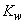 по высоте в зависимости от типа местности

|Высота расположения приведенного центра тяжести проводов, тросов и средних точек зон конструкций опор ВЛ над поверхностью земли, м | Коэффициент img_4b7d5e83_2.png для типов местности | | |
| --- | --- | --- | --- |
|  | А | В | С |
| До 15 | 1,00 | 0,65 | 0,40 |
| 20 | 1,25 | 0,85 | 0,55 |
| 40 | 1,50 | 1,10 | 0,80 |
| 60 | 1,70 | 1,30 | 1,00 |
| 80 | 1,85 | 1,45 | 1,15 |
| 100 | 2,00 | 1,60 | 1,25 |
| 150 | 2,25 | 1,90 | 1,55 |
| 200 | 2,45 | 2,10 | 1,80 |
| 250 | 2,65 | 2,30 | 2,00 |
| 300 | 2,75 | 2,50 | 2,20 |
| 350 и выше | 2,75 | 2,75 | 2,35 |

Примечание. Типы местности соответствуют определениям, приведенным в 2.5.6.

Полученные значения ветрового давления должны быть округлены до целого числа.

Для промежуточных высот значения коэффициентов  определяются линейной интерполяцией.

Высота расположения приведенного центра тяжести проводов или тросов 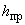 для габаритного пролета определяется по формуле, м

,

где  - среднеарифметическое значение высоты крепления проводов к изоляторам или среднеарифметическое значение высоты крепления тросов к опоре, отсчитываемое от отметок земли в местах установки опор, м;

 - стрела провеса провода или троса в середине пролета при высшей температуре, м.

2.5.45. При расчете проводов и тросов ветер следует принимать направленным под углом 90° к оси ВЛ.

При расчете опор ветер следует принимать направленным под углом 0°, 45° и 90° к оси ВЛ, при этом для угловых опор за ось ВЛ принимается направление биссектрисы внешнего угла поворота, образованного смежными участками линии.

2.5.46. Нормативную толщину стенки гололеда  плотностью 0,9 г/см следует принимать по табл.2.5.3 в соответствии с картой районирования территории России по толщине стенки гололеда (см. рис.2.5.2) или по региональным картам районирования.

Таблица 2.5.3

Нормативная толщина стенки гололеда  для высоты 10 м над поверхностью земли

|Район по гололеду | Нормативная толщина стенки гололеда img_da3a1c60_2.png, мм |
| --- | --- |
| I | 10 |
| II | 15 |
| III | 20 |
| IV | 25 |
| V | 30 |
| VI | 35 |
| VII | 40 |
| Особый | Выше 40 |

Полученные при обработке метеоданных нормативные толщины стенок гололеда рекомендуется округлять до ближайшего большего значения, приведенного в табл.2.5.3.

В особых районах по гололеду следует принимать толщину стенки гололеда, полученную при обработке метеоданных, округленную до 1 мм.

Для ВЛ 330-750 кВ нормативная толщина стенки гололеда должна приниматься не менее 15 мм.

Для ВЛ, сооружаемых в труднодоступных местностях, толщину стенки гололеда рекомендуется принимать соответствующей району на один выше, чем принято для данного региона по региональным картам районирования или на основании обработки метеоданных.

2.5.47. При отсутствии данных наблюдений для участков ВЛ, проходящих по плотинам и дамбам гидротехнических сооружений, вблизи прудов-охладителей, башенных градирен, брызгальных бассейнов в районах с низшей температурой выше минус 45 °С, I нормативную толщину стенки гололеда  следует принимать на 5 мм больше, чем для прилегающих участков ВЛ, а для районов с низшей температурой минус 45° и ниже - на 10 мм.

2.5.48. Нормативная ветровая нагрузка при гололеде на провод (трос) определяется по 2.5.52 с учетом условной толщины стенки гололеда , которая принимается по региональному районированию ветровых нагрузок при гололеде или рассчитывается согласно методическим указаниям по расчету климатических нагрузок. При отсутствии региональных карт и данных наблюдений .

2.5.49. Толщина стенки гололеда (, ) на проводах ВЛ определяется на высоте расположения приведенного центра тяжести всех проводов, на тросах - на высоте расположения центра тяжести тросов. Высота приведенного центра тяжести проводов и тросов определяется в соответствии с 2.5.44.

Толщина стенки гололеда на проводах (тросах) при высоте расположения приведенного их центра тяжести более 25 м определяется умножением ее значения на коэффициенты  и , принимаемые по табл.2.5.4. При этом исходную толщину стенки гололеда (для высоты 10 м и диаметра 10 мм) следует принимать без увеличения, предусмотренного 2.5.47. Полученные значения толщины стенки гололеда округляются до 1 мм.

Таблица 2.5.4

Коэффициенты  и , учитывающие изменение толщины стенки гололеда

|  |  |  |  |
| --- | --- | --- | --- |
|Высота расположения приведенного центра тяжести проводов, тросов и средних точек зон конструкций опор над поверхностью земли, м | Коэффициент img_607f87b6_2.png, учитывающий изменение толщины стенки гололеда по высоте над поверхностью земли | Диаметр провода (троса), мм | Коэффициент img_427c2c3d_2.png, учитывающий изменение толщины стенки гололеда в зависимости от диаметра провода (троса) |
| 25 | 1,0 | 10 | 1,0 |
| 30 | 1,4 | 20 | 0,9 |
| 50 | 1,6 | 30 | 0,8 |
| 70 | 1,8 | 50 | 0,7 |
| 100 | 2,0 | 70 | 0,6 |

Примечание. Для промежуточных высот и диаметров значения коэффициентов  и 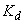 определяются линейной интерполяцией.

При высоте расположения приведенного центра тяжести проводов или тросов до 25 м поправки на толщину стенки гололеда на проводах и тросах в зависимости от высоты и диаметра проводов и тросов не вводятся.

2.5.50. Для участков ВЛ, сооружаемых в горных районах по орографически защищенным извилистым и узким склоновым долинам и ущельям, независимо от высот местности над уровнем моря, нормативную толщину стенки гололеда  рекомендуется принимать не более 15 мм. При этом не следует учитывать коэффициент .

2.5.51. Температуры воздуха - среднегодовая, низшая, которая принимается за абсолютно минимальную, высшая, которая принимается за абсолютно максимальную, - определяются по строительным нормам и правилам и по данным наблюдений с округлением до значений, кратных пяти.

Температуру воздуха при нормативном ветровом давлении  следует принимать равной минус 5 °С, за исключением районов со среднегодовой температурой минус 5 °С и ниже, для которых ее следует принимать равной минус 10 °С.

Температуру воздуха при гололеде для территории с высотными отметками местности до 1000 м над уровнем моря следует принимать равной минус 5 °С, при этом для районов со среднегодовой температурой минус 5 °С и ниже температуру воздуха при гололеде следует принимать равной минус 10 °С. Для горных районов с высотными отметками выше 1000 м и до 2000 м температуру следует принимать равной минус 10 °С, более 2000 м - минус 15 °С. В районах, где при гололеде наблюдается температура ниже минус 15 °С, ее следует принимать по фактическим данным.

2.5.52. Нормативная ветровая нагрузка на провода и тросы , действующая перпендикулярно проводу (тросу), для каждого рассчитываемого условия определяется по формуле

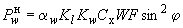,

где  - коэффициент, учитывающий неравномерность ветрового давления по пролету ВЛ, принимаемый равным:

|  |  |  |  |  |  |  |  |  |  |
| --- | --- | --- | --- | --- | --- | --- | --- | --- | --- |
|Ветровое давление, Па До | 200 | 240 | 280 | 300 | 320 | 360 | 400 | 500 | 580 и более |
| Коэффициент img_bfa1a2e4_1.png | 1,0 | 0,94 | 0,88 | 0,85 | 0,83 | 0,80 | 0,76 | 0,71 | 0,70 |

Промежуточные значения  определяются линейной интерполяцией;

 - коэффициент, учитывающий влияние длины пролета на ветровую нагрузку, равный 1,2 при длине пролета до 50 м, 1,1 - при 100 м, 1,05 - при 150 м, 1,0 - при 250 м и более (промежуточные значения  определяются интерполяцией);

 - коэффициент, учитывающий изменение ветрового давления по высоте в зависимости от типа местности, определяемый по табл.2.5.2;

 - коэффициент лобового сопротивления, принимаемый равным: 1,1 - для проводов и тросов, свободных от гололеда, диаметром 20 мм и более; 1,2 - для всех проводов и тросов, покрытых гололедом, и для всех проводов и тросов, свободных от гололеда, диаметром менее 20 мм;

 - нормативное ветровое давление, Па, в рассматриваемом режиме:

 - определяется по табл.2.5.1 в зависимости от ветрового района;

- определяется по 2.5.43;

 - площадь продольного диаметрального сечения провода, м(при гололеде с учетом условной толщины стенки гололеда );

 - угол между направлением ветра и осью ВЛ.

Площадь продольного диаметрального сечения провода (троса)  определяется по формуле, м

,

где  - диаметр провода, мм;

 и  - коэффициенты, учитывающие изменение толщины стенки гололеда по высоте и в зависимости от диаметра провода и определяемые по табл.2.5.4;

 - условная толщина стенки гололеда, мм, принимается согласно 2.5.48;

 - длина ветрового пролета, м.

2.5.53. Нормативная линейная гололедная нагрузка на 1 м провода и трос  определяется по формуле, Н/м

,

где 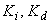 - коэффициенты, учитывающие изменение толщины стенки гололеда по высоте и в зависимости от диаметра провода и принимаемые по табл.2.5.4;

 - толщина стенки гололеда, мм, по 2.5.46;

 - диаметр провода, мм;

- плотность льда, принимаемая равной 0,9 г/см;

 - ускорение свободного падения, принимаемое равным 9,8 м/с.

2.5.54. Расчетная ветровая нагрузка на провода (тросы)  при механическом расчете проводов и тросов по методу допускаемых напряжений определяется по формуле, Н

,

где  - нормативная ветровая нагрузка по 2.5.52;

 - коэффициент надежности по ответственности, принимаемый равным: 1,0 - для ВЛ до 220 кВ; 1,1 - для ВЛ 330-750 кВ и ВЛ, сооружаемых на двухцепных и многоцепных опорах независимо от напряжения, а также для отдельных особо ответственных одноцепных ВЛ до 220 кВ при наличии обоснования;

 - региональный коэффициент, принимаемый от 1 до 1,3. Значение коэффициента принимается на основании опыта эксплуатации и указывается в задании на проектирование ВЛ;

 - коэффициент надежности по ветровой нагрузке, равный 1,1.

2.5.55. Расчетная линейная гололедная нагрузка на 1 м провода (троса) 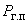 при механическом расчете проводов и тросов по методу допускаемых напряжений определяется по формуле, Н/м

,

где  - нормативная линейная гололедная нагрузка, принимаемая по 2.5.53;

 - коэффициент надежности по ответственности, принимаемый равным: 1,0 - для ВЛ до 220 кВ; 1,3 - для ВЛ 330-750 кВ и ВЛ, сооружаемых на двухцепных и многоцепных опорах независимо от напряжения, а также для отдельных особо ответственных одноцепных ВЛ до 220 кВ при наличии обоснования;

 - региональный коэффициент, принимаемый равным от 1 до 1,5. Значение коэффициента принимается на основании опыта эксплуатации и указывается в задании на проектирование ВЛ;

 - коэффициент надежности по гололедной нагрузке, равный 1,3 для районов по гололеду I и II; 1,6 - для районов по гололеду III и выше;

 - коэффициент условий работы, равный 0,5.

2.5.56. При расчете приближений токоведущих частей к сооружениям, насаждениям и элементам опор расчетная ветровая нагрузка на провода (тросы) определяется по 2.5.54.

2.5.57. При определении расстояний от проводов до поверхности земли и до пересекаемых объектов и насаждений расчетная линейная гололедная нагрузка на провода принимается по 2.5.55.

2.5.58. Нормативная ветровая нагрузка на конструкцию опоры определяется как сумма средней и пульсационной составляющих.

2.5.59. Нормативная средняя составляющая ветровой нагрузки на опору  определяется по формуле, Н

,

где  - принимается по 2.5.44;  - принимается по 2.5.52;  - аэродинамический коэффициент, определяемый в зависимости от вида конструкции, согласно строительным нормам и правилам;

 - площадь проекции, ограниченная контуром конструкции, ее части или элемента с наветренной стороны на плоскость перпендикулярно ветровому потоку, вычисленная по наружному габариту, м.

Для конструкций опор из стального проката, покрытых гололедом, при определении  учитывается обледенение конструкции с толщиной стенки гололеда  при высоте опор более 50 м, а также для районов по гололеду V и выше независимо от высоты опор.

Для железобетонных и деревянных опор, а также стальных опор с элементами из труб обледенение конструкций при определении нагрузки  не учитывается.

2.5.60. Нормативная пульсационная составляющая ветровой нагрузки\*  для опор высотой до 50 м принимается:

для свободностоящих одностоечных стальных опор:

;

для свободностоящих портальных стальных опор:

;

для свободностоящих железобетонных опор (портальных и одностоечных) на центрифугированных стойках:

;

для свободностоящих одностоечных железобетонных опор ВЛ до 35 кВ:

;

для стальных и железобетонных опор с оттяжками при шарнирном креплении к фундаментам:

.

Нормативное значение пульсационной составляющей ветровой нагрузки для свободностоящих опор высотой более 50 м, а также для других типов опор, не перечисленных выше, независимо от их высоты определяется в соответствии со строительными нормами и правилами на нагрузки и воздействия.

В расчетах деревянных опор пульсационная составляющая ветровой нагрузки не учитывается.

2.5.61. Нормативная гололедная нагрузка на конструкции металлических опор  определяется по формуле, Н

,

где  - принимаются согласно 2.5.53;

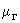 - коэффициент, учитывающий отношение площади поверхности элемента, подверженной обледенению, к полной поверхности элемента и принимаемый равным:

0,6 - для районов по гололеду до IV при высоте опор более 50 м и для районов по гололеду V и выше, независимо от высоты опор;

 - площадь общей поверхности элемента, м.

Для районов по гололеду до IV при высоте опор менее 50 м гололедные отложения на опорах не учитываются.

Для железобетонных и деревянных опор, а также стальных опор с элементами из труб гололедные отложения не учитываются.

Гололедные отложения на траверсах рекомендуется определять по вышеприведенной формуле с заменой площади общей поверхности элемента на площадь горизонтальной проекции консоли траверсы.

2.5.62. Расчетная ветровая нагрузка на провода (тросы), воспринимаемая опорами, определяется по формуле, Н

,

где  - нормативная ветровая нагрузка по 2.5.52;

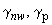 - принимается согласно 2.5.54;

 - коэффициент надежности по ветровой нагрузке, равный для проводов (тросов), покрытых гололедом и свободных от гололеда:

1,3 - при расчете по первой группе предельных состояний;

1,1 - при расчете по второй группе предельных состояний.

2.5.63. Расчетная ветровая нагрузка на конструкцию опоры , Н, определяется по формуле

,

где  - нормативная средняя составляющая ветровой нагрузки, принимаемая по 2.5.59;

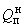 - нормативная пульсационная составляющая ветровой нагрузки, принимаемая по 2.5.60;

 - принимаются согласно 2.5.54;

 - коэффициент надежности по ветровой нагрузке, равный:

1,3 - при расчете по первой группе предельных состояний;

1,1 - при расчете по второй группе предельных состояний.

2.5.64. Расчетная ветровая нагрузка на гирлянду изоляторов , Н, определяется по формуле

,

где  - принимаются согласно 2.5.54;

 - принимается согласно 2.5.44;

- коэффициент лобового сопротивления цепи изоляторов, принимаемый равным 1,2;

 - коэффициент надежности по ветровой нагрузке, равный 1,3;

 - нормативное ветровое давление (см. 2.5.41);

 - площадь диаметрального сечения цепи гирлянды изоляторов, м, определяется по формуле

,

где  - диаметр тарелки изоляторов, мм;

 - строительная высота изолятора, мм;

 - число изоляторов в цепи;

 - число цепей изоляторов в гирлянде.

2.5.65. Расчетная линейная гололедная нагрузка на 1 м провода (троса) , Н/м, воспринимаемая опорами, определяется по формуле

,

где  - нормативная линейная гололедная нагрузка, принимается по 2.5.53;

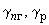 - принимаются согласно 2.5.55;

 - коэффициент надежности по гололедной нагрузке при расчете по первой и второй группам предельных состояний, принимается равным 1,3 для районов по гололеду I и II; 1,6 для районов по гололеду III и выше;

 - коэффициент условий работы, равный:

1,0 - при расчете по первой группе предельных состояний;

0,5 - при расчете по второй группе предельных состояний.

2.5.66. Гололедная нагрузка от проводов и тросов, приложенная к точкам их крепления на опорах, определяется умножением соответствующей линейной гололедной нагрузки (2.5.53, 2.5.55, 2.5.65) на длину весового пролета.

2.5.67. Расчетная гололедная нагрузка на конструкции опор , Н, определяется по формуле

,

где  - нормативная гололедная нагрузка, принимаемая по 2.5.61;

 - принимаются согласно 2.5.55;

 - принимаются согласно 2.5.65.

2.5.68. В районах по гололеду III и выше обледенение гирлянд изоляторов учитывается увеличением их веса на 50%. В районах по гололеду II и менее обледенение не учитывается.

Воздействие ветрового давления на гирлянды изоляторов при гололеде не учитывается.

2.5.69. Расчетная нагрузка на опоры ВЛ от веса проводов, тросов, гирлянд изоляторов, конструкций опор по первой и второй группам предельных состояний определяется при расчетах как произведение нормативной нагрузки на коэффициент надежности по весовой нагрузке 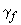, принимаемый равным для проводов, тросов и гирлянд изоляторов 1,05, для конструкций опор - с указаниями строительных норм и правил на нагрузки и воздействия.

2.5.70. Нормативные нагрузки на опоры ВЛ от тяжения проводов и тросов определяются при расчетных ветровых и гололедных нагрузках по 2.5.54 и 2.5.55.

Расчетная горизонтальная нагрузка от тяжения проводов и тросов, , свободных от гололеда или покрытых гололедом, при расчете конструкций опор, фундаментов и оснований определяется как произведение нормативной нагрузки от тяжения проводов и тросов на коэффициент надежности по нагрузке от тяжения равный:

1,3 - при расчете по первой группе предельных состояний;

1,0 - при расчете по второй группе предельных состояний.

2.5.71. Расчет ВЛ по нормальному режиму работы необходимо производить для сочетания следующих условий:

1. Высшая температура , ветер и гололед отсутствуют.

2. Низшая температура , ветер и гололед отсутствуют.

3. Среднегодовая температура 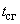, ветер и гололед отсутствуют.

4. Провода и тросы покрыты гололедом по 2.5.55, температура при гололеде по 2.5.51, ветер отсутствует.

5. Ветер по 2.5.54, температура при  по 2.5.51, гололед отсутствует.

6. Провода и тросы покрыты гололедом по 2.5.55, ветер при гололеде на провода и тросы по 2.5.54, температура при гололеде по 2.5.51.

7. Расчетная нагрузка от тяжения проводов по 2.5.70.

2.5.72. Расчет ВЛ по аварийному режиму работы необходимо производить для сочетания следующих условий:

1. Среднегодовая температура , ветер и гололед отсутствуют.

2. Низшая температура , ветер и гололед отсутствуют.

3. Провода и тросы покрыты гололедом по 2.5.55, температура при гололеде по 2.5.51, ветер отсутствует.

4. Расчетная нагрузка от тяжения проводов по 2.5.70.

2.5.73. При расчете приближения токоведущих частей к кронам деревьев, элементам опор ВЛ и сооружениям необходимо принимать следующие сочетания климатических условий:

1) при рабочем напряжении: расчетная ветровая нагрузка по 2.5.54, температура при  по 2.5.51, гололед отсутствует;

2) при грозовых и внутренних перенапряжениях: температура +15 °С, ветровое давление, равное 0,06 , но не менее 50 Па;

3) для обеспечения безопасного подъема на опору при наличии напряжения на линии: для ВЛ 500 кВ и ниже - температура минус 15 °С, гололед и ветер отсутствуют; для ВЛ 750 кВ - температура минус 15 °С, ветровое давление 50 Па, гололед отсутствует.

При расчете приближений угол отклонения  поддерживающей гирлянды изоляторов от вертикали определяется по формуле

,

где  - расчетная ветровая нагрузка на провода фазы, направленная поперек оси ВЛ (или по биссектрисе угла поворота ВЛ), Н;

 - коэффициент инерционности системы "гирлянда - провод в пролете", при отклонениях под давлением ветра принимается равным:

|  |  |  |  |  |  |
| --- | --- | --- | --- | --- | --- |
|Ветровое давление, Па | До 310 | 350 | 425 | 500 | От 615 |
| Коэффициент img_826277c7.png | 1 | 0,95 | 0,9 | 0,85 | 0,8 |

Промежуточные значения определяются линейной интерполяцией;

 - горизонтальная составляющая от тяжения проводов на поддерживающую гирлянду промежуточно-угловой опоры (принимаемая со знаком плюс, если ее направление совпадает с направлением ветра, и со знаком минус, если она направлена в наветренную сторону), Н;

 - расчетная нагрузка от веса провода, воспринимаемая гирляндой изоляторов, Н;

 - расчетная нагрузка от веса гирлянды изоляторов, Н;

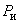 - расчетная ветровая нагрузка на гирлянды изоляторов, Н, принимаемая по 2.5.64.

2.5.74. Проверку опор ВЛ по условиям монтажа необходимо производить по первой группе предельных состояний на расчетные нагрузки при следующих климатических условиях: температура минус 15 °С, ветровое давление на высоте 15 м над поверхностью земли 50 Па, гололед отсутствует.

# Провода и грозозащитные тросы

2.5.75. Воздушные линии могут выполняться с одним или несколькими проводами в фазе, во втором случае фаза называется расщепленной.

Провода расщепленной фазы могут быть изолированы друг от друга.

Диаметр проводов, их сечение и количество в фазе, а также расстояние между проводами расщепленной фазы определяются расчетом.

2.5.76. На проводах расщепленной фазы в пролетах и петлях анкерных опор должны быть установлены дистанционные распорки. Расстояния между распорками или группами распорок, устанавливаемыми в пролете на расщепленной фазе из двух или трех проводов, не должны превышать 60 м, а при прохождении ВЛ по местности типа *А* (2.5.6) - 40 м. Расстояния между распорками или группами распорок, устанавливаемыми в пролете на расщепленной фазе из четырех и более проводов, не должны превышать 40 м. При прохождении ВЛ по местности типа *С* эти расстояния допускается увеличивать до 60 м.

2.5.77. На ВЛ должны применяться многопроволочные провода и тросы. Минимально допустимые сечения проводов приведены в табл.2.5.5.

Таблица 2.5.5

Минимально допустимые сечения проводов по условиям механической прочности

|  |  |  |  |  |
| --- | --- | --- | --- | --- |
|| Сечение проводов, ммimg_85e43c10_7.png | | | |
| Характеристика ВЛ | алюминиевых и из нетермообра- ботанного алюминиевого сплава | из термообра- ботанного алюминиевого сплава | сталеалюми- ниевых | стальных |
| ВЛ без пересечений в районах по гололеду: |  |  |  |  |
| до II | 70 | 50 | 35/6,2 | 35 |
| в III-IV | 95 | 50 | 50/8 | 35 |
| в V и более | - | - | 70/11 | 35 |
| Пересечения ВЛ с судоходными реками и инженерными сооружениями в районах по гололеду: |  |  |  |  |
| до II | 70 | 50 | 50/8 | 35 |
| в III-IV | 95 | 70 | 50/8 | 50 |
| в V и более | - | - | 70/11 | 50 |
| ВЛ, сооружаемые на двухцепных или многоцепных опорах: |  |  |  |  |
| до 20 кВ | - | - | 70/11 | - |
| 35 кВ и выше | - | - | 120/19 | - |

Примечания: 1. В пролетах пересечений с автомобильными дорогами, троллейбусными и трамвайными линиями, железными дорогами необщего пользования допускается применение проводов таких же сечений, как на ВЛ без пересечений.

2. В районах, где требуется применение проводов с антикоррозионной защитой, минимально допустимые сечения проводов принимаются такими же, как и сечения соответствующих марок без антикоррозионной защиты.

2.5.78. Для снижения потерь электроэнергии на перемагничивание стальных сердечников в сталеалюминиевых проводах и в проводах из термообработанного алюминиевого сплава со стальным сердечником рекомендуется применять провода с четным числом повивов алюминиевых проволок.

2.5.79. В качестве грозозащитных тросов следует, как правило, применять стальные канаты, изготовленные из оцинкованной проволоки для особо жестких агрессивных условий работы (ОЖ) и по способу свивки нераскручивающиеся (Н) сечением не менее:

35 мм - на ВЛ 35 кВ без пересечений;

35 мм - на ВЛ 35 кВ в пролетах пересечений с железными дорогами общего пользования и электрифицированными в районах по гололеду I-II;

50 мм - в остальных районах и на ВЛ, сооружаемых на двухцепных и многоцепных опорах;

50 мм- на ВЛ 110-150 кВ;

70 мм - на ВЛ 220 кВ и выше.

Сталеалюминиевые провода или провода из термообработанного алюминиевого сплава со стальным сердечником в качестве грозозащитного троса рекомендуется применять:

1) на особо ответственных переходах через инженерные сооружения (электрифицированные железные дороги, автомобильные дороги категории IA (2.5.256), судоходные водные преграды и т.п.);

2) на участках ВЛ, проходящих в районах с повышенным загрязнением атмосферы (промышленные зоны с высокой химической активностью уносов, зоны интенсивного земледелия с засоленными почвами и водоемами, побережья морей и т.п.), а также проходящих по населенной и труднодоступной местностям;

3) на ВЛ с большими токами однофазного короткого замыкания по условиям термической стойкости и для уменьшения влияния ВЛ на линии связи.

При этом для ВЛ, сооружаемых на двухцепных или многоцепных опорах, независимо от напряжения суммарное сечение алюминиевой (или алюминиевого сплава) и стальной частей троса должно быть не менее 120 мм.

При использовании грозозащитных тросов для организации многоканальных систем высокочастотной связи при необходимости применяются одиночные или сдвоенные изолированные друг от друга тросы или тросы со встроенным оптическим кабелем связи (2.5.178-2.5.200). Между составляющими сдвоенного троса в пролетах и петлях анкерных опор должны быть установлены дистанционные изолирующие распорки.

Расстояния между распорками в пролете не должны превышать 40 м.

2.5.80. Для сталеалюминиевых проводов с площадью поперечного сечения алюминиевых проволок *А* и стальных проволок *С* рекомендуются следующие области применения:

1) районы с толщиной стенки гололеда 25 мм и менее:

*А* до 185 мм - при отношении *А/С* от 6,0 до 6,25;

*А* от 240 мм и более - при отношении *А/С* более 7,71;

2) районы с толщиной стенки гололеда более 25 мм:

*А* до 95 мм - при отношении *А/С* 6,0;

*А* от 120 до 400 мм- при отношении *А/С* от 4,29 до 4,39;

*А* от 450 мм и более - при отношении *А/С* от 7,71 до 8,04;

3) на больших переходах с пролетами более 700 м - отношение *А/С* более 1,46.

Выбор марок проводов из других материалов обосновывается расчетами.

При сооружении ВЛ в местах, где опытом эксплуатации установлено разрушение проводов от коррозии (побережья морей, соленых озер, промышленные районы и районы засоленных песков, прилежащие к ним районы с атмосферой воздуха типа II и III, а также в местах, где на основании данных изысканий возможны такие разрушения, следует применять провода, которые в соответствии с государственными стандартами и техническими условиями предназначены для указанных условий.

На равнинной местности при отсутствии данных эксплуатации ширину прибрежной полосы, к которой относится указанное требование, следует принимать равной 5 км, а полосы от химических предприятий - 1,5 км.

2.5.81. При выборе конструкции ВЛ, количества составляющих и площади сечения проводов фазы и их расположения необходимо ограничение напряженности электрического поля на поверхности проводов до уровней, допустимых по короне и радиопомехам (см. гл.1.3).

По условиям короны и радиопомех при отметках до 1000 м над уровнем моря рекомендуется применять на ВЛ провода диаметром не менее указанных в табл.2.5.6.

Таблица 2.5.6

Минимальный диаметр проводов ВЛ по условиям короны и радиопомех, мм

|  |  |  |
| --- | --- | --- |
|Напряжение ВЛ, кВ | Фаза с проводами | |
|  | одиночными | два и более |
| 110 | 11,4 (*АС* 70/11) | - |
| 150 | 15,2 (*AC* 120/19) | - |
| 220 | 21,6 (*АС* 240/32)  24,0 (*AC* 300/39) | - |
|  |  | 2х21,6(2х*АС* 240/32) |
| 330 | 33,2 (*AC* 600/72) | 3х15,2(3х*АС* 120/19) |
|  |  | 3х17,1(3х*АС* 150/24) |
|  |  | 2х36,2(2х*AC* 700/86) |
| 500 | - | 3х24,0(3х*АС* 300/39) |
|  |  | 4x18,8(4х*АС* 185/29) |
| 750 | - | 4х29,1(4х*АС* 400/93)  5х21,6 (5х*АС* 240/32) |

Примечания: 1. Для ВЛ 220 кВ минимальный диаметр провода 21,6 мм относится к горизонтальному расположению фаз, а в остальных случаях допустим с проверкой по радиопомехам.

2. Для ВЛ 330 кВ минимальный диаметр провода 15,2 мм (три провода в фазе) относится к одноцепным опорам.

При отметках более 1000 м над уровнем моря для ВЛ 500 кВ и выше рекомендуется рассматривать целесообразность изменения конструкции средней фазы по сравнению с крайними фазами.

2.5.82. Сечение грозозащитного троса, выбранное по механическому расчету, должно быть проверено на термическую стойкость в соответствии с указаниями гл.1.4 и 2.5.193, 2.5.195, 2.5.196.

2.5.83. Провода и тросы должны рассчитываться на расчетные нагрузки нормального, аварийного и монтажного режимов ВЛ для сочетаний условий, указанных в 2.5.71-2.5.74.

При этом напряжения в проводах (тросах) не должны превышать допустимых значений, приведенных в табл.2.5.7.

Таблица 2.5.7

Допустимое механическое напряжение в проводах и тросах ВЛ напряжением выше 1 кВ

|  |  |  |  |  |
| --- | --- | --- | --- | --- |
|Провода и тросы | Допустимое напряжение, % предела прочности при растяжении | | Допустимое напряжение, Н/ммimg_85e43c10_19.png | |
|  | при наибольшей нагрузке и низшей температуре | при среднегодовой температуре | при наибольшей нагрузке и низшей температуре | при среднегодовой температуре |
| Алюминиевые с площадью поперечного сечения, ммimg_85e43c10_20.png: |  |  |  |  |
| 70-95 | 35 | 30 | 56 | 48 |
| 120-240 | 40 | 30 | 64 | 51 |
| 300-750 | 45 | 30 | 72 | 51 |
| Из нетермообработанного алюминиевого сплава площадью поперечного сечения, ммimg_85e43c10_21.png: |  |  |  |  |
| 50-95 | 40 | 30 | 83 | 62 |
| 120-185 | 45 | 30 | 94 | 62 |
| Из термообработанного алюминиевого сплава площадью поперечного сечения, ммimg_85e43c10_22.png: |  |  |  |  |
| 50-95 | 40 | 30 | 114 | 85 |
| 120-185 | 45 | 30 | 128 | 85 |
| Сталеалюминиевые площадью поперечного сечения алюминиевой части провода, ммimg_85e43c10_23.png: |  |  |  |  |
| 400 и 500  при *А/С* 20,27 и 18,87 | 45 | 30 | 104 | 69 |
| 400, 500 и 1000  при *А/С* 17,91, 18,08 и 17,85 | 45 | 30 | 96 | 64 |
| 330 при *А/С* 11,51 | 45 | 30 | 117 | 78 |
| 150-800  при *А/С* от 7,8 до 8,04 | 45 | 30 | 126 | 84 |
| 35-95  при *А/С* от 5,99 до 6,02 | 40 | 30 | 120 | 90 |
| 185 и более  при *А/С* от 6,14 до 6,28 | 45 | 30 | 135 | 90 |
| 120 и более  при *А/С* от 4,29 до 4,38 | 45 | 30 | 153 | 102 |
| 500 при *А/С* 2,43 | 45 | 30 | 205 | 137 |
| 185, 300 и 500  при *А/С* 1,46 | 45 | 30 | 254 | 169 |
| 70 при *А/С* 0,95 | 45 | 30 | 272 | 204 |
| 95 при *А/С* 0,65 | 40 | 30 | 308 | 231 |
| Из термообработанного алюминиевого сплава со стальным сердечником площадью поперечного сечения алюминиевого сплава, ммimg_85e43c10_24.png: |  |  |  |  |
| 500 при *А/С* 1,46 | 45 | 30 | 292 | 195 |
| 70 при *А/С* 1,71 | 45 | 30 | 279 | 186 |
| Стальные провода | 50 | 35 | 310 | 216 |
| Стальные канаты | 50 | 35 | По стандартам и техническим условиям | |
| Защищенные провода | 40 | 30 | 114 | 85 |

Указанные в табл.2.5.7 напряжения следует относить к той точке провода на длине пролета, в которой напряжение наибольшее. Допускается указанные напряжения принимать для низшей точки провода при условии превышения напряжения в точках подвеса не более 5%.

2.5.84. Расчет монтажных напряжений и стрел провеса проводов (тросов) должен выполняться с учетом остаточных деформаций (вытяжки).

В механических расчетах проводов (тросов) следует принимать физико-механические характеристики, приведенные в табл.2.5.8.

Таблица 2.5.8

Физико-механические характеристики проводов и тросов

|  |  |  |  |
| --- | --- | --- | --- |
|Провода и тросы | Модуль упругости, 10img_434c8c13.pngН/ммimg_85e43c10_25.png | Температурный коэффициент линейного удлинения, 10img_c466bad1.png градimg_df27c957.png | Предел прочности при растяжении img_b914cb85.png\*, Н/ммimg_85e43c10_26.png, провода и троса в целом |
| Алюминиевые | 6,30 | 23,0 | 16 |
| Сталеалюминиевые с отношением площадей поперечных сечений *А/С*: |  |  |  |
| 20,27 | 7,04 | 21,5 | 210 |
| 16,87-17,82 | 7,04 | 21,2 | 220 |
| 11,51 | 7,45 | 21,0 | 240 |
| 8,04-7,67 | 7,70 | 19,8 | 270 |
| 6,28-5,99 | 8,25 | 19,2 | 290 |
| 4,36-4,28 | 8,90 | 18,3 | 340 |
| 2,43 | 10,3 | 16,8 | 460 |
| 1,46 | 11,4 | 15,5 | 565 |
| 0,95 | 13,4 | 14,5 | 690 |
| 0,65 | 13,4 | 14,5 | 780 |
| Из нетермообработанного алюминиевого сплава | 6,3 | 23,0 | 208 |
| Из термообработанного алюминиевого сплава | 6,3 | 23,0 | 285 |
| Из термообработанного алюминиевого сплава со стальным сердечником с отношением площадей поперечных сечений *А/С*: |  |  |  |
| 1,71 | 11,65 | 15,83 | 620 |
| 1,46 | 12,0 | 15,5 | 650 |
| Стальные канаты | 18,5 | 12,0 | 1200\*\* |
| Стальные провода | 20,0 | 12,0 | 620 |
| Защищенные провода | 6,25 | 23,0 | 294 |

\_\_\_\_\_\_\_\_\_\_\_\_\_\_\_\_

\* Предел прочности при растяжении  определяется отношением разрывного усилия провода (троса) , нормированного государственным стандартом или техническими условиями, к площади поперечного сечения , . Для сталеалюминиевых проводов 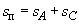.

\*\* Принимается по соответствующим стандартам, но не менее 1200 Н/мм.

2.5.85. Защищать от вибрации следует:

одиночные провода и тросы при длинах пролетов, превышающих значения, приведенные в табл.2.5.9, и механических напряжениях при среднегодовой температуре, превышающих приведенные в табл.2.5.10;

Таблица 2.5.9

Длины пролетов для одиночных проводов и тросов, требующих защиты от вибрации

|  |  |  |  |
| --- | --- | --- | --- |
|Провода, тросы | Площадь сечения\*, ммimg_85e43c10_28.png | Пролеты длиной более, м, в местности типа | |
|  |  | *А* | *В* |
| Сталеалюминиевые, из термообработанного алюминиевого сплава со стальным сердечником и без него\* | 35-95 | 80 | 95 |
|  | 120-240 | 100 | 120 |
|  | 300 и более | 120 | 145 |
| Алюминиевые и из нетермообработанного алюминиевого сплава | 50-95 | 60 | 95 |
|  | 120-240 | 100 | 120 |
|  | 300 и более | 120 | 145 |
| Стальные | 25 и более | 120 | 145 |

\_\_\_\_\_\_\_\_\_\_\_\_\_\_\_

\* Приведены площади сечения алюминиевой части.

Таблица 2.5.10

Механические напряжения, Н/мм, одиночных проводов и тросов при среднегодовой температуре , требующих защиты от вибрации

|  |  |  |
| --- | --- | --- |
|Провода, тросы | Тип местности | |
|  | *А* | *В* |
| Сталеалюминиевые марок *АС* при *А/С*: |  |  |
| 0,65-0,95 | Более 70 | Более 85 |
| 1,46 | " 60 | " 70 |
| 4,29-4,39 | " 45 | " 55 |
| 6,0-8,05 | " 40 | " 45 |
| 11,5 и более | " 35 | " 40 |
| Алюминиевые и из нетермообработанного алюминиевого сплава всех марок | " 35 | " 40 |
| Из термообработанного алюминиевого сплава со стальным сердечником и без него всех марок | " 40 | " 45 |
| Стальные всех марок | " 170 | " 195 |

расщепленные провода и тросы из двух составляющих при длинах пролетов, превышающих 150 м, и механических напряжениях, превышающих приведенные в табл.2.5.11;

Таблица 2.5.11

Механические напряжения, Н/мм, расщепленных проводов и тросов из двух составляющих, при среднегодовой температуре , требующих защиты от вибрации

|  |  |  |
| --- | --- | --- |
|Провода, тросы | Тип местности | |
|  | *А* | *В* |
| Сталеалюминиевые марок *АС* |  |  |
| при *А/С*: |  |  |
| 0,65-0,95 | Более 75 | Более 85 |
| 1,46 | " 65 | " 70 |
| 4,29-4,39 | " 50 | " 55 |
| 6,0-8,05 | " 45 | " 50 |
| 11,5 и более | " 40 | " 45 |
| Алюминиевые и из нетермообработанного алюминиевого сплава всех марок | " 40 | " 45 |
| Из термообработанного алюминиевого сплава со стальным сердечником и без него всех марок | " 45 | " 50 |
| Стальные всех марок | " 195 | " 215 |

провода расщепленной фазы из трех и более составляющих при длинах пролетов, превышающих 700 м;

провода ВЛЗ при прохождении трассы на местности типа *А*, если напряжение в проводе при среднегодовой температуре превышает 40 Н/мм.

В табл.2.5.9, 2.5.10 и 2.5.11 тип местности принимается согласно 2.5.6.

При длинах пролетов менее указанных в табл.2.5.9 и в местности типа *С* защита от вибрации не требуется.

Защищать от вибрации рекомендуется:

провода алюминиевые и из нетермообработанного алюминиевого сплава площадью сечения до 95 мм, из термообработанного алюминиевого сплава и сталеалюминиевые провода площадью сечения алюминиевой части до 70 мм, стальные тросы площадью сечения до 35 мм - гасителями вибрации петлевого типа (демпфирующие петли) или армирующими спиральными прутками, протекторами, спиральными вязками;

провода (тросы) большего сечения - гасителями вибрации типа Стокбриджа;

провода ВЛЗ в местах их крепления к изоляторам - гасителями вибрации спирального типа с полимерным покрытием.

Гасители вибрации следует устанавливать с обеих сторон пролета.

Для ВЛ, проходящих в особых условиях (районы Крайнего Севера, орографически незащищенные выходы из горных ущелий, отдельные пролеты в местности типа *С* и др.), защита от вибрации должна производиться по специальному проекту.

Защита от вибрации больших переходов выполняется согласно 2.5.163.

# Расположение проводов и тросов и расстояния между ними

2.5.86. На ВЛ может применяться любое расположение проводов на опоре: горизонтальное, вертикальное, смешанное. На ВЛ 35 кВ и выше с расположением проводов в несколько ярусов предпочтительной является схема со смещением проводов соседних ярусов по горизонтали; в районах по гололеду IV и более рекомендуется применять горизонтальное расположение проводов.

2.5.87. Расстояния между проводами ВЛ, а также между проводами и тросами должны выбираться:

1) по условиям работы проводов (тросов) в пролетах согласно 2.5.88-2.5.94;

2) по допустимым изоляционным расстояниям: между проводами согласно 2.5.126; между проводами и элементами опоры согласно 2.5.125;

3) по условиям защиты от грозовых перенапряжений согласно 2.5.120 и 2.5.121;

4) по условиям короны и допустимых уровней радиопомех и акустических шумов согласно гл.1.3, 2.5.81, государственным стандартам, строительным нормам и правилам.

Расстояния между проводами, а также между проводами и тросами выбираются по стрелам провеса, соответствующим габаритному пролету; при этом стрела провеса троса должна быть не более стрелы провеса провода.

В отдельных пролетах (не более 10% общего количества), полученных при расстановке опор и превышающих габаритные пролеты не более чем на 25%, увеличения расстояний, вычисленных для габаритного пролета, не требуется.

Для пролетов, превышающих габаритные более чем на 25%, следует производить проверку расстояний между проводами и между проводами и тросами согласно указаниям 2.5.88-2.5.90, 2.5.92-2.5.95, 2.5.120 и 2.5.121, при этом допускается не учитывать требования таблиц приложения.

При различии стрел провеса, конструкций проводов и гирлянд изоляторов в разных фазах ВЛ дополнительно должны проверяться расстояния между проводами (тросами) в пролете. Проверка производится при наиболее неблагоприятных статических отклонениях при нормативном ветровом давлении , направленном перпендикулярно оси пролета данной ВЛ. При этом расстояния между проводами или проводами и тросами в свету для условий наибольшего рабочего напряжения должны быть не менее указанных в 2.5.125 и 2.5.126.

2.5.88. На ВЛ с поддерживающими гирляндами изоляторов при горизонтальном расположении проводов минимальное расстояние между проводами в пролете определяется по формуле

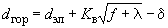,

где  - расстояние по горизонтали между неотклоненными проводами (для расщепленных проводов - между ближайшими проводами разных фаз), м;

 - расстояние согласно 2.5.126 для условий внутренних перенапряжений, м;

 - коэффициент, значение которого принимается по табл.2.5.12;

 - наибольшая стрела провеса при высшей температуре или при гололеде без ветра, соответствующая действительному пролету, м;

 - длина поддерживающей гирлянды изоляторов, м:

для пролета, ограниченного анкерными опорами =0;

для пролетов с комбинированными гирляндами изоляторов  принимается равной ее проекции на вертикальную плоскость;

для пролетов с различной конструкцией гирлянд изоляторов  принимается равной полусумме длин гирлянд изоляторов смежных опор;

 - поправка на расстояние между проводами, м, принимается равной 0,25 на ВЛ 35 кВ и 0,5 на ВЛ 110 кВ и выше в пролетах, ограниченных анкерными опорами, в остальных случаях =0.

Таблица 2.5.12

Значение коэффициента 

|  |  |  |  |  |  |  |  |
| --- | --- | --- | --- | --- | --- | --- | --- |
|img_764dc602.png | 0,5 | 1 | 2 | 3 | 5 | 7 | 10 и более |
| img_c81f8310_2.png | 0,65 | 0,70 | 0,73 | 0,75 | 0,77 | 0,775 | 0,78 |

 - расчетная ветровая нагрузка на провод согласно 2.5.54, Н;

 - расчетная нагрузка от веса провода, Н.

Для промежуточных значений , указанных в табл.2.5.12,  определяется линейной интерполяцией.

2.5.89. На ВЛ с поддерживающими гирляндами изоляторов при вертикальном расположении проводов минимальное расстояние между неотклоненными проводами в середине пролета определяется по формуле

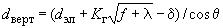,

где  - расстояние между неотклоненными проводами (для расщепленных проводов - между ближайшими проводами разноименных фаз) по вертикали, м;

 - то же, что и в 2.5.88;

 - коэффициент, значение которого принимается по табл.2.5.13;

 - угол наклона прямой, соединяющей точки крепления проводов (тросов), к горизонтали; при углах наклона до 10° допускается принимать .

Таблица 2.5.13

Значение коэффициента 

|  |  |  |  |  |  |  |  |  |
| --- | --- | --- | --- | --- | --- | --- | --- | --- |
|Значение стрел провеса, м | Значение коэффициента img_f5092eb1_2.png при отношении img_918ccd6f.png | | | | | | | |
|  | 0,5 | 1 | 2 | 3 | 4 | 5 | 7 | 10 и более |
| Менее 12 | 0,4 | 0,7 | 0,9 | 1,1 | 1,2 | 1,25 | 1,3 | 1,4 |
| От 12 до 20 | 0,5 | 0,85 | 1,15 | 1,4 | 1,5 | 1,6 | 1,75 | 1,9 |
| Выше 20 | 0,55 | 0,95 | 1,4 | 1,75 | 2,0 | 2,1 | 2,3 | 2,4 |

 - расчетная гололедная нагрузка на провод, Н/м, определяется по 2.5.55;

 - то же, что и в 2.5.88.

Для промежуточных значений , указанных в табл.2.5.13,  определяется линейной интерполяцией.

2.5.90. На ВЛ с поддерживающими гирляндами изоляторов при смешанном расположении проводов (имеются смещения проводов друг относительно друга как по горизонтали, так и по вертикали) минимальное смещение по горизонтали  (при заданном расстоянии между проводами по вертикали) или минимальное расстояние по вертикали  (при заданном смещении по горизонтали) определяется в середине пролета в зависимости от наименьших расстояний между проводами ВЛ  и , рассчитанных согласно 2.5.88 и 2.5.89 для фактических условий, и принимается в соответствии с табл.2.5.14 (при ) или табл.2.5.15 (при ).

Таблица 2.5.14

Соотношения между горизонтальным и вертикальным смещениями проводов при 

|  |  |  |  |  |  |
| --- | --- | --- | --- | --- | --- |
|Горизонтальное смещение | 0 | 0,25img_8ea7df58_3.png | 0,50img_8ea7df58_4.png | 0,75img_8ea7df58_5.png | img_8ea7df58_6.png |
| Вертикальное расстояние | img_a26cce53_3.png | 0,95img_a26cce53_4.png | 0,85img_a26cce53_5.png | 0,65img_a26cce53_6.png | 0 |

Таблица 2.5.15

Соотношения между горизонтальным и вертикальным смещениями проводов при 

|  |  |  |  |  |  |
| --- | --- | --- | --- | --- | --- |
|Вертикальное расстояние | 0 | 0,25img_a26cce53_7.png | 0,50img_a26cce53_8.png | 0,75img_a26cce53_9.png | img_a26cce53_10.png |
| Горизонтальное смещение | img_6956b0dd.png | 0,95img_6956b0dd_1.png | 0,85img_6956b0dd_2.png | 0,65img_6956b0dd_3.png | 0 |

Промежуточные значения смещений и расстояний определяются линейной интерполяцией.

Расстояния, определенные по 2.5.88, 2.5.89, 2.5.90, допускается округлять до 0,1 м для стрел провеса до 4 м, до 0,25 м - для стрел провеса 4-12 м и до 0,5 м при стрелах более 12 м.

2.5.91. Выбранные согласно 2.5.89, 2.5.90 расстояния между проводами должны быть также проверены на условия пляски (см. табл.П1-П8 приложения). Из двух расстояний следует принимать наибольшее.

2.5.92. На ВЛ 35 кВ и выше с подвесными изоляторами при непараллельном расположении проводов минимальные расстояния между ними следует определять:

1) в середине пролета - в соответствии с 2.5.88-2.5.91;

2) на опоре: горизонтальные расстояния  - согласно 2.5.88 при стреле провеса провода , длине поддерживающей гирлянды изоляторов  и 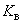=1; вертикальные расстояния  - согласно 2.5.89 при стреле провеса 0 и 1.

Расстояния между проводами ВЛ с металлическими и железобетонными опорами должны также удовлетворять требованиям: на одноцепных опорах - 2.5.125, 2.5.126, на двухцепных опорах - 2.5.95, а на ВЛ с деревянными опорами - требованиям 2.5.123;

3) на расстоянии от опоры 0,25 длины пролета: горизонтальные расстояния  определяются интерполяцией расстояния на опоре и в середине пролета; вертикальные расстояния  принимаются как для середины пролета.

При изменении взаимного расположения проводов в пролете наименьшее расстояние между проводами определяется линейной интерполяцией минимальных расстояний  или , рассчитанных в точках, ограничивающих первую или вторую четверти пролета от опоры, в которой имеется пересечение.

2.5.93. Расстояния между проводами и тросами определяются согласно 2.5.88-2.5.90 дважды: по параметрам провода и параметрам троса, и из двух расстояний выбирается наибольшее. При этом допускается определять расстояния по фазному напряжению ВЛ.

Выбор расстояний между проводами и тросами по условиям пляски производится по стрелам провеса провода при среднегодовой температуре (см. приложение).

При двух и более тросах на ВЛ выбор расстояний между ними производится по параметрам тросов.

2.5.94. На ВЛ 35 кВ и ниже со штыревыми и стержневыми изоляторами при любом расположении проводов расстояние между ними по условиям их сближения в пролете должно быть не менее значений, определенных по формуле, м,

,

где  - то же, что и в 2.5.88;

 - стрела провеса при высшей температуре после вытяжки провода в действительном пролете, м.

При >2 м расстояние  допускается определять согласно 2.5.88 и 2.5.89 при =0.

Расстояние между проводами на опоре и в пролете ВЛЗ независимо от расположения проводов на опоре и района по гололеду должно быть не менее 0,4 м.

2.5.95. На двухцепных опорах расстояние между ближайшими проводами разных цепей по условию работы проводов в пролете должно удовлетворять требованиям 2.5.88-2.5.91, 2.5.96; при этом указанные расстояния должны быть не менее: 2 м - для ВЛ до 20 кВ со штыревыми и 2,5 м с подвесными изоляторами; 2,5 м - для ВЛ 35 кВ со штыревыми и 3 м с подвесными изоляторами; 4 м - для ВЛ 110 кВ; 5 м - для ВЛ 150 кВ; 6 м - для ВЛ 220 кВ; 7 м - для ВЛ 330 кВ; 8,5 м - для ВЛ 500 кВ и 10 м - для ВЛ 750 кВ.

На двухцепных опорах ВЛЗ расстояние между ближайшими проводами разных цепей должно быть не менее 0,6 м для ВЛЗ со штыревыми изоляторами и 1,5 м - с подвесными изоляторами.

2.5.96. Провода ВЛ разных напряжений выше 1 кВ могут быть подвешены на общих опорах.

Допускается подвеска на общих опорах проводов ВЛ до 10 кВ и ВЛ до 1 кВ при соблюдении следующих условий:

1) ВЛ до 1 кВ должны выполняться по расчетным условиям ВЛ высшего напряжения;

2) провода ВЛ до 10 кВ должны располагаться выше проводов ВЛ до 1 кВ, причем расстояние между ближайшими проводами ВЛ разных напряжений на опоре, а также в середине пролета при температуре окружающего воздуха плюс 15 °С без ветра должно быть не менее 2 м;

3) крепление проводов высшего напряжения на штыревых изоляторах должно быть двойным.

В сетях до 35 кВ с изолированной нейтралью, имеющих участки совместной подвески с ВЛ более высокого напряжения, электромагнитное и электростатическое влияние последних не должно вызвать смещение нейтрали при нормальном режиме сети более 15% фазного напряжения.

К сетям с заземленной нейтралью, подверженным влиянию ВЛ более высокого напряжения, специальных требований в отношении наведенного напряжения не предъявляется.

Провода ВЛЗ могут быть подвешены на общих опорах с проводами ВЛ 6-20 кВ, а также с проводами ВЛ и ВЛИ\* до 1 кВ.

\_\_\_\_\_\_\_\_\_\_\_\_\_\_\_\_

\* Здесь и далее ВЛИ - воздушная линия электропередачи с самонесущими изолированными проводами.

Расстояние по вертикали между ближайшими проводами ВЛЗ и ВЛ 6-20 кВ на общей опоре и в пролете при температуре плюс 15 °С без ветра должно быть не менее 1,5 м.

При подвеске на общих опорах проводов ВЛЗ 6-20 кВ и ВЛ до 1 кВ или ВЛИ должны соблюдаться следующие требования:

1) ВЛ до 1 кВ или ВЛИ должны выполняться по расчетным условиям ВЛЗ;

2) провода ВЛЗ 6-20 кВ должны располагаться выше проводов ВЛ до 1 кВ или ВЛИ;

3) расстояние по вертикали между ближайшими проводами ВЛЗ 6-20 кВ и проводами ВЛ до 1 кВ или ВЛИ на общей опоре и в пролете при температуре плюс 15 °С без ветра должно быть не менее 0,4 м для ВЛИ и 1,5 м - для ВЛ;

4) крепление проводов ВЛЗ 6-20 кВ на штыревых и подвесных изоляторах должно выполняться усиленным.

# Изоляторы и арматура

2.5.97. На ВЛ 110 кВ и выше должны применяться подвесные изоляторы, допускается применение стержневых и опорно-стержневых изоляторов.

На ВЛ 35 кВ должны применяться подвесные или стержневые изоляторы. Допускается применение штыревых изоляторов.

На ВЛ 20 кВ и ниже должны применяться:

1) на промежуточных опорах - любые типы изоляторов;

2) на опорах анкерного типа - подвесные изоляторы, допускается применение штыревых изоляторов в районе по гололеду I и в ненаселенной местности.

2.5.98. Выбор типа и материала (стекло, фарфор, полимерные материалы) изоляторов производится с учетом климатических условий (температуры и увлажнения) и условий загрязнения.

На ВЛ 330 кВ и выше рекомендуется применять, как правило, стеклянные изоляторы; на ВЛ 35-220 кВ - стеклянные, полимерные и фарфоровые, преимущество должно отдаваться стеклянным или полимерным изоляторам.

На ВЛ, проходящих в особо сложных для эксплуатации условиях (горы, болота, районы Крайнего Севера и т.п.), на ВЛ, сооружаемых на двухцепных и многоцепных опорах, на ВЛ, питающих тяговые подстанции электрифицированных железных дорог, и на больших переходах независимо от напряжения следует применять стеклянные изоляторы или, при наличии соответствующего обоснования, полимерные.

2.5.99. Выбор количества изоляторов в гирляндах производится в соответствии с гл.1.9.

2.5.100. Изоляторы и арматура выбираются по нагрузкам в нормальных и аварийных режимах работы ВЛ при климатических условиях, указанных в 2.5.71 и 2.5.72 соответственно.

Горизонтальная нагрузка в аварийных режимах поддерживающих гирлянд изоляторов определяется согласно 2.5.141, 2.5.142 и 2.5.143.

Расчетные усилия в изоляторах и арматуре не должны превышать значений разрушающих нагрузок (механической или электромеханической для изоляторов и механической для арматуры), установленных государственными стандартами и техническими условиями, деленных на коэффициент надежности по материалу .

Для ВЛ, проходящих в районах со среднегодовой температурой минус 10 °С и ниже или в районах с низшей температурой минус 50 °С и ниже, расчетные усилия в изоляторах и арматуре умножаются на коэффициент условий работы 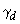=1,4 , для остальных ВЛ =1,0.

2.5.101. Коэффициенты надежности по материалу  для изоляторов и арматуры должны быть не менее:

|  |  |
| --- | --- |
|) в нормальном режиме: |  |
| при наибольших нагрузках | 2,5 |
| при среднеэксплуатационных нагрузках для изоляторов |  |
| для поддерживающих гирлянд | 5,0 |
| для натяжных гирлянд | 6,0 |
| 2) в аварийном режиме: |  |
| для ВЛ 500 кВ и 750 кВ | 2,0 |
| для ВЛ 330 кВ и ниже | 1,8 |
| 3) в нормальном и аварийных режимах: |  |
| для крюков и штырей | 1,1 |

2.5.102. В качестве расчетного аварийного режима работы двух- и многоцепных поддерживающих и натяжных гирлянд изоляторов с механической связкой между цепями изоляторов (2.5.111) следует принимать обрыв одной цепи. При этом расчетные нагрузки от проводов и тросов принимаются для климатических условий, указанных в 2.5.71 в режимах, дающих наибольшие значения нагрузок, а расчетные усилия в оставшихся в работе цепях изоляторов не должны превышать 90% механической (электромеханической) разрушающей нагрузки изоляторов.

2.5.103. Конструкции поддерживающих и натяжных гирлянд изоляторов должны обеспечивать возможность удобного производства строительно-монтажных и ремонтных работ.

2.5.104. Крепление проводов к подвесным изоляторам и крепление тросов следует производить при помощи глухих поддерживающих или натяжных зажимов.

Крепление проводов к штыревым изоляторам следует производить проволочными вязками или специальными зажимами.

2.5.105. Радиопомехи, создаваемые гирляндами изоляторов и арматурой при наибольшем рабочем напряжении ВЛ, не должны превышать значения, нормируемые государственными стандартами.

2.5.106. Поддерживающие гирлянды изоляторов ВЛ 750 кВ должны выполняться двухцепными с раздельным креплением к опоре.

2.5.107. Поддерживающие гирлянды изоляторов для промежуточно-угловых опор ВЛ 330 кВ и выше должны выполняться двухцепными.

2.5.108. На ВЛ 110 кВ и выше в условиях труднодоступной местности рекомендуется применение двухцепных поддерживающих и натяжных гирлянд изоляторов с раздельным креплением к опоре.

2.5.109. В двухцепных поддерживающих гирляндах изоляторов цепи следует располагать вдоль оси ВЛ.

2.5.110. Для защиты проводов шлейфов (петель) от повреждений при соударении с арматурой натяжных гирлянд изоляторов ВЛ с фазами, расщепленными на три провода и более, на них должны быть установлены предохранительные муфты в местах приближения проводов шлейфа к арматуре гирлянды.

2.5.111. Двух- и трехцепные натяжные гирлянды изоляторов следует предусматривать с раздельным креплением к опоре. Допускается натяжные гирлянды с количеством цепей более трех крепить к опоре не менее чем в двух точках.

Конструкции натяжных гирлянд изоляторов расщепленных фаз и их узел крепления к опоре должны обеспечивать раздельный монтаж и демонтаж каждого провода, входящего в расщепленную фазу.

2.5.112. На ВЛ 330 кВ и выше в натяжных гирляндах изоляторов с раздельным креплением цепей к опоре должна быть предусмотрена механическая связка между всеми цепями гирлянды, установленная со стороны проводов.

2.5.113. В натяжных гирляндах изоляторов ВЛ 330 кВ и выше со стороны пролета должна быть установлена экранная защитная арматура.

2.5.114. В одном пролете ВЛ допускается не более одного соединения на каждый провод и трос.

В пролетах пересечения ВЛ с улицами (проездами), инженерными сооружениями, перечисленными в 2.5.231-2.5.268, 2.5.279, водными пространствами одно соединение на провод (трос) допускается:

при сталеалюминиевых проводах с площадью сечения по алюминию 240 мм и более независимо от содержания стали;

при сталеалюминиевых проводах с отношением *А/С*1,49 для любой площади сечения алюминия;

при стальных тросах с площадью сечения 120 мм и более;

при расщеплении фазы на три сталеалюминиевых провода с площадью сечения по алюминию 150 мм и более.

Не допускается соединение проводов (тросов) в пролетах пересечения ВЛ между собой на пересекающих (верхних) ВЛ, а также в пролетах пересечения ВЛ с надземными и наземными трубопроводами для транспорта горючих жидкостей и газов.

2.5.115. Прочность заделки проводов и тросов в соединительных и натяжных зажимах должна составлять не менее 90% разрывного усилия проводов и канатов при растяжении.

# Защита от перенапряжений, заземление

2.5.116. Воздушные линии 110-750 кВ с металлическими и железобетонными опорами должны быть защищены от прямых ударов молнии тросами по всей длине.

Сооружение ВЛ 110-500 кВ или их участков без тросов допускается:

1) в районах с числом грозовых часов в году менее 20 и в горных районах с плотностью разрядов на землю менее 1,5 на 1 км в год;

2) на участках ВЛ в районах с плохо проводящими грунтами (10 Ом·м );

3) на участках трассы с расчетной толщиной стенки гололеда более 25 мм;

4) для ВЛ с усиленной изоляцией провода относительно заземленных частей опоры при обеспечении расчетного числа грозовых отключений линии, соответствующего расчетному числу грозовых отключений ВЛ такого же напряжения с тросовой защитой.

Число грозовых отключений линии для случаев, приведенных в пп.1-3, определенное расчетом с учетом опыта эксплуатации, не должно превышать без усиления изоляции трех в год для ВЛ 110-330 кВ и одного в год - для ВЛ 500 кВ.

Воздушные линии 110-220 кВ, предназначенные для электроснабжения объектов добычи и транспорта нефти и газа, должны быть защищены от прямых ударов молнии тросами по всей длине (независимо от интенсивности грозовой деятельности и удельного эквивалентного сопротивления земли).

2.5.117. Защита подходов ВЛ к подстанциям должна выполняться в соответствии с требованиями гл.4.2.

2.5.118. Для ВЛ до 35 кВ применение грозозащитных тросов не требуется.

На ВЛЗ 6-20 кВ рекомендуется устанавливать устройства защиты изоляции проводов при грозовых перекрытиях.

Воздушные линии 110 кВ на деревянных опорах в районах с числом грозовых часов до 40, как правило, не должны защищаться тросами, а в районах с числом грозовых часов более 40 защита их тросами обязательна.

На ВЛ 6-20 кВ на деревянных опорах по условиям молниезащиты применение металлических траверс не рекомендуется.

2.5.119. Гирлянды изоляторов единичных металлических и железобетонных опор, а также крайних опор участков с такими опорами и другие места с ослабленной изоляцией на ВЛ с деревянными опорами должны защищаться защитными аппаратами, в качестве которых могут использоваться вентильные разрядники (РВ), ограничители перенапряжения нелинейные (ОПН), трубчатые разрядники (РТ) и искровые промежутки (ИП). Устанавливаемые ИП должны соответствовать требованиям, приведенным в гл.4.2.

2.5.120. При выполнении защиты ВЛ от грозовых перенапряжений тросами необходимо руководствоваться следующим:

1) одностоечные металлические и железобетонные опоры с одним тросом должны иметь угол защиты не более 30°, а опоры с двумя тросами - не более 20°;

2) на металлических опорах с горизонтальным расположением проводов и с двумя тросами угол защиты по отношению к внешним проводам для ВЛ 110-330 кВ должен быть не более 20°, для ВЛ 500 кВ - не более 25°, для ВЛ 750 кВ - не более 22°. В районах по гололеду IV и более и в районах с частой и интенсивной пляской проводов для ВЛ 110-330 кВ допускается угол защиты до 30°;

3) на железобетонных и деревянных опорах портального типа допускается угол защиты по отношению к крайним проводам не более 30°;

4) при защите ВЛ двумя тросами расстояние между ними на опоре должно быть не более 5-кратного расстояния по вертикали от тросов до проводов, а при высоте подвеса тросов на опоре более 30 м расстояние между тросами должно быть не более 5-кратного расстояния по вертикали между тросом и проводом на опоре, умноженного на коэффициент, равный , где  - высота подвеса троса на опоре.

2.5.121. Расстояния по вертикали между тросом и проводом ВЛ в середине пролета без учета отклонения их ветром по условиям защиты от грозовых перенапряжений должны быть не менее приведенных в табл.2.5.16 и не менее расстояния по вертикали между тросом и проводом на опоре.

Таблица 2.5.16

Наименьшие расстояния между тросом и проводом в середине пролета

|  |  |
| --- | --- |
|Длина  пролета, м | Наименьшее расстояние  между тросом и  проводом по вертикали, м |
| 100 | 2,0 |
| 150 | 3,2 |
| 200 | 4,0 |
| 300 | 5,5 |
| 400 | 7,0 |
| 500 | 8,5 |
| 600 | 10,0 |
| 700 | 11,5 |
| 800 | 13,0 |
| 900 | 14,5 |
| 1000 | 16,0 |
| 1200 | 18,0 |
| 1500 | 21,0 |

При промежуточных значениях длин пролетов расстояния определяются интерполяцией.

2.5.122. Крепление тросов на всех опорах ВЛ 220-750 кВ должно быть выполнено при помощи изоляторов, шунтированных ИП размером не менее 40 мм.

На каждом анкерном участке длиной до 10 км тросы должны быть заземлены в одной точке путем устройства специальных перемычек на анкерной опоре. При большей длине анкерных пролетов количество точек заземления в пролете выбирается таким, чтобы при наибольшем значении продольной электродвижущей силы, наводимой в тросе при коротком замыкании (КЗ) на ВЛ, не происходил пробой ИП.

Изолированное крепление троса рекомендуется выполнять стеклянными подвесными изоляторами.

На подходах ВЛ 220-330 кВ к подстанциям на длине 1-3 км и на подходах ВЛ 500-750 кВ на длине 3-5 км, если тросы не используются для емкостного отбора, плавки гололеда или связи, их следует заземлять на каждой опоре (см. также 2.5.192).

На ВЛ 150 кВ и ниже, если не предусмотрена плавка гололеда или организация каналов высокочастотной связи на тросе, изолированное крепление троса следует выполнять только на металлических и железобетонных анкерных опорах.

На участках ВЛ с неизолированным креплением троса и током КЗ на землю, превышающим 15 кА, а также на подходах к подстанциям заземление троса должно быть выполнено с установкой перемычки, шунтирующей зажим.

При использовании тросов для устройства каналов высокочастотной связи они изолируются от опор на всем протяжении каналов высокочастотной связи и заземляются на подстанциях и усилительных пунктах через высокочастотные заградители.

Количество изоляторов в поддерживающем тросовом креплении должно быть не менее двух и определяться условиями обеспечения требуемой надежности каналов высокочастотной связи. Количество изоляторов в натяжном тросовом креплении следует принимать удвоенным по сравнению с количеством изоляторов в поддерживающем тросовом креплении.

Изоляторы, на которых подвешен трос, должны быть шунтированы искровым промежутком. Размер ИП выбирается минимально возможным по следующим условиям:

1) разрядное напряжение ИП должно быть ниже разрядного напряжения изолирующего тросового крепления не менее чем на 20%;

2) ИП не должен перекрываться при однофазном КЗ на землю на других опорах;

3) при перекрытиях ИП от грозовых разрядов должно происходить самопогасание дуги сопровождающего тока промышленной частоты.

На ВЛ 500-750 кВ для улучшения условий самопогасания дуги сопровождающего тока промышленной частоты и снижения потерь электроэнергии рекомендуется применять скрещивание тросов.

Если на тросах ВЛ предусмотрена плавка гололеда, то изолированное крепление тросов выполняется по всему участку плавки. В одной точке участка плавки тросы заземляются с помощью специальных перемычек. Тросовые изоляторы шунтируются ИП, которые должны быть минимальными, выдерживающими напряжение плавки и иметь разрядное напряжение меньше разрядного напряжения тросовой гирлянды. Размер ИП должен обеспечивать самопогасание дуги сопровождающего тока промышленной частоты при его перекрытии во время КЗ или грозовых разрядов.

2.5.123. На ВЛ с деревянными опорами портального типа расстояние между фазами по дереву должно быть не менее: 3 м - для ВЛ 35 кВ; 4 м - для ВЛ 110 кВ; 4,8 м - для ВЛ 150 кВ; 5 м - для ВЛ 220 кВ.

В отдельных случаях для ВЛ 110-220 кВ при наличии обоснований (небольшие токи КЗ, районы со слабой грозовой деятельностью и т.п.) допускается уменьшение указанных расстояний до значения, рекомендованного для ВЛ напряжением на одну ступень ниже.

На одностоечных деревянных опорах допускаются следующие расстояния между фазами по дереву: 0,75 м - для ВЛ 3-20 кВ; 2,5 м - для ВЛ 35 кВ при условии соблюдения расстояний в пролете согласно 2.5.94.

2.5.124. Кабельные вставки в ВЛ должны быть защищены по обоим концам кабеля от грозовых перенапряжений защитными аппаратами. Заземляющий зажим защитных аппаратов, металлические оболочки кабеля, корпус кабельной муфты должны быть соединены между собой по кратчайшему пути. Заземляющий зажим защитного аппарата должен быть соединен с заземлителем отдельным проводником.

Не требуют защиты от грозовых перенапряжений:

1) кабельные вставки 35-220 кВ длиной 1,5 км и более в ВЛ, защищенные тросами;

2) кабельные вставки в ВЛ напряжением до 20 кВ, выполненные кабелями с пластмассовой изоляцией и оболочкой, длиной 2,5 км и более и кабелями других конструкций длиной 1,5 км и более.

2.5.125. Для ВЛ, проходящих на высоте до 1000 м над уровнем моря, изоляционные расстояния по воздуху от проводов и арматуры, находящейся под напряжением, до заземленных частей опор должны быть не менее приведенных в табл.2.5.17. Допускается уменьшение изоляционных расстояний по грозовым перенапряжениям, указанных в табл.2.5.17, при условии снижения общего уровня грозо-упорности ВЛ не более чем на 20%. Для ВЛ 750 кВ, проходящих на высоте до 500 м над уровнем моря, расстояния, указанные в табл.2.5.17, могут быть уменьшены на 10% для промежутка "провод шлейфа - стойка анкерно-угловой опоры", "провод-оттяжка" и на 5% для остальных промежутков. Наименьшие изоляционные расстояния по внутренним перенапряжениям приведены для следующих значений расчетной кратности: 4,5 - для ВЛ 6-10 кВ; 3,5 - для ВЛ 20-35 кВ; 3,0 - для ВЛ 110-220 кВ; 2,7 - для ВЛ 330 кВ; 2,5 - для ВЛ 500 кВ и 2,1 - для ВЛ 750 кВ.

Таблица 2.5.17

Наименьшее изоляционное расстояние по воздуху (в свету) от токоведущих до заземленных частей опоры

|  |  |  |  |  |  |  |  |  |  |
| --- | --- | --- | --- | --- | --- | --- | --- | --- | --- |
|Расчетное условие | Наименьшее изоляционное расстояние, см, при напряжении ВЛ, кВ | | | | | | | | |
|  | до 10 | 20 | 35 | 110 | 150 | 220 | 330 | 500 | 750 |
| Грозовые перенапряжения для изоляторов: |  |  |  |  |  |  |  |  |  |
| штыревых | 20 | 30 | 40 | - | - | - | - | - | - |
| подвесных | 20 | 35 | 40 | 100 | 130 | 180 | 260 | 320 | Не нормируется |
| Внутренние перенапряжения | 10 | 15 | 30 | 80 | 110 | 160 | 215 | 300 | 450/500\* |
| Обеспечение безопасного подъема на опору без отключения ВЛ | - | - | 150 | 150 | 200 | 250 | 350 | 450 | 540/580\* |
| Рабочее напряжение | - | 7 | 10 | 25 | 35 | 55 | 80 | 115 | 160 |

\_\_\_\_\_\_\_\_\_\_\_\_\_\_\_\_

\* В знаменателе - промежуток "провод шлейфа - стойка анкерно-угловой опоры", в числителе - все промежутки, кроме промежутка "провод - опора" для средней фазы, который должен быть не менее 480 см.

При других, более низких значениях расчетной кратности внутренних перенапряжений допустимые изоляционные расстояния по ним пересчитываются пропорционально.

Изоляционные расстояния по воздуху между токоведущими частями и деревянной опорой, не имеющей заземляющих спусков, допускается уменьшать на 10%, за исключением расстояний, выбираемых по условию безопасного подъема на опору.

При прохождении ВЛ в горных районах наименьшие изоляционные расстояния по рабочему напряжению и по внутренним перенапряжениям должны быть увеличены по сравнению с приведенными в табл.2.5.17 на 1% на каждые 100 м выше 1000 м над уровнем моря.

2.5.126. Наименьшие расстояния на опоре между проводами ВЛ в месте их пересечения между собой при транспозиции, ответвлениях, переходе с одного расположения проводов на другое должны быть не менее приведенных в табл.2.5.18.

Таблица 2.5.18

Наименьшее расстояние между фазами на опоре

|  |  |  |  |  |  |  |  |  |  |
| --- | --- | --- | --- | --- | --- | --- | --- | --- | --- |
|Расчетное условие | Наименьшее изоляционное расстояние, см, при напряжении ВЛ, кВ | | | | | | | | |
|  | До 10 | 20 | 35 | 110 | 150 | 220 | 330 | 500 | 750 |
| Грозовые перенапряжения | 20 | 45 | 50 | 135 | 175 | 250 | 310 | 400 | Не нормируется |
| Внутренние перенапряжения | 22 | 33 | 44 | 100 | 140 | 200 | 280 | 420 | 640\* |
| Наибольшее рабочее напряжение | 10 | 15 | 20 | 45 | 60 | 95 | 140 | 200 | 280 |

\_\_\_\_\_\_\_\_\_\_\_\_\_\_\_

\* При значениях расчетной кратности внутренних перенапряжений менее 2,1 допустимые изоляционные расстояния пересчитываются пропорционально.

2.5.127. Дополнительные требования к защите от грозовых перенапряжений ВЛ при пересечении их между собой и при пересечении ими различных сооружений приведены в 2.5.229, 2.5.238, 2.5.267.

2.5.128. На двухцепных ВЛ 110 кВ и выше, защищенных тросом, для снижения количества двухцепных грозовых перекрытий допускается усиление изоляции одной из цепей на 20-30% по сравнению с изоляцией другой цепи.

2.5.129. На ВЛ должны быть заземлены:

1) опоры, имеющие грозозащитный трос или другие устройства молниезащиты;

2) железобетонные и металлические опоры ВЛ 3-35 кВ;

3) опоры, на которых установлены силовые или измерительные трансформаторы, разъединители, предохранители и другие аппараты;

4) металлические и железобетонные опоры ВЛ 110-500 кВ без тросов и других устройств молниезащиты, если это необходимо по условиям обеспечения работы релейной защиты и автоматики.

Деревянные опоры и деревянные опоры с металлическими траверсами ВЛ без грозозащитных тросов или других устройств молниезащиты не заземляются.

Сопротивления заземляющих устройств опор, приведенных в п.1, при их высоте до 50 м должны быть не более приведенных в табл.2.5.19; при высоте опор более 50 м - в 2 раза ниже по сравнению с приведенными в табл.2.5.19. На двухцепных и многоцепных опорах ВЛ, независимо от напряжения линии и высоты опор, рекомендуется снижать сопротивления заземляющих устройств в 2 раза по сравнению с приведенными в табл.2.5.19.

Таблица 2.5.19

Наибольшее сопротивление заземляющих устройств опор ВЛ

|  |  |
| --- | --- |
|Удельное эквивалентное сопротивление грунта img_ea1773bb_1.png, Ом·м | Наибольшее сопротивление заземляющего устройства, Ом |
| До 100 | 10 |
| Более 100 до 500 | 15 |
| Более 500 до 1000 | 20 |
| Более 1000 до 5000 | 30 |
| Более 5000 | 6·10img_9fd7f6ce.pngimg_ea1773bb_2.png |

Допускается превышение сопротивлений заземления части опор по сравнению с нормируемыми значениями, если имеются опоры с пониженными значениями сопротивлений заземления, а ожидаемое число грозовых отключений не превышает значений, получаемых при выполнении требований табл.2.5.19 для всех опор ВЛ.

Для опор горных ВЛ, расположенных на высотах более 700 м над уровнем моря, указанные в табл.2.5.19 значения сопротивлений заземления могут быть увеличены в 2 раза. Сопротивления заземляющих устройств опор, указанных в п.2 для ВЛ 3-20 кВ, проходящих в населенной местности, а также всех ВЛ 35 кВ должны быть не более приведенных в табл.2.5.19: для ВЛ 3-20 кВ в ненаселенной местности в грунтах с удельным сопротивлением  до 100 Ом·м - не более 30 Ом, а в грунтах с  выше 100 Ом·м - не более 0,3  Ом.

Сопротивления заземляющих устройств опор ВЛ 110 кВ и выше, указанных в п.3, должны быть не более приведенных в табл.2.5.19, а для ВЛ 3-35 кВ не должны превышать 30 Ом.

Сопротивления заземляющих устройств опор, указанных в п.4, определяются при проектировании ВЛ.

Для ВЛ, защищенных тросами, сопротивления заземляющих устройств, выполненных по условиям молниезащиты, должны обеспечиваться при отсоединенном тросе, а по остальным условиям - при неотсоединенном тросе.

Сопротивления заземляющих устройств опор ВЛ должны обеспечиваться и измеряться при токах промышленной частоты в период их наибольших значений в летнее время. Допускается производить измерение в другие периоды с корректировкой результатов путем введения сезонного коэффициента, однако не следует производить измерение в период, когда на значение сопротивления заземляющих устройств оказывает существенное влияние промерзание грунта.

Место присоединения заземляющего устройства к железобетонной опоре должно быть доступно для выполнения измерений.

2.5.130. Железобетонные фундаменты опор ВЛ 110 кВ и выше могут быть использованы в качестве естественных заземлителей (исключение 2.5.131 и 2.5.253) при осуществлении металлической связи между анкерными болтами и арматурой фундамента и отсутствии гидроизоляции железобетона полимерными материалами.

Битумная обмазка на железобетонных опорах и фундаментах не влияет на их использование в качестве естественных заземлителей.

2.5.131. При прохождении ВЛ 110 кВ и выше в местности с глинистыми, суглинистыми, супесчаными и тому подобными грунтами с удельным сопротивлением 1000 Ом·м следует использовать арматуру железобетонных фундаментов, опор и пасынков в качестве естественных заземлителей без дополнительной укладки или в сочетании с укладкой искусственных заземлителей. В грунтах с более высоким удельным сопротивлением естественная проводимость железобетонных фундаментов не должна учитываться, а требуемое значение сопротивления заземляющего устройства должно обеспечиваться только применением искусственных заземлителей.

Требуемые сопротивления заземляющих устройств опор ВЛ 35 кВ должны обеспечиваться применением искусственных заземлителей, а естественная проводимость фундаментов, подземных частей опор и пасынков (приставок) при расчетах не должна учитываться.

2.5.132. Для заземления железобетонных опор в качестве заземляющих проводников следует использовать те элементы напряженной и ненапряженной продольной арматуры стоек, металлические элементы которых соединены между собой и могут быть присоединены к заземлителю.

В качестве заземляющего проводника вне стойки или внутри может быть проложен при необходимости специальный проводник. Элементы арматуры, используемые для заземления, должны удовлетворять термической стойкости при протекании токов КЗ. За время КЗ стержни должны нагреваться не более чем на 60 °С.

Оттяжки железобетонных опор должны использоваться в качестве заземляющих проводников дополнительно к арматуре.

Тросы, заземляемые согласно 2.5.122, и детали крепления гирлянд изоляторов к траверсе железобетонных опор должны быть металлически соединены с заземляющим спуском или заземленной арматурой.

2.5.133. Сечение каждого из заземляющих спусков на опоре ВЛ должно быть не менее 35 мм, а для однопроволочных спусков диаметр должен быть не менее 10 мм (сечение 78,5 мм). Количество спусков должно быть не менее двух.

Для районов со среднегодовой относительной влажностью воздуха 60% и более, а также при средне- и сильноагрессивных степенях воздействия среды заземляющие спуски у места их входа в грунт должны быть защищены от коррозии в соответствии с требованиями строительных норм и правил.

В случае опасности коррозии заземлителей следует увеличивать их сечение или применять оцинкованные заземлители.

На ВЛ с деревянными опорами рекомендуется болтовое соединение заземляющих спусков; на металлических и железобетонных опорах соединение заземляющих спусков может быть выполнено как болтовым, так и сварным.

2.5.134. Заземлители опор ВЛ, как правило, должны находиться на глубине не менее 0,5 м, а в пахотной земле - 1 м. В случае установки опор в скальных грунтах допускается прокладка лучевых заземлителей непосредственно под разборным слоем над скальными породами при толщине слоя не менее 0,1 м. При меньшей толщине этого слоя или его отсутствии рекомендуется прокладка заземлителей по поверхности скалы с заливкой их цементным раствором.

# Опоры и фундаменты

2.5.135. Опоры ВЛ разделяются на два основных вида: анкерные опоры, полностью воспринимающие тяжение проводов и тросов в смежных с опорой пролетах, и промежуточные, которые не воспринимают тяжение проводов или воспринимают его частично. На базе анкерных опор могут выполняться концевые и транспозиционные опоры. Промежуточные и анкерные опоры могут быть прямыми и угловыми.

В зависимости от количества подвешиваемых на них цепей опоры разделяются на одноцепные, двухцепные и многоцепные.

Опоры могут выполняться свободностоящими или с оттяжками.

Промежуточные опоры могут быть гибкой и жесткой конструкции; анкерные опоры должны быть жесткими. Допускается применение анкерных опор гибкой конструкции для ВЛ до 35 кВ.

К опорам жесткой конструкции относятся опоры, отклонение верха которых (без учета поворота фундаментов) при воздействии расчетных нагрузок по второй группе предельных состояний не превышает 1/100 высоты опоры. При отклонении верха опоры более 1/100 высоты опоры относятся к опорам гибкой конструкции.

Опоры анкерного типа могут быть нормальной и облегченной конструкции (см. 2.5.145).

2.5.136. Анкерные опоры следует применять в местах, определяемых условиями работ на ВЛ при ее сооружении и эксплуатации, а также условиями работы конструкции опоры.

Требования к применению анкерных опор нормальной конструкции устанавливаются настоящей главой.

На ВЛ 35 кВ и выше расстояние между анкерными опорами должно быть не более 10 км, а на ВЛ, проходящих в труднодоступной местности и в местности с особо сложными природными условиями, - не более 5 км.

На ВЛ 20 кВ и ниже с проводами, закрепленными на штыревых изоляторах, расстояние между анкерными опорами не должно превышать 1,5 км в районах по гололеду I-III и 1 км в районах по гололеду IV и более.

На ВЛ 20 кВ и ниже с подвесными изоляторами расстояние между анкерными опорами не должно превышать 3 км.

На ВЛ, проходящих по горной или сильно пересеченной местности в районах по гололеду III и более, рекомендуется устанавливать опоры анкерного типа на перевалах и в других точках, резко возвышающихся над окружающей местностью.

2.5.137. Предельные состояния, по которым производится расчет опор, фундаментов и оснований ВЛ, подразделяются на две группы.

Первая группа включает предельные состояния, которые ведут к потере несущей способности элементов или к полной непригодности их в эксплуатации, т.е. к их разрушению любого характера. К этой группе относятся состояния при наибольших внешних нагрузках и при низшей температуре, т.е. при условиях, которые могут привести к наибольшим изгибающим или крутящим моментам на опоры, наибольшим сжимающим или растягивающим усилиям на опоры и фундаменты.

Вторая группа включает предельные состояния, при которых возникают недопустимые деформации, перемещения или отклонения элементов, нарушающие нормальную эксплуатацию, к этой группе относятся состояния при наибольших прогибах опор.

Метод расчета по предельным состояниям имеет целью не допускать, с определенной вероятностью, наступления предельных состояний первой и второй групп при эксплуатации, а также первой группы при производстве работ по сооружению ВЛ.

2.5.138. Нагрузки, воздействующие на строительные конструкции ВЛ, в зависимости от продолжительности действия подразделяются на постоянные и временные (длительные, кратковременные, особые).

К постоянным нагрузкам относятся:

собственный вес проводов, тросов, строительных конструкций, гирлянд изоляторов, линейной арматуры; тяжение проводов и тросов при среднегодовой температуре и отсутствии ветра и гололеда; воздействие предварительного напряжения конструкций, а также нагрузки от давления воды на фундаменты в руслах рек.

К длительным нагрузкам относятся:

нагрузки, создаваемые воздействием неравномерных деформаций оснований, не сопровождающихся изменением структуры грунта, а также воздействием усадки и ползучести бетона.

К кратковременным нагрузкам относятся:

давление ветра на провода, тросы и опоры - свободные от гололеда и покрытые гололедом; вес отложений гололеда на проводах, тросах, опорах; тяжение проводов и тросов сверх их значений при среднегодовой температуре; нагрузки от давления воды на опоры и фундаменты в поймах рек и от давления льда; нагрузки, возникающие при изготовлении и перевозке конструкций, а также при монтаже строительных конструкций, проводов и тросов.

К особым нагрузкам относятся:

нагрузки, возникающие при обрыве проводов и тросов, а также нагрузки при сейсмических воздействиях.

2.5.139. Опоры, фундаменты и основания ВЛ должны рассчитываться на сочетания расчетных нагрузок нормальных режимов по первой и второй группам предельных состояний и аварийных и монтажных режимов ВЛ по первой группе предельных состояний.

Расчет опор, фундаментов и оснований фундаментов на прочность и устойчивость должен производиться на нагрузки первой группы предельных состояний.

Расчет опор, фундаментов и их элементов на выносливость и по деформациям производится на нагрузки второй группы предельных состояний.

Расчет оснований по деформациям производится на нагрузки второй группы предельных состояний без учета динамического воздействия порывов ветра на конструкцию опоры.

Опоры, фундаменты и основания должны рассчитываться также на нагрузки и воздействия внешней среды в конкретных условиях (воздействие размывающего действия воды, давления волн, навалов льда, давления грунта и т.п.), которые принимаются в соответствии со строительными нормами и правилами или другими нормативными документами.

Дополнительно учитывается следующее:

возможность временного усиления отдельных элементов конструкций в монтажных режимах;

расчет железобетонных опор и фундаментов по раскрытию трещин в нормальных режимах производится на нагрузки второй группы предельных состояний, причем кратковременные нагрузки снижаются на 10%; при использовании опор и фундаментов в условиях агрессивной среды снижение кратковременных нагрузок не производится;

отклонение верха опоры при воздействии расчетных нагрузок по второй группе предельных состояний не должно приводить к нарушению установленных настоящими Правилами наименьших изоляционных расстояний от токоведущих частей (проводов) до заземленных элементов опоры и до поверхности земли и пересекаемых инженерных сооружений;

расчет опор гибкой конструкции производится по деформированной схеме (с учетом дополнительных усилий, возникавших от весовых нагрузок при деформациях опоры, для первой и второй групп предельных состояний);

расчет опор, устанавливаемых в районах с сейсмичностью свыше 6 баллов, на воздействие сейсмических нагрузок должен выполняться в соответствии со строительными нормами и правилами по строительству в сейсмических районах; при этом расчетные нагрузки от веса гололеда, от тяжения проводов и тросов в нормальных режимах умножаются на коэффициент сочетаний 0,8.

2.5.140. Опоры должны рассчитываться в нормальном режиме по первой и второй группам предельных состояний на сочетания условий, указанных в 2.5.71 пп.4, 5, 6 и в 2.5.73 пп.1, 2, 3.

Опоры анкерного типа и промежуточные угловые опоры должны рассчитываться также на условия 2.5.71 п.2, если тяжение проводов или тросов в этом режиме больше, чем в режиме наибольших нагрузок.

Анкерные опоры должны быть рассчитаны на разность тяжений проводов и тросов, возникающую вследствие неравенства значений приведенных пролетов по обе стороны опоры. При этом условия для расчета разности тяжений устанавливаются при разработке конструкции опор.

Концевые опоры должны рассчитываться также на одностороннее тяжение всех проводов и тросов.

Двухцепные опоры во всех режимах должны быть рассчитаны также для условий, когда смонтирована только одна цепь.

2.5.141. Промежуточные опоры ВЛ с поддерживающими гирляндами изоляторов и глухими зажимами должны рассчитываться в аварийном режиме по первой группе предельных состояний на расчетные условные горизонтальные статические нагрузки .

Расчет производится при следующих условиях:

1) оборваны провод или провода одной фазы одного пролета (при любом числе проводов на опоре), тросы не оборваны;

2) оборван один трос пролета (для расщепленного троса - все его составляющие), провода не оборваны.

Условные нагрузки прикладываются в местах крепления той фазы или того троса, при обрыве которых усилия в рассчитываемых элементах получаются наибольшими. При этом принимаются сочетания условий, указанных в 2.5.72 п.1.

2.5.142. Расчетная условная горизонтальная статическая нагрузка  от проводов на опоры принимается равной:

1) на ВЛ с нерасщепленными фазами:

для свободностоящих металлических опор, опор из любого материала на оттяжках, А-образных и других типов жестких опор с проводами площадью сечения алюминиевой части до 185 мм - 0,5, площадью сечения алюминиевой части 205 мм и более - 0,4 ;

для железобетонных свободностоящих опор с проводами площадью сечения алюминиевой части до 185 мм - 0,3 ; площадью сечения алюминиевой части 205 мм и более - 0,25 ;

для деревянных свободностоящих опор с проводами площадью сечения алюминиевой части до 185 мм - 0,25; сечения алюминиевой части 205 мм и более 0,2 ,

где  - наибольшая расчетная нагрузка от тяжения проводов (см. 2.5.70);

для других типов опор (опор из новых материалов, металлических гибких опор и т.п.) - в зависимости от гибкости рассчитываемых опор в пределах, указанных выше;

2) на ВЛ напряжением до 330 кВ с расщепленными фазами путем умножения значений, указанных в п.1 для нерасщепленных фаз, на дополнительные коэффициенты: 0,8 - при расщеплении на два провода; 0,7 - на три провода и 0,6 - на четыре провода.

На ВЛ 500 кВ с расщеплением на три и более проводов в фазе - 0,15, но не менее 18 кН.

На ВЛ 750 кВ с расщеплением на четыре и более проводов в фазе - 27 кН.

В расчетах допускается учитывать поддерживающее действие необорванных проводов и тросов при среднегодовой температуре без гололеда и ветра. При этом расчетные условные нагрузки следует определять как в п.1 настоящего параграфа, а механические напряжения, возникающие в поддерживающих проводах и тросах, не должны превышать 70% их разрывного усилия.

При применении средств, ограничивающих передачу продольной нагрузки на промежуточную опору (многороликовые подвесы, а также другие средства), расчет следует производить на нагрузки, возникающие при использовании этих средств, но не более расчетных условных нагрузок, принимаемых при подвеске проводов в глухих зажимах.

2.5.143. Расчетная условная горизонтальная статическая нагрузка на промежуточные опоры 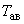 от тросов принимается равной:

1) от одиночного троса - 0,5 ;

2) от расщепленного троса (из двух составляющих) - 0,4, но не менее 20 кН, где  - наибольшая расчетная нагрузка от тяжения тросов (см. 2.5.70).

2.5.144. Промежуточные опоры со штыревыми изоляторами должны рассчитываться в аварийном режиме на обрыв одного провода, дающего наибольшие усилия в элементах опоры с учетом гибкости опор и поддерживающего действия необорванных проводов. Расчетная условная горизонтальная статическая нагрузка  для стоек и приставок принимается равной 0,3, но не менее 3 кН; для остальных элементов опоры - 0,15, но не менее 1,5 кН, где  - то же, что и в 2.5.142.

2.5.145. Опоры анкерного типа должны рассчитываться в аварийном режиме по первой группе предельных состояний на обрыв тех проводов и тросов, при обрыве которых усилия в рассматриваемых элементах получаются наибольшими.

Расчет производится на следующие условия:

1) для опор ВЛ с алюминиевыми и стальными проводами всех сечений, проводами из алюминиевых сплавов всех сечений, сталеалюминиевыми проводами и проводами из термообработанного алюминиевого сплава со стальным сердечником с площадью сечения алюминиевой части для обоих типов проводов до 150 мм:

а) оборваны провода двух фаз одного пролета при любом числе цепей на опоре, тросы не оборваны (анкерные нормальные опоры);

б) оборваны провода одной фазы одного пролета при любом числе цепей на опоре, тросы не оборваны (анкерные облегченные и концевые опоры);

2) для опор ВЛ со сталеалюминиевыми проводами и проводами из термообработанного алюминиевого сплава со стальным сердечником площадью сечения алюминиевой части для обоих типов проводов 185 мм и более, а также со стальными канатами типа ТК всех сечений, используемыми в качестве проводов: оборваны провода одной фазы одного пролета при любом числе цепей на опоре, тросы не оборваны (анкерные нормальные и концевые опоры);

3) для опор ВЛ независимо от марок и сечений подвешиваемых проводов: оборван один трос одного пролета (при расщепленном тросе - все составляющие), провода не оборваны. Сочетания климатических условий принимаются согласно 2.5.72 пп.2 и 3.

2.5.146. Опоры анкерного типа должны проверяться в монтажном режиме по первой группе предельных состояний на следующие условия:

1) в одном пролете смонтированы все провода и тросы, в другом пролете провода и тросы не смонтированы. Тяжение в смонтированных проводах и тросах принимается равным 0,6, где  - наибольшее расчетное горизонтальное тяжение проводов и тросов (см. 2.5.70). При этом сочетания климатических условий принимаются по 2.5.74.

В этом режиме металлические опоры и их закрепления должны иметь требуемую нормами прочность без установки временных оттяжек;

2) в одном из пролетов при любом числе проводов на опоре последовательно и в любом порядке монтируются провода одной цепи, тросы не смонтированы;

3) в одном из пролетов при любом числе тросов на опоре последовательно и в любом порядке монтируются тросы, провода не смонтированы.

При проверках по пп.2 и 3 допускается предусматривать временное усиление отдельных элементов опор и установку временных оттяжек.

2.5.147. Опоры ВЛ должны проверяться на расчетные нагрузки, соответствующие способу монтажа, принятому проектом, с учетом составляющих от усилий тягового троса, веса монтируемых проводов (тросов), изоляторов, монтажных приспособлений и монтера с инструментами.

Узел крепления каждого провода (проушина, диафрагма и др.) при раздельном креплении проводов расщепленной фазы должен рассчитываться с учетом перераспределения нагрузки от оборванной цепи подвески на оставшиеся провода фазы.

Элементы опоры должны выдерживать вертикальную нагрузку от веса монтера с инструментами, расчетное значение которой равно 1,3 кН в сочетании с нагрузками нормального режима от проводов и тросов, свободных от гололеда, при среднегодовой температуре, а также с нагрузками аварийного и монтажного режимов.

Расчетные нагрузки на опоры от веса монтируемых проводов (тросов) при климатических условиях согласно 2.5.74 и гирлянд изоляторов в условиях равнинной местности рекомендуется принимать:

1) на промежуточных опорах - равными удвоенному весу пролета проводов (тросов) без гололеда и гирлянды изоляторов, исходя из возможности подъема монтируемых проводов (тросов) и гирлянды через один блок;

2) на анкерных опорах и промежуточных опорах, при ограничении последними монтажного участка, - с учетом усилия в тяговом тросе, определяемого из условия расположения тягового механизма на расстоянии 2,5 от опоры, где  - высота подвеса провода средней фазы на опоре.

При установке тягового механизма в условиях пересеченной местности необходимо дополнительно учитывать усилие от наклона тягового троса с учетом разности высотных отметок точки подвеса провода и тягового механизма.

Расчетная вертикальная нагрузка от веса монтера и монтажных приспособлений, прикладываемая в месте крепления гирлянд изоляторов, для опор ВЛ 500-750 кВ принимается равной 3,25 кН, для опор анкерного типа ВЛ до 330 кВ с подвесными изоляторами - 2,6 кН, для промежуточных опор ВЛ до 330 кВ с подвесными изоляторами - 1,95 кН, для опор со штыревыми изоляторами - 1,3 кН.

2.5.148. Конструкции опор должны обеспечивать на отключенной ВЛ, а на ВЛ 110 кВ и выше и при наличии на ней напряжения:

1) производство их технического обслуживания и ремонтных работ;

2) удобные и безопасные подъем персонала на опору от уровня земли до вершины опоры и его перемещение по элементам опоры (стойкам, траверсам, тросостойкам, подкосам и др.).

На опоре и ее элементах должна предусматриваться возможность крепления специальных устройств и приспособлений для выполнения эксплуатационных и ремонтных работ.

2.5.149. Для подъема персонала на опору должны быть предусмотрены следующие мероприятия:

1) на каждой стойке металлических опор высотой до вершины до 20 м при расстояниях между точками крепления решетки к поясам стойки (ствола) более 0,6 м или при наклоне решетки к горизонтали более 30°, а для опор высотой более 20 и менее 50 м независимо от расстояний между точками крепления решетки и угла ее наклона должны быть выполнены специальные ступеньки (степ-болты) на одном поясе или лестницы без ограждения, доходящие до отметки верхней траверсы.

Конструкция тросостойки на этих опорах должна обеспечивать удобный подъем или иметь специальные ступеньки (степ-болты);

2) на каждой стойке металлических опор высотой до вершины опоры более 50 м должны быть установлены лестницы с ограждениями, доходящие до вершины опоры. При этом через каждые 15 м по вертикали должны быть выполнены площадки (трапы) с ограждениями. Трапы с ограждениями должны выполняться также на траверсах этих опор. На опорах со шпренгельными траверсами должна быть обеспечена возможность держаться за тягу при перемещении по траверсе;

3) на железобетонных опорах любой высоты должна быть обеспечена возможность подъема на нижнюю траверсу с телескопических вышек, по инвентарным лестницам или с помощью специальных инвентарных подъемных устройств. Для подъема по железобетонной центрифугированной стойке выше нижней траверсы на опорах ВЛ 35-750 кВ должны быть предусмотрены стационарные лазы (лестницы без ограждений и т.п.).

Для подъема по железобетонной вибрированной стойке ВЛ 35 кВ и ниже, на которой установлены силовые или измерительные трансформаторы, разъединители, предохранители или другие аппараты, должна быть предусмотрена возможность крепления инвентарных лестниц или специальных инвентарных подъемных устройств. На железобетонные вибрированные стойки, на которых вышеуказанное электрооборудование не устанавливается, это требование не распространяется.

Удобный подъем на тросостойки и металлические вертикальные части стоек железобетонных опор ВЛ 35-750 кВ должны обеспечивать их конструкция или специальные ступеньки (степ-болты);

4) железобетонные опоры, не допускающие подъема по инвентарным лестницам или с помощью специальных инвентарных подъемных устройств (опоры с оттяжками или внутренними связями, закрепленными на стойке ниже нижней траверсы и т.п.), должны быть снабжены стационарными лестницами без ограждений, доходящими до нижней траверсы.

Выше нижней траверсы должны быть выполнены устройства, указанные в первом абзаце п.3).

# Большие переходы

2.5.150. Участок большого перехода должен быть ограничен концевыми опорами (концевыми устройствами в виде бетонных якорей и др.), выделяющими большой переход в самостоятельную часть ВЛ, прочность и устойчивость которой не зависят от влияния смежных участков ВЛ.

2.5.151. В зависимости от типа крепления проводов опоры, устанавливаемые между концевыми (К) опорами (устройствами), могут быть:

1) промежуточными (П) - с креплением всех проводов на опоре с помощью поддерживающих гирлянд изоляторов;

2) анкерными (А) - с креплением всех проводов на опоре с помощью натяжных гирлянд изоляторов;

3) комбинированными (ПА) - со смешанным креплением проводов на опоре с помощью как поддерживающих, так и натяжных гирлянд изоляторов.

2.5.152. Переходные опоры, ограничивающие пролет пересечения, должны быть анкерными концевыми. Допускается применение промежуточных опор и анкерных опор облегченного типа для переходов со сталеалюминиевыми проводами или проводами из термообработанного алюминиевого сплава со стальным сердечником с сечением алюминиевой части для обоих типов проводов 120 мм и более или стальными канатами типа ТК в качестве проводов с сечением канатов 50 мм и более. При этом количество промежуточных опор между концевыми опорами должно соответствовать требованиям 2.5.153.

2.5.153. В зависимости от конкретных условий могут применяться следующие схемы переходов:

1) однопролетные на концевых опорах К-К;

2) двухпролетные с опорами К-П-К, К-ПА-К;

3) трехпролетные с опорами К-П-П-К, К-ПА-ПА-К;

4) четырехпролетные с опорами К-П-П-П-К, К-ПА-ПА-ПА-К (только для нормативной толщины стенки гололеда 15 мм и менее и длин переходных пролетов не более 1100 м);

5) многопролетные с опорами К-А...А-К;

6) при применении опор П или ПА переход должен быть разделен опорами А на участки с числом опор П или ПА на каждом участке не более двух, т.е. К-П-П-А...А-П-П-К, К-ПА-ПА-А...А-ПА-ПА-К (или не более трех по п.4).

2.5.154. Ветровое давление на провода и тросы больших переходов через водные пространства определяется согласно 2.5.44, но с учетом следующих дополнительных требований.

1. Для перехода, состоящего из одного пролета, высота расположения приведенного центра тяжести проводов или тросов определяется по формуле

,

где 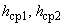 - высота крепления тросов или средняя высота крепления проводов к изоляторам на опорах перехода, отсчитываемая от меженного уровня реки, нормального горизонта пролива, канала, водохранилища, а для пересечений ущелий, оврагов и других препятствий - от отметки земли в местах установки опор, м;

 - стрела провеса провода или троса при высшей температуре в середине пролета, м.

2. Для перехода, состоящего из нескольких пролетов, ветровое давление на провода или тросы определяется для высоты , соответствующей средневзвешенной высоте приведенных центров тяжести проводов или тросов во всех пролетах и вычисляемой по формуле

,

где  - высоты приведенных центров тяжести проводов или тросов над меженным уровнем реки, нормальным горизонтом пролива, канала, водохранилища в каждом из пролетов, а для пересечений ущелий, оврагов и других препятствий - над среднеарифметическим значением отметок земли в местах установки опор, м.

При этом, если пересекаемое водное пространство имеет высокий незатопляемый берег, на котором расположены как переходные, так и смежные с ними опоры, то высоты приведенных центров тяжести в пролете, смежном с переходным, отсчитываются от отметки земли в этом пролете;

 - длины пролетов, входящих в переход, м.

Нормативное ветровое давление на провода, тросы и конструкции опор больших переходов, сооружаемых в местах, защищенных от поперечных ветров, уменьшать не допускается.

2.5.155. Переходы могут выполняться одноцепными и двухцепными.

Двухцепными рекомендуется выполнять переходы в населенной местности, в районах промышленной застройки, а также при потребности в перспективе второго перехода в ненаселенной или труднодоступной местности.

2.5.156. На одноцепных переходах для ВЛ 330 кВ и ниже рекомендуется применять треугольное расположение фаз, допускается горизонтальное расположение фаз; для ВЛ 500-750 кВ следует, как правило, применять горизонтальное расположение фаз.

2.5.157. На двухцепных переходах ВЛ до 330 кВ рекомендуется расположение проводов в трех ярусах, допускается также расположение проводов в двух ярусах. На двухцепных переходах ВЛ 500 кВ рекомендуется применение опор анкерного типа с расположением проводов в одном (горизонтальном) или в двух ярусах.

2.5.158. Расстояния между проводами, а также между проводами и тросами из условий работы в пролете должны выбираться в соответствии с 2.5.88-2.5.92 с учетом дополнительных требований:

1) значение коэффициента 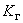 в табл.2.5.13 необходимо увеличивать на: 0,2 - при отношении нагрузок , в интервале от 2 до 6,99; 0,4 - при отношении нагрузок , равном 7 и более;

2) расстояния между ближайшими фазами одноцепных и двухцепных ВЛ должны также удовлетворять требованиям 2.5.159, 2.5.160.

2.5.159. Для обеспечения нормальной работы проводов в пролете в любом районе по пляске проводов, при расположении их в разных ярусах, расстояния между соседними ярусами промежуточных переходных опор высотой более 50 м и смещение по горизонтали должны быть:

|  |  |  |  |  |  |  |
| --- | --- | --- | --- | --- | --- | --- |
|Расстояния, м, не менее | 7,5 | 8 | 9 | 11 | 14 | 18 |
| Смещение по горизонтали, м, не менее | 2 | 2 | 2,5 | 3,5 | 5 | 7 |
| ВЛ напряжением, кВ | 35-110 | 150 | 220 | 330 | 500 | 750 |

2.5.160. На двухцепных опорах расстояние между осями фаз разных цепей должно быть не менее указанных ниже:

|  |  |  |  |  |  |  |
| --- | --- | --- | --- | --- | --- | --- |
|Расстояние между осями фаз, м | 8 | 9 | 10 | 12 | 15 | 19 |
| ВЛ напряжением, кВ | 35-110 | 150 | 220 | 330 | 500 | 750 |

2.5.161. На переходах с пролетами, превышающими пролеты основной линии не более чем в 1,5 раза, рекомендуется проверять целесообразность применения провода той же марки, что и на основной линии. На переходах ВЛ до 110 кВ рекомендуется проверять целесообразность применения в качестве проводов стальных канатов, если это позволяет электрический расчет проводов.

На переходах с расщепленными фазами рекомендуется рассматривать фазы с меньшим количеством проводов больших сечений с проверкой проводов на нагрев.

2.5.162. В качестве грозозащитных тросов следует применять стальные канаты и сталеалюминиевые провода по 2.5.79.

В случае использования грозозащитных тросов для организации каналов высокочастотной связи рекомендуется применение в качестве тросов проводов из термообработанного алюминиевого сплава со стальным сердечником и сталеалюминиевых проводов, а также тросов со встроенными оптическими кабелями.

2.5.163. Одиночные и расщепленные провода и тросы должны быть защищены от вибрации установкой с каждой стороны переходного пролета длиной до 500 м - одного гасителя вибрации на каждом проводе и тросе и длиной от 500 до 1500 м - не менее двух разнотипных гасителей вибрации на каждом проводе и тросе.

Защита от вибрации проводов и тросов в пролетах длиной более 1500 м, а также независимо от длины пролета для проводов диаметром более 38 мм и проводов с тяжением при среднегодовой температуре более 180 кН должна производиться по специальному проекту.

2.5.164. На переходах ВЛ должны применяться, как правило, стеклянные изоляторы.

2.5.165. Количество изоляторов в гирляндах переходных опор определяется в соответствии с гл.1.9.

2.5.166. Поддерживающие и натяжные гирлянды изоляторов следует предусматривать с количеством цепей не менее двух с раздельным креплением к опоре. Многоцепные натяжные гирлянды должны крепиться к опоре не менее чем в двух точках.

2.5.167. Конструкция гирлянд изоляторов расщепленных фаз и крепление их к опоре должны, по возможности, обеспечивать раздельный монтаж и демонтаж каждого из проводов, входящих в расщепленную фазу.

2.5.168. Для крепления проводов и тросов к гирляндам изоляторов на переходных опорах рекомендуется применять глухие поддерживающие зажимы или поддерживающие устройства специальной конструкции (роликовые подвесы).

2.5.169. При выполнении защиты переходов ВЛ 110-750 кВ от грозовых перенапряжений необходимо руководствоваться следующим:

1) все переходы следует защищать от прямых ударов молнии тросами;

2) количество тросов должно быть не менее двух с углом защиты по отношению к крайним проводам не более 20°.

При расположении перехода за пределами длины защищаемого подхода ВЛ к РУ и подстанциям с повышенным защитным уровнем в районах по гололеду III и более, а также в районах с частой и интенсивной пляской проводов допускается угол защиты до 30°;

3) рекомендуется установка защитных аппаратов (2.5.119) на переходах с пролетами длиной выше 1000 м или с высотой опор выше 100 м;

4) горизонтальное смещение троса от центра крайней фазы должно быть не менее: 1,5 м - для ВЛ 110 кВ; 2 м - для ВЛ 150 кВ;2,5 м - для ВЛ 220 кВ; 3,5 м - для ВЛ 330 кВ и 4 м - для ВЛ 500-750 кВ;

5) выбор расстояния между тросами производится согласно 2.5.93 и 2.5.120 п.4.

2.5.170. Крепление тросов на всех опорах перехода должно быть выполнено при помощи изоляторов с разрушающей механической нагрузкой не менее 120 кН.

С целью уменьшения потерь электроэнергии в изолирующем тросовом креплении должно быть не менее двух изоляторов. Их количество определяется с учетом доступности местности и высоты опор.

При использовании тросов для устройства каналов высокочастотной связи или для плавки гололеда количество изоляторов, определенное по условиям обеспечения надежности каналов связи или по условиям обеспечения плавки гололеда, должно быть увеличено на два.

Изоляторы, на которых подвешен трос, должны быть шунтированы искровым промежутком, размер которого выбирается в соответствии с 2.5.122 без учета установки дополнительных изоляторов.

2.5.171. Подвеска грозозащитных тросов для защиты переходов ВЛ 35 кВ и ниже не требуется. На переходных опорах должны устанавливаться защитные аппараты. Размер ИП при использовании их в качестве защитных аппаратов рекомендуется принимать в соответствии с гл.4.2. При увеличении количества изоляторов из-за высоты опоры электрическая прочность ИП должна быть скоординирована с электрической прочностью гирлянд.

2.5.172. Для обеспечения безопасного перемещения обслуживающего персонала по траверсам переходных опор высотой более 50 м с расположением фаз в разных ярусах наименьшее допустимое изоляционное расстояние по воздуху от токоведущих до заземленных частей опор должно быть не менее: 3,3 м - для ВЛ до 110 кВ; 3,8 м - для ВЛ 150 кВ; 4,3 м - для ВЛ 220 кВ; 5,3 м - для ВЛ 330 кВ; 6,3 м - для ВЛ 500 кВ; 7,6 м - для ВЛ 750 кВ.

2.5.173. Сопротивление заземляющих устройств опор должно выбираться в соответствии с табл.2.5.19 и 2.5.129.

Сопротивление заземляющего устройства опор с защитными аппаратами должно быть не более 10 Ом при удельном сопротивлении земли не выше 1000 Ом·м и не более 15 Ом при более высоком удельном сопротивлении.

2.5.174. При проектировании переходов через водные пространства необходимо провести следующие расчеты по гидрологии поймы реки:

1) гидрологический расчет, устанавливающий расчетный уровень воды, уровень ледохода, распределение расхода воды между руслом и поймами и скорости течения воды в руслах и по поймам;

2) русловой расчет, устанавливающий размер отверстия перехода и глубины после размыва у опор перехода;

3) гидравлический расчет, устанавливающий уровень воды перед переходом, струенаправляющими дамбами и насыпями, высоту волн на поймах;

4) расчет нагрузок на фундаменты, находящиеся в русле и пойме реки с учетом воздействия давления льда и навалов судов.

Высота фундаментов опор, находящихся в русле и пойме реки, должна превышать уровень ледохода на 0,5 м.

Заглубление фундаментов опор переходов мелкого и глубокого заложения при возможности размыва грунта должно быть не менее 2,5 м (считая от отметки грунта после размыва). Глубина погружения свай в грунт при свайном основании должна быть не менее 4 м от уровня размыва.

2.5.175. Промежуточные и комбинированные опоры (П и ПА) с креплением проводов с помощью поддерживающих гирлянд изоляторов должны рассчитываться в аварийном режиме по первой группе предельных состояний на следующие условия:

1) оборваны одиночный провод или все провода одной фазы одного пролета, тросы не оборваны (одноцепные опоры);

2) оборваны провода двух фаз одного пролета, тросы не оборваны (двухцепные опоры, а также одноцепные со сталеалюминиевыми проводами и проводами из термообработанного алюминиевого сплава со стальным сердечником сечением алюминиевой части для обоих типов проводов до 150 мм);

3) оборван один трос одного пролета (при расщеплении троса - все его составляющие), провода независимо от марок и сечений не оборваны.

В расчетах опор расчетная горизонтальная статическая нагрузка от проводов принимается равной:

а) при нерасщепленной фазе и креплении ее в глухом зажиме - редуцированному тяжению, возникающему при обрыве фазы. При этом принимаются сочетания условий согласно 2.5.72 п.3.

При расщепленной фазе и креплении ее в глухих зажимах значения для нерасщепленных фаз умножаются на дополнительные коэффициенты: 0,8 - при расщеплении на 2 провода; 0,7 - на три провода; 0,6 - на четыре провода и 0,5 - на пять и более;

б) при нерасщепленной и расщепленной фазах провода и креплении их в поддерживающем устройстве специальной конструкции - условной нагрузке, равной 25 кН при одном проводе в фазе; 40 кН при двух проводах в фазе; 60 кН при трех и более проводах в фазе.

Расчетная нагрузка от троса, закрепленного в глухом зажиме, принимается равной наибольшему расчетному горизонтальному тяжению троса при сочетании условий, указанных в 2.5.72 п.3.

При этом для тросов, расщепленных на две составляющие, тяжение следует умножать на 0,8.

Расчетная нагрузка от троса, закрепленного в поддерживающем устройстве специальной конструкции, принимается равной 40 кН. Нагрузки прикладываются в местах крепления проводов тех фаз или того троса, при обрыве которых усилия в рассчитываемых элементах получаются наибольшими.

2.5.176. Опоры анкерного типа должны рассчитываться в аварийном режиме по первой группе предельных состояний на обрыв тех фаз или того троса, при обрыве которых усилия в рассматриваемых элементах получаются наибольшими. Расчет производится на следующие условия:

1) оборваны провод или провода одной фазы одного пролета, тросы не оборваны (одноцепные опоры со сталеалюминиевыми проводами и проводами из термообработанного алюминиевого сплава со стальным сердечником сечением алюминиевой части для обоих типов проводов 185 мм и более, а также со стальными канатами типа ТК всех сечений, используемыми в качестве проводов);

2) оборваны провода двух фаз одного пролета, тросы не оборваны (двухцепные опоры, а также одноцепные опоры со сталеалюминиевыми проводами и проводами из термообработанного алюминиевого сплава со стальным сердечником сечением алюминиевой части для обоих типов проводов до 150 мм);

3) оборван один трос одного пролета (при расщеплении троса - все его составляющие), провода независимо от марок и сечений не оборваны.

Расчетные нагрузки от проводов и тросов принимаются равными наибольшему расчетному горизонтальному тяжению провода или троса при сочетании условий согласно 2.5.72 пп.2 и 3.

При определении усилий в элементах опоры учитываются условные нагрузки или неуравновешенные тяжения, возникающие при обрывах тех проводов или тросов, при которых эти усилия имеют наибольшие значения.

2.5.177. Опоры большого перехода должны иметь дневную маркировку (окраску) и сигнальное освещение в соответствии с 2.5.292.

#

# Подвеска волоконно-оптических линий связи на BЛ

2.5.178. Волоконно-оптической линией связи на воздушных линиях электропередачи (ВОЛС-ВЛ) называется линия связи, для передачи информации по которой служит оптический кабель (ОК), размещаемый на элементах ВЛ.

2.5.179. Требования 2.5.180-2.5.200 распространяются на размещение на ВЛ оптических кабелей следующих типов:

1) ОКГТ - оптический кабель, встроенный в грозозащитный трос;

2) ОКФП - оптический кабель, встроенный в фазный провод;

3) ОКСН - оптический кабель самонесущий неметаллический;

4) ОКНН - оптический кабель неметаллический, прикрепляемый или навиваемый на грозозащитный трос или фазный провод.

2.5.180. Все элементы ВОЛС-ВЛ должны соответствовать условиям работы ВЛ.

2.5.181. Для сооружения конкретной линии связи допускается использование нескольких ВЛ различного напряжения, совпадающих по направлению с ее трассой.

2.5.182. При сооружении вводов ОК на регенерационные пункты и узлы связи энергообъектов на отдельных самостоятельных опорах конструктивное выполнение и требования к параметрам и характеристикам вводов определяются в проекте.

2.5.183. Элементы ВОЛС-ВЛ, включая вводы ОК на регенерационные пункты, узлы связи энергообъектов должны проектироваться на те же климатические условия, что и ВЛ, на которой эта ВОЛС размещается, и соответствовать требованиям 2.5.38-2.5.74.

2.5.184. Оптические кабели, размещаемые на элементах ВЛ, должны удовлетворять требованиям:

1) механической прочности;

2) термической стойкости;

3) стойкости к воздействию грозовых перенапряжений;

4) обеспечения нагрузок на оптические волокна, не превышающих допускаемые;

5) стойкости к воздействию электрического поля.

2.5.185. Механический расчет ОКГТ, ОКФП, ОКСН должен производиться на расчетные нагрузки по методу допускаемых напряжений с учетом вытяжки кабелей и допустимых нагрузок на оптическое волокно.

2.5.186. Механический расчет грозозащитного троса или фазного провода, на которых размещается ОКНН, должен производиться с учетом дополнительных весовых и ветровых нагрузок от ОК во всех режимах, указанных в 2.5.71-2.5.74.

2.5.187. Механический расчет ОК всех типов следует выполнять для исходных условий по 2.5.71-2.5.74.

Значения физико-механических параметров, необходимых для механического расчета ОК, и данные по вытяжке должны приниматься по техническим условиям на ОК или по данным изготовителей кабелей.

2.5.188. Оптические кабели должны быть защищены от вибрации в соответствии с условиями их подвески и требованиями изготовителя ОК.

2.5.189. При подвеске на ВЛ ОКГТ и ОКФП их расположение должно удовлетворять требованиям 2.5.86-2.5.96 и 2.5.121.

2.5.190. Независимо от напряжения ВЛ ОКГТ должен, как правило, быть заземлен на каждой опоре. Сопротивление заземляющих устройств опор, на которых подвешен ОКГТ, должно соответствовать табл.2.5.19. Допускается увеличение этих сопротивлений при обеспечении термической стойкости ОК.

При наличии плавки гололеда на грозозащитных тросах допускается изолированное крепление ОКГТ при условии, что стойкость оптических волокон по температурному режиму удовлетворяет условиям работы в режиме плавки гололеда и режиму протекания токов на этом участке (см. также 2.5.192, 2.5.193, 2.5.195).

2.5.191. Необходимость заземления (или возможность изолированной подвески) троса, на котором подвешен ОКНН, обосновывается в проекте.

2.5.192. Оптические кабели ОКГТ, ОКФП и ОКНН должны быть проверены на работоспособность по температурному режиму при протекании максимального полного тока КЗ, определяемого с учетом времени срабатывания резервных защит, дальнего резервирования, действия УРОВ и АПВ и полного времени отключения выключателей. Допускается не учитывать дальнее резервирование.

2.5.193. Оптические кабели ОКФП и ОКНН (при подвеске его на фазном проводе) следует проверять на работоспособность по температурному режиму при температурах провода, возникающих при его нагреве наибольшим рабочим током линии.

2.5.194. Напряженность электрического поля в точке подвеса ОКСН должна рассчитываться с учетом реального расположения кабеля, транспозиции фаз ВЛ, вероятности отключения одной цепи в случае двухцепной ВЛ, а также конструкции зажима (протектора).

2.5.195. Оптический кабель типа ОКНН следует проверять:

1) при подвеске его на фазном проводе - на стойкость при воздействии электрического поля проводов;

2) при подвеске его на грозозащитном тросе - на стойкость к воздействию электрического напряжения, наведенного на тросе, и прямых ударов молнии в трос.

2.5.196. Токи КЗ, на которые производится проверка ОК (ОКГТ, ОКФП, ОКНН) на термическую стойкость, должны определяться с учетом перспективы развития энергосистемы.

2.5.197. Место крепления ОКСН на опоре с учетом его вытяжки в процессе эксплуатации определяется, исходя из условий:

1) стойкости оболочки к воздействию электрического поля;

2) обеспечения наименьшего расстояния до поверхности земли не менее 5 м независимо от напряжения ВЛ и вида местности;

3) обеспечения расстояний от ОКСН до фазных проводов на опоре не менее 0,6 м для ВЛ до 35 кВ; 1 м - 110 кВ; 1,5 м - 150 кВ; 2 м - 220 кВ; 2,5 м - 330 кВ; 3,5 м - 500 кВ; 5 м - 750 кВ при отсутствии гололеда и ветра.

С учетом указанных условий ОКСН может размещаться как выше фазных проводов, так и между фазами или ниже фазных проводов.

2.5.198. При креплении ОКНН к фазному проводу должны быть обеспечены следующие наименьшие расстояния от провода с прикрепленным или навитым ОК:

1) до конструкции опоры при отклонении от воздействия ветра в соответствии с табл.2.5.17;

2) до земли и инженерных сооружений и естественных препятствий в соответствии с табл.2.5.20-2.5.25, 2.5.30, 2.5.31, 2.5.34-2.5.40.

2.5.199. При подвеске на ВЛ ОК любого типа должна быть выполнена проверка опор и их закреплений в грунте с учетом дополнительных нагрузок, возникающих при этом.

2.5.200. Соединение строительных длин ОК выполняется в специальных соединительных муфтах, которые рекомендуется размещать на анкерных опорах.

Высота расположения соединительных муфт на опорах ВЛ должна быть не менее 5 м от основания опоры.

К опорам ВЛ, на которых размещаются соединительные муфты ОК, должен быть обеспечен в любое время года подъезд транспортных средств со сварочным и измерительным оборудованием.

На опорах ВЛ при размещении на них муфт ОК дополнительно к 2.5.23 должны быть нанесены следующие постоянные знаки:

условное обозначение ВОЛС;

номер соединительной муфты.

# Прохождение ВЛ по ненаселенной и труднодоступной местности

2.5.201. Расстояния от проводов ВЛ до поверхности земли в ненаселенной и труднодоступной местностях в нормальном режиме ВЛ должны приниматься не менее приведенных в табл.2.5.20.

Таблица 2.5.20

Наименьшее расстояние от проводов ВЛ до поверхности земли в ненаселенной и труднодоступной местности

|  |  |  |  |  |  |  |  |  |
| --- | --- | --- | --- | --- | --- | --- | --- | --- |
|Характеристика местности | Наименьшее расстояние, м, при напряжении ВЛ, кВ | | | | | | | |
|  | До 20 | 35-110 | 150 | 220 | 330 | 500 | 750 | ВЛЗ |
| Ненаселенная местность; районы тундры, степей с почвами, непригодными для земледелия, и пустыни | 6 | 6 | 6,5 | 7 | 7,5 | 8 | 12 | 5 |
| Труднодоступная местность | 5 | 5 | 5,5 | 6 | 6,5 | 7 | 10 | 5 |
| Недоступные склоны гор, скалы, утесы и т.п. | 3 | 3 | 3,5 | 4 | 4,5 | 5 | 7,5 | 3 |

Наименьшие расстояния определяются при наибольшей стреле провеса провода без учета его нагрева электрическим током:

при высшей температуре воздуха для ВЛ 500 кВ и ниже;

при температуре воздуха по 2.5.17 при предельно допустимых значениях интенсивности электрической и магнитной составляющих электромагнитного поля для ВЛ 750 кВ;

при расчетной линейной гололедной нагрузке по 2.5.57 и температуре воздуха при гололеде согласно 2.5.51.

2.5.202. При прохождении ВЛ всех классов напряжений рекомендуется не занимать земли, орошаемые дождевальными установками. Допускается прохождение ВЛ по этим землям при условии выполнения требований строительных норм и правил на мелиоративные системы и сооружения.

2.5.203. В местах пересечения ВЛ со скотопрогонами наименьшее расстояние по вертикали от проводов до поверхности земли должно быть не менее, чем при пересечении с автомобильными дорогами (см.2.5.258).

2.5.204. В местах пересечения ВЛ с мелиоративными каналами наименьшее расстояние по вертикали от проводов при высшей температуре воздуха без учета нагрева провода электрическим током до подъемной или выдвижной частей землеройных машин, располагаемых на дамбе или берме каналов, в рабочем положении или до габаритов землесосов при наибольшем уровне высоких вод должно быть не менее: 2 м - для ВЛ до 20 кВ; 4 м - для ВЛ 35-110 кВ; 5 м - для ВЛ 150-220 кВ; 6 м - для ВЛ 330 кВ; 9 м - для ВЛ 500-750 кВ.

Опоры должны располагаться вне полосы отвода земель в постоянное пользование для мелиоративных каналов.

При параллельном следовании ВЛ с мелиоративными каналами крайние провода ВЛ при неотклоненном их положении должны располагаться вне полосы отвода земель в постоянное пользование для мелиоративных каналов.

2.5.205. Шпалерная проволока для подвески винограда, хмеля и других аналогичных сельскохозяйственных культур, пересекаемая ВЛ 110 кВ и выше под углом менее 70°, должна быть заземлена через каждые 50-70 м ее длины в пределах охранной зоны ВЛ.

Сопротивление заземления не нормируется.

# Прохождение ВЛ по насаждениям\*

\_\_\_\_\_\_\_\_\_\_\_\_\_\_\_\_

\* Под насаждениями понимаются естественные и искусственные древостои и кустарники, а также сады и парки.

2.5.206. Следует, как правило, избегать прокладки ВЛ по лесам I группы\*.

\_\_\_\_\_\_\_\_\_\_\_\_\_\_\_

\* Деление лесов на группы приведено в "Лесном кодексе Российской Федерации".

2.5.207. Для прохождения ВЛ по насаждениям должны быть прорублены просеки.

Ширина просек в насаждениях должна приниматься в зависимости от высоты\* насаждений с учетом их перспективного роста в течение 25 лет с момента ввода ВЛ в эксплуатацию и группы лесов.

\_\_\_\_\_\_\_\_\_\_\_\_\_\_\_\_

\* Здесь и далее под высотой насаждения понимается увеличенная на 10% средняя высота преобладающей по запасам породы, находящейся в верхнем ярусе насаждения. В разновозрастных насаждениях под ней понимается увеличенная на 10% средняя высота преобладающего по запасу поколения.

1. В насаждениях с перспективной высотой пород до 4 м ширина просек принимается равной расстоянию между крайними проводами ВЛ плюс по 3 м в каждую сторону от крайних проводов. При прохождении ВЛ по территории фруктовых садов вырубка просек не обязательна.

2. При прохождении ВЛ в насаждениях лесов I группы, парках и фруктовых садах ширина просеки рассчитывается по формуле

,

где  - ширина просеки, м;

 - расстояние по горизонтали между крайними, наиболее удаленными проводами фаз, м;

 - наименьшее допустимое расстояние по горизонтали между крайним проводом ВЛ и кроной деревьев, м (эти расстояния должны быть не менее приведенных в табл.2.5.21);

 - горизонтальная проекция стрелы провеса провода и поддерживающей гирлянды изоляторов, м, при наибольшем их отклонении согласно 2.5.73 (п.1) с учетом типа местности согласно 2.5.6;

 - радиус горизонтальной проекции кроны с учетом перспективного роста в течение 25 лет с момента ввода ВЛ в эксплуатацию, м.

Таблица 2.5.21

Наименьшее расстояние по горизонтали между проводами ВЛ и кронами деревьев

|  |  |  |  |  |  |
| --- | --- | --- | --- | --- | --- |
|Напряжение ВЛ, кВ | До 20 | 35-110 | 150-220 | 330-500 | 750 |
| Наименьшее расстояние, м | 3 | 4 | 5 | 6 | 7 |

Радиусы проекций крон деревьев основных лесообразующих пород принимаются равными, м:

|  |  |
| --- | --- |
|сосна, лиственница | 7,0 |
| ель, пихта | 5,0 |
| дуб, бук | 9,0 |
| липа | 4,5 |
| береза | 4,5 |
| осина | 5,0 |

Для других пород деревьев радиусы проекций крон определяются при конкретном проектировании по данным владельца насаждений.

3. В лесах II и III групп ширина просеки принимается равной большему из двух значений, рассчитанных по формуле, приведенной в п.2, и по формуле

,

где 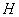 - высота насаждений с учетом перспективного роста, м.

4. Для ВЛЗ ширина просек в насаждениях должна приниматься не менее расстояния между крайними проводами плюс 1,25 м в каждую сторону независимо от высоты насаждений. При прохождении ВЛЗ по территории фруктовых садов с деревьями высотой более 4 м расстояние от крайних проводов до деревьев должно быть не менее 2 м.

5. Отдельные деревья или группы деревьев, растущие вне просеки и угрожающие падением на провода или опоры ВЛ, должны вырубаться.

2.5.208. В понижениях рельефа, на косогорах и в оврагах просека прорубается с учетом перспективной высоты насаждений, при этом, если расстояние по вертикали от верха крон деревьев до провода ВЛ более 9 м, просека прорубается только под ВЛ по ширине, равной расстоянию между крайними проводами плюс по 2 м в каждую сторону.

После окончания монтажа места нарушения склонов на просеках должны быть засажены кустарниковыми породами.

2.5.209. По всей ширине просеки по трассе ВЛ должны быть произведены ее очистка от вырубленных деревьев и кустарников, корчевка пней или срезка их под уровень земли и рекультивация.

# Прохождение ВЛ по населенной местности

2.5.210. Прохождение ВЛ по населенной местности следует выполнять в соответствии с требованиями строительных норм и правил. Планировка зданий и застройка городских и сельских поселений" (ВЛ 110 кВ и выше следует размещать за пределами селитебной территории).

Угол пересечения с улицами (проездами) не нормируется. При прохождении ВЛ вдоль улицы допускается расположение проводов над проезжей частью.

Для предотвращения вынужденных наездов транспортных средств на опоры ВЛ, устанавливаемые в пределах городских и сельских улиц и дорог, их следует ограждать в соответствии с требованиями строительных норм и правил.

2.5.211. Крепление проводов ВЛ на штыревых изоляторах должно быть двойным. При применении подвесных и полимерных изоляторов крепление проводов на промежуточных опорах должно выполняться глухими зажимами.

Крепление проводов ВЛЗ на штыревых изоляторах должно выполняться усиленным с применением спиральных пружинных вязок с полимерным покрытием; при применении поддерживающих гирлянд изоляторов крепление проводов следует выполнять с помощью глухих поддерживающих зажимов.

2.5.212. Наименьшие расстояния от проводов ВЛ до поверхности земли в населенной местности в нормальном режиме работы ВЛ должны приниматься не менее приведенных в табл.2.5.22.

Наименьшие расстояния определяются при наибольшей стреле провеса провода без учета его нагрева электрическим током:

при высшей температуре воздуха для ВЛ 220 кВ и ниже;

при температуре воздуха по 2.5.17 при предельно допустимых значениях интенсивности электрической и магнитной составляющих электромагнитного поля для ВЛ 330 кВ и выше;

при расчетной линейной гололедной нагрузке по 2.5.57 и температуре воздуха при гололеде согласно 2.5.51.

2.5.213. В местах пересечения ВЛ с улицами, проездами и т.п. расстояния по вертикали от проводов площадью сечения алюминиевой части менее 185 мм до поверхности земли должны быть проверены также на обрыв провода в смежном пролете при среднегодовой температуре воздуха, без учета нагрева проводов электрическим током. Эти расстояния должны быть не менее приведенных в табл.2.5.22.

Таблица 2.5.22

Наименьшее расстояние по вертикали от проводов ВЛ до поверхности земли, производственных зданий и сооружений в населенной местности

|  |  |  |  |  |  |  |  |  |
| --- | --- | --- | --- | --- | --- | --- | --- | --- |
|Условия работы ВЛ | Наименьшее расстояние, м, при напряжении ВЛ, кВ | | | | | | | |
|  | ВЛЗ | до 35 | 110 | 150 | 220 | 330 | 500 | 750 |
| Нормальный режим: |  |  |  |  |  |  |  |  |
| до поверхности земли | 6 | 7 | 7 | 7,5 | 8 | 11 | 15,5 | 23 |
| до производственных зданий и сооружений | 3 | 3 | 4 | 4 | 5 | 7,5 | 8 | 12 |
| Обрыв провода в смежном пролете до поверхности земли | 5,0 | 5,5 | 5,5 | 5,5 | 5,5 | 6 | - | - |

При прохождении ВЛ в пределах специально отведенных в городской черте коридоров, а также для ВЛ с проводами площадью сечения алюминиевой части 185 мм и более проверка вертикальных расстояний при обрыве проводов не требуется.

2.5.214. Расстояние по горизонтали от основания опоры ВЛ до кювета или бортового камня проезжей части улицы (проезда) должно быть не менее 2,0 м; расстояние до тротуаров и пешеходных дорожек не нормируется.

2.5.215. Прохождение ВЛ над зданиями и сооружениями, как правило, не допускается.

Допускается прохождение ВЛ над производственными зданиями и сооружениями промышленных предприятий I и II степени огнестойкости в соответствии со строительными нормами и правилами по пожарной безопасности зданий и сооружений с кровлей из негорючих материалов (для ВЛ 330-750 кВ только над производственными зданиями электрических станций и подстанций). При этом расстояние по вертикали от проводов ВЛ до вышеуказанных зданий и сооружений при наибольшей стреле провеса должно быть не менее приведенных в табл.2.5.22.

Металлические кровли, над которыми проходят ВЛ, должны быть заземлены. Сопротивление заземления должно быть не более указанного в табл.2.5.19.

Для ВЛ 330 кВ и выше должна быть обеспечена защита персонала, находящегося внутри производственных зданий электрических станций и подстанций, от влияния электрического поля, а заземление металлической кровли должно выполняться не менее чем в двух точках.

2.5.216. Расстояния по горизонтали от крайних проводов ВЛ до 220 кВ при наибольшем их отклонении до ближайших частей производственных, складских, административно-бытовых и общественных зданий и сооружений должны быть не менее: 2 м - для ВЛ до 20 кВ, 4 м - для ВЛ 35-110 кВ, 5 м - для ВЛ 150 кВ и 6 м - для ВЛ 220 кВ.

Расстояния по горизонтали от крайних проводов ВЛ 330 кВ и выше должны быть не менее:

до ближайших частей непроизводственных и производственных зданий и сооружений электрических станций и подстанций при наибольшем отклонении проводов: 8 м - для ВЛ 330 кВ, 10 м - для ВЛ 500-750 кВ;

до ближайших частей производственных, складских, административно-бытовых и общественных зданий и сооружений (кроме электрических станций и подстанций) при неотклоненном положении проводов: 20 м - для ВЛ 330 кВ, 30 м - для ВЛ 500 кВ, 40 м - для ВЛ 750 кВ.

Прохождение ВЛ по территориям стадионов, учебных и детских учреждений не допускается.

2.5.217. Расстояния от отклоненных проводов ВЛ, расположенных вдоль улиц, в парках и садах, до деревьев, а также до тросов подвески дорожных знаков должны быть не менее приведенных в табл.2.5.21.

Расстояния по горизонтали от крайних проводов вновь сооружаемых ВЛ при неотклоненном их положении до границ земельных участков жилых и общественных зданий, до детских игровых площадок, площадок отдыха и занятий физкультурой, хозяйственных площадок или до ближайших выступающих частей жилых и общественных зданий при отсутствии земельных участков со стороны прохождения ВЛ, а также до границ приусадебных земельных участков индивидуальных домов и коллективных садовых участков должно быть не менее расстояний для охранных зон ВЛ соответствующих напряжений.

Допускается принимать для ВЛ до 20 кВ расстояние по горизонтали от крайних проводов ВЛ при наибольшем их отклонении до границ приусадебных земельных участков индивидуальных домов и коллективных садовых участков не менее 2 м.

2.5.218. Если при расстояниях, указанных в 2.5.216 и 2.5.217, от ВЛ до зданий и сооружений, имеющих приемную радио- или телевизионную аппаратуру, радиопомехи превышают значения, нормируемые государственными стандартами, и соблюдение требований стандартов не может быть достигнуто специальными мероприятиями (выносными антеннами, изменением конструкции ВЛ и др.) или эти мероприятия нецелесообразны, расстояния от крайних проводов ВЛ при неотклоненном их положении до ближайших частей этих зданий и сооружений должны быть приняты не менее: 10 м - для ВЛ до 35 кВ, 50 м - для ВЛ 110-220 кВ и 100 м - для ВЛ 330 кВ и выше.

Расчет уровня радиопомех должен выполняться с учетом гл.1.3 и 2.5.81.

2.5.219. Расстояния от заземлителей опор ВЛ до проложенных в земле силовых кабелей должны приниматься в соответствии с гл.2.1 и 2.3.

# Пересечение и сближение ВЛ между собой

2.5.220. Угол пересечения ВЛ (ВЛЗ) выше 1 кВ между собой и с ВЛ (ВЛИ) до 1 кВ не нормируется.

2.5.221. Место пересечения должно выбираться возможно ближе к опоре верхней (пересекающей) ВЛ (ВЛЗ). Расстояния от проводов нижней (пересекаемой) ВЛ до опор верхней (пересекающей) ВЛ по горизонтали и от проводов верхней (пересекающей) ВЛ до опор нижней (пересекаемой) ВЛ в свету должны быть не менее приведенных в табл.2.5.23, а также не менее 1,5 м для ВЛЗ и 0,5 м для ВЛИ.

Таблица 2.5.23

Наименьшее расстояние между проводами и опорами пересекающихся ВЛ

|  |  |  |
| --- | --- | --- |
|Напряжение ВЛ, кВ | Наименьшее расстояние от проводов до ближайшей части опоры, м | |
|  | при наибольшем отклонении проводов | при неотклоненном положении проводов |
| До 330 | 3 | 6 |
| 500 | 4 | 10 |
| 750 | 6 | 15 |

Допускается выполнение пересечений ВЛ и ВЛЗ между собой и с ВЛ (ВЛИ) до 1 кВ на общей опоре.

2.5.222. Опоры ВЛ 500-750 кВ, ограничивающие пролет пересечения с ВЛ 500-750 кВ, должны быть анкерного типа.

Пересечения ВЛ 500-750 кВ с ВЛ 330 кВ и ниже, а также ВЛ 330 кВ и ниже между собой допускается осуществлять в пролетах, ограниченных как промежуточными, так и анкерными опорами.

Одностоечные деревянные опоры пересекающей ВЛ, ограничивающие пролет пересечения, как правило, должны быть с железобетонными приставками. Допускается применение одностоечных деревянных опор без приставок и, как исключение, повышенных деревянных опор с деревянными приставками.

2.5.223. При пересечении ВЛ 500-750 кВ с ВЛ 6-20 кВ и ВЛ (ВЛИ) до 1 кВ опоры пересекаемых ВЛ, ограничивающие пролет пересечения, должны быть анкерного типа, провода пересекаемых ВЛ в пролете пересечения должны быть:

сталеалюминиевыми площадью сечения не менее 70 мм по алюминию - для ВЛ 6-20 кВ;

сталеалюминиевыми площадью сечения по алюминию не менее 70 ммили из термоупроченного алюминиевого сплава площадью сечения не менее 70 мм - для ВЛЗ 6-20 кВ;

алюминиевыми площадью сечения не менее 50 мм - для ВЛ до 1кВ;

жгут СИП без несущего нулевого провода с площадью сечения фазной жилы не менее 25 мм или с несущим проводом из термообработанного алюминиевого сплава площадью сечения не менее 50 мм.

Провода в пролетах пересечений должны крепиться на опорах с помощью:

подвесных стеклянных изоляторов - для ВЛ (ВЛЗ) 6-20 кВ;

штыревых изоляторов с двойным креплением к ним - для ВЛ до 1 кВ;

натяжных анкерных зажимов - для ВЛИ.

2.5.224. На промежуточных опорах пересекающей ВЛ с поддерживающими гирляндами изоляторов провода должны быть подвешены в глухих зажимах, а на опорах со штыревыми изоляторами должно применяться двойное крепление провода.

На промежуточных опорах существующей ВЛ 750 кВ, ограничивающих пролет пересечения с вновь сооружаемыми под ней ВЛ до 330 кВ, а также на существующих ВЛ до 500 кВ при площади сечения алюминиевой части проводов 300 мм и более при сооружении под ними других ВЛ допускается оставлять зажимы с ограниченной прочностью заделки и выпадающие зажимы.

2.5.225. Провода ВЛ более высокого напряжения, как правило, должны быть расположены выше проводов пересекаемых ВЛ более низкого напряжения. Допускается, как исключение, прохождение ВЛ 35 кВ и выше с проводами площадью сечения алюминиевой части 120 мм и более над проводами ВЛ более высокого напряжения, но не выше 220 кВ.\* При этом прохождение ВЛ более низкого напряжения над проводами двухцепных ВЛ более высокого напряжения не допускается.

\_\_\_\_\_\_\_\_\_\_\_\_\_\_\_\_

\* В городах и поселках городского типа допускается прохождение ВЛИ или ВЛ с изолированными проводами напряжением до 1 кВ над проводами ВЛ напряжением до 20 кВ.

2.5.226. Пересечение ВЛ 35-500 кВ с двухцепными ВЛ тех же напряжений, служащими для электроснабжения потребителей, не имеющих резервного питания, или с двухцепными ВЛ, цепи которых являются взаиморезервирующими, должно, как правило, осуществляться в разных пролетах пересекающей ВЛ, разделенных анкерной опорой. Пересечение ВЛ 750 кВ с такими ВЛ допускается выполнять в одном пролете, ограниченном как анкерными, так и промежуточными опорами.

На участках стесненной трассы пересечение ВЛ с проводами площадью сечения алюминиевой части 120 мм и более с двухцепными ВЛ допускается осуществлять в одном пролете пересекающей ВЛ, ограниченном промежуточными опорами. При этом на опорах, ограничивающих пролет пересечения, должны быть применены двухцепные поддерживающие гирлянды изоляторов с раздельным креплением цепей к опоре.

2.5.227. Наименьшие расстояния между ближайшими проводами (или проводами и тросами) пересекающихся ВЛ должны приниматься не менее приведенных в табл.2.5.24 при температуре воздуха плюс 15 °С без ветра.

Таблица 2.5.24

Наименьшее расстояние между проводами или проводами и тросами пересекающихся ВЛ на металлических и железобетонных опорах, а также на деревянных опорах при наличии грозозащитных устройств

|  |  |  |  |  |  |  |
| --- | --- | --- | --- | --- | --- | --- |
|Длина пролета пересекающей ВЛ, м | Наименьшее расстояние, м, при расстоянии от места пересечения до ближайшей опоры ВЛ, м | | | | | |
|  | 30 | 50 | 70 | 100 | 120 | 150 |
| При пересечении ВЛ 750 кВ между собой и с ВЛ более низкого напряжения | | | | | | |
| До 200 | 6,5 | 6,5 | 6,5 | 7,0 | - | - |
| 300 | 6,5 | 6,5 | 7,0 | 7,5 | 8,0 | 8,5 |
| 450 | 6,5 | 7,0 | 7,5 | 8,0 | 8,5 | 9,0 |
| 500 | 7,0 | 7,5 | 8,0 | 8,5 | 9,0 | 9,5 |
| При пересечении ВЛ 500-330 кВ между собой и с ВЛ более низкого напряжения | | | | | | |
| До 200 | 5,0 | 5,0 | 5,0 | 5,5 | - | - |
| 300 | 5,0 | 5,0 | 5,5 | 6,0 | 6,5 | 7,0 |
| 450 | 5,0 | 5,5 | 6,0 | 7,0 | 7,5 | 8,0 |
| При пересечении ВЛ 220-150 кВ между собой и с ВЛ более низкого напряжения | | | | | | |
| До 200 | 4 | 4 | 4 | 4 | - | - |
| 300 | 4 | 4 | 4 | 4,5 | 5 | 5,5 |
| 450 | 4 | 4 | 5 | 6 | 6,5 | 7 |
| При пересечении ВЛ 110-20 кВ между собой и с ВЛ более низкого напряжения | | | | | | |
| До 200 | 3 | 3 | 3 | 4 | - | - |
| 300 | 3 | 3 | 4 | 4,5 | 5 | - |
| При пересечении ВЛ 10 кВ между собой и с ВЛ более низкого напряжения | | | | | | |
| До 100 | 2 | 2 | - | - | - | - |
| 150 | 2 | 2,5 | 2,5 | - | - | - |

Для промежуточных длин пролетов соответствующие расстояния определяются линейной интерполяцией.

Расстояние между ближайшими проводами пересекающей и пересекаемой ВЛ 6-20 кВ при условии, что хотя бы одна из них выполнена с защищенными проводами, при температуре плюс 15 °С без ветра должно быть не менее 1,5 м.

Расстояние по вертикали между ближайшими проводами пересекающей ВЛЗ и пересекаемой ВЛИ при температуре воздуха плюс 15 °С без ветра должно быть не менее 1 м.

Допускается сохранение опор пересекаемых ВЛ до 110 кВ под проводами пересекающих ВЛ до 500 кВ, если расстояние по вертикали от проводов пересекающей ВЛ до верха опоры пересекаемой ВЛ на 4 м больше значений, приведенных в табл.2.5.24.

Допускается сохранение опор пересекаемых ВЛ до 150 кВ под проводами пересекающих ВЛ 750 кВ, если расстояние по вертикали от проводов ВЛ 750 кВ до верха опоры пересекаемой ВЛ не менее 12 м при высшей температуре воздуха.

2.5.228. Расстояния между ближайшими проводами (или между проводами и тросами) пересекающихся ВЛ 35 кВ и выше подлежат дополнительной проверке на условия отклонения проводов (тросов) одной из пересекающихся ВЛ в пролете пересечения при ветровом давлении согласно 2.5.56, направленном перпендикулярно оси пролета данной ВЛ, и неотклоненном положении провода (троса) другой. При этом расстояния между проводами и тросами или проводами должны быть не менее указанных в табл.2.5.17 или 2.5.18 для условий наибольшего рабочего напряжения, температура воздуха для неотклоненных проводов принимается по 2.5.51.

2.5.229. На ВЛ с деревянными опорами, не защищенных тросами, на опорах, ограничивающих пролеты пересечения, должны устанавливаться защитные аппараты на обеих пересекающихся ВЛ. Расстояния между проводами пересекающихся ВЛ должны быть не менее приведенных в табл.2.5.24.

На опорах ВЛ 35 кВ и ниже при пересечении их с ВЛ 750 кВ и ниже допускается применять ИП. При этом для ВЛ 35 кВ должно быть предусмотрено автоматическое повторное включение. Искровые промежутки на одностоечных и А-образных опорах с деревянными траверсами выполняются в виде одного заземляющего спуска и заканчиваются бандажами на расстоянии 75 см (по дереву) от точки крепления нижнего изолятора. На П- и АП-образных опорах заземляющие спуски прокладываются по двум стойкам опор до траверсы.

На ВЛ с деревянными опорами, не защищенных тросами, при пересечении их с ВЛ 750 кВ металлические детали для крепления проводов (крюки, штыри, оголовки) должны быть заземлены на опорах, ограничивающих пролет пересечения, а количество подвесных изоляторов в гирляндах должно соответствовать изоляции для металлических опор. При этом на опорах ВЛ 35-220 кВ должны быть установлены защитные аппараты.

Если расстояние от места пересечения до ближайших опор пересекающихся ВЛ составляет более 40 м, допускается защитные аппараты не устанавливать, а заземление деталей крепления проводов на опорах ВЛ 35 кВ и выше не требуется.

Установка защитных аппаратов на опорах пересечения не требуется:

для ВЛ с металлическими и железобетонными опорами;

для ВЛ с деревянными опорами при расстояниях между проводами пересекающихся ВЛ, не менее: 9 м - при напряжении 750 кВ; 7 м - при напряжении 330-500 кВ; 6 м - при напряжении 150-220 кВ; 5 м - при напряжении 35-110 кВ; 4 м - при напряжении до 20 кВ.

Сопротивления заземляющих устройств деревянных опор с защитными аппаратами должны приниматься в соответствии с табл.2.5.19.

2.5.230. При параллельном следовании и сближении ВЛ одного напряжения между собой или с ВЛ других напряжений расстояния по горизонтали должны быть не менее приведенных в табл.2.5.25 и приниматься по ВЛ более высокого напряжения. Указанные расстояния подлежат дополнительной проверке:

1) на непревышение смещения нейтрали более 15% фазного напряжения в нормальном режиме работы ВЛ до 35 кВ с изолированной нейтралью за счет электромагнитного и электростатического влияния ВЛ более высокого напряжения;

2) на исключение возможности развития в отключенном положении ВЛ 500-750 кВ, оборудованных компенсирующими устройствами (шунтирующими реакторами, синхронными или тиристорными статическими компенсаторами и др.), резонансных перенапряжений. Степень компенсации рабочей емкости линии, расстояния между осями ВЛ и длины участков сближений должны определяться расчетами.

Таблица 2.5.25

Наименьшее расстояние по горизонтали между ВЛ

|  |  |  |  |  |  |  |  |  |  |
| --- | --- | --- | --- | --- | --- | --- | --- | --- | --- |
|Участки ВЛ и расстояния | Наименьшее расстояние, м, при напряжении ВЛ, кВ | | | | | | | | |
|  | До 20 | 35 | 110 | 150 | 220 | 330 | 500 | 750 | ВЛЗ |
| Участки нестесненной трассы, между осями ВЛ | Высота наиболее высокой опоры\* | | | | | | | | 3 |
| Участки стесненной трассы, подходы к подстанциям: |  |  |  |  |  |  |  |  |  |
| между крайними проводами в неотклоненном положении; | 2,5 | 4 | 5 | 6 | 7 | 10 | 15 | 20\*\* | 2 |
| от отклоненных проводов одной ВЛ до ближайших частей опор другой ВЛ | 2 | 4 | 4 | 5 | 6 | 8 | 10 | 10 | 2 |

\_\_\_\_\_\_\_\_\_\_\_\_\_\_\_\_

\* Не менее 50 м для ВЛ 500 кВ и не менее 75 м для ВЛ 750 кВ.

\*\* Для двух и более ВЛ 750 кВ фазировка смежных крайних фаз должна быть разноименной.

# Пересечение и сближение ВЛ с сооружениями связи, сигнализации и проводного вещания

2.5.231. Пересечение ВЛ напряжением до 35 кВ с ЛС и ЛПВ должно быть выполнено по одному из следующих вариантов:

1) проводами ВЛ и подземным кабелем ЛС\* и ЛПВ;

\_\_\_\_\_\_\_\_\_\_\_\_\_\_\_\_

\* В данной главе к кабелям связи относятся металлические и оптические кабели с металлическими элементами.

2) проводами ВЛ и воздушным кабелем ЛС и ЛПВ;

3) подземной кабельной вставкой в ВЛ и неизолированными проводами ЛС и ЛПВ;

4) проводами ВЛ и неизолированными проводами ЛС и ЛПВ.

2.5.232. Пересечение ВЛ напряжением до 35 кВ с неизолированными проводами ЛС и ЛПВ может применяться в следующих случаях:

1) если невозможно проложить ни подземный кабель ЛС и ЛПВ, ни кабель ВЛ;

2) если применение кабельной вставки в ЛС приведет к необходимости установки дополнительного или переноса ранее установленного усилительного пункта ЛС;

3) если при применении кабельной вставки в ЛПВ общая длина кабельных вставок в линию превышает допустимые значения;

4) если на ВЛ применены подвесные изоляторы. При этом ВЛ на участке пересечения с неизолированными проводами ЛС и ПВ выполняются с повышенной механической прочностью проводов и опор (см. 2.5.240).

2.5.233. Пересечение ВЛ 110-500 кВ с ЛС и ЛПВ должно быть выполнено по одному из следующих вариантов:

1) проводами ВЛ и подземным кабелем ЛС и ЛПВ;

2) проводами ВЛ и неизолированными проводами ЛС и ЛПВ.

2.5.234. Пересечение ВЛ 750 кВ с ЛС и ЛПВ выполняется подземным кабелем ЛС и ЛПВ. При невозможности прокладки подземного кабеля ЛС и ЛПВ в условиях стесненной, труднопроходимой горной местности допускается выполнять пересечение ЛС и ЛПВ с ВЛ 750 кВ неизолированными проводами, но расстояние в свету от вершин опор ЛС и ЛПВ до неотклоненных проводов ВЛ должно быть не менее 30 м.

2.5.235. При пересечении ВЛ 110-500 кВ с воздушными проводами ЛС и ЛПВ применять кабельные вставки не следует, если:

1) применение кабельной вставки в ЛС приведет к необходимости установки дополнительного усилительного пункта на ЛС, а отказ от применения этой кабельной вставки не приведет к увеличению мешающего влияния ВЛ на ЛС сверх допустимых норм;

2) применение кабельной вставки в ЛПВ приведет к превышению суммарной допустимой длины кабельных вставок в линии, а отказ от этой кабельной вставки не приведет к увеличению мешающего влияния ВЛ на ЛПВ сверх допустимого значения.

2.5.236. В пролете пересечения ЛС и ЛПВ с ВЛ до 750 кВ, на которых предусматриваются каналы высокочастотной связи и телемеханики с аппаратурой, работающей в совпадающем с аппаратурой ЛС и ЛПВ спектре частот и имеющей мощность на один канал:

1) более 10 Вт - ЛС и ЛПВ должны быть выполнены подземными кабельными вставками. Длина кабельной вставки определяется по расчету мешающего влияния, при этом расстояние по горизонтали от основания кабельной опоры ЛС и ЛПВ до проекции крайнего провода ВЛ на горизонтальную плоскость должно быть не менее 100 м;

2) от 5 до 10 Вт - необходимость применения кабельной вставки в ЛС и ЛПВ или принятия других средств защиты определяется по расчету мешающего влияния. При этом, в случае применения кабельной вставки, расстояние в свету от неотклоненных проводов ВЛ до 500 кВ до вершин кабельных опор ЛС и ЛПВ должно быть не менее 20 м, а от неотклоненных проводов ВЛ 750 кВ до вершин кабельных опор ЛС и ЛПВ - не менее 30 м;

3) менее 5 Вт или если высокочастотная аппаратура ВЛ работает в несовпадающем спектре частот, или ЛС и ЛПВ не уплотнена ВЧ аппаратурой - применение кабельной вставки при пересечении с ВЛ до 750 кВ по условиям мешающего влияния не требуется. Если кабельная вставка в ЛС и ЛПВ оборудуется не по условиям мешающего влияния от высокочастотных каналов ВЛ, то расстояние по горизонтали от основания кабельной опоры ЛС и ЛПВ до проекции на горизонтальную плоскость крайнего неотклоненного провода ВЛ до 330 кВ должно быть не менее 15 м. Для ВЛ 500 кВ расстояние в свету от крайних неотклоненных проводов ВЛ до вершины кабельных опор ЛС и ЛПВ должно быть не менее 20 м, а для ВЛ 750 кВ - не менее 30 м.

2.5.237. Пересечения проводов ВЛ с воздушными линиями городской телефонной связи не допускаются; эти линии в пролете пересечения с проводами ВЛ должны выполняться только подземными кабелями.

2.5.238. При пересечении ВЛ с подземным кабелем связи и ПВ (или с подземной кабельной вставкой) должны соблюдаться следующие требования:

1) угол пересечения ВЛ до 500 кВ с ЛС и ЛПВ не нормируется, угол пересечения ВЛ 750 кВ с ЛС и ЛПВ должен быть по возможности близок к 90°, но не менее 45°;

2) расстояние от подземных кабелей ЛС и ЛПВ до ближайшего заземлителя опоры ВЛ напряжением до 35 кВ или ее подземной металлической или железобетонной части должно быть не менее:

в населенной местности - 3 м;

в ненаселенной местности - расстояний, приведенных в табл.2.5.26.

Таблица 2.5.26

Наименьшие расстояния от подземных кабелей ЛС (ЛПВ) до ближайшего заземлителя опоры ВЛ и ее подземной части

|  |  |  |  |
| --- | --- | --- | --- |
|Эквивалентное удельное сопротивление земли, Ом·м | Наименьшее расстояние, м, при напряжении ВЛ, кВ | | |
|  | До 35 | 110-500 | 750 |
| До 100 | 10 | 10 | 15 |
| Более 100 до 500 | 15 | 25 | 25 |
| Более 500 до 1000 | 20 | 35 | 40 |
| Более 1000 | 30 | 50 | 50 |

Расстояние от подземных кабелей ЛС и ЛПВ до подземной части незаземленной деревянной опоры ВЛ напряжением до 35 кВ должно быть не менее:

в населенной местности - 2 м, в стесненных условиях указанное расстояние может быть уменьшено до 1 м при условии прокладки кабеля в полиэтиленовой трубе на длине в обе стороны от опоры не менее 3 м;

в ненаселенной местности: 5 м - при эквивалентном удельном сопротивлении земли до 100 Ом·м; 10 м - при эквивалентном удельном сопротивлении земли от 100 до 500 Ом·м; 15 м - при эквивалентном удельном сопротивлении земли от 500 до 1000 Ом·м; 25 м - при эквивалентном удельном сопротивлении земли более 1000 Ом·м;

3) расстояние от подземных кабелей ЛС и ЛПВ до ближайшего заземлителя опоры ВЛ 110 кВ и выше и ее подземной части должно быть не менее значений, приведенных в табл.2.5.26;

4) при прокладке подземного кабеля (кабельной вставки) в стальных трубах, или при покрытии его швеллером, уголком, или при прокладке его в полиэтиленовой трубе, закрытой с обеих сторон от попадания земли, на длине, равной расстоянию между проводами ВЛ плюс 10 м с каждой стороны от крайних проводов для ВЛ до 500 кВ и 15 м для ВЛ 750 кВ, допускается уменьшение указанных в табл.2.5.26 расстояний до 5 м для ВЛ до 500 кВ и до 10 м для 750 кВ.

Металлические покровы кабеля в этом случае следует соединять с трубой или другими металлическими защитными элементами. Это требование не относится к оптическим кабелям и кабелям с внешним изолирующим шлангом, в том числе с металлической оболочкой. Металлические покровы кабельной вставки должны быть заземлены по концам. При уменьшении расстояний между кабелем и опорами ВЛ, указанных в табл.2.5.26, помимо приведенных мер защиты необходимо устройство дополнительной защиты от ударов молнии путем оконтуровки опор тросами в соответствии с требованиями нормативной документации по защите кабелей от ударов молнии;

5) вместо применения швеллера, уголка или стальной трубы допускается при строительстве новой ВЛ использовать два стальных троса сечением 70 мм, прокладываемых симметрично на расстоянии не более 0,5 м от кабеля и на глубине 0,4 м. Тросы должны быть продлены с обеих сторон под углом 45° к трассе в сторону опоры ВЛ и заземлены на сопротивление не более 30 Ом. Соотношения между длиной отвода тросов  и сопротивлением  заземлителя должны соответствовать значениям  и , приведенным в табл.2.5.27;

Таблица 2.5.27

Сопротивления заземлителей при защите кабеля ЛС и ЛПВ на участке пересечения с ВЛ

|  |  |  |  |
| --- | --- | --- | --- |
|Удельное сопротивление земли, Ом·м | До 100 | 101-500 | Более 500 |
| Длина отвода, img_88c26142_2.png, м | 20 | 30 | 50 |
| Сопротивление заземлителя, Ом | 30 | 30 | 20 |

Примечание. Защита кабеля от ударов молнии путем оконтуровки опор ВЛ или прокладки защитного троса в этом случае также обязательна.

6) в пролете пересечения ВЛ с ЛС и ЛПВ крепление проводов ВЛ на опорах, ограничивающих пролет пересечения, должно осуществляться с помощью глухих зажимов, не допускающих падения проводов на землю в случае их обрыва в соседних пролетах.

2.5.239. При пересечении подземной кабельной вставки в ВЛ до 35 кВ с неизолированными проводами ЛС и ЛПВ должны соблюдаться следующие требования:

1) угол пересечения подземной кабельной вставки ВЛ с ЛС и ЛПВ не нормируется;

2) расстояние от подземной кабельной вставки до незаземленной опоры ЛС и ЛПВ должно быть не менее 2 м, а до заземленной опоры ЛС (ЛПВ) и ее заземлителя - не менее 10 м;

3) расстояние по горизонтали от основания кабельной опоры ВЛ, неуплотненной и уплотненной в несовпадающем и совпадающем спектрах частот в зависимости от мощности высокочастотной аппаратуры, до проекции проводов ЛС и ЛПВ должно выбираться в соответствии с требованиями, изложенными в 2.5.236;

4) подземные кабельные вставки в ВЛ должны выполняться в соответствии с требованиями, приведенными в гл.2.3 и 2.5.124.

2.5.240. При пересечении проводов ВЛ с неизолированными проводами ЛС и ЛПВ необходимо соблюдать следующие требования:

1) угол пересечения проводов ВЛ с проводами ЛС и ЛПВ должен быть по возможности близок к 90°. Для стесненных условий угол не нормируется;

2) место пересечения следует выбирать по возможности ближе к опоре ВЛ. При этом расстояние по горизонтали от ближайшей части опоры ВЛ до проводов ЛС и ЛПВ должно быть не менее 7 м, а от опор ЛС и ЛПВ до проекции на горизонтальную плоскость ближайшего неотклоненного провода ВЛ должно быть не менее 15 м. Расстояние в свету от вершин опор ЛС и ПВ до неотклоненных проводов ВЛ должно быть не менее: 15 м - для ВЛ до 330 кВ, 20 м - для ВЛ 500 кВ;

3) не допускается расположение опор ЛС и ЛПВ под проводами пересекающей ВЛ;

4) опоры ВЛ, ограничивающие пролет пересечения с ЛС и ЛПВ, должны быть анкерного типа облегченной конструкции из любого материала как свободностоящие, так и на оттяжках. Деревянные опоры должны быть усилены дополнительными приставками или подкосами;

5) пересечения можно выполнять на промежуточных опорах при условии применения на ВЛ проводов с площадью сечения алюминиевой части не менее 120 мм;

6) провода ВЛ должны быть расположены над проводами ЛС и ЛПВ и должны быть многопроволочными сечениями не менее приведенных в табл.2.5.5;

7) провода ЛС и ЛПВ в пролете пересечения не должны иметь соединений;

8) в пролете пересечения ВЛ с ЛС и ЛПВ на промежуточных опорах ВЛ крепление проводов на опорах должно осуществляться только с помощью поддерживающих гирлянд изоляторов с глухими зажимами;

9) изменение места установки опор ЛС и ЛПВ, ограничивающих пролет пересечения с ВЛ, допускается при условии, что отклонение средней длины элемента скрещивания на ЛС и ЛПВ не будет превышать значений, указанных в табл.2.5.28;

Таблица 2.5.28

Допустимое изменение места установки опор ЛС и ЛПВ, ограничивающих пролет пересечения с ВЛ

|  |  |  |  |  |  |  |  |  |  |
| --- | --- | --- | --- | --- | --- | --- | --- | --- | --- |
|Длина элемента скрещивания, м | 35 | 40 | 50 | 60 | 70 | 80 | 100 | 125 | 170 |
| Допустимое отклонение, м | ±6 | ±6,5 | ±7 | ±8 | ±8,5 | ±9 | ±10 | ±11 | ±13 |

10) длины пролетов ЛС и ЛПВ в месте пересечения с ВЛ не должны превышать значений, указанных в табл.2.5.29;

Таблица 2.5.29

Максимально допустимые длины пролетов ЛС и ПВ в месте пересечения с ВЛ

|  |  |  |  |  |  |
| --- | --- | --- | --- | --- | --- |
|Марки проводов, применяемых на ЛС и ЛПВ | Диаметр провода, мм | Максимально допустимые длины пролета ЛС и ЛПВ, м, для линий типов | | | |
|  |  | О | Н | У | ОУ |
| Сталеалюминиевые: |  |  |  |  |  |
| АС 25/4,2 | 6,9 | 150 | 85 | 65 | 50 |
| АС 16/2,7 | 5,6 | 85 | 65 | 40 | 35 |
| АС 10/1,8 | 4,5 | 85 | 50 | 40 | 35 |
| Биметаллические (сталемедные) БСМ-1, БСМ-2 | 4,0 | 180 | 125 | 100 | 85 |
|  | 3,0 | 180 | 100 | 85 | 65 |
|  | 2,0 | 150 | 85 | 65 | 40 |
|  | 1,6 | 100 | 65 | 40 | 40 |
|  | 1,2 | 85 | 35 | - | - |
| Биметаллические(сталеалюминиевые) БСА-КПЛ | 5,1 | 180 | 125 | 90 | 85 |
|  | 4,3 | 180 | 100 | 85 | 65 |
| Стальные | 5,0 | 150 | 130 | 70 | 45 |
|  | 4,0 | 150 | 85 | 50 | 40 |
|  | 3,0 | 125 | 65 | 40 | - |
|  | 2,5 | 100 | 40 | 30 | - |
|  | 2,0 | 100 | 40 | 30 | - |
|  | 1,5 | 100 | 40 | - | - |

Примечание. О - обычный, Н - нормальный, У - усиленный, ОУ - особо усиленный, типы линий - в соответствии с "Правилами пересечения воздушных линий связи и радиотрансляционных сетей с линиями электропередачи".

11) опоры ЛС и ЛПВ, ограничивающие пролет пересечения или смежные с ним и находящиеся на обочине автомобильной дороги, должны быть защищены от наездов транспортных средств;

12) провода на опорах ЛС и ЛПВ, ограничивающие пролет пересечения с ВЛ, должны иметь двойное крепление: при траверсном профиле - только на верхней траверсе, при крюковом профиле - на двух верхних цепях;

13) расстояния по вертикали от проводов ВЛ до пересекаемых проводов ЛС и ЛПВ в нормальном режиме ВЛ и при обрыве проводов в смежных пролетах ВЛ должны быть не менее приведенных в табл.2.5.30.

Таблица 2.5.30

Наименьшее расстояние по вертикали от проводов ВЛ до проводов ЛС и ЛПВ

|  |  |  |  |  |  |  |
| --- | --- | --- | --- | --- | --- | --- |
|Расчетный режим ВЛ | Наименьшее расстояние, м, при напряжении ВЛ, кВ | | | | | |
|  | до 10 | 20-110 | 150 | 220 | 330 | 500 |
| Нормальный режим: |  |  |  |  |  |  |
| а) ВЛ на деревянных опорах при наличии грозозащитных устройств, а также на металлических и железобетонных опорах | 2 | 3 | 4 | 4 | 5 | 5 |
| б) ВЛ на деревянных опорах при отсутствии грозозащитных устройств | 4 | 5 | 6 | 6 | - | - |
| Обрыв проводов в смежных пролетах | 1 | 1 | 1,5 | 2 | 2,5 | 3,5 |

Расстояния по вертикали определяются в нормальном режиме при наибольшей стреле провеса проводов (без учета их нагрева электрическим током). В аварийном режиме расстояния проверяются для ВЛ с проводами площадью сечения алюминиевой части менее 185 ммпри среднегодовой температуре, без гололеда и ветра. Для ВЛ с проводами площадью сечения алюминиевой части 185 мм и более проверка по аварийному режиму не требуется.

При разности высот точек крепления проводов ЛС и ЛПВ на опорах, ограничивающих пролет пересечения (например, на косогорах) с ВЛ 35 кВ и выше, вертикальные расстояния, определяемые по табл.2.5.30, подлежат дополнительной проверке на условия отклонения проводов ВЛ при ветровом давлении, определенном согласно 2.5.56, направленном перпендикулярно оси ВЛ, и при неотклоненном положении проводов ЛС и ЛПВ.

Расстояния между проводами следует принимать для наиболее неблагоприятного случая.

При применении на ВЛ плавки гололеда следует проверять габариты до проводов ЛС и ЛПВ в режиме плавки гололеда. Эти габариты проверяются при температуре провода в режиме плавки гололеда и должны быть не меньше, чем при обрыве провода ВЛ в смежном пролете;

14) на деревянных опорах ВЛ без грозозащитного троса, ограничивающих пролет пересечения с ЛС и ЛПВ, при расстояниях между проводами пересекающихся линий менее указанных в п.б) табл.2.5.30 на ВЛ должны устанавливаться защитные аппараты. Защитные аппараты должны устанавливаться в соответствии с требованиями 2.5.229. При установке ИП на ВЛ должно быть предусмотрено автоматическое повторное включение;

15) на деревянных опорах ЛС и ЛПВ, ограничивающих пролет пересечения, должны устанавливаться молниеотводы в соответствии с требованиями, предъявляемыми в нормативной документации на ЛС и ЛПВ.

2.5.241. Совместная подвеска проводов ВЛ и проводов ЛС и ЛПВ на общих опорах не допускается. Это требование не распространяется на специальные оптические кабели, которые подвешиваются на конструкциях ВЛ. Эти кабели должны соответствовать требованиям настоящей главы и правил проектирования, строительства и эксплуатации волоконно-оптических линий связи на воздушных линиях электропередачи.

2.5.242. При сближении ВЛ с ЛС и ЛПВ расстояния между их проводами и мероприятия по защите от влияния определяются в соответствии с правилами защиты устройств проводной связи, железнодорожной сигнализации и телемеханики от опасного и мешающего влияния линий электропередачи.

2.5.243. При сближении ВЛ с воздушными ЛС и ЛПВ наименьшие расстояния от крайних неотклоненных проводов ВЛ до опор ЛС и ЛПВ должны быть не менее высоты наиболее высокой опоры ВЛ, а на участках стесненной трассы расстояние от крайних проводов ВЛ при наибольшем отклонении их ветром расстояния должны быть не менее значений, указанных в табл.2.5.31. При этом расстояние в свету от ближайшего неотклоненного провода ВЛ до вершин опор ЛС и ЛПВ должно быть не менее: 15 м - для ВЛ до 330 кВ, 20 м - для ВЛ 500 кВ, 30 м - для ВЛ 750 кВ.

Таблица 2.5.31

Наименьшие расстояния между проводами ВЛ при наибольшем отклонении их ветром и опорами ЛС и ЛПВ в условиях стесненной трассы

|  |  |  |  |  |  |  |
| --- | --- | --- | --- | --- | --- | --- |
|Напряжение ВЛ, кВ | До 20 | 35-110 | 150 | 220 | 330 | 500-750 |
| Наименьшее расстояние, м | 2 | 4 | 5 | 6 | 8 | 10 |

Шаг транспозиции ВЛ по условию влияния на ЛС и ЛПВ не нормируется.

Опоры ЛС и ЛПВ должны быть укреплены дополнительными подпорами или устанавливаться сдвоенными в случае, если при их падении возможно соприкосновение между проводами ЛС и ЛПВ и проводами ВЛ.

2.5.244. При сближении ВЛ со штыревыми изоляторами на участках, имеющих углы поворота, с воздушными ЛС и ЛПВ расстояния между ними должны быть такими, чтобы провод, сорвавшийся с угловой опоры ВЛ, не мог оказаться от ближайшего провода ЛС и ЛПВ на расстояниях менее приведенных в табл.2.5.31. При невозможности выполнить это требование провода ВЛ, отходящие с внутренней стороны поворота, должны иметь двойное крепление.

2.5.245. При сближении ВЛ с подземными кабелями ЛС и ЛПВ наименьшие расстояния между ними и меры защиты определяются в соответствии с правилами защиты устройств проводной связи, железнодорожной сигнализации и телемеханики от опасного и мешающего влияния линий электропередачи и рекомендациями по защите оптических кабелей с металлическими элементами от опасного влияния линий электропередачи, электрифицированных железных дорог переменного тока и энергоподстанций.

Наименьшие расстояния от заземлителя и подземной части опоры ВЛ до подземного кабеля ЛС и ЛПВ должны быть не менее приведенных в табл.2.5.26.

2.5.246. Расстояния от ВЛ до антенных сооружений передающих радиоцентров должны приниматься по табл.2.5.32.

Таблица 2.5.32

Наименьшие расстояния от ВЛ до антенных сооружений передающих радиоцентров

|  |  |  |
| --- | --- | --- |
|Антенные сооружения | Расстояния, м, при напряжении ВЛ, кВ | |
|  | До 110 | 150-750 |
| Средневолновые и длинноволновые передающие антенны | За пределами высокочастотного заземляющего устройства, но не менее 100 | |
| Коротковолновые передающие антенны: |  |  |
| в направлении наибольшего излучения | 200 | 300 |
| в остальных направлениях | 50 | 50 |
| Коротковолновые передающие слабонаправленные и ненаправленные антенны | 150 | 200 |

2.5.247. Наименьшие расстояния сближения ВЛ со створом радиорелейной линии и радиорелейными станциями вне зоны направленности антенны должны приниматься по табл.2.5.33. Возможность пересечения ВЛ со створом радиорелейной линии устанавливается при проектировании ВЛ.

2.5.248. Расстояния от ВЛ до границ приемных радиоцентров и выделенных приемных пунктов радиофикации и местных радиоузлов должны приниматься по табл.2.5.33.

Таблица 2.5.33

Наименьшие расстояния от ВЛ до границ приемных радиоцентров, радиорелейных KB и УКВ станций, выделенных приемных пунктов радиофикации и местных радиоузлов

|  |  |  |  |
| --- | --- | --- | --- |
|Радиоустройства | Расстояние, м, при напряжении ВЛ, кВ | | |
|  | До 35 | 110-220 | 330-750 |
| Магистральные, областные, районные, связные радиоцентры и радиорелейные станции в диаграмме направленности антенны | 500 | 1000 | 2000 |
| Радиолокационные станции, радиотехнические системы ближней навигации | 1000 | 1000 | 1000 |
| Автоматические ультракоротковолновые радиопеленгаторы | 800 | 800 | 800 |
| Коротковолновые радиопеленгаторы | 700 | 700 | 700 |
| Станции проводного вещания | 200 | 300 | 400 |
| Радиорелейные станции вне зоны направленности их антенн и створы радиорелейных линий | 100 | 200 | 250 |

В случае прохождения трассы проектируемой ВЛ в районе расположения особо важных приемных радиоустройств допустимое сближение устанавливается в индивидуальном порядке в процессе проектирования ВЛ.

Если соблюдение расстояний, указанных в табл.2.5.33, затруднительно, то в отдельных случаях допускается их уменьшение (при условии выполнения мероприятий на ВЛ, обеспечивающих соответствующее уменьшение помех). Для каждого случая в процессе проектирования ВЛ должен быть составлен проект мероприятий по соблюдению норм радиопомех.

Расстояния от ВЛ до телецентров и радиодомов должны быть не менее: 400 м - для ВЛ до 20 кВ, 700 м - для ВЛ 35-150 кВ, 1000 м - для ВЛ 220-750 кВ.

# Пересечение и сближение ВЛ с железными дорогами

2.5.249. Пересечение ВЛ с железными дорогами следует выполнять, как правило, воздушными переходами. На железных дорогах с особо интенсивным движением\* и в некоторых технически обоснованных случаях (например, при переходе через насыпи, на железнодорожных станциях или в местах, где устройство воздушных переходов технически затруднено) переходы ВЛ следует выполнять кабелем.

\_\_\_\_\_\_\_\_\_\_\_\_\_\_\_\_\_

\* К особо интенсивному движению поездов относится такое движение, при котором количество пассажирских и грузовых поездов в сумме по графику на двухпутных участках составляет более 100 пар в сутки и на однопутных - 48 пар в сутки.

Пересечение ВЛ с железными дорогами в горловинах железнодорожных станций и в местах сопряжения анкерных участков контактной сети запрещается.

Угол пересечения ВЛ с электрифицированными\* или подлежащими электрификации\*\* железными дорогами, а также угол пересечения ВЛ 750 кВ с железными дорогами общего пользования должен быть близким к 90°, но не менее 65°.

\_\_\_\_\_\_\_\_\_\_\_\_\_\_\_\_

\* К электрифицированным железным дорогам относятся все электрифицированные дороги независимо от рода тока и значения напряжения контактной сети.

\*\* К дорогам, подлежащим электрификации, относятся дороги, которые будут электрифицированы в течение 10 лет, считая от года строительства ВЛ, намечаемого проектом.

В случае непараллельного прохождения воздушной ЛС МПС относительно железной дороги угол пересечения воздушной ЛС с ВЛ должен определяться расчетом опасного и мешающего влияний.

2.5.250. При пересечении и сближении ВЛ с железными дорогами расстояния от основания опоры ВЛ до габарита приближения строений\* на неэлектрифицированных железных дорогах или до оси опор контактной сети электрифицированных или подлежащих электрификации дорог должны быть не менее высоты опоры плюс 3 м. На участках стесненной трассы допускается эти расстояния принимать не менее: 3 м - для ВЛ до 20 кВ, 6 м - для ВЛ 35-150 кВ, 8 м - для ВЛ 220-330 кВ, 10 м - для ВЛ 500 кВ и 20 м - для ВЛ 750 кВ.

\_\_\_\_\_\_\_\_\_\_\_\_\_\_\_\_

\* Габаритом приближения строений называется предназначенное для пропуска подвижного состава предельное поперечное перпендикулярное пути очертание, внутрь которого, помимо подвижного состава, не могут заходить никакие части строений, сооружений и устройств.

Защита пересечений ВЛ с контактной сетью защитными аппаратами осуществляется в соответствии с требованиями, приведенными в 2.5.229.

2.5.251. Расстояния при пересечении и сближении ВЛ с железными дорогами от проводов до различных элементов железной дороги должны быть не менее приведенных в табл.2.5.34.

Таблица 2.5.34

Наименьшие расстояния при пересечении и сближении ВЛ с железными дорогами

|  |  |  |  |  |  |  |  |  |  |  |  |  |  |  |
| --- | --- | --- | --- | --- | --- | --- | --- | --- | --- | --- | --- | --- | --- | --- |
|Пересечение или сближение | | Наименьшее расстояние, м, при напряжении ВЛ, кВ | | | | | | | | | | | | |
|  | | До 20 | | 35-100 | | 150 | | 220 | | 330 | | 500 | | 750 |
| При пересечении | | | | | | | | | | | | | | |
| Для неэлектрифицированных железных дорог |  | |  | |  | |  | |  | |  | |  | |
| - от провода до головки рельса в нормальном режиме ВЛ по вертикали: |  | |  | |  | |  | |  | |  | |  | |
| железных дорог широкой и узкой колеи общего пользования | 7,5 | | 7,5 | | 8 | | 8,5 | | 9 | | 9,5 | | 20 | |
| железных дорог широкой колеи необщего пользования | 7,5 | | 7,5 | | 8 | | 8,5 | | 9 | | 9,5 | | 12 | |
| железных дорог узкой колеи необщего пользования | 6,5 | | 6,5 | | 7 | | 7,5 | | 8 | | 8,5 | | 12 | |
| - от провода до головки рельса при обрыве провода ВЛ в смежном пролете по вертикали: |  | |  | |  | |  | |  | |  | |  | |
| железных дорог широкой колеи | 6 | | 6 | | 6,5 | | 6,5 | | 7 | | - | | - | |
| железных дорог узкой колеи | 4,5 | | 4,5 | | 5 | | 5 | | 5,5 | | - | | - | |
| Для электрифицированных или подлежащих электрификации железных дорог |  | |  | |  | |  | |  | |  | |  | |
| от проводов ВЛ до наивысшего провода или несущего троса: |  | |  | |  | |  | |  | |  | |  | |
| в нормальном режиме  по вертикали | Как при пересечении ВЛ между собой в соответствии с табл.2.5.24 (см. также 2.5.229) | | | | | | | | | | | | | |
| при обрыве провода в соседнем пролете | 1 | | 1 | | 2 | | 2 | | 2,5 | | 3,5 | | - | |
| При сближении или параллельном следовании | | | | | | | | | | | | | | |
| Для неэлектрифицированных железных дорог  на участках стесненной трассы от отклоненного провода ВЛ до габарита приближения строений по горизонтали | 1,5 | | 2,5 | | 2,5 | | 2,5 | | 3,5 | | 4,5 | | 5,5 | |
| Для электрифицированных или подлежащих электрификации железных дорог от крайнего провода ВЛ до крайнего провода, подвешенного с полевой стороны опоры контактной сети, по горизонтали | Как при сближении ВЛ между собой в соответствии с табл.2.5.25 | | | | | | | | | | | | | |
| То же, но при отсутствии проводов с полевой стороны опор контактной сети | Как при сближении ВЛ с сооружениями в соответствии с 2.5.216 | | | | | | | | | | | | | |

Наименьшие расстояния по вертикали от проводов ВЛ до различных элементов железных дорог, а также до наивысшего провода или несущего троса электрифицированных железных дорог определяются в нормальном режиме ВЛ при наибольшей стреле провеса провода (при высшей температуре воздуха с учетом дополнительного нагрева провода электрическим током или при расчетной линейной гололедной нагрузке по 2.5.55).

При отсутствии данных об электрических нагрузках ВЛ температура проводов принимается равной плюс 70 °С.

В аварийном режиме расстояния проверяются при пересечении ВЛ с проводами площадью сечения алюминиевой части менее 185 ммдля условий среднегодовой температуры без гололеда и ветра, без учета нагрева проводов электрическим током.

При площади сечения алюминиевой части проводов 185 мм и более проверка в аварийном режиме не требуется. Допускается расположение проводов пересекающей ВЛ над опорами контактной сети при расстоянии по вертикали от проводов ВЛ до верха опор контактной сети не менее: 7 м - для ВЛ напряжением до 110 кВ, 8 м - для ВЛ 150-220 кВ, 9 м - для ВЛ 330-500 кВ и 10 м - для ВЛ 750 кВ. В исключительных случаях на участках стесненной трассы допускается подвеска проводов ВЛ и контактной сети на общих опорах.

При пересечении и сближении ВЛ с железными дорогами, вдоль которых проходят линии связи и сигнализации, необходимо, кроме табл.2.5.34, руководствоваться также требованиями, предъявляемыми к пересечениям и сближениям ВЛ с сооружениями связи.

2.5.252. При пересечении ВЛ электрифицированных и подлежащих электрификации железных дорог общего пользования опоры ВЛ, ограничивающие пролет пересечения, должны быть анкерными нормальной конструкции. На участках с особо интенсивным и интенсивным движением\* поездов эти опоры должны быть металлическими.

\_\_\_\_\_\_\_\_\_\_\_\_\_\_\_\_

\* К интенсивному движению поездов относится такое движение, при котором количество пассажирских и грузовых поездов в сумме по графику на двухпутных участках составляет более 50 и до 100 пар в сутки, а на однопутных - более 24 и до 48 пар в сутки.

Допускается в пролете этого пересечения, ограниченного анкерными опорами, установка промежуточной опоры между путями, не предназначенными для прохождения регулярных пассажирских поездов, а также промежуточных опор по краям железнодорожного полотна путей любых дорог. Указанные опоры должны быть металлическими или железобетонными. Крепление проводов на этих опорах должно осуществляться поддерживающими двухцепными гирляндами изоляторов с глухими зажимами.

Применение опор из любого материала с оттяжками и деревянных одностоечных опор не допускается. Деревянные промежуточные опоры должны быть П-образными (с Х- или Z-образными связями) или А-образными.

При пересечении железных дорог необщего пользования допускается применение анкерных опор облегченной конструкции и промежуточных опор. Крепление проводов на промежуточных опорах должно осуществляться поддерживающими двухцепными гирляндами изоляторов с глухими зажимами. Опоры всех типов, устанавливаемых на пересечении железных дорог необщего пользования, могут быть свободностоящими или на оттяжках.

2.5.253. На ВЛ с подвесными изоляторами и нерасщепленным проводом в фазе натяжные гирлянды изоляторов для провода должны быть двухцепными с раздельным креплением каждой цепи к опоре. Крепление натяжных гирлянд изоляторов для расщепленного провода в фазе должно выполняться в соответствии с 2.5.112. Применение штыревых изоляторов в пролетах пересечений ВЛ с железными дорогами не допускается.

Использование в качестве заземлителей арматуры железобетонных опор и железобетонных приставок у опор, ограничивающих пролет пересечения, не допускается.

2.5.254. При пересечении ВЛ с железной дорогой, имеющей лесозащитные насаждения, следует руководствоваться требованиями 2.5.207.

2.5.255. Минимальные расстояния от ВЛ до мостов железных дорог с пролетом 20 м и менее следует принимать такими же, как до соответствующих железных дорог по табл.2.5.34, а с пролетом более 20 м устанавливаются при проектировании ВЛ.

# Пересечение и сближение ВЛ с автомобильными дорогами

2.5.256. Требования, приведенные в 2.5.256-2.5.263, распространяются на пересечения и сближения с автомобильными дорогами:

общего пользования и подъездными к промпредприятиям (категорий IA, IБ, II-V по строительным нормам и правилам на автомобильные дороги);

внутрихозяйственными в сельскохозяйственных предприятиях (категорий I-C - III-С по строительным нормам и правилам на внутрихозяйственные автомобильные дороги в колхозах, совхозах и других сельскохозяйственных предприятиях и организациях).

Пересечение и сближение ВЛ с федеральными дорогами общего пользования должны также соответствовать требованиям правил установления и использования придорожных полос федеральных автомобильных дорог общего пользования.

Угол пересечения с автомобильными дорогами не нормируется.

2.5.257. При пересечении автомобильных дорог категорий IA и IБ опоры ВЛ, ограничивающие пролет пересечения, должны быть анкерного типа нормальной конструкции.

На ВЛ с подвесными изоляторами и нерасщепленным проводом в фазе с площадью сечения алюминиевой части 120 мм и более натяжные гирлянды изоляторов для провода должны быть двухцепными с раздельным креплением каждой цепи к опоре.

Натяжные многоцепные гирлянды изоляторов для расщепленной фазы, состоящие из двух-пяти цепей, следует предусматривать с раздельным креплением каждой цепи к опоре.

Допускается в пролете пересечения дорог категорий IA и IБ, ограниченном анкерными опорами, установка промежуточных опор за пределами водопропускной канавы у подошвы дорожного полотна с учетом требований 2.5.262. Крепление проводов на этих опорах должно осуществляться поддерживающими двухцепными гирляндами изоляторов с глухими зажимами.

При пересечении автомобильных дорог категорий II-V, I-C - III-C опоры, ограничивающие пролет пересечения, могут быть анкерного типа облегченной конструкции или промежуточными.

На промежуточных опорах с поддерживающими гирляндами изоляторов провода должны быть подвешены в глухих зажимах, на опорах со штыревыми изоляторами должно применяться двойное крепление проводов на ВЛ и усиленное крепление на ВЛЗ.

При сооружении новых автомобильных дорог всех категорий и прохождении их под действующими ВЛ 500-750 кВ переустройство ВЛ не требуется, если выдерживаются наименьшие расстояния в соответствии с табл.2.5.35.

Таблица 2.5.35

Наименьшие расстояния при пересечении и сближении ВЛ с автомобильными дорогами

|  |  |  |  |  |  |  |  |
| --- | --- | --- | --- | --- | --- | --- | --- |
|Пересечение, сближение  или параллельное следование | Наименьшие расстояния, м, при напряжении ВЛ, кВ | | | | | | |
|  | До 20 | 35-110 | 150 | 220 | 330 | 500 | 750 |
| Расстояние по вертикали: |  |  |  |  |  |  |  |
| а) от провода до покрытия проезжей части дорог всех категорий | 7 | 7 | 7,5 | 8 | 8,5 | 9,5 | 16 |
| б) то же, при обрыве провода в смежном пролете | 5,5 | 5,5 | 5,5 | 5,5 | 6 | - | - |
| Расстояние по горизонтали:  1. При пересечении дорог всех категорий, за исключением III-C и V: |  | | | | | | |
| а) от основания или любой части опоры до бровки земляного полотна дороги | Высота опоры | | | | | | |
| б) в стесненных условиях от основания или любой части опоры до подошвы насыпи или до наружной бровки кювета дорог категорий IA, IБ и II | 5 | 5 | 5 | 5 | 10 | 10 | 15 |
| в) то же, до дороги категорий III, IV, I-C, II-C | 2,0 | 2,5 | 2,5 | 2,5 | 5 | 5 | 15 |
| 2. При пересечении дороги категорий III-C и V: |  | | | | | | |
| а) от основания или любой части опоры до бровки земляного полотна дороги | Высота опоры | | | | | | |
| б) в стесненных условиях от основания или любой части опоры до подошвы насыпи, наружной бровки, выемки или боковой водоотводящей канавы | 1,5 | 2,5 | 2,5 | 2,5 | 5 | 5 | 15 |
| 3. При параллельном следовании с дорогами всех категорий: |  | | | | | | |
| а) от основания или любой части опоры до бровки земляного полотна дороги | Высота опоры плюс 5 м | | | | | | |
| б) от крайнего неотклоненного провода до бровки земляного полотна | 10 | 15 | 15 | 15 | 20\* | 30\* | 40\* |
| в) то же, в стесненных условиях | 2 | 4 | 5 | 6 | 8 | 10 | 15 |

\_\_\_\_\_\_\_\_\_\_\_\_\_\_\_\_

\* С учетом предельно допустимых уровней напряженности электрического поля.

2.5.258. Расстояния при пересечении и сближении ВЛ с автомобильными дорогами должны быть не менее приведенных в табл.2.5.35.

Во всех случаях сближения с криволинейными участками автодорог, проходящих по насыпям, минимальные расстояния от проводов ВЛ до бровки земляного полотна должны быть не менее расстояний по вертикали, указанных в табл.2.5.35.

Наименьшие расстояния по вертикали в нормальном режиме работы ВЛ от проводов до проезжей части дорог должны приниматься:

без учета нагрева провода электрическим током при высшей температуре воздуха для ВЛ 500 кВ и ниже, при температуре воздуха по 2.5.17 при предельно допустимых значениях интенсивности электрической и магнитной составляющих электромагнитного поля для ВЛ 750 кВ;

при расчетной линейной гололедной нагрузке по 2.5.55 и температуре воздуха при гололеде согласно 2.5.51.

2.5.259. Расстояния по вертикали от проводов ВЛ с площадью сечения алюминиевой части менее 185 мм в местах пересечения с автомобильными дорогами должны быть проверены на обрыв провода в смежном пролете при среднегодовой температуре воздуха без учета нагрева проводов электрическим током. Эти расстояния должны быть не менее приведенных в табл.2.5.35.

2.5.260. В местах пересечения ВЛ с автомобильными дорогами с обеих сторон ВЛ на дорогах должны устанавливаться дорожные знаки в соответствии с требованиями государственного стандарта.

В местах пересечения ВЛ 330 кВ и выше с автомобильными дорогами с обеих сторон ВЛ на дорогах должны устанавливаться дорожные знаки, запрещающие остановку транспорта в охранных зонах этих линий.

Подвеска дорожных знаков на тросах-растяжках в пределах охранных зон ВЛ не допускается.

2.5.261. При сближении или пересечении зеленых насаждений, расположенных вдоль автомобильных дорог, следует руководствоваться 2.5.207.

2.5.262. Для предотвращения наездов транспортных средств на опоры ВЛ, расположенные на расстоянии менее 4 м от кромки проезжей части, должны применяться дорожные ограждения I группы\*.

\_\_\_\_\_\_\_\_\_\_\_\_\_\_\_

\* Определение дорожных ограждений I группы приведено в строительных нормах и правилах на автомобильные дороги.

2.5.263. Минимальные расстояния от ВЛ до мостов автомобильных дорог с пролетом 20 м и менее следует принимать такими же, как до соответствующих автомобильных дорог по табл.2.5.35, а с пролетом более 20 м - устанавливаются при проектировании ВЛ.

# Пересечение, сближение или параллельное следование ВЛ с троллейбусными и трамвайными линиями

2.5.264. Угол пересечения ВЛ с троллейбусными и трамвайными линиями следует принимать близким 90°, но не менее 60°.

2.5.265. При пересечении троллейбусных и трамвайных линий опоры ВЛ, ограничивающие пролет пересечения, должны быть анкерными нормальной конструкции.

Для ВЛ с проводами площадью сечения алюминиевой части 120 мм и более или со стальными канатами типа ТК сечением 50 мми более допускаются также промежуточные опоры с подвеской проводов в глухих зажимах или с двойным креплением на штыревых изоляторах.

В случае применения анкерных опор на ВЛ с подвесными изоляторами и нерасщепленным проводом в фазе с площадью сечения алюминиевой части 120 мм и более натяжные гирлянды изоляторов для провода должны быть двухцепными с раздельным креплением каждой цепи к опоре.

При сооружении новых троллейбусных и трамвайных линий и прохождении их под действующими ВЛ 500 кВ переустройство ВЛ не требуется, если выдерживаются наименьшие расстояния в соответствии с табл.2.5.36.

Таблица 2.5.36

Наименьшие расстояния от проводов ВЛ при пересечении, сближении или параллельном следовании с троллейбусными и трамвайными линиями

|  |  |  |  |  |  |  |
| --- | --- | --- | --- | --- | --- | --- |
|Пересечение, сближение или параллельное следование | Наименьшее расстояние, м,  при напряжении ВЛ, кВ | | | | | |
|  | До 20 | 35-110 | 150-220 | | 330 | 500 |
| Расстояние по вертикали от проводов ВЛ: |  |  |  | |  |  |
| а) при пересечении с троллейбусной линией в нормальном режиме ВЛ: |  |  |  | |  |  |
| до высшей отметки проезжей части | 11 | 11 | 12 | | 13 | 13 |
| до проводов контактной сети или несущих тросов | 3 | 3 | 4 | | 5 | 5 |
| б) при пересечении с трамвайной линией в нормальном режиме ВЛ: |  |  |  | |  |  |
| до головки рельса | 9,5 | 9,5 | | 10,5 | 11,5 | 11,5 |
| до проводов контактной сети или несущих тросов | 3 | 3 | | 4 | 5 | 5 |
| в) при обрыве провода ВЛ в смежном пролете до проводов или несущих тросов троллейбусной или трамвайной линии | 1 | 1 | | 2 | 2,5 | - |
| Расстояние по горизонтали при сближении или параллельном следовании: |  | | | | | |
| а) от крайних неотклоненных проводов ВЛ до опор троллейбусной и трамвайной контактных сетей | Не менее высоты опоры | | | | | |
| б) от крайних проводов ВЛ при наибольшем их отклонении до опор троллейбусной и трамвайной контактных сетей на участках стесненной трассы | 3 | 4 | | 6 | 8 | 10 |
| в) от крайних неотклоненных проводов ВЛ до остановочных пунктов трамваев и троллейбусов, разворотных колец с путями рабочими, отстоя, обгона и ремонта | 10 | 20 | | 25 | 30 | 30 |

Для ВЛЗ с проводами площадью сечения алюминиевой части 120 мм и более допускается применение промежуточных опор с усиленным креплением защищенных проводов.

2.5.266. Наименьшие расстояния от проводов ВЛ при пересечении, сближении или параллельном следовании с троллейбусными и трамвайными линиями в нормальном режиме работы ВЛ должны приниматься не менее приведенных в табл.2.5.36:

при высшей температуре воздуха без учета нагрева провода электрическим током;

при расчетной линейной гололедной нагрузке по 2.5.55 и температуре воздуха при гололеде согласно 2.5.51.

Расстояния по вертикали от проводов ВЛ площадью сечения алюминиевой части менее 185 мм в местах пересечения с проводами или несущими тросами троллейбусной или трамвайной линии должны быть проверены в аварийном режиме на обрыв провода ВЛ в смежном пролете при среднегодовой температуре воздуха без учета нагрева проводов электрическим током. При этом расстояния должны быть не менее приведенных в табл.2.5.36.

При сближении ВЛ 110 кВ и выше с троллейбусными и трамвайными линиями расстояния между их проводами и мероприятия по защите от влияния должны быть определены в соответствии со строительными нормами и правилами на трамвайные и троллейбусные линии.

2.5.267. Защита пересечений ВЛ с контактной сетью осуществляется защитными аппаратами в соответствии с требованиями, приведенными в 2.5.229.

Допускается размещение проводов пересекающей ВЛ над опорами контактной сети при расстояниях по вертикали от проводов ВЛ до верха опор контактной сети не менее: 7 м - для ВЛ напряжением до 110 кВ, 8 м - для ВЛ 150-220 кВ , 9м - для ВЛ 330-500 кВ.

# Пересечение ВЛ с водными пространствами

2.5.268. Угол пересечения ВЛ с водными пространствами (реками, каналами, озерами, водохранилищами и др.) не нормируется.

Следует избегать, по возможности, пересечения ВЛ мест длительной стоянки судов (затонов, портов и других отстойных пунктов).

Прохождение ВЛ над шлюзами не допускается.

2.5.269. При пересечении судоходных участков рек, каналов, озер и водохранилищ независимо от длины пролета пересечения, а также несудоходных участков водных пространств с пролетом пересечения более 700 м (большие переходы) опоры ВЛ, ограничивающие пролет пересечения, должны быть анкерными концевыми.

Для ВЛ со сталеалюминиевыми проводами и проводами из термообработанного алюминиевого сплава со стальным сердечником с площадью сечения алюминиевой части для обоих типов проводов 120 мми более или стальными канатами типа ТК площадью сечения 50 мми более допускается применение промежуточных опор и анкерных опор облегченного типа; при этом количество промежуточных опор между концевыми опорами должно соответствовать требованиям 2.5.153.

При применении в пролете пересечения промежуточных опор провода и тросы должны крепиться к ним глухими или специальными зажимами (например, многороликовыми подвесами).

На пересечениях ВЛ с судоходными водными пространствами, выполненных на промежуточных опорах с креплением проводов в глухих зажимах, расстояния по вертикали от проводов ВЛ площадью сечения алюминиевой части менее 185 мм до судов должны быть проверены на обрыв провода в соседнем пролете при среднегодовой температуре воздуха без ветра и гололеда без учета нагрева проводов электрическим током. При площади сечения алюминиевой части 185 мм и более проверка в аварийном режиме не требуется.

2.5.270. Расстояние от нижней точки провеса проводов ВЛ в нормальном и аварийном режимах до уровня высоких (паводковых) вод на судоходных участках рек, каналов, озер и водохранилищ определяется как сумма максимального габарита судов и наименьшего расстояния от проводов ВЛ до габарита судов по табл.2.5.37.

Таблица 2.5.37

Наименьшее расстояние при пересечении ВЛ с водными пространствами

|  |  |  |  |  |  |  |
| --- | --- | --- | --- | --- | --- | --- |
|Расстояние | Наименьшее расстояние, м, при напряжении ВЛ, кВ | | | | | |
|  | До 110 | 150 | 220 | 330 | 500 | 750 |
| Для судоходных участков рек, каналов, озер и водохранилищ  от проводов по вертикали: |  |  |  |  |  |  |
| до максимального габарита судов или сплава в нормальном режиме ВЛ | 2 | 2,5 | 3,0 | 3,5 | 4,0 | 5,5 |
| то же, но при обрыве провода в соседнем пролете | 0,5 | 1,0 | 1,0 | 1,5 | - | - |
| до верхних рабочих площадок обслуживания судов (крыша рубки и т.д.) в затонах, портах и других отстойных пунктах | - | - | - | 11,0 | 15,5 | 23,0 |
| до уровня льда | 6,0 | 6,5 | 7,0 | 7,5 | 8,0 | 12,0 |
| Для несудоходных участков рек, каналов, озер и водохранилищ от проводов по вертикали: |  |  |  |  |  |  |
| до уровня высоких вод\* | 5,5 | 6,0 | 6,5 | 7,0 | 7,5 | 10,0 |
| до уровня льда | 6,0 | 6,5 | 7,0 | 7,5 | 8,0 | 12,0 |

\_\_\_\_\_\_\_\_\_\_\_\_\_\_\_\_

\* Наименьшее расстояние обеспечивает пропуск плавающих средств высотой до 3,5 м.

Стрела провеса провода при этом определяется при высшей температуре воздуха без учета нагрева проводов электрическим током.

Уровень высоких (паводковых) вод принимается с вероятностью превышения (обеспеченностью) 0,01 (повторяемость 1 раз в 100 лет) для ВЛ 500-750 кВ и 0,02 (повторяемость 1 раз в 50 лет) - для ВЛ 330 кВ и ниже.

Расстояния от нижней точки провеса провода ВЛ до уровня льда должны быть не менее указанных в табл.2.5.37. Стрела провеса провода при этом определяется при расчетной линейной гололедной нагрузке по 2.5.55 и температуре воздуха при гололеде согласно 2.5.51.

При пересечении ВЛ 330 кВ и выше мест длительной стоянки судов (затонов, портов и других отстойных пунктов) должно быть обеспечено наименьшее расстояние до верхних рабочих площадок обслуживания судов согласно табл.2.5.37. Стрела провеса провода при этом определяется при температуре воздуха по 2.5.17 без учета нагрева провода электрическим током при предельно допустимых значениях интенсивности электрической и магнитной составляющих электромагнитного поля.

2.5.271. Расстояния от нижней точки провеса проводов ВЛ в нормальном режиме до уровня высоких (паводковых) вод на несудоходных участках рек, каналов, озер и водохранилищ должны быть не менее приведенных в табл.2.5.37. Стрела провеса провода при этом определяется при температуре воздуха 15 °С без учета нагрева проводов электрическим током.

Расстояния от нижней точки провеса проводов ВЛ до уровня льда должны быть не менее указанных в табл.2.5.37. Стрела провеса провода при этом определяется при расчетной линейной гололедной нагрузке по 2.5.55 и температуре воздуха при гололеде согласно 2.5.51.

2.5.272. Места пересечения ВЛ с судоходными и сплавными реками, озерами, водохранилищами и каналами должны быть обозначены на берегах сигнальными знаками в соответствии с правилами плавания по внутренним водным путям.

Знаки "Соблюдай надводный габарит" устанавливаются по одному на каждом берегу на расстоянии 100 м выше или ниже (по течению) оси воздушного перехода. При ширине реки до 100 м щиты знаков устанавливаются непосредственно на опоре ВЛ на высоте не менее 5 м.

Предупреждающие навигационные знаки устанавливают владельцы ВЛ. Размеры знака, цвет и режим горения огней должны соответствовать государственным стандартам.

# Прохождение ВЛ по мостам

2.5.273. Прокладка ВЛ 1 кВ и выше на всех мостах, как правило, не допускается.

При обоснованной необходимости допускается прохождение ВЛ по мостам, выполненным из негорючих материалов, при этом опоры или поддерживающие устройства, ограничивающие пролеты с берега на мост и через разводную часть моста, должны быть анкерными нормальной конструкции, все прочие поддерживающие устройства на мостах могут быть промежуточного типа, на этих устройствах с поддерживающими гирляндами изоляторов провода должны быть подвешены в глухих зажимах. Применение штыревых изоляторов не допускается, кроме ВЛЗ, где допускается их применение с креплением проводов спиральными пружинными вязками.

2.5.274. На металлических железнодорожных мостах с ездой по низу, снабженных на всем протяжении верхними связями, провода допускается располагать непосредственно над пролетным строением моста выше связей или за его пределами; располагать провода в пределах габарита приближения строений, а также в пределах ширины, занятой элементами контактной сети электрифицированных железных дорог, не допускается. Расстояния от проводов ВЛ до всех линий МПС, проложенных по конструкции моста, принимаются по 2.5.251, как для стесненных участков трассы.

На городских и шоссейных мостах провода допускается располагать как за пределами пролетного строения, так и в пределах ширины пешеходной и проезжей частей моста.

На охраняемых мостах допускается располагать провода ВЛ ниже отметки пешеходной части.

2.5.275. Наименьшие расстояния от проводов ВЛ до различных частей мостов должны приниматься в соответствии с требованиями организаций, в ведении которых находится данный мост. При этом определение наибольшей стрелы провеса проводов производится путем сопоставления стрел провеса при высшей температуре воздуха и при гололеде.

# Прохождение ВЛ по плотинам и дамбам

2.5.276. При прохождении ВЛ по плотинам, дамбам и т.п. любые расстояния от неотклоненных и отклоненных проводов до различных частей плотин или дамб в нормальном режиме ВЛ должны быть не менее приведенных в табл.2.5.38.

Таблица 2.5.38

Наименьшие расстояния от проводов ВЛ до различных частей плотин и дамб

|  |  |  |  |  |  |  |
| --- | --- | --- | --- | --- | --- | --- |
|Части плотин и дамб | Наименьшее расстояние, м, при напряжении ВЛ, кВ | | | | | |
|  | До 110 | 150 | 220 | 330 | 500 | 750 |
| Гребень и бровка откоса | 6 | 6,5 | 7 | 7,5 | 8 | 12 |
| Наклонная поверхность откоса | 5 | 5,5 | 6 | 6,5 | 7 | 9 |
| Поверхность переливающейся через плотину воды | 4 | 4,5 | 5 | 5,5 | 6 | 7 |

Расстояния по вертикали в нормальном режиме работы ВЛ должны приниматься не менее приведенных в табл.2.5.38:

при высшей температуре воздуха без учета нагрева провода электрическим током для ВЛ 500 кВ и ниже;

при температуре воздуха по 2.5.17 без учета нагрева проводов электрическим током при предельно допустимых значениях интенсивности электрической и магнитной составляющих электромагнитного поля для ВЛ 750 кВ;

при расчетной линейной гололедной нагрузке по 2.5.55 и температуре воздуха при гололеде согласно 2.5.51.

2.5.277. При прохождении ВЛ по плотинам и дамбам, по которым проложены пути сообщения, ВЛ должна удовлетворять также требованиям, предъявляемым к ВЛ при пересечении и сближении с соответствующими объектами путей сообщения.

При этом расстояния по горизонтали от любой части опоры до путей сообщения должны приниматься как для ВЛ на участках стесненной трассы. Расстояния до пешеходных дорожек и тротуаров не нормируются.

Располагать провода в пределах габарита приближения строений, а также в пределах ширины, занятой элементами контактной сети электрифицированных железных дорог, не допускается.

Допускается располагать провода в пределах полотна автомобильной дороги, пешеходных дорожек и тротуаров.

# Сближение ВЛ со взрыво- и пожароопасными установками

2.5.278. Сближение ВЛ со зданиями, сооружениями и наружными технологическими установками, связанными с добычей, транспортировкой, производством, изготовлением, использованием или хранением взрывоопасных, взрывопожароопасных и пожароопасных веществ, а также со взрыво- и пожароопасными зонами, должно выполняться в соответствии с нормами, утвержденными в установленном порядке.

Если нормы сближения не предусмотрены нормативными документами, то расстояния от оси трассы ВЛ до указанных зданий, сооружений, наружных установок и зон должны составлять не менее полуторакратной высоты опоры.

# Пересечение и сближение ВЛ с надземными и наземными трубопроводами, сооружениями транспорта нефти и газа и канатными дорогами

2.5.279. Угол пересечения ВЛ с надземными и наземными газопроводами, нефтепроводами, нефтепродуктопроводами, трубопроводами сжиженных углеводородных газов, аммиакопроводами\*, а также с пассажирскими канатными дорогами рекомендуется принимать близким к 90°.

\_\_\_\_\_\_\_\_\_\_\_\_\_\_\_\_

\* Газопроводы, нефтепроводы, нефтепродуктопроводы, трубопроводы сжиженных углеводородных газов, аммиакопроводы в дальнейшем именуются трубопроводы для транспорта горючих жидкостей и газов.

Угол пересечения ВЛ с надземными и наземными трубопроводами для транспорта негорючих жидкостей и газов, а также с промышленными канатными дорогами не нормируется.

2.5.280. Пересечение ВЛ 110 кВ и выше с надземными и наземными магистральными и промысловыми трубопроводами\* для транспорта горючих жидкостей и газов, как правило, не допускается.

\_\_\_\_\_\_\_\_\_\_\_\_\_\_\_\_

\* Магистральные и промысловые трубопроводы в дальнейшем именуются магистральные трубопроводы.

Допускается пересечение этих ВЛ с действующими однониточными наземными магистральными трубопроводами для транспорта горючих жидкостей и газов, а также с действующими техническими коридорами этих трубопроводов при прокладке трубопроводов в насыпи.

В районах с вечномерзлыми грунтами допускается пересечение ВЛ 110 кВ и выше с надземными и наземными магистральными нефтепроводами, а также с их техническими коридорами без прокладки нефтепроводов в насыпи. При этом нефтепроводы на расстоянии 1000 м в обе стороны от пересечения с ВЛ должны отвечать требованиям, предъявляемым к участкам трубопроводов категории I, а в пределах охранной зоны ВЛ 500 кВ и выше - категории В по строительным нормам и правилам магистральные трубопроводы.

В пролетах пересечения с ВЛ надземные и наземные трубопроводы для транспорта горючих жидкостей и газов, кроме проложенных в насыпи, следует защищать ограждениями, исключающими попадание проводов на трубопровод как при их обрыве, так и необорванных проводов при падении опор, ограничивающих пролет пересечения.

Ограждения должны быть рассчитаны на нагрузки от воздействия проводов при их обрыве или при падении опор ВЛ, ограничивающих пролет пересечения, и на термическую стойкость при протекании токов КЗ.

Ограждение должно выступать по обе стороны пересечения на расстояние, равное высоте опоры.

2.5.281. Опоры ВЛ, ограничивающие пролет пересечения с надземными и наземными трубопроводами, а также с канатными дорогами, должны быть анкерными нормальной конструкции. Для ВЛ со сталеалюминиевыми проводами площадью сечения по алюминию 120 мм и более или со стальными канатами площадью сечения 50 мм и более, кроме пересечений с пассажирскими канатными дорогами, допускаются анкерные опоры облегченной конструкции или промежуточные опоры. Поддерживающие зажимы на промежуточных опорах должны быть глухими.

При сооружении новых трубопроводов и канатных дорог под действующими ВЛ 500 кВ и выше переустройство ВЛ не требуется, если выдерживается наименьшее расстояние в соответствии с табл.2.5.39.

Таблица 2.5.39

Наименьшее расстояние от проводов ВЛ до наземных, надземных трубопроводов, канатных дорог

|  |  |  |  |  |  |  |  |  |
| --- | --- | --- | --- | --- | --- | --- | --- | --- |
|Пересечение, сближение и параллельное следование | Наименьшее расстояние, м, при напряжении ВЛ, кВ | | | | | | | |
|  | До 20 | 35 | 110 | 150 | 220 | 330 | 500 | 750 |
| Расстояние по вертикали (в свету) при пересечении: |  |  |  |  |  |  |  |  |
| от неотклоненных проводов ВЛ до любой части трубопроводов (насыпи), защитных устройств, трубопровода или канатной дороги в нормальном режиме | 3\* | 4 | 4 | 4,5 | 5 | 6 | 8 | 12 |
| то же, при обрыве провода в смежном пролете | 2\* | 2\* | 2\* | 2,5 | 3 | 4 | - | - |
| Расстояния по горизонтали: |  | | | | | | | |
| 1) при сближении и параллельном следовании от крайнего неотклоненного провода до любой части: |  | | | | | | | |
| магистрального нефтепровода и нефтепродуктопровода | 50 м, но не менее высоты опоры | | | | | | | |
| газопровода с избыточным давлением свыше 1,2 МПа (магистрального газопровода) | Не менее удвоенной высоты опоры, но не менее 50 м | | | | | | | |
| трубопровода сжиженных углеводородных газов | Не менее 1000 м | | | | | | | |
| аммиакопровода | 3-кратная высота опоры, но не менее 50 м | | | | | | | |
| немагистральных нефтепровода и нефтепродуктопровода, газопровода с избыточным давлением газа 1,2 МПа и менее, водопровода, канализации (напорной и самотечной), водостока, тепловой сети | Не менее высоты опоры\*\* | | | | | | | |
| помещений со взрывоопасными зонами и наружных взрывоопасных установок: |  |  |  |  |  |  |  |  |
| компрессорных (КС) и газораспределительных (ГРС) станций: |  |  |  |  |  |  |  |  |
| на газопроводах с давлением свыше 1,2 МПа | 80 | 80 | 100 | 120 | 140 | 160 | 180 | 200 |
| на газопроводах с давлением газа 1,2 МПа и менее | Не менее высоты опоры плюс 3 м | | | | | | | |
| нефтеперекачивающих станций (НПС) | 40 | 40 | 60 | 80 | 100 | 120 | 150 | 150 |
| 2) при пересечении от основания опоры ВЛ до любой части: |  | | | | | | | |
| трубопровода, защитных устройств трубопровода или канатной дороги | Не менее высоты опоры | | | | | | | |
| то же, на участках трассы в стесненных условиях | 3 | 4 | 4 | 4,5 | 5 | 6 | 6,5 | 15 |

\_\_\_\_\_\_\_\_\_\_\_\_\_\_\_

\* При прокладке трубопровода в насыпи расстояние до насыпи увеличивается на 1 м.

\*\*Если высота надземного сооружения превышает высоту опоры ВЛ, расстояние между этим сооружением и ВЛ следует принимать не менее высоты этого сооружения.

Примечание. Приведенные в таблице расстояния принимаются до границы насыпи или защитного устройства.

В пролетах пересечения ВЛ с трубопроводами для транспорта горючих жидкостей и газов провода и тросы не должны иметь соединений.

2.5.282. Провода ВЛ должны располагаться над надземными трубопроводами и канатными дорогами. В исключительных случаях допускается прохождение ВЛ до 220 кВ под канатными дорогами, которые должны иметь мостики или сетки для ограждения проводов ВЛ. Крепление мостиков и сеток на опорах ВЛ не допускается.

Расстояния по вертикали от ВЛ до мостиков, сеток и ограждений (2.5.280) должны быть такими же, как до надземных и наземных трубопроводов и канатных дорог (см. табл.2.5.39).

2.5.283. В пролетах пересечения с ВЛ металлические трубопроводы, кроме проложенных в насыпи, канатные дороги, а также ограждения, мостики и сетки должны быть заземлены. Сопротивление, обеспечиваемое применением искусственных заземлителей, должно быть не более 10 Ом.

2.5.284. Расстояния при пересечении, сближении и параллельном следовании с надземными и наземными трубопроводами и канатными дорогами должны быть не менее приведенных в табл.2.5.39\*.

\_\_\_\_\_\_\_\_\_\_\_\_\_\_\_

\* Взаимное расположение трубопроводов, их зданий, сооружений и наружных установок и ВЛ, входящих в состав трубопроводов, определяется ведомственными нормами.

Расстояния по вертикали в нормальном режиме работы ВЛ должны приниматься не менее значений, приведенных в табл.2.5.39:

при высшей температуре воздуха без учета нагрева проводов электрическим током расстояния должны приниматься как для ВЛ 500 кВ и ниже;

при температуре воздуха по 2.5.17 без учета нагрева провода электрическим током при предельно допустимых значениях интенсивности электрической и магнитной составляющих электромагнитного поля - для ВЛ 750 кВ;

при расчетной линейной гололедной нагрузке по 2.5.55 и температуре воздуха при гололеде - согласно 2.5.51.

В аварийном режиме расстояния проверяются для ВЛ с проводами площадью сечения алюминиевой части менее 185 мм при среднегодовой температуре, без гололеда и ветра; для ВЛ с проводами площадью сечения алюминиевой части 185 мм и более проверка при обрыве провода не требуется.

Трасса ВЛ напряжением 110 кВ и выше при параллельном следовании с техническими коридорами надземных и наземных магистральных нефтепроводов и нефтепродуктопроводов должна проходить, как правило, на местности с отметками рельефа выше отметок технических коридоров магистральных нефтепроводов и нефтепродуктопроводов. В районах Западной Сибири и Крайнего Севера\* при параллельном следовании ВЛ 110 кВ и выше с техническими коридорами надземных и наземных магистральных газопроводов, нефтепроводов, нефтепродуктопроводов и аммиакопроводов расстояние от оси ВЛ до крайнего трубопровода должно быть не менее 1000 м.

\_\_\_\_\_\_\_\_\_\_\_\_\_\_\_

\* Здесь и далее к районам Западной Сибири относятся нефтегазодобывающие районы Тюменской и Томской областей и Ямало-Ненецкого и Ханты-Мансийского округов и к районам Крайнего Севера - территория, включенная в это понятие Постановлением Совета Министров СССР от 10.10.67.

2.5.285. Расстояние от крайних неотклоненных проводов ВЛ до продувочных свечей, устанавливаемых на магистральных газопроводах, следует принимать не менее 300 м.

На участках стесненной трассы ВЛ это расстояние может быть уменьшено до 150 м, кроме многоцепных ВЛ, расположенных как на общих, так и на раздельных опорах.

2.5.286. На участках пересечения ВЛ с вновь сооружаемыми надземными и наземными магистральными трубопроводами последние на расстоянии по 50 м в обе стороны от проекции крайнего неотклоненного провода должны иметь для ВЛ до 20 кВ категорию, отвечающую требованиям строительных норм и правил, а для ВЛ 35 кВ и выше - на одну категорию выше.

# Пересечение и сближение ВЛ с подземными трубопроводами

2.5.287. Угол пересечения ВЛ 35 кВ и ниже с подземными магистральными и промысловыми газопроводами, нефтепроводами, нефтепродуктопроводами, трубопроводами сжиженных углеводородных газов и аммиакопроводами\* не нормируется.

\_\_\_\_\_\_\_\_\_\_\_\_\_\_\_\_

\* Газопроводы, нефтепроводы, нефтепродуктопроводы, трубопроводы снижения углеводородных газов, аммиакопроводы в дальнейшем именуются трубопроводами для транспорта горючих, жидкостей и газов; магистральные и промысловые трубопроводы в дальнейшем именуются магистральными трубопроводами.

Угол пересечения ВЛ 110 кB и выше с вновь сооружаемыми подземными магистральными трубопроводами для транспорта горючих жидкостей и газов, а также с действующими техническими коридорами этих трубопроводов должен быть не менее 60°.

Угол пересечения ВЛ с подземными газопроводами с избыточным давлением газа 1,2 МПа и менее, немагистральными нефтепроводами, нефтепродуктопроводами, трубопроводами сжиженных углеводородных газов и аммиакопроводами, а также с подземными трубопроводами для транспорта негорючих жидкостей и газов не нормируется.

2.5.288. Расстояния при пересечении, сближении и параллельном следовании ВЛ с подземными трубопроводами должны быть не менее приведенных в табл.2.5.40\*.

\_\_\_\_\_\_\_\_\_\_\_\_\_\_\_

\* Взаимное расположение трубопроводов, их зданий, сооружений и наружных установок и ВЛ, входящих в состав трубопроводов, определяется ведомственными нормами.

Таблица 2.5.40

Наименьшие расстояния от ВЛ до подземных сетей

|  |  |  |  |  |  |  |  |  |
| --- | --- | --- | --- | --- | --- | --- | --- | --- |
|Пересечение, сближение или параллельное следование | Наименьшее расстояние, м, при напряжении ВЛ, кВ | | | | | | | |
|  | До 20 | 35 | 110 | 150 | 220 | 330 | 500 | 750 |
| Расстояние по горизонтали: |  |  |  |  |  |  |  |  |
| 1) при сближении и параллельном следовании от крайнего неотклоненного провода до любой части: |  |  |  |  |  |  |  |  |
| магистральных нефтепроводов, нефтепродуктопроводов, аммиакопроводов, газопроводов с давлением газа свыше 1,2 МПа (магистральные газопроводы) | 10 | 15 | 20 | 25 | 25 | 30 | 0 | 40 |
| трубопроводов  сжиженных углеводородных газов | Не менее 1000 м | | | | | | | |
| 2) при сближении и параллельном следовании в стесненных условиях и при пересечении от заземлителя или подземной части (фундаментов) опоры до любой части трубопроводов, указанных в п.1 | 5 | 5 | 10 | 10 | 10 | 15 | 25 | 25 |
| 3) при пересечении, сближении и параллельном следовании от заземлителя или подземной части (фундаментов) опоры: |  |  |  |  |  |  |  |  |
| до немагистральных нефтепроводов, нефтепродуктопроводов, трубопроводов сжиженных углеводородных газов и аммиакопроводов и до газопроводов с давлением газа 1,2 МПа и менее | 5 | 5 | 10 | 10 | 10 | 10 | 10 | 25 |
| до водопровода, канализации (напорной и самотечной), водостоков, дренажей тепловых сетей | 2 | 2 | 3 | 3 | 3 | 3 | 3 | 10 |

В исключительных случаях допускается в процессе проектирования уменьшение до 50% расстояний (например, при прохождении ВЛ по территориям электростанций, промышленных предприятий, по улицам городов и т.п.), приведенных в п.3 табл.2.5.40 для газопроводов с давлением газа 1,2 МПа и менее.

При этом следует предусматривать защиту фундаментов опор ВЛ от возможного их подмыва при повреждении указанных трубопроводов, а также защиту, предотвращающую вынос опасных потенциалов на металлические трубопроводы.

В районах Западной Сибири и Крайнего Севера при параллельном следовании ВЛ 110 кВ и выше с техническими коридорами подземных магистральных трубопроводов для транспорта горючих жидкостей и газов расстояние от оси ВЛ до крайнего трубопровода должно быть не менее 1000 м.

2.5.289. Расстояния от крайних неотклоненных проводов ВЛ до продувочных свечей, устанавливаемых на газопроводах с давлением газа свыше 1,2 МПа (магистральных газопроводах), и до помещений со взрывоопасными зонами и наружных взрывоопасных установок КС, ГРС и НПС следует принимать как для надземных и наземных трубопроводов по 2.5.285 и по табл.2.5.39 соответственно.

2.5.290. Вновь сооружаемые подземные магистральные трубопроводы на участках сближения и параллельного следования с ВЛ при прокладке их на расстояниях менее приведенных в п.1 табл.2.5.40 должны иметь категорию:

для газопроводов и ВЛ 500 кВ и выше - не менее II;

для газопроводов и ВЛ 330 кВ и ниже - не менее III;

для нефтепроводов и ВЛ выше 1 кВ - не менее III.

Вновь сооружаемые подземные магистральные трубопроводы при пересечении с ВЛ в пределах охранной зоны ВЛ должны соответствовать строительным нормам и правилам.

Вновь сооружаемые подземные магистральные трубопроводы, прокладываемые в районах Западной Сибири и Крайнего Севера, при пересечении с ВЛ на расстоянии 1000 м в обе стороны от пересечения должны быть не ниже II категории, а в пределах охранной зоны ВЛ 500 кВ и выше - I категории.

# Сближение ВЛ с аэродромами и вертодромами

2.5.291. Размещение ВЛ в районах аэродромов, вертодромов и воздушных трасс производится в соответствии с требованиями строительных норм и правил на аэродромы и планировку и застройку городских и сельских поселений.

2.5.292. В соответствии с Руководством по эксплуатации гражданских аэродромов Российской Федерации (РЭГА РФ) в целях обеспечения безопасности полетов воздушных судов опоры ВЛ, расположенные на приаэродромной территории и на местности в пределах воздушных трасс и нарушающие или ухудшающие условия безопасности полетов, а также опоры высотой 100 м и более независимо от места их расположения должны иметь дневную маркировку (окраску) и светоограждение.

Маркировку и светоограждение опор ВЛ должны выполнять предприятия и организации, которые их строят и эксплуатируют.

Необходимость и характер маркировки и светоограждения проектируемых опор ВЛ определяются в каждом конкретном случае соответствующими органами гражданской авиации при согласовании строительства.

Выполнение дневной маркировки и светоограждения опор ВЛ производится в соответствии с РЭГА РФ. При этом следует соблюдать следующие условия:

1) дневная маркировка должна иметь два маркировочных цвета: красный (оранжевый) и белый. Опоры высотой до 100 м маркируют от верхней точки на 1/3 высоты горизонтальными чередующимися по цвету полосами шириной 0,5-6 м. Число полос должно быть не менее трех, причем крайние полосы окрашивают в красный (оранжевый) цвет. На приаэродромной территории международных аэропортов и воздушных трассах международного значения опоры маркируются горизонтальными чередующимися по цвету полосами той же ширины сверху до основания.

Опоры высотой более 100 м маркируются от верха до основания чередующимися по цвету полосами шириной, определяемой РЭГА РФ, но не более 30 м;

2) для светоограждения опор должны быть использованы заградительные огни, которые устанавливаются на самой верхней части (точке) и ниже через каждые 45 м. Расстояния между промежуточными ярусами, как правило, должны быть одинаковыми. Опоры, расположенные внутри застроенных районов, светоограждаются сверху вниз до высоты 45 м над средним уровнем высоты застройки;

3) в верхних точках опор устанавливается по два огня (основной и резервный), работающих одновременно или по одному при наличии устройства для автоматического включения резервного огня при выходе из строя основного. Автомат включения резервного огня должен работать так, чтобы в случае выхода его из строя остались включенными оба заградительных огня;

4) заградительные огни должны быть установлены так, чтобы их можно было наблюдать со всех направлений в пределах от зенита до 5° ниже горизонта;

5) заградительные огни должны быть постоянного излучения красного цвета с силой света во всех направлениях не менее 10 кд.

Для светоограждения опор, расположенных вне зон аэродромов и не имеющих вокруг себя посторонних огней, могут быть применены огни белого цвета, работающие в проблесковом режиме. Сила заградительного огня должна быть не менее 10 кд, а частота проблесков - не менее 60 1/мин.

При установке на опоре нескольких проблесковых огней должна быть обеспечена одновременность проблесков;

6) средства светового ограждения аэродромных препятствий по условиям электроснабжения относятся к потребителям I категории, и их электроснабжение должно осуществляться по отдельным линиям, подключенным к подстанциям.

Линии должны быть обеспечены аварийным (резервным) питанием.

Рекомендуется предусмотреть АВР;

7) включение и отключение светового ограждения препятствий в районе аэродрома производится владельцами ВЛ и диспетчерским пунктом аэродрома по заданному режиму работы. На случай отказа автоматических устройств для включения заградительных огней следует предусматривать возможность включения заградительных огней вручную;

8) для обеспечения удобного и безопасного обслуживания должны предусматриваться площадки у мест размещения сигнальных огней и оборудования, а также лестницы для доступа к этим площадкам.

Для этих целей следует использовать площадки и лестницы, предусматриваемые на опорах ВЛ.

Приложение

(обязательное)

#

# Расстояния между проводами и между проводами и тросами по условиям пляски

Таблица П1

Наименьшее смещение проводов соседних ярусов по горизонтали на промежуточных опорах ВЛ 35-220 кВ в районах с умеренной пляской проводов

|  |  |  |  |  |  |  |  |  |  |
| --- | --- | --- | --- | --- | --- | --- | --- | --- | --- |
|Напряжение ВЛ, кВ | Расстояние по вертикали, м | Расстояние по горизонтали, м, при стрелах провеса, м, при среднегодовой температуре | | | | | | | |
|  |  | До 4 | 5 | 6 | 8 | 12 | 16 | 20 | 30 и более |
| 35 | 2,5 | - | 0,7 | 1,0 | 1,60 | 2,3 | 2,60 | 3,30 | 3,90 |
|  | 3,0 | - | - | 0,7 | 1,30 | 2,15 | 2,55 | 3,20 | 3,85 |
|  | 3,5 | - | - | - | 1,00 | 2,10 | 2,50 | 3,15 | 3,80 |
|  | 4,0 | - | - | - | 0,70 | 2,00 | 2,45 | 3,10 | 3,80 |
|  | 4,5 | - | - | - | - | 1,80 | 2,40 | 3,10 | 3,85 |
|  | 5,0 | - | - | - | - | 1,60 | 2,30 | 3,05 | 3,80 |
|  | 5,5 | - | - | - | - | 1,00 | 2,25 | 3,05 | 3,80 |
|  | 6,0 | - | - | - | - | 0,70 | 2,10 | 3,00 | 3,75 |
|  | 6,5 | - | - | - | - | - | 1,90 | 2,90 | 3,65 |
|  | 7,0 | - | - | - | - | - | 1,60 | 2,60 | 3,40 |
|  | 7,5 | - | - | - | - | - | 1,30 | 2,45 | 3,30 |
| 110 | 3,0 | - | - | 1,15 | 1,70 | 2,40 | 2,80 | 3,50 | 4,15 |
|  | 3,5 | - | - | - | 1,50 | 2,40 | 2,70 | 3,40 | 4,10 |
|  | 4,0 | - | - | - | 1,20 | 2,20 | 2,65 | 3,40 | 4,10 |
|  | 4,5 | - | - | - | - | 2,00 | 2,60 | 3,35 | 4,05 |
|  | 5,0 | - | - | - | - | 1,80 | 2,50 | 3,25 | 4,00 |
|  | 5,5 | - | - | - | - | 1,50 | 2,45 | 3,30 | 4,10 |
|  | 6,0 | - | - | - | - | 1,20 | 2,30 | 3,20 | 4,00 |
|  | 6,5 | - | - | - | - | - | 2,10 | 3,05 | 3,80 |
|  | 7,0 | - | - | - | - | - | 2,00 | 2,90 | 3,70 |
|  | 7,5 | - | - | - | - | - | 1,60 | 2,75 | 3,65 |
|  | 8,0 | - | - | - | - | - | 1,20 | 2,60 | 3,50 |
| 150 | 3,5 | - | - | 0,65 | 1,50 | 2,50 | 2,85 | 3,60 | 4,25 |
|  | 4,0 | - | - | - | 1,50 | 2,30 | 2,80 | 3,55 | 4,25 |
|  | 4,5 | - | - | - | 0,75 | 2,20 | 2,75 | 3,50 | 4,25 |
|  | 5,0 | - | - | - | - | 2,00 | 2,70 | 3,50 | 4,25 |
|  | 5,5 | - | - | - | - | 1,60 | 2,60 | 3,45 | 4,25 |
|  | 6,0 | - | - | - | - | 1,50 | 2,50 | 3,40 | 4,25 |
|  | 6,5 | - | - | - | - | 0,95 | 2,30 | 3,30 | 4,10 |
|  | 7,0 | - | - | - | - | - | 2,10 | 3,15 | 4,05 |
|  | 7,5 | - | - | - | - | - | 1,80 | 3,00 | 3,90 |
|  | 8,0 | - | - | - | - | - | 1,45 | 2,80 | 3,80 |
|  | 8,5 | - | - | - | - | - | 0,80 | 2,60 | 3,65 |
| 220 | 4,0 | - | - | - | 1,45 | 2,60 | 3,05 | 3,95 | 4,70 |
|  | 4,5 | - | - | - | 1,10 | 2,45 | 3,00 | 3,90 | 4,65 |
|  | 5,0 | - | - | - | - | 2,30 | 3,00 | 3,85 | 4,60 |
|  | 5,5 | - | - | - | - | 2,00 | 2,80 | 3,65 | 4,40 |
|  | 6,0 | - | - | - | - | 2,00 | 2,70 | 3,55 | 4,35 |
|  | 6,5 | - | - | - | - | 1,75 | 2,60 | 3,55 | 4,35 |
|  | 7,0 | - | - | - | - | - | 2,35 | 3,35 | 4,25 |
|  | 7,5 | - | - | - | - | - | 2,10 | 3,25 | 4,15 |
|  | 8,0 | - | - | - | - | - | 1,80 | 3,10 | 4,00 |
|  | 8,5 | - | - | - | - | - | 1,40 | 2,85 | 3,90 |
|  | 9,0 | - | - | - | - | - | - | 2,65 | 3,75 |

Таблица П2

Наименьшее смещение проводов соседних ярусов по горизонтали на промежуточных опорах ВЛ 330 кВ в районах с умеренной пляской проводов

|  |  |  |  |  |  |  |  |
| --- | --- | --- | --- | --- | --- | --- | --- |
|Напряжение ВЛ, кВ | Расстояние по вертикали, м | Расстояние по горизонтали, м, при стрелах провеса, м, при среднегодовой температуре | | | | | |
|  |  | До 4 | 5 | 6 | 8 | 12 | 16 и более |
| 330 | 5,0 | - | 1,20 | 2,45 | 2,65 | 3,10 | 3,70 |
|  | 5,5 | - | - | 1,85 | 2,50 | 3,05 | 3,65 |
|  | 6,0 | - | - | - | 2,50 | 2,95 | 3,60 |
|  | 6,5 | - | - | - | - | 2,85 | 3,55 |
|  | 7,0 | - | - | - | - | 2,70 | 3,50 |
|  | 7,5 | - | - | - | - | 2,50 | 3,45 |
|  | 8,0 | - | - | - | - | 2,50 | 3,40 |
|  | 8,5 | - | - | - | - | 2,50 | 3,20 |
|  | 9,0 | - | - | - | - | 2,25 | 3,15 |
|  | 9,5 | - | - | - | - | 1,95 | 3,00 |
|  | 10,0 | - | - | - | - | 1,50 | 2,90 |

Таблица П3

Наименьшее смещение проводов соседних ярусов по горизонтали на промежуточных опорах ВЛ 500-750 кВ в районах с умеренной пляской проводов

|  |  |  |  |  |  |  |
| --- | --- | --- | --- | --- | --- | --- |
|Напряжение ВЛ, кВ | Расстояние по вертикали, м | Расстояние по горизонтали, м, при стрелах провеса, м, при среднегодовой температуре | | | | |
|  |  | До 4 | 5 | 6 | 8 | 12 и более |
| 500 | 6,0 | - | 1,60 | 2,20 | 3,10 | 4,50 |
|  | 6,5 | - | 1,25 | 1,90 | 2,95 | 4,40 |
|  | 7,0 | - | - | 1,70 | 2,80 | 4,35 |
|  | 7,5 | - | - | 1,35 | 2,70 | 4,25 |
|  | 8,0 | - | - | - | 2,50 | 4,20 |
|  | 8,5 | - | - | - | 2,25 | 4,10 |
|  | 9,0 | - | - | - | 2,00 | 4,00 |
|  | 9,5 | - | - | - | 1,50 | 3,90 |
|  | 10,0 | - | - | - | - | 3,80 |
|  | 10,5 | - | - | - | - | 3,60 |
|  | 11,0 | - | - | - | - | 3,45 |
| 750 | 7,0 | - | 1,30 | 2,05 | 3,00 | 4,45 |
|  | 7,5 | - | 0,60 | 1,80 | 2,90 | 4,40 |
|  | 8,0 | - | - | 1,45 | 2,70 | 4,30 |
|  | 8,5 | - | - | 0,70 | 2,55 | 4,25 |
|  | 9,0 | - | - | - | 2,35 | 4,15 |
|  | 9,5 | - | - | - | 2,05 | 4,05 |
|  | 10,0 | - | - | - | 1,65 | 3,95 |
|  | 10,5 | - | - | - | - | 3,65 |
|  | 11,0 |  | - | - | - | 3,50 |
|  | 11,5 | - | - | - | - | 3,30 |
|  | 12,0 | - | - | - | - | 3,10 |
|  | 12,5 | - | - | - | - | 2,80 |

Таблица П4

Наименьшее смещение проводов соседних ярусов по горизонтали на промежуточных опорах ВЛ 35-220 кВ в районах с частой и интенсивной пляской проводов

|  |  |  |  |  |  |  |  |  |  |
| --- | --- | --- | --- | --- | --- | --- | --- | --- | --- |
|Напряжение ВЛ, кВ | Расстояние по вертикали, м | Расстояние по горизонтали, м, при стрелах провеса, м, при среднегодовой температуре | | | | | | | |
|  |  | До 4 | 5 | 6 | 8 | 12 | 16 | 20 | 30 и более |
| 35 | 2,5 | - | 0,7 | 1,20 | 1,90 | 3,10 | 4,15 | 5,20 | 6,25 |
|  | 3,0 | - | - | 0,75 | 1,70 | 3,00 | 4,10 | 5,15 | 6,20 |
|  | 3,5 | - | - | - | 1,45 | 2,85 | 4,05 | 5,10 | 6,20 |
|  | 4,0 | - | - | - | 0,90 | 2,70 | 3,95 | 5,05 | 6,15 |
|  | 4,5 | - | - | - | - | 2,50 | 3,80 | 4,95 | 6,10 |
|  | 5,0 | - | - | - | - | 2,20 | 3,65 | 4,85 | 6,00 |
|  | 5,5 | - | - | - | - | 1,80 | 3,50 | 4,75 | 5,90 |
|  | 6,0 | - | - | - | - | 1,15 | 3,25 | 4,60 | 5,80 |
|  | 6,5 | - | - | - | - | - | 2,95 | 4,45 | 5,65 |
|  | 7,0 | - | - | - | - | - | 2,60 | 4,25 | 5,55 |
|  | 7,5 | - | - | - | - | - | 2,15 | 4,00 | 5,40 |
| 110 | 3,0 | - | - | 1,15 | 2,0 | 3,25 | 4,35 | 5,40 | 6,45 |
|  | 3,5 | - | - | - | 1,72 | 3,10 | 4,25 | 5,35 | 6,40 |
|  | 4,0 | - | - | - | 1,30 | 2,95 | 4,15 | 5,30 | 6,35 |
|  | 4,5 | - | - | - | - | 2,75 | 4,05 | 5,20 | 6,30 |
|  | 5,0 | - | - | - | - | 2,50 | 3,95 | 5,10 | 6,25 |
|  | 5,5 | - | - | - | - | 2,15 | 3,70 | 5,00 | 6,15 |
|  | 6,0 | - | - | - | - | 1,60 | 3,50 | 4,85 | 6,05 |
|  | 6,5 | - | - | - | - | - | 3,25 | 4,70 | 5,90 |
|  | 7,5 | - | - | - | - | - | 2,50 | 4,25 | 5,65 |
|  | 8,0 | - | - | - | - | - | 1,90 | 4,00 | 5,45 |
| 150 | 3,5 | - | - | 0,65 | 1,90 | 3,25 | 4,40 | 5,50 | 6,55 |
|  | 4,0 | - | - | - | 1,50 | 3,10 | 4,30 | 5,45 | 6,50 |
|  | 4,5 | - | - | - | 0,75 | 2,90 | 4,20 | 5,35 | 6,45 |
|  | 5,0 | - | - | - | - | 2,85 | 4,05 | 5,25 | 6,40 |
|  | 5,5 | - | - | - | - | 2,30 | 3,85 | 5,15 | 6,30 |
|  | 6,0 | - | - | - | - | 1,85 | 3,65 | 5,00 | 6,20 |
|  | 6,5 | - | - | - | - | 0,95 | 3,40 | 4,85 | 6,05 |
|  | 7,0 | - | - | - | - | - | 3,10 | 4,65 | 5,95 |
|  | 7,5 | - | - | - | - | - | 2,70 | 4,40 | 5,75 |
|  | 8,0 | - | - | - | - | - | 2,15 | 4,15 | 5,60 |
|  | 8,5 | - | - | - | - | - | 1,15 | 3,85 | 5,40 |
| 220 | 4,0 | - | - | - | 1,95 | 3,45 | 4,45 | 5,80 | 6,85 |
|  | 4,5 | - | - | - | 1,45 | 3,25 | 4,55 | 5,70 | 6,80 |
|  | 5,0 | - | - | - | - | 3,05 | 4,40 | 5,60 | 6,70 |
|  | 5,5 | - | - | - | - | 2,75 | 4,25 | 5,50 | 6,65 |
|  | 6,0 | - | - | - | - | 2,35 | 4,05 | 5,35 | 6,55 |
|  | 6,5 | - | - | - | - | 1,75 | 3,80 | 5,20 | 6,40 |
|  | 7,0 | - | - | - | - | - | 3,50 | 5,00 | 6,30 |
|  | 7,5 | - | - | - | - | - | 3,15 | 4,80 | 6,15 |
|  | 8,0 | - | - | - | - | - | 2,70 | 4,55 | 5,95 |
|  | 8,5 | - | - | - | - | - | 2,05 | 4,25 | 5,75 |
|  | 9,0 | - | - | - | - | - | - | 3,95 | 5,55 |

Таблица П5

Наименьшее смещение проводов соседних ярусов по горизонтали на промежуточных опорах ВЛ 330 кВ в районах с частой и интенсивной пляской проводов

|  |  |  |  |  |  |  |  |
| --- | --- | --- | --- | --- | --- | --- | --- |
|Напряжение ВЛ, кВ | Расстояние по вертикали, м | Расстояние по горизонтали, м, при стрелах провеса, м, при среднегодовой температуре | | | | | |
|  |  | До 4 | 5 | 6 | 8 | 12 | 16 и более |
| 330 | 5,0 | - | 1,20 | 2,45 | 3,80 | 5,80 | 7,55 |
|  | 5,5 | - | - | 1,85 | 3,55 | 5,70 | 7,45 |
|  | 6,0 | - | - | - | 3,20 | 5,55 | 7,40 |
|  | 6,5 | - | - | - | 2,80 | 5,40 | 7,30 |
|  | 7,0 | - | - | - | 2,10 | 5,20 | 7,20 |
|  | 7,5 | - | - | - | - | 4,95 | 7,05 |
|  | 8,0 | - | - | - | - | 4,70 | 6,95 |
|  | 8,5 | - | - | - | - | 4,35 | 6,75 |
|  | 9,0 | - | - | - | - | 3,95 | 6,60 |
|  | 9,5 | - | - | - | - | 3,40 | 6,35 |
|  | 10,0 | - | - | - | - | 2,60 | 6,10 |

Таблица П6

Наименьшее смещение проводов соседних ярусов по горизонтали на промежуточных опорах ВЛ 500-750 кВ в районах с частой и интенсивной пляской проводов

|  |  |  |  |  |  |  |
| --- | --- | --- | --- | --- | --- | --- |
|Напряжение ВЛ, кВ | Расстояние по вертикали, м | Расстояние по горизонтали, м, при стрелах провеса, м, при среднегодовой температуре | | | | |
|  |  | До 4 | 5 | 6 | 8 | 12 и более |
| 500 | 6,0 | - | 2,90 | 3,95 | 5,50 | 8,00 |
|  | 6,5 | - | 2,25 | 3,55 | 5,30 | 7,90 |
|  | 7,0 | - | - | 3,10 | 5,05 | 7,80 |
|  | 7,5 | - | - | 2,40 | 4,80 | 7,65 |
|  | 8,0 | - | - | - | 4,45 | 7,55 |
|  | 8,5 | - | - | - | 4,05 | 7,40 |
|  | 9,0 | - | - | - | 3,55 | 7,20 |
|  | 9,5 | - | - | - | 2,75 | 7,00 |
|  | 10,0 | - | - | - | - | 6,80 |
|  | 10,5 | - | - | - | - | 6,50 |
|  | 11,0 | - | - | - | - | 6,20 |
| 750 | 7,0 | - | 2,50 | 3,90 | 5,70 | 8,40 |
|  | 7,5 | - | 1,20 | 3,45 | 5,45 | 8,25 |
|  | 8,0 | - | - | 2,75 | 5,15 | 8,15 |
|  | 8,5 | - | - | 1,30 | 4,80 | 8,00 |
|  | 9,0 | - | - | - | 4,40 | 7,80 |
|  | 9,5 | - | - | - | 3,85 | 7,60 |
|  | 10,0 | - | - | - | 3,10 | 7,40 |
|  | 11,0 | - | - | - | - | 6,90 |
|  | 11,5 | - | - | - | - | 6,55 |
|  | 12,0 | - | - | - | - | 6,20 |
|  | 12,5 | - | - | - | - | 5,80 |
|  | 13,0 | - | - | - | - | 5,25 |

Таблица П7

Наименьшее смещение проводов и тросов по горизонтали на промежуточных опорах ВЛ 35-750 кВ в районах с умеренной пляской проводов

|  |  |  |  |  |  |  |  |  |
| --- | --- | --- | --- | --- | --- | --- | --- | --- |
|Напряжение ВЛ, кВ | Расстояние по вертикали, м | Расстояние по горизонтали, м, при стрелах провеса провода, м, при 0 °С | | | | | | |
|  |  | До 6 | 8 | 10 | 12 | 14 | 16 | 20 |
| 35 | 2,5 | - | 1,50 | 2,55 | 3,35 | 3,90 | 4,35 | 5,85 |
|  | 3,0 | - | 0,55 | 1,80 | 2,75 | 3,40 | 4,00 | 5,55 |
|  | 3,5 | - | - | 1,00 | 2,20 | 3,00 | 3,55 | 5,10 |
|  | 4,0 | - | - | 0,60 | 1,55 | 2,45 | 3,15 | 4,75 |
|  | 4,5 | - | - | - | 0,70 | 1,85 | 2,70 | 4,40 |
|  | 5,0 | - | - | - | - | 1,15 | 2,15 | 3,90 |
|  | 5,5 | - | - | - | - | 0,20 | 1,55 | 3,60 |
|  | 6,0 | - | - | - | - | - | 0,80 | 3,10 |
|  | 6,5 | - | - | - | - | - | - | 2,45 |
|  | 7,0 | - | - | - | - | - | - | 1,70 |
|  | 7,5 | - | - | - | - | - | - | 0,90 |
|  | 8,0 | - | - | - | - | - | - | - |
|  | 9,0 | - | - | - | - | - | - | - |
| 110 | 3,0 | - | 0,85 | 2,05 | 2,95 | 3,65 | 4,25 | 5,80 |
|  | 3,5 | - | - | 1,40 | 2,50 | 3,20 | 3,75 | 5,35 |
|  | 4,0 | - | - | 0,40 | 1,75 | 2,65 | 3,35 | 5,0 |
|  | 4,5 | - | - | - | 0,95 | 2,05 | 2,90 | 4,60 |
|  | 5,0 | - | - | - | - | 1,35 | 2,35 | 4,15 |
|  | 5,5 | - | - | - | - | 0,50 | 1,75 | 3,70 |
|  | 6,0 | - | - | - | - | - | 1,05 | 3,25 |
|  | 6,5 | - | - | - | - | - | 0,10 | 2,60 |
|  | 7,0 | - | - | - | - | - | - | 1,95 |
|  | 7,5 | - | - | - | - | - | - | 1,15 |
|  | 8,0 | - | - | - | - | - | - | 0,20 |
|  | 8,5 | - | - | - | - | - | - | - |
|  | 9,0 | - | - | - | - | - | - | - |
| 150 | 3,5 | - | - | 1,45 | 2,60 | 3,30 | 3,90 | 5,50 |
|  | 4,0 | - | - | 0,65 | 1,85 | 2,80 | 3,50 | 5,15 |
|  | 4,5 | - | - | - | 1,15 | 2,25 | 3,05 | 4,80 |
|  | 5,0 | - | - | - | 0,10 | 1,50 | 2,55 | 4,40 |
|  | 5,5 | - | - | - | - | 0,65 | 1,95 | 3,95 |
|  | 6,0 | - | - | - | - | - | 1,20 | 3,45 |
|  | 6,5 | - | - | - | - | - | 0,25 | 2,80 |
|  | 7,0 | - | - | - | - | - | - | 2,15 |
|  | 7,5 | - | - | - | - | - | - | 1,35 |
|  | 8,0 | - | - | - | - | - | - | 0,45 |
|  | 8,5 | - | - | - | - | - | - | - |
|  | 9,0 | - | - | - | - | - | - | - |
| 220 | 4,0 | - | - | 0,85 | 2,10 | 3,05 | 3,80 | 5,55 |
|  | 4,5 | - | - | - | 1,40 | 2,45 | 3,30 | 5,15 |
|  | 5,0 | - | - | - | 0,50 | 1,80 | 2,75 | 4,65 |
|  | 5,5 | - | - | - | - | 1,00 | 2,10 | 4,05 |
|  | 6,0 | - | - | - | - | 0,40 | 1,45 | 3,55 |
|  | 6,5 | - | - | - | - | - | 0,65 | 3,05 |
|  | 7,0 | - | - | - | - | - | - | 2,35 |
|  | 7,5 | - | - | - | - | - | - | 1,65 |
|  | 8,0 | - | - | - | - | - | - | 0,75 |
|  | 9,0 | - | - | - | - | - | - | - |
| 330 | 5,0 | - | 0,80 | 2,15 | 2,95 | 3,75 | 4,40 | 4,85 |
|  | 5,5 | - | - | 1,60 | 2,60 | 3,45 | 4,10 | 4,55 |
|  | 6,0 | - | - | 1,00 | 2,15 | 3,10 | 3,80 | 4,15 |
|  | 6,5 | - | - | 0,05 | 1,65 | 2,70 | 3,50 | 3,85 |
|  | 7,0 | - | - | - | 1,05 | 2,25 | 3,15 | 3,45 |
|  | 7,5 | - | - | - | 0,30 | 1,80 | 2,80 | 3,10 |
|  | 8,0 | - | - | - | - | 1,30 | 2,45 | 2,65 |
|  | 8,5 | - | - | - | - | 0,65 | 1,95 | 2,05 |
|  | 9,0 | - | - | - | - | - | 1,40 | 1,55 |
|  | 9,5 | - | - | - | - | - | 0,80 | 0,90 |
|  | 10,0 | - | - | - | - | - | - | 0,20 |
|  | 10,5 | - | - | - | - | - | - | - |
|  | 11,0 | - | - | - | - | - | - | - |
| 500 | 6,0 | - | 1,55 | 2,90 | 4,05 | 4,35 | 4,60 | 5,05 |
|  | 6,5 | - | 1,05 | 2,55 | 3,75 | 4,05 | 4,25 | 4,70 |
|  | 7,0 | - | 0,40 | 2,15 | 3,45 | 3,70 | 3,90 | 4,25 |
|  | 7,5 | - | - | 1,70 | 3,15 | 3,35 | 3,50 | 3,70 |
|  | 8,0 | - | - | 1,20 | 2,75 | 2,90 | 3,10 | 3,35 |
|  | 8,5 | - | - | 0,50 | 2,30 | 2,45 | 2,60 | 2,80 |
|  | 9,0 | - | - | - | 1,85 | 1,95 | 2,05 | 2,20 |
|  | 9,5 | - | - | - | 1,30 | 1,35 | 1,45 | 1,60 |
|  | 10,0 | - | - | - | 0,60 | 0,60 | 0,65 | 0,75 |
|  | 10,5 | - | - | - | - | - | - | - |
| 750 | 7,0 | - | 0,70 | 2,20 | 3,40 | 3,65 | 3,85 | 4,20 |
|  | 7,5 | - | 0,35 | 1,85 | 3,10 | 3,30 | 3,50 | 3,80 |
|  | 8,0 | - | - | 1,35 | 2,75 | 2,95 | 3,10 | 3,40 |
|  | 8,5 | - | - | 0,80 | 2,40 | 2,55 | 2,70 | 2,90 |
|  | 9,0 | - | - | 0,10 | 1,95 | 2,05 | 2,20 | 2,40 |
|  | 9,5 | - | - | - | 1,50 | 1,55 | 1,65 | 1,80 |
|  | 10,0 | - | - | - | 0,90 | 1,00 | 1,05 | 1,15 |
|  | 10,5 | - | - | - | 0,25 | 0,25 | 0,25 | 0,30 |
|  | 11,0 | - | - | - | - | - | - | - |

Таблица П8

Наименьшее смещение проводов и тросов по горизонтали на промежуточных опорах ВЛ 35-750 кВ в районах с частой и интенсивной пляской проводов

|  |  |  |  |  |  |  |  |  |  |
| --- | --- | --- | --- | --- | --- | --- | --- | --- | --- |
|Напряжение ВЛ, кВ | Расстояние по вертикали, м | Расстояние по горизонтали, м, при стрелах провеса провода, м, при 0 °С | | | | | | | |
|  |  | До 6 | 8 | 10 | 12 | 14 | 16 | 20 | |
| 35 | 2,5 | - | 1,75 | 3,20 | 4,50 | 5,75 | 6,95 | 9,35 | |
|  | 3,0 | - | 0,70 | 2,40 | 3,80 | 5,10 | 6,40 | 8,85 | |
|  | 3,5 | - | - | 1,40 | 3,00 | 4,45 | 5,75 | 8,25 | |
|  | 4,0 | - | - | 0,80 | 2,10 | 3,65 | 5,05 | 7,65 | |
|  | 4,5 | - | - | - | 0,95 | 2,75 | 4,30 | 7,00 | |
|  | 5,0 | - | - | - | - | 1,70 | 3,40 | 6,30 | |
|  | 5,5 | - | - | - | - | 0,35 | 2,40 | 5,55 | |
|  | 6,0 | - | - | - | - | - | 1,20 | 4,70 | |
|  | 6,5 | - | - | - | - | - | - | 3,75 | |
|  | 7,0 | - | - | - | - | - | - | 2,70 | |
|  | 7,5 | - | - | - | - | - | - | 1,45 | |
|  | 8,0 | - | - | - | - | - | - | - | |
|  | 9,0 | - | - | - | - | - | - | - | |
| 110 | 3,0 | - | 1,00 | 2,60 | 3,95 | 5,30 | 6,55 | 8,95 | |
|  | 3,5 | - | - | 1,70 | 3,25 | 4,60 | 5,90 | 8,40 | |
|  | 4,0 | - | - | 0,50 | 2,35 | 3,85 | 5,25 | 7,80 | |
|  | 4,5 | - | - | - | 1,30 | 3,00 | 4,50 | 7,15 | |
|  | 5,0 | - | - | - | - | 2,00 | 3,65 | 6,45 | |
|  | 5,5 | - | - | - | - | 0,75 | 2,70 | 5,75 | |
|  | 6,0 | - | - | - | - | - | 1,55 | 4,90 | |
|  | 6,5 | - | - | - | - | - | 0,10 | 4,00 | |
|  | 7,0 | - | - | - | - | - | - | 3,00 | |
|  | 7,5 | - | - | - | - | - | - | 1,80 | |
|  | 8,0 | - | - | - | - | - | - | 0,35 | |
|  | 8,5 | - | - | - | - | - | - | - | |
|  | 9,5 | - | - | - | - | - | - | - | |
| 150 | 3,5 | - | - | 1,85 | 3,35 | 4,70 | 6,00 | | 8,50 |
|  | 4,0 | - | - | 0,75 | 2,50 | 4,00 | 5,35 | | 7,90 |
|  | 4,5 | - | - | - | 1,50 | 3,15 | 4,60 | | 7,30 |
|  | 5,0 | - | - | - | 0,15 | 2,20 | 3,80 | | 6,60 |
|  | 5,5 | - | - | - | - | 1,00 | 2,85 | | 5,85 |
|  | 6,0 | - | - | - | - | - | 1,75 | | 5,05 |
|  | 6,5 | - | - | - | - | - | 0,40 | | 4,15 |
|  | 7,0 | - | - | - | - | - | - | 3,15 | |
|  | 7,5 | - | - | - | - | - | - | 2,00 | |
|  | 8,0 | - | - | - | - | - | - | 0,65 | |
|  | 8,5 | - | - | - | - | - | - | - | |
|  | 9,0 | - | - | - | - | - | - | - | |
| 220 | 4,0 | - | - | 1,15 | 2,80 | 4,25 | 5,55 | 8,10 | |
|  | 4,5 | - | - | - | 1,85 | 3,45 | 4,85 | 7,50 | |
|  | 5,0 | - | - | - | 0,65 | 2,55 | 4,05 | 6,80 | |
|  | 5,5 | - | - | - | - | 1,45 | 3,20 | 6,10 | |
|  | 6,0 | - | - | - | - | 0,50 | 2,15 | 5,35 | |
|  | 6,5 | - | - | - | - | - | 0,95 | 4,45 | |
|  | 7,0 | - | - | - | - | - | - | 3,50 | |
|  | 7,5 | - | - | - | - | - | - | 2,45 | |
|  | 8,0 | - | - | - | - | - | - | 1,15 | |
|  | 8,5 | - | - | - | - | - | - | - | |
|  | 9,0 | - | - | - | - | - | - | - | |
| 330 | 5,0 | - | 1,15 | 3,55 | 5,45 | 7,25 | 8,95 | 9,85 | |
|  | 5,5 | - | - | 2,65 | 4,80 | 6,65 | 8,40 | 9,25 | |
|  | 6,0 | - | - | 1,60 | 4,00 | 6,00 | 7,80 | 8,55 | |
|  | 6,5 | - | - | 0,10 | 3,10 | 5,30 | 7,20 | 7,90 | |
|  | 7,0 | - | - | - | 2,05 | 4,50 | 6,50 | 7,10 | |
|  | 7,5 | - | - | - | 0,65 | 3,55 | 5,75 | 6,30 | |
|  | 8,0 | - | - | - | - | 2,50 | 4,95 | 5,40 | |
|  | 8,5 | - | - | - | - | 1,20 | 4,05 | 4,35 | |
|  | 9,0 | - | - | - | - | - | 2,95 | 3,20 | |
|  | 9,5 | - | - | - | - | - | 1,70 | 1,85 | |
|  | 10,0 | - | - | - | - | - | - | 0,50 | |
|  | 10,5 | - | - | - | - | - | - | - | |
|  | 11,0 | - | - | - | - | - | - | - | |
| 500 | 6,0 | - | 2,75 | 5,15 | 7,25 | 7,75 | 8,20 | 9,00 | |
|  | 6,5 | - | 1,90 | 4,55 | 6,75 | 7,20 | 7,60 | 8,35 | |
|  | 7,0 | - | 0,70 | 3,85 | 6,20 | 6,60 | 6,95 | 7,60 | |
|  | 7,5 | - | - | 3,05 | 5,60 | 5,95 | 6,25 | 6,65 | |
|  | 8,0 | - | - | 2,10 | 4,90 | 5,20 | 5,50 | 5,95 | |
|  | 8,5 | - | - | 0,90 | 4,15 | 4,40 | 4,65 | 5,05 | |
|  | 9,0 | - | - | - | 3,30 | 3,50 | 3,65 | 3,95 | |
|  | 9,5 | - | - | - | 2,30 | 2,40 | 2,55 | 2,85 | |
|  | 10,0 | - | - | - | 1,05 | 1,10 | 1,15 | 1,30 | |
|  | 10,5 | - | - | - | - | - | - | - | |
|  | 11,0 | - | - | - | - | - | - | - | |
| 750 | 7,0 | - | 1,35 | 4,15 | 6,45 | 6,85 | 7,25 | 7,95 | |
|  | 7,5 | - | 0,70 | 3,45 | 5,85 | 6,25 | 6,60 | 7,20 | |
|  | 8,0 | - | - | 2,55 | 5,20 | 5,55 | 5,85 | 6,40 | |
|  | 8,5 | - | - | 1,55 | 4,50 | 4,80 | 5,05 | 5,50 | |
|  | 9,0 | - | - | 0,25 | 3,70 | 3,90 | 4,15 | 4,50 | |
|  | 9,5 | - | - | - | 2,80 | 2,95 | 3,15 | 3,401 | |
|  | 10,0 | - | - | - | 1,70 | 1,85 | 1,95 | 2,15 | |
|  | 10,5 | - | - | - | 0,40 | 0,40 | 0,45 | 0,55 | |
|  | 11,0 | - | - | - | - | - | - | - | |
|  | 11,5 | - | - | - | - | - | - | - | |

Текст документа сверен по:

официальное издание

Правила устройства электроустановок.

Раздел 2. Передача электроэнергии.

Главы 2.4, 2,5. - 7-е изд. -

М.: Издательство НЦ ЭНАС, 2003

Приложение 1\*

\_\_\_\_\_\_\_\_\_\_\_\_\_\_\_

\* Нумерация в соответствии с "Правилами устройства электроустановок", седьмое издание. Раздел 4. Глава 4.2. - Примечание "КОДЕКС".

# Справочный материал к главе 2.5 ПУЭ. Перечень ссылочных нормативных документов

В соответствии с правилами оформления нормативных документов в тексте главы 2.5 приведены ссылки на строительные нормы и правила (СНиП) и Государственные стандарты (ГОСТ) в общем виде без указания их номеров и наименований.

Для обеспечения удобства пользования главой 2.5 и во избежание возникновения при этом ошибок ниже приводятся номера параграфов главы 2.5 и наименования и номера относящихся к ним СНиПов и ГОСТов.

|  |  |  |
| --- | --- | --- |
|Параграф | Нормативные документы | |
| 2.5.9 |ГОСТ 27751-88| "Надежность строительных конструкций и оснований" |
|  |СниП 2.03.01-84\* | "Бетонные и ж/б конструкции" |
|  |СниП II-23-81\*\* | "Стальные конструкции" |
|  |СНиП 2.02.01-83| "Основания зданий и сооружений" |
|  | СНиП 2-25-80\* | "Деревянные конструкции" |
| \_\_\_\_\_\_\_\_\_\_\_\_\_\_\_\_\_  \* Вероятно ошибка оригинала. Следует читатьСНиП II-25-80. Примечание "КОДЕКС". | | |
| 2.5.11 |СНиП 2.01.07-85\* | "Нагрузки и воздействия" |
| 2.5.17 |СНиП 23-01-99| "Строительная климатология" |
| 2.5.19 |СНиП 32-03-96| "Аэродромы" |
| 2.5.25 |СНиП 2.03.11-85| "Защита строительных конструкций от коррозии" |
| 2.5.28 |СНиП 2.01.15-90| "Инженерная защита территорий, зданий и сооружений от опасных геологических процессов" |
| 2.5.38 |СНиП 23-01-99| "Строительная климатология" |
| 2.5.51 |СНиП 2.01.07-85\* | "Нагрузки и воздействия" |
|  |СНиП 23-01-99| "Строительная климатология" |
| 2.5.59 |СНиП 2.01.07-85\* | "Нагрузки и воздействия" |
| 2.5.60 |СНиП 2.01.07-85\* | "Нагрузки и воздействия" |
| 2.5.69 |СНиП 2.01.07-85\* | "Нагрузки и воздействия" |
| 2.5.79 |ГОСТ 3062-80--80| "Канаты стальные" |
| 2.5.80 |ГОСТ 15150-69| "Машины, приборы и другие технические изделия. Исполнения для различных климатических районов категорий. Условия эксплуатации, хранения и транспортирования в части воздействия климатических факторов внешней среды" |
| 2.5.87 |ГОСТ 22012-82| "Радиопомехи индустриальные от линий электропередачи и электрических подстанций" |
|  |СНиП II-12-77| "Защита от шума" |
| 2.5.133 |СНиП 2.03.11-85| "Защита строительных конструкций от коррозии" |
| 2.5.139 | СНиП\* |  |
| \_\_\_\_\_\_\_\_\_\_\_\_\_\_\_\_  \* Текст соответствует оригинала. Примечание "КОДЕКС". | | |
|  |СниП II-7-81\* | "Строительство в сейсмических районах" |
| 2.5.202 |СНиП 2.06.03-85| "Мелиоративные системы и сооружения" |
| 2.5.210 |СНиП 2.07.01-89\* | "Градостроительство. Планировка и застройка городских и сельских поселений" |
| 2.5.215 |СНиП 21-01-97| "Пожарная безопасность зданий и сооружений" |
| 2.5.218 |ГОСТ 22012-82| "Радиопомехи индустриальные от линий электропередачи и электрических подстанций" |
| 2.5.256 |СНиП 2.05.02-85| "Автомобильные дороги" |
|  |СНиП 2.05.11-83| "Внутрихозяйственные автодороги в колхозах, совхозах и др." |
| 2.5.260 |ГОСТ 23457-86| "Технические средства организации дорожного движения" |
| 2.5.262 сноска |СНиП 2.05.02-85| "Автомобильные дороги" |
| 2.5.266 |СНиП 2.05.09-90| "Трамвайные и троллейбусные линии" |
| 2.5.272 |ГОСТ 26600-98| "Знаки навигационных внутренних судоходных путей" |
| 2.5.280 |СНиП 2.05.06-85| "Магистральные трубопроводы" |
| 2.5.286 |СНиП 2.05.06-85| "Магистральные трубопроводы" |
| 2.5.290 |СНиП 2.05.06-85| "Магистральные трубопроводы" |
| 2.5.291 |СНиП 32-03-96| "Аэродромы" |
|  |СНиП 2.07.01-89\* | "Градостроительство. Планировка и застройка городских и сельских поселений" |

Текст Приложения 1\* приводится и сверен по:

официальное издание

Правила устройства электроустановок.

Раздел 4. Распределительные устройства и

подстанции. Главы 4.1, 4.2 - 7-е изд. -

М.: "Издательство НЦ ЭНАС", 2003