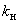
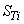

## Глава 7.5

# ЭЛЕКТРОТЕРМИЧЕСКИЕ УСТАНОВКИ

#

Дата введения 2003-01-01

# Предисловие

#

РАЗРАБОТАНО с учетом требований государственных стандартов, строительных норм и правил, рекомендаций научно-технических советов по рассмотрению проектов глав. Проекты глав рассмотрены рабочими группами Координационного совета по пересмотру ПУЭ.

ПОДГОТОВЛЕНО ОАО "ВНИПИ Тяжпромэлектропроект" совместно с Ассоциацией "Росэлектромонтаж".

СОГЛАСОВАНО в установленном порядке с Госстроем России, Госгортехнадзором России, РАО "ЕЭС России" (ОАО "ВНИИЭ") и представлено к утверждению Госэнергонадзором Минэнерго России.

УТВЕРЖДЕНО Министерством энергетики Российской Федерации, приказ от 8 июля 2002 г. N 204.Глава 7.5 Правил устройства электроустановок шестого изданияс 1 января 2003 г. утрачивает силу.

"Правила устройства электроустановок" (ПУЭ) седьмого издания в связи с длительным сроком переработки выпускаются и вводятся в действие отдельными разделами и главами по мере завершения работ по их пересмотру, согласованию и утверждению.

Требования Правил устройства электроустановок обязательны для всех организаций независимо от форм собственности и организационно-правовых форм, а также для физических лиц, занятых предпринимательской деятельностью без образования юридического лица.

# Область применения

7.5.1. Настоящая глава Правил распространяется на производственные и лабораторные установки электропечей и электронагревательных устройств переменного тока промышленной - 50 Гц, пониженной - ниже 50 Гц, повышенно-средней - до 30 кГц, высокой - от 30 кГц до 300 МГц и сверхвысокой частоты - от 300 МГц до 300 ГГц и постоянного (выпрямленного) тока:

дуговых прямого (включая вакуумные дуговые), косвенного действия и комбинированного нагрева с преобразованием электроэнергии в тепловую в электрической дуге и в сопротивлении шихты, в том числе руднотермических (рудовосстановительных, ферросплавных), а также плазменных нагревательных и плавильных;

индукционных нагревательных (включая закалочные) и плавильных (тигельных и канальных);

диэлектрического нагрева;

сопротивления прямого и косвенного нагрева (с любым материалом нагревателя: твердым и жидким), в том числе печей электрошлакового переплава\* - ЭШП, литья - ЭШЛ и наплавки - ЭШН, а также печей электродных расплавления флюса для перечисленных разновидностей электрошлаковых печей;

\_\_\_\_\_\_\_\_\_\_\_\_\_\_\_\_\_\_\_\_\_

\* Дуговой процесс только при "твердом старте" печей ЭШП и лишь весьма короткий промежуток времени, в среднем около 1% периода плавки, причем "твердый старт" в ЭШП используется редко, а в ЭШЛ и ЭШН вообще не применяется. Флюсоплавильные (шлакоплавильные) печи при дуговом процессе также работают относительно короткое время.

электронно-лучевых;

ионных;

лазерных.

Требования настоящей главы Правил распространяются на все элементы электроустановок перечисленных видов электропечей и электронагревательных устройств любых конструкций, назначений и режимов работы, а также с любыми средами (воздух, вакуум, инертный газ и т.п.) и давлениями в их рабочих камерах.

7.5.2. Электротермические установки и используемое в них электротехническое и другое оборудование кроме требований настоящей главы должны удовлетворять требованиям разд.1-6, а также гл.7.3 и 7.4 в той мере, в какой они не изменены настоящей главой.

# Определения

7.5.3. Электротермическая установка (ЭТУ) - комплекс функционально связанных элементов: специализированного электротермического и другого электротехнического, а также механического оборудования, средств управления, автоматики и КИП, обеспечивающих проведение соответствующего технологического процесса.

В состав ЭТУ в зависимости от ее назначения и конструктивного исполнения оборудования входят: кабельные линии, электропроводки и токопроводы между элементами установки, а также трубопроводы систем водоохлаждения и гидравлического привода; трубопроводы линий сжатого воздуха, азота, аргона, гелия, водорода, углекислого газа и других газов, водяного пара или вакуума, системы вентиляции и очистки газов, а также элементы строительных конструкций (фундаменты, рабочие площадки и т.п.).

7.5.4. Электротермическое оборудование (ЭТО) - электротехнологическое оборудование, предназначенное для преобразования электрической энергии в тепловую с целью нагревания (расплавления) материалов.

К ЭТО относятся электрические печи (электропечи) и электронагревательные устройства (приборы, аппараты). Электропечи отличаются от электронагревательных устройств тем, что имеют камеру или ванну.

В разновидностях ЭТУ, перечисленных в 7.5.1, во входящем в состав этих установок ЭТО электрическая энергия преобразуется в тепловую, в основном, тремя способами:

непосредственно в заданных элементах (элементе) этой цепи или между заданными элементами (например, почти полностью или частично между одним или несколькими электродами и шихтой, слитком) на переменном токе промышленной и пониженной частоты, на постоянном токе, а при использовании в плазменных печах индукционных плазменных горелок - на токе высокой или сверхвысокой частоты;

в результате создания у заданного элемента (элементов) указанной цепи электромагнитного поля или электрического поля с последующим превращением в нагреваемом (расплавляемом) материале энергии поля в тепловую энергию;

посредством формирования потока электронов, ионов или лазерного луча с воздействием (вид определяется требованиями технологии) на обрабатываемый материал, как правило, на его поверхность.

Рабочее напряжение ЭТУ по номинальному значению делится на три класса:

до 50 В переменного или 110 В постоянного тока;

более указанного выше напряжения до 1600 В переменного или постоянного тока;

более 1600 В переменного или постоянного тока.

7.5.5. Печная трансформаторная или преобразовательная подстанция - подстанция, входящая в состав ЭТУ, выполняющая функции и содержащая элементы, указанные в гл.4.2 и 4.3.

7.5.6. Печной силовой трансформатор (трансформаторный агрегат) или автотрансформатор - соответственно трансформатор или автотрансформатор ЭТУ, преобразующий электроэнергию переменного тока с напряжения сети на рабочее напряжение электрической печи (электронагревательного устройства).

Печной преобразовательный трансформатор - трансформатор, передающий электроэнергию к преобразовательному (выпрямительному) устройству ЭТУ.

7.5.7. Печной выключатель - выключатель, коммутирующий главные силовые цепи переменного тока ЭТУ, оперативно-защитный или оперативный выключатель, функции которого приведены в 7.5.10.

# Общие требования

7.5.8. Категория электроприемников основного оборудования и вспомогательных механизмов, а также объем резервирования электрической части должны определяться с учетом особенностей ЭТУ и предъявляемых действующими стандартами нормами и правилами требований к оборудованию ЭТУ, системам снабжения его водой, газами, сжатым воздухом, создания и поддержания в рабочих камерах давления или разрежения.

К III категории рекомендуется относить электроприемники ЭТУ цехов и участков несерийного производства: кузнечных, штамповочных, прессовых, механических, механосборочных и окрасочных; цехов и участков (отделений и мастерских) инструментальных, сварочных, сборного железобетона, деревообрабатывающих и деревообделочных, экспериментальных, ремонтных, а также лабораторий, испытательных станций, гаражей, депо, административных зданий.

7.5.9. ЭТУ, в которых электрическая энергия преобразуется в тепловую на постоянном токе, переменном токе пониженной, повышенно-средней, высокой или сверхвысокой частоты, рекомендуется снабжать преобразователями, присоединяемыми к питающим электрическим сетям общего назначения непосредственно или через самостоятельные печные (силовые, преобразовательные) трансформаторы.

Печными (силовыми) трансформаторами или автотрансформаторами рекомендуется оборудовать также ЭТУ промышленной частоты с дуговыми печами (вне зависимости от их напряжения и мощности) и установки с печами\* индукционными и сопротивления, работающие на напряжении, отличающемся от напряжения электрической сети общего назначения, или с печами индукционными и сопротивления однофазными единичной мощностью 0,4 МВт и более, трехфазными - 1,6 МВт и более.

\_\_\_\_\_\_\_\_\_\_\_\_\_\_\_\_\_\_\_\_\_\_

\* Здесь и далее в гл.7.5 помимо электропечей имеются в виду также и электронагревательные устройства.

Преобразователи и печные (преобразовательные) трансформаторы (автотрансформаторы), как правило, должны иметь вторичное напряжение в соответствии с требованиями технологического процесса, а первичное напряжение ЭТУ должно выбираться с учетом технико-экономической целесообразности.

Печные трансформаторы (автотрансформаторы) и преобразователи, как правило, должны снабжаться устройствами для регулирования напряжения, когда это необходимо по условиям проведения технологического процесса.

7.5.10. Первичная цепь каждой ЭТУ, как правило, должна содержать следующие коммутационные и защитные аппараты в зависимости от напряжения питающей электросети промышленной частоты:

до 1 кВ - выключатель (рубильник с дугогасящими контактами, пакетный выключатель) на вводе и предохранители, или блок выключатель-предохранитель, или автоматический выключатель с электромагнитными и тепловыми расцепителями;

выше 1 кВ - разъединитель (отделитель или разъемное контактное соединение КРУ) на вводе и выключатель оперативно-защитного назначения или разъединитель (отделитель, разъемные контактные соединения КРУ) и два выключателя - оперативный и защитный.

Для включения электронагревательного устройства мощностью менее 1 кВт в электрическую цепь напряжением до 1 кВ допускается использовать на вводе втычные разъемные контактные соединения, присоединяемые к линии (магистральной или радиальной), устройство защиты которой установлено в силовом (осветительном) пункте или на щитке.

В первичных цепях ЭТУ напряжением до 1 кВ допускается в качестве вводных коммутационных аппаратов использовать рубильники без дугогасящих контактов при условии, что коммутация ими выполняется без нагрузки.

Выключатели напряжением выше 1 кВ оперативно-защитного назначения в ЭТУ, как правило, должны выполнять операции включения и отключения электротермического оборудования (печей или устройств), обусловленные эксплуатационными особенностями его работы, и защиту от КЗ и ненормальных режимов работы.

Оперативные выключатели напряжением выше 1 кВ ЭТУ должны выполнять оперативные и часть защитных функций, объем которых определяется при конкретном проектировании, но на них не должна возлагаться защита от КЗ (кроме эксплуатационных КЗ, не устраняемых в случае неисправности системы автоматического регулирования печи), которую должны осуществлять защитные выключатели.

Оперативно-защитные и оперативные выключатели напряжением выше 1 кВ допускается устанавливать как на печных подстанциях, так и в цеховых (заводских и т.п.) распределительных устройствах.

Допускается устанавливать один защитный выключатель для защиты группы электротермических установок.

7.5.11. В электрических цепях напряжением выше 1 кВ с числом коммутационных операций в среднем пять циклов включения-отключения в сутки и более должны применяться специальные выключатели повышенной механической и электрической износостойкости, соответствующие требованиям действующих стандартов.

7.5.12. Электрическую нагрузку присоединяемых к электрической сети общего назначения нескольких однофазных электроприемников ЭТУ рекомендуется распределять между тремя фазами сети таким образом, чтобы во всех возможных эксплуатационных режимах работы несимметрия напряжений, вызываемая их нагрузкой, как правило, не превышала бы значений, допускаемых действующим стандартом.

В случаях, когда такое условие при выбранной точке присоединения к сети общего назначения однофазных электроприемников ЭТУ не соблюдается и при этом нецелесообразно (по технико-экономическим показателям) присоединять эти электроприемники к более мощной электрической сети (т.е. к точке сети с большей мощностью КЗ), рекомендуется снабжать ЭТУ симметрирующим устройством или параметрическим источником тока, либо устанавливать коммутационные аппараты, с помощью которых возможно перераспределение нагрузки однофазных электроприемников между фазами трехфазной сети (при нечастом возникновении несимметрии в процессе работы).

7.5.13. Электрическая нагрузка ЭТУ, как правило, не должна вызывать в электрических сетях общего назначения несинусоидальности кривой напряжения, при которой не соблюдается требование действующего стандарта. При необходимости рекомендуется снабжать печные понижающие или преобразовательные подстанции или питающие их цеховые (заводские) трансформаторные подстанции фильтрами высших и в некоторых случаях низших гармоник, либо принимать другие меры, уменьшающие искажение формы кривой напряжения электрической сети.

7.5.14. Коэффициент мощности ЭТУ, присоединяемых к электрическим сетям общего назначения, как правило, должен быть не ниже 0,98. ЭТУ единичной мощностью 0,4 МВт и более, естественный коэффициент мощности которых ниже указанного значения, рекомендуется снабжать индивидуальными компенсирующими устройствами, которые не следует включать в ЭТУ, если технико-экономическими расчетами выявлены явные преимущества групповой компенсации.

7.5.15. Для ЭТУ, присоединяемых к электрическим сетям общего назначения, для которых в качестве компенсирующего устройства используются конденсаторные батареи, схему включения конденсаторов (параллельно или последовательно с электротермическим оборудованием), как правило, следует выбирать на основе технико-экономических расчетов, характера изменения индуктивной нагрузки установки и формы кривой напряжения, определяемой составом высших гармоник.

7.5.16. Напряжение печных (включая преобразовательные) подстанций, в том числе внутрицеховых, количество, мощность устанавливаемых в них трансформаторов, автотрансформаторов, преобразователей или реакторов как сухих, так и маслонаполненных или заполненных экологически безопасной негорючей жидкостью, высота (отметка) их расположения по отношению к полу первого этажа здания, расстояние между камерами с маслонаполненным оборудованием разных подстанций не ограничиваются при условии, что рядом могут располагаться только две камеры (два помещения) с маслонаполненным оборудованием печных трансформаторных или преобразовательных подстанций, разделенные стеной с пределом огнестойкости, указанным в 7.5.22 для несущих стен; расстояние до расположенных в одном ряду с ними аналогичных двух\* камер (помещений) при их суммарном числе до шести должно быть не менее 1,5 м, при большем числе после каждых шести камер (помещений) следует устраивать проезд шириной не менее 4 м.

\_\_\_\_\_\_\_\_\_\_\_\_\_\_\_\_\_\_\_\_\_

\* Или одной при их суммарном числе три или пять.

7.5.17. Под маслонаполненным оборудованием печных подстанций должны сооружаться:

при массе масла в одном баке (полюсе) до 60 кг - порог или пандус для удержания полного объема масла;

при массе масла в одном баке (полюсе) от 60 до 600 кг - приямок или маслоприемник для удержания полного объема масла;

при массе масла более 600 кг - маслоприемник на 20% объема масла с отводом в маслосборный бак.

Маслосборный бак должен быть подземным и располагаться вне зданий на расстоянии не менее 9 м от стен I-II степеней огнестойкости и не менее 12 м от стен III-IV степеней огнестойкости по СНиП 21-01-97 "Пожарная безопасность зданий и сооружений".

Маслоприемник должен перекрываться металлической решеткой, поверх которой следует насыпать слой промытого просеянного гравия или непористого щебня с частицами от 30 до 70 мм толщиной не менее 250 мм.

7.5.18. Под устройствами для приема масла не допускается располагать помещения с постоянным пребыванием людей. Ниже них пульт управления ЭТУ может находиться только в отдельном помещении, имеющем защитный гидроизолированный потолок, исключающий попадание масла в пультовое помещение даже при малой вероятности появления течи из любых устройств для приема масла. Должна быть обеспечена возможность систематического осмотра гидроизоляции потолка, предел его огнестойкости - не менее 0,75 ч.

7.5.19. Вместимость подземного сборного бака должна быть не менее суммарного объема масла в оборудовании, установленном в камере, а при присоединении к сборному баку нескольких камер - не менее наибольшего суммарного объема масла одной из камер.

7.5.20. Внутренний диаметр маслоотводных труб, соединяющих маслоприемники с подземным сборным баком, определяется по формуле

,

где  - масса масла в оборудовании, расположенном в камере (помещении) над данным маслоприемником, т;

 - число труб, прокладываемых от маслоприемника до подземного сборного бака. Этот диаметр должен быть не менее 100 мм.

Маслоотводные трубы со стороны маслоприемников должны закрываться съемными сетками из латуни или нержавеющей стали с размерами ячеек 33 мм. При необходимости поворота трассы радиус изгиба трубы (труб) должен быть не меньше пяти диаметров трубы. На горизонтальных участках труба должна иметь уклон не менее 0,02 в сторону сборного бака. При всех условиях время удаления масла в подземный сборный бак должно быть менее 0,75 ч.

7.5.21. Камеры (помещения) с маслонаполненным электрооборудованием следует снабжать автоматическими системами пожаротушения при суммарном количестве масла, превышающем 10 т - для камер (помещений), расположенных на отметке первого этажа и выше, и 0,6 т - для камер (помещений), расположенных ниже отметки первого этажа.

Эти системы пожаротушения должны иметь помимо автоматического также и ручные режимы пуска (местный - для опробования и дистанционный - с пульта управления ЭТУ).

При суммарном количестве масла в указанных камерах (помещениях) менее 10 и 0,6 т соответственно они должны оборудоваться пожарной сигнализацией.

7.5.22. При установке трансформаторов, преобразователей и другого электрооборудования ЭТУ в камере внутрицеховой печной (в том числе преобразовательной) подстанции или в другом отдельном помещении (вне отдельных помещений - камер - устанавливать электрооборудование ЭТУ при количестве масла в нем более 60 кг не допускается, за исключением расположения его вне зданий согласно гл.4.2) его строительные конструкции, в зависимости от массы масла в данном помещении, должны иметь пределы огнестойкости не ниже I степени по СНиП 21-01-97.

7.5.23. Оборудование ЭТУ вне зависимости от его номинального напряжения допускается размещать непосредственно в производственных помещениях, если его исполнение соответствует условиям среды в данном помещении.

При этом во взрыво-, пожароопасных и наружных зонах помещений допускается размещать только такое оборудование ЭТУ, которое имеет нормируемые для данной среды уровни и виды взрывозащиты или соответствующую степень защиты оболочки.

Конструкция и расположение самого оборудования и ограждений должны обеспечивать безопасность персонала и исключать возможность механического повреждения оборудования и случайных прикосновений персонала к токоведущим и вращающимся частям.

Если длина электропечи, электронагревательного устройства или нагреваемого изделия, такова, что выполнение ограждений токоведущих частей вызывает значительное усложнение конструкции или затрудняет обслуживание ЭТУ, допускается устанавливать вокруг печи или устройства в целом ограждение высотой не менее 2 м с блокированием, исключающим возможность открывания дверей до отключения установки.

7.5.24. Силовое электрооборудование напряжением до 1,6 кВ и выше, относящееся к одной ЭТУ (печные трансформаторы, статические преобразователи, реакторы, печные выключатели, разъединители и т.п.), а также вспомогательное оборудование гидравлических приводов и систем охлаждения печных трансформаторов и преобразователей (насосы замкнутых систем водяного и масляноводяного охлаждения, теплообменники, абсорберы, вентиляторы и др.) допускается устанавливать в общей камере. Указанное электрооборудование должно иметь ограждение открытых токоведущих частей, а оперативное управление приводами коммутационных аппаратов должно быть вынесено за пределы камеры. Электрооборудование нескольких ЭТУ рекомендуется в обоснованных случаях располагать в общих электропомещениях, например в электромашинных помещениях, с соблюдением требований гл.5.1.

7.5.25. Трансформаторы, преобразовательные устройства и агрегаты ЭТУ (двигатель-генераторные и статические - ионные и электронные, в том числе полупроводниковые устройства и ламповые генераторы) рекомендуется располагать на минимально возможном расстоянии от присоединенных к ним электропечей и электронагревательных устройств (аппаратов). Минимальные расстояния в свету от наиболее выступающих частей печного трансформатора, расположенных на высоте до 1,9 м от пола, до стенок трансформаторных камер при отсутствии в камерах другого оборудования рекомендуется принимать:

до передней стенки камеры (со стороны печи или электронагревательного устройства) - 0,4 м для трансформаторов мощностью менее 0,4 MB·A, 0,6 м - от 0,4 до 12,5 MB·А и 0,8 м - более 12,5 MB·A;

до боковых и задней стенок камеры - 0,8 м при мощности трансформатора менее 0,4 МВ·А, 1 м - от 0,4 до 12,5 МВ·А и 1,2 м - более 12,5 МВ·А;

до соседнего печного трансформатора (автотрансформатора) - 1 м при мощности до 12,5 МВ·А и 1,2 м - более 12,5 МВ·А для вновь проектируемых печных подстанций и соответственно 0,8 и 1 м - для реконструируемых;

допускается уменьшение указанных расстояний на 0,2 м на длине не более 1 м.

При совместной установке в общей камере печных трансформаторов и другого оборудования (согласно 7.5.24) ширину проходов и расстояние между оборудованием, а также между оборудованием и стенками камеры рекомендуется принимать на 10-20% больше указанных значений.

7.5.26. ЭТУ должны быть снабжены блокировками, обеспечивающими безопасное обслуживание электрооборудования и механизмов этих установок, а также правильную последовательность оперативных переключений. Открывание дверей шкафов, расположенных вне электропомещений, а также дверей камер (помещений) распределительных устройств, имеющих доступные для прикосновения токоведущие части, должно быть возможно лишь после снятия напряжения с установки, двери должны иметь блокирование, действующее на снятие напряжения с установки без выдержки времени.

7.5.27. ЭТУ должны быть оборудованы устройствами защиты в соответствии с требованиями гл.3.1 и 3.2. Защита дуговых печей и дуговых печей сопротивления должна выполняться в соответствии с требованиями, изложенными в 7.5.46, индукционных - в 7.5.54 (см. также 7.5.38).

7.5.28. ЭТУ, как правило, должны иметь автоматические регуляторы электрического режима работы, за исключением ЭТУ, в которых их применение нецелесообразно по технологическим или технико-экономическим причинам.

Для установок, в которых при регулировании электрического режима (или для защиты от перегрузки) необходимо учитывать значение переменного тока, трансформаторы (или другие датчики) тока, как правило, следует устанавливать на стороне низшего напряжения. В ЭТУ с большими значениями тока во вторичных токоподводах трансформаторы тока допускается устанавливать на стороне высшего напряжения. При этом, если печной трансформатор имеет переменный коэффициент трансформации, рекомендуется использовать согласующие устройства.

7.5.29. Измерительные приборы и аппараты защиты, а также аппараты управления ЭТУ должны устанавливаться так, чтобы была исключена возможность их перегрева (от тепловых излучений и других причин).

Щиты и пульты (аппараты) управления ЭТУ должны, как правило, располагаться в местах, где обеспечивается возможность наблюдения за проводимыми на установках производственными операциями.

Направление движения рукоятки аппарата управления приводом наклона печей должно соответствовать направлению наклона.

Если ЭТУ имеют значительные габариты и обзор с пульта управления недостаточен, рекомендуется предусматривать оптические, телевизионные или другие устройства для наблюдения за технологическим процессом.

При необходимости должны устанавливаться аварийные кнопки для дистанционного отключения всей установки или отдельных ее частей.

7.5.30. На щитах управления ЭТУ должна предусматриваться сигнализация включенного и отключенного положений оперативных коммутационных аппаратов (см. 7.5.10), в установках единичной мощностью 0,4 МВт и более рекомендуется предусматривать также сигнализацию включенного положения вводных коммутационных аппаратов.

7.5.31. При выборе сечений токопроводов ЭТУ на токи более 1,5 кА промышленной частоты и на любые токи повышенно-средней, высокой и сверхвысокой частоты, в том числе в цепях фильтров высших гармоник и цепях стабилизатора реактивной мощности (тиристорно-реакторной группы - ТРГ), должна учитываться неравномерность распределения тока как по сечению шины (кабеля), так и между отдельными шинами (кабелями).

Конструкция токопроводов ЭТУ (в частности, вторичных токоподводов - "коротких сетей" электропечей) должна обеспечивать:

оптимальные реактивное и активное сопротивления;

рациональное распределение тока в проводниках;

симметрирование сопротивлений по фазам в соответствии с требованиями стандартов или технических условий на отдельные виды (типы) трехфазных электропечей или электронагревательных устройств;

ограничение потерь электроэнергии в металлических креплениях шин, конструкциях установок и строительных элементах зданий и сооружений.

Вокруг одиночных шин и линий (в частности, при их проходе через железобетонные перегородки и перекрытия, а также при устройстве металлических опорных конструкций, защитных экранов и т.п.) не должно быть замкнутых металлических контуров. Токопроводы на токи промышленной частоты более 4 кА и на любые токи повышенно-средней, высокой и сверхвысокой частоты не должны прокладываться вблизи стальных строительных элементов зданий и сооружений. Если этого избежать нельзя, то для соответствующих строительных элементов необходимо применять немагнитные и маломагнитные материалы и проверять расчетом потери электроэнергии в них и температуру их нагрева. При необходимости рекомендуется предусматривать устройство экранов.

Для токопроводов переменного тока с частотой 2,4 кГц применение крепящих деталей из магнитных материалов не рекомендуется, а с частотой 4 кГц и более - не допускается, за исключением узлов присоединения шин к водоохлаждаемым элементам. Опорные конструкции и защитные экраны таких токопроводов (за исключением конструкций для коаксиальных токопроводов) должны изготавливаться из немагнитных или маломагнитных материалов.

Температура шин и контактных соединений с учетом нагрева электрическим током и внешними тепловыми излучениями, как правило, должна быть не выше 90 °С. В реконструируемых установках для вторичных токоподводов допускается в обоснованных случаях для медных шин температура 140 °С, для алюминиевых - 120 °С, при этом соединения шин следует выполнять сварными. Предельная температура шин при заданной токовой нагрузке и по условиям среды должна проверяться расчетом. При необходимости следует предусматривать принудительное воздушное или водяное охлаждение.

7.5.32. В установках электропечей и электронагревательных устройств со спокойным режимом работы, в том числе дуговых косвенного действия, плазменных, дугового нагрева сопротивлением (см. 7.5.1), из дуговых прямого действия - вакуумных дуговых (также и гарнисажных), индукционных и диэлектрического нагрева, сопротивления прямого и косвенного нагрева, включая ЭШП, ЭШЛ и ЭШН, электронно-лучевых, ионных и лазерных для жестких токопроводов вторичных токоподводов, как правило, должны применяться шины из алюминия или из алюминиевых сплавов.

Для жесткой части вторичного токоподвода установок электропечей с ударной нагрузкой, в частности стале- и чугуноплавильных дуговых печей, рекомендуется применять шины из алюминиевого сплава с повышенной механической и усталостной прочностью. Жесткий токопровод вторичного токоподвода в цепях переменного тока из многополосных пакетов шин рекомендуется выполнять шихтованным с параллельными чередующимися цепями разных фаз или прямого и обратного направлений тока.

Жесткие однофазные токопроводы повышенно-средней частоты рекомендуется выполнять шихтованными и коаксиальными.

В обоснованных случаях допускается изготовление жестких токопроводов вторичных токоподводов из меди.

Гибкий токопровод на подвижных элементах электропечей следует выполнять гибкими медными кабелями или гибкими медными лентами. Для гибких токопроводов на токи 6 кА и более промышленной частоты и на любые токи повышенно-средней и высокой частот рекомендуется применять водоохлаждаемые гибкие медные кабели.

7.5.33. Рекомендуемые допустимые длительные токи приведены при нагрузке: током промышленной частоты токопроводов из шихтованного пакета прямоугольных шин - в табл.7.5.1-7.5.4, током повышенно-средней частоты токопроводов из двух прямоугольных шин - в табл.7.5.5-7.5.6 и коаксиальных токопроводов из двух концентрических труб - в табл.7.5.7-7.5.8, кабелей марки АСГ - в табл.7.5.9 и марки СГ - в табл.7.5.10.

Таблица 7.5.1

#

# Допустимый длительный ток промышленной частоты

# однофазных токопроводов из шихтованного пакета

# алюминиевых прямоугольных шин

|  |  |  |  |  |  |  |  |  |
| --- | --- | --- | --- | --- | --- | --- | --- | --- |
|Размер поло сы, мм | Токовая нагрузка, А, при количестве полос в пакете | | | | | | | |
|  | 2 | 4 | 6 | 8 | 12 | 16 | 20 | 24 |
| 100img_ccd63c65_1.png10 | 1250 | 2480 | 3705 | 4935 | 7380 | 9850 | 12315 | 14750 |
| 120img_ccd63c65_2.png10 | 1455 | 2885 | 4325 | 5735 | 8600 | 11470 | 14315 | 17155 |
| 140img_ccd63c65_3.png10 | 1685 | 3330 | 4980 | 6625 | 9910 | 13205 | 16490 | 19785 |
| 160img_ccd63c65_4.png10 | 1870 | 3705 | 5545 | 7380 | 11045 | 14710 | 18375 | 22090 |
| 180img_ccd63c65_5.png10 | 2090 | 4135 | 6185 | 8225 | 12315 | 16410 | 20490 | 24610 |
| 200img_ccd63c65_6.png10 | 2310 | 4560 | 6825 | 9090 | 13585 | 18105 | 22605 | 27120 |
| 250img_ccd63c65_7.png10 | 2865 | 5595 | 8390 | 11185 | 16640 | 22185 | 27730 | 33275 |
| 250img_ccd63c65_8.png20 | 3910 | 7755 | 11560 | 15415 | 23075 | 30740 | 38350 | 46060 |
| 300img_ccd63c65_9.png10 | 3330 | 6600 | 9900 | 13200 | 19625 | 26170 | 32710 | 39200 |
| 300img_ccd63c65_10.png20 | 4560 | 8995 | 13440 | 17880 | 26790 | 35720 | 44605 | 53485 |

Примечания: 1. В табл.7.5.1-7.5.4 токи приведены для неокрашенных шин, установленных на ребро, при зазоре между шинами 30 мм для шин высотой 300 мм и 20 мм для шин высотой 250 мм и менее.

2. Коэффициенты () допустимой длительной токовой нагрузки (к табл.7.5.1 и 7.5.3) алюминиевых шин, окрашенных масляной краской или эмалевым лаком:

|  |  |  |  |  |  |
| --- | --- | --- | --- | --- | --- |
|Количество полос в пакете img_0ca2ce55_1.png при высоте полосы, мм: | 2 | 3-4 | 6-9 | 12-16 | 20-24 |
| 100-120 | 1,25 | 1,18 | 1,15 | 1,14 | 1,13 |
| 140-160 | 1,24 | 1,16 | 1,14 | 1,10 | 1,09 |
| 180-300 | 1,23 | 1,15 | 1,12 | 1,09 | 1,07 |

3. Коэффициент снижения допустимой длительной токовой нагрузки для шин из сплава АД 31Т- 0,94, из сплава АД 31Т1 - 0,91.

Таблица 7.5.2

#

# Допустимый длительный ток промышленной частоты

# однофазных токопроводов из шихтованного пакета

# медных прямоугольных шин\*

|  |  |  |  |  |  |  |  |  |
| --- | --- | --- | --- | --- | --- | --- | --- | --- |
|Размер поло сы, мм | Токовая нагрузка, А, при количестве полос в пакете | | | | | | | |
|  | 2 | 4 | 6 | 8 | 12 | 16 | 20 | 24 |
| 100img_ccd63c65_11.png10 | 1880 | 3590 | 5280 | 7005 | 10435 | 13820 | 17250 | 20680 |
| 120img_ccd63c65_12.png10 | 2185 | 4145 | 6110 | 8085 | 12005 | 15935 | 19880 | 23780 |
| 140img_ccd63c65_13.png10 | 2475 | 4700 | 6920 | 9135 | 13585 | 18050 | 22465 | 26930 |
| 160img_ccd63c65_14.png10 | 2755 | 5170 | 7670 | 10150 | 15040 | 19930 | 24910 | 29800 |
| 180img_ccd63c65_15.png10 | 3035 | 5735 | 8440 | 11140 | 16545 | 21900 | 27355 | 32760 |
| 200img_ccd63c65_16.png10 | 3335 | 6300 | 9280 | 12220 | 18140 | 24065 | 29985 | 35910 |
| 250img_ccd63c65_17.png10 | 4060 | 7660 | 11235 | 14805 | 21930 | 29140 | 36235 | 43430 |
| 300img_ccd63c65_18.png10 | 4840 | 9135 | 13395 | 17670 | 26225 | 34780 | 43380 | 51700 |

\_\_\_\_\_\_\_\_\_\_\_\_\_\_\_\_\_\_\_\_\_

\* См. примечания к табл.7.5.1.

Таблица 7.5.3

#

# Допустимый длительный ток промышленной частоты

# трехфазных токопроводов из шихтованного пакета

# алюминиевых прямоугольных шин\*

|  |  |  |  |  |  |  |
| --- | --- | --- | --- | --- | --- | --- |
|Размер полосы, мм | Токовая нагрузка, А, при количестве полос в пакете | | | | | |
|  | 3 | 6 | 9 | 12 | 18 | 24 |
| 100img_ccd63c65_19.png10 | 1240 | 2470 | 3690 | 4920 | 7390 | 9900 |
| 120img_ccd63c65_20.png10 | 1445 | 2885 | 4300 | 5735 | 8560 | 11435 |
| 140img_ccd63c65_21.png10 | 1665 | 3320 | 4955 | 6605 | 9895 | 13190 |
| 160img_ccd63c65_22.png10 | 1850 | 3695 | 5525 | 7365 | 11025 | 14720 |
| 180img_ccd63c65_23.png10 | 2070 | 4125 | 6155 | 8210 | 12290 | 16405 |
| 200img_ccd63c65_24.png10 | 2280 | 4550 | 6790 | 9055 | 13565 | 18080 |
| 250img_ccd63c65_25.png10 | 2795 | 5590 | 8320 | 11095 | 16640 | 22185 |
| 250img_ccd63c65_26.png20 | 3880 | 7710 | 11540 | 15385 | 23010 | 30705 |
| 300img_ccd63c65_27.png10 | 3300 | 6580 | 9815 | 13085 | 19620 | 26130 |
| 300img_ccd63c65_28.png20 | 4500 | 8960 | 13395 | 17860 | 26760 | 35655 |

\_\_\_\_\_\_\_\_\_\_\_\_\_\_\_\_\_\_\_\_\_

\* См. примечания к табл.7.5.1.

Таблица 7.5.4

#

# Допустимый длительный ток промышленной частоты

# трехфазных токопроводов из шихтованного пакета

# медных прямоугольных шин\*

|  |  |  |  |  |  |  |
| --- | --- | --- | --- | --- | --- | --- |
|Размер полосы, мм | Токовая нагрузка, А, при количестве полос в пакете | | | | | |
|  | 3 | 6 | 9 | 12 | 18 | 24 |
| 100img_ccd63c65_29.png10 | 1825 | 3530 | 5225 | 6965 | 10340 | 13740 |
| 120img_ccd63c65_30.png10 | 2105 | 4070 | 6035 | 8000 | 11940 | 15885 |
| 140img_ccd63c65_31.png10 | 2395 | 4615 | 6845 | 9060 | 13470 | 17955 |
| 160img_ccd63c65_32.png10 | 2660 | 5125 | 7565 | 10040 | 14945 | 19850 |
| 180img_ccd63c65_33.png10 | 2930 | 5640 | 8330 | 11015 | 16420 | 21810 |
| 200img_ccd63c65_34.png10 | 3220 | 6185 | 9155 | 12090 | 18050 | 23925 |
| 250img_ccd63c65_35.png10 | 3900 | 7480 | 11075 | 14625 | 21810 | 28950 |
| 300img_ccd63c65_36.png10 | 4660 | 8940 | 13205 | 17485 | 25990 | 34545 |

\_\_\_\_\_\_\_\_\_\_\_\_\_\_\_\_\_\_\_\_

\* См. примечания к табл.7.5.1.

Таблица 7.5.5

#

# Допустимый длительный ток повышенно-средней частоты

# токопроводов из двух алюминиевых прямоугольных шин

|  |  |  |  |  |  |  |
| --- | --- | --- | --- | --- | --- | --- |
|Ширина шины, мм | Токовая нагрузка, A, при частоте, Гц | | | | | |
|  | 500 | 1000 | 2500 | 4000 | 8000 | 10000 |
| 25 | 310 | 255 | 205 | 175 | 145 | 140 |
| 30 | 365 | 305 | 245 | 205 | 180 | 165 |
| 40 | 490 | 410 | 325 | 265 | 235 | 210 |
| 50 | 615 | 510 | 410 | 355 | 300 | 285 |
| 60 | 720 | 605 | 485 | 410 | 355 | 330 |
| 80 | 960 | 805 | 640 | 545 | 465 | 435 |
| 100 | 1160 | 980 | 775 | 670 | 570 | 535 |
| 120 | 1365 | 1140 | 915 | 780 | 670 | 625 |
| 150 | 1580 | 1315 | 1050 | 905 | 770 | 725 |
| 200 | 2040 | 1665 | 1325 | 1140 | 970 | 910 |

Примечания: 1. В табл.7.5.5 и 7.5.6 токи приведены для неокрашенных шин с расчетной толщиной, равной 1,2 глубины проникновения тока, с зазором между шинами 20 мм при установке шин на ребро и прокладке их в горизонтальной плоскости.

2. Толщина шин токопроводов, допустимые длительные токи которых приведены в табл.7.5.5 и 7.5.6, должна быть равной или больше расчетной; ее следует выбирать с учетом требований к механической прочности шин из сортамента, приведенного в стандартах или технических условиях.

3. Глубина проникновения тока, , при алюминиевых шинах в зависимости от частоты переменного тока :

|  |  |  |  |  |  |  |
| --- | --- | --- | --- | --- | --- | --- |
|img_b73694f8_1.png, кГц | 0,5 | 1,0 | 2,5 | 4,0 | 8,0 | 10,0 |
| img_10364d33_1.png, мм | 4,2 | 3,0 | 1,9 | 1,5 | 1,06 | 0,95 |

Таблица 7.5.6

#

# Допустимый длительный ток повышенно-средней частоты

# токопроводов из двух медных прямоугольных шин

|  |  |  |  |  |  |  |
| --- | --- | --- | --- | --- | --- | --- |
|Ширина шины, мм | Токовая нагрузка, A, при частоте, Гц | | | | | |
|  | 500 | 1000 | 2500 | 4000 | 8000 | 10000 |
| 25 | 355 | 295 | 230 | 205 | 175 | 165 |
| 30 | 425 | 350 | 275 | 245 | 210 | 195 |
| 40 | 570 | 465 | 370 | 330 | 280 | 265 |
| 50 | 705 | 585 | 460 | 410 | 350 | 330 |
| 60 | 835 | 685 | 545 | 495 | 420 | 395 |
| 80 | 1100 | 915 | 725 | 645 | 550 | 515 |
| 100 | 1325 | 1130 | 895 | 785 | 675 | 630 |
| 120 | 1420 | 1325 | 1045 | 915 | 785 | 735 |
| 150 | 1860 | 1515 | 1205 | 1060 | 910 | 845 |
| 200 | 2350 | 1920 | 1485 | 1340 | 1140 | 1070 |

Примечание. Глубина проникновения тока, , при медных шинах в зависимости от частоты переменного тока :

|  |  |  |  |  |  |  |
| --- | --- | --- | --- | --- | --- | --- |
|img_b73694f8_3.png, кГц | 0,5 | 1,0 | 2,5 | 4,0 | 8,0 | 10,0 |
| img_10364d33_3.png, мм | 3,3 | 2,4 | 1,5 | 1,19 | 0,84 | 0,75 |

См. также примечания 1 и 2 к табл.7.5.5.

Таблица 7.5.7

#

# Допустимый длительный ток повышенно-средней частоты

# токопроводов из двух алюминиевых концентрических труб

|  |  |  |  |  |  |  |  |
| --- | --- | --- | --- | --- | --- | --- | --- |
|Наружный диаметр трубы, мм | | Токовая нагрузка, А, при частоте, кГц | | | | | |
| внешней | внутрен- ней | 0,5 | 1,0 | 2,50 | 4,0 | 8,0 | 10,0 |
| 150 | 110 | 1330 | 1110 | 885 | 770 | 640 | 615 |
|  | 90 | 1000 | 835 | 665 | 570 | 480 | 455 |
|  | 70 | 800 | 670 | 530 | 465 | 385 | 370 |
| 180 | 140 | 1660 | 1400 | 1095 | 950 | 800 | 760 |
|  | 120 | 1280 | 1075 | 855 | 740 | 620 | 590 |
|  | 100 | 1030 | 905 | 720 | 620 | 520 | 495 |
| 200 | 160 | 1890 | 1590 | 1260 | 1080 | 910 | 865 |
|  | 140 | 1480 | 1230 | 980 | 845 | 710 | 675 |
|  | 120 | 1260 | 1070 | 840 | 725 | 610 | 580 |
| 220 | 180 | 2185 | 1755 | 1390 | 1200 | 1010 | 960 |
|  | 160 | 1660 | 1390 | 1100 | 950 | 800 | 760 |
|  | 140 | 1425 | 1185 | 940 | 815 | 685 | 650 |
| 240 | 200 | 2310 | 1940 | 1520 | 1315 | 1115 | 1050 |
|  | 180 | 1850 | 1550 | 1230 | 1065 | 895 | 850 |
|  | 160 | 1630 | 1365 | 1080 | 930 | 785 | 745 |
| 260 | 220 | 2530 | 2130 | 1780 | 1450 | 1220 | 1160 |
|  | 200 | 2040 | 1710 | 1355 | 1165 | 980 | 930 |
|  | 180 | 1820 | 1530 | 1210 | 1040 | 875 | 830 |
| 280 | 240 | 2780 | 2320 | 1850 | 1590 | 1335 | 1270 |
|  | 220 | 2220 | 1865 | 1480 | 1275 | 1075 | 1020 |
|  | 200 | 2000 | 1685 | 1320 | 1150 | 960 | 930 |

Примечание. В табл.7.5.7 и 7.5.8 токовые нагрузки приведены для неокрашенных труб с толщиной стенок 10 мм.

Таблица 7.5.8

#

# Допустимый длительный ток повышенно-средней частоты

# токопроводов из двух медных концентрических труб\*

|  |  |  |  |  |  |  |  |
| --- | --- | --- | --- | --- | --- | --- | --- |
|Наружный диаметр трубы, мм | | Токовая нагрузка, А, при частоте, кГц | | | | | |
| внешней | внутрен- ней | 0,5 | 1,0 | 2,50 | 4,0 | 8,0 | 10,0 |
| 150 | 110 | 1530 | 1270 | 1010 | 895 | 755 | 715 |
|  | 90 | 1150 | 950 | 750 | 670 | 565 | 535 |
|  | 70 | 920 | 760 | 610 | 540 | 455 | 430 |
| 180 | 140 | 1900 | 1585 | 1240 | 1120 | 945 | 895 |
|  | 120 | 1480 | 1225 | 965 | 865 | 730 | 690 |
|  | 100 | 1250 | 1030 | 815 | 725 | 615 | 580 |
| 200 | 160 | 2190 | 1810 | 1430 | 1275 | 1075 | 1020 |
|  | 140 | 1690 | 1400 | 1110 | 995 | 840 | 795 |
|  | 120 | 1460 | 1210 | 955 | 830 | 715 | 665 |
| 220 | 180 | 2420 | 2000 | 1580 | 1415 | 1190 | 1130 |
|  | 160 | 1915 | 1585 | 1250 | 1115 | 940 | 890 |
|  | 140 | 1620 | 1350 | 1150 | 955 | 810 | 765 |
| 240 | 200 | 2670 | 2200 | 1740 | 1565 | 1310 | 1250 |
|  | 180 | 2130 | 1765 | 1395 | 1245 | 1050 | 995 |
|  | 160 | 1880 | 1555 | 1230 | 1095 | 925 | 875 |
| 260 | 220 | 2910 | 2380 | 1910 | 1705 | 1470 | 1365 |
|  | 200 | 2360 | 1950 | 1535 | 1315 | 1160 | 1050 |
|  | 180 | 2100 | 1740 | 1375 | 1225 | 1035 | 980 |
| 280 | 240 | 3220 | 2655 | 2090 | 1865 | 1580 | 1490 |
|  | 220 | 2560 | 2130 | 1680 | 1500 | 1270 | 1200 |
|  | 200 | 2310 | 1900 | 1500 | 1340 | 1135 | 1070 |

\_\_\_\_\_\_\_\_\_\_\_\_\_\_\_\_\_\_\_\_

\* См. примечание к табл.7.5.7.

Таблица 7.5.9

#

# Допустимый длительный ток повышенно-средней частоты

# кабелей марки АСГ на напряжение 1 кВ

# при однофазной нагрузке

|  |  |  |  |  |  |  |
| --- | --- | --- | --- | --- | --- | --- |
|Сечение токопроводящей жилы, ммimg_85e43c10.png | Токовая нагрузка, А, при частоте, кГц | | | | | |
|  | 0,5 | 1,0 | 2,50 | 4,0 | 8,0 | 10,0 |
| 2img_ccd63c65_37.png25 | 100 | 80 | 65 | 55 | 47 | 45 |
| 2img_ccd63c65_38.png35 | 115 | 95 | 75 | 65 | 55 | 50 |
| 2img_ccd63c65_39.png50 | 130 | 105 | 85 | 75 | 62 | 60 |
| 2img_ccd63c65_40.png70 | 155 | 130 | 100 | 90 | 75 | 70 |
| 2img_ccd63c65_41.png95 | 180 | 150 | 120 | 100 | 85 | 80 |
| 2img_ccd63c65_42.png120 | 200 | 170 | 135 | 115 | 105 | 90 |
| 2img_ccd63c65_43.png150 | 225 | 185 | 150 | 130 | 110 | 105 |
| 3img_ccd63c65_44.png25 | 115 | 95 | 75 | 60 | 55 | 50 |
| 3img_ccd63c65_45.png35 | 135 | 110 | 85 | 75 | 65 | 60 |
| 3img_ccd63c65_46.png50 | 155 | 130 | 100 | 90 | 75 | 70 |
| 3img_ccd63c65_47.png70 | 180 | 150 | 120 | 100 | 90 | 80 |
| 3img_ccd63c65_48.png95 | 205 | 170 | 135 | 120 | 100 | 95 |
| 3img_ccd63c65_49.png120 | 230 | 200 | 160 | 140 | 115 | 110 |
| 3img_ccd63c65_50.png150 | 250 | 220 | 180 | 150 | 125 | 120 |
| 3img_ccd63c65_51.png185 | 280 | 250 | 195 | 170 | 140 | 135 |
| 3img_ccd63c65_52.png240 | 325 | 285 | 220 | 190 | 155 | 150 |
| 3img_ccd63c65_53.png50+1img_ccd63c65_54.png25 | 235 | 205 | 160 | 140 | 115 | 110 |
| 3img_ccd63c65_55.png70+1img_ccd63c65_56.png35 | 280 | 230 | 185 | 165 | 135 | 130 |
| 3img_ccd63c65_57.png95+1img_ccd63c65_58.png50 | 335 | 280 | 220 | 190 | 160 | 150 |
| 3img_ccd63c65_59.png120+1img_ccd63c65_60.png50 | 370 | 310 | 250 | 215 | 180 | 170 |
| 3img_ccd63c65_61.png150+1img_ccd63c65_62.png70 | 415 | 340 | 260 | 230 | 195 | 190 |
| 3img_ccd63c65_63.png185+1img_ccd63c65_64.png70 | 450 | 375 | 300 | 255 | 210 | 205 |

Примечание. Токовые нагрузки приведены исходя из использования: для трехжильных кабелей в "прямом" направлении - одной жилы, в "обратном" - двух, для четырехжильных кабелей в "прямом" и "обратном" направлениях - по две жилы, расположенные крестообразно.

Таблица 7.5.10

#

# Допустимый длительный ток повышенно-средней частоты

# кабелей марки СГ на напряжение 1 кВ при однофазной нагрузке\*

|  |  |  |  |  |  |  |
| --- | --- | --- | --- | --- | --- | --- |
|Сечение токопроводящей жилы, ммimg_85e43c10_1.png | Токовая нагрузка, А, при частоте, кГц | | | | | |
|  | 0,5 | 1,0 | 2,50 | 4,0 | 8,0 | 10,0 |
| 2img_ccd63c65_65.png25 | 115 | 95 | 76 | 70 | 57 | 55 |
| 2img_ccd63c65_66.png35 | 130 | 110 | 86 | 75 | 65 | 60 |
| 2img_ccd63c65_67.png50 | 150 | 120 | 96 | 90 | 75 | 70 |
| 2img_ccd63c65_68.png70 | 180 | 150 | 115 | 105 | 90 | 85 |
| 2img_ccd63c65_69.png95 | 205 | 170 | 135 | 120 | 100 | 95 |
| 2img_ccd63c65_70.png120 | 225 | 190 | 150 | 130 | 115 | 105 |
| 2img_ccd63c65_71.png150 | 260 | 215 | 170 | 150 | 130 | 120 |
| 3img_ccd63c65_72.png25 | 135 | 110 | 90 | 75 | 65 | 60 |
| 3img_ccd63c65_73.png35 | 160 | 125 | 100 | 90 | 75 | 70 |
| 3img_ccd63c65_74.png50 | 180 | 150 | 115 | 105 | 90 | 85 |
| 3img_ccd63c65_75.png70 | 210 | 170 | 135 | 120 | 105 | 95 |
| 3img_ccd63c65_76.png95 | 245 | 195 | 155 | 140 | 115 | 110 |
| 3img_ccd63c65_77.png120 | 285 | 230 | 180 | 165 | 135 | 130 |
| 3img_ccd63c65_78.png150 | 305 | 260 | 205 | 180 | 155 | 145 |
| 3img_ccd63c65_79.png185 | 340 | 280 | 220 | 200 | 165 | 160 |
| 3img_ccd63c65_80.png240 | 375 | 310 | 250 | 225 | 185 | 180 |
| 3img_ccd63c65_81.png50+1img_ccd63c65_82.png25 | 290 | 235 | 185 | 165 | 135 | 130 |
| 3img_ccd63c65_83.png70+1img_ccd63c65_84.png35 | 320 | 265 | 210 | 190 | 155 | 150 |
| 3img_ccd63c65_85.png95+1img_ccd63c65_86.png50 | 385 | 325 | 250 | 225 | 190 | 180 |
| 3img_ccd63c65_87.png120+1img_ccd63c65_88.png50 | 430 | 355 | 280 | 250 | 210 | 200 |
| 3img_ccd63c65_89.png150+1img_ccd63c65_90.png70 | 470 | 385 | 310 | 275 | 230 | 220 |
| 3img_ccd63c65_91.png185+1img_ccd63c65_92.png70 | 510 | 430 | 340 | 300 | 250 | 240 |

\_\_\_\_\_\_\_\_\_\_\_\_\_\_\_\_\_\_\_\_

\* См. примечание к табл.7.5.9.

Токи в таблицах приняты с учетом температуры окружающего воздуха 25 °С, прямоугольных шин - 70 °С, внутренней трубы - 75 °С, жил кабеля - 80 °С (поправочные коэффициенты при другой температуре окружающего воздуха приведены в гл.1.3 ПУЭ).

Рекомендуется плотность тока в водоохлаждаемых жестких и гибких токопроводах промышленной частоты: алюминиевых и из алюминиевых сплавов - до 6 А/мм, медных - до 8 А/мм. Оптимальная плотность тока в таких токопроводах, а также в аналогичных токопроводах повышенно-средней, высокой и сверхвысокой частот должна выбираться по минимуму приведенных затрат.

Для линий повышенно-средней частоты кроме токопроводов рекомендуется применять специальные коаксиальные кабели (см. также 7.5.53).

Коаксиальный кабель КВСП-М (номинальное напряжение 2 кВ) рассчитан на следующие допустимые токи:

|  |  |  |  |  |  |
| --- | --- | --- | --- | --- | --- |
|img_b73694f8_4.png, кГц | 0,5 | 2,4 | 4,0 | 8,0 | 10,0 |
| img_6ed0cabb.png, А | 400 | 360 | 340 | 300 | 290 |

В зависимости от температуры окружающей среды для кабеля КВСП-М установлены следующие коэффициенты нагрузки :

|  |  |  |  |  |  |
| --- | --- | --- | --- | --- | --- |
|img_ad963ddf.png, °C | 25 | 30 | 35 | 40 | 45 |
| img_afb898d7_1.png | 1,0 | 0,93 | 0,87 | 0,80 | 0,73 |

7.5.34. Динамическая стойкость при токах КЗ жестких токопроводов ЭТУ на номинальный ток 10 кА и более должна быть рассчитана с учетом возможного увеличения электромагнитных сил в местах поворотов и пересечений шин. При определении расстояний между опорами такого токопровода должна быть проверена возможность возникновения частичного или полного резонанса.

7.5.35. Для токопроводов электротермических установок в качестве изолирующих опор шинных пакетов и прокладок между ними в электрических цепях постоянного и переменного тока промышленной, пониженной и повышенно-средней частоты напряжением до 1 кВ рекомендуется использовать колодки или плиты (листы) из непропитанного асбоцемента, в цепях напряжением от 1 до 1,6 кВ - из гетинакса, стеклотекстолита или термостойких пластмасс. Такие изоляционные материалы в обоснованных случаях допускается применять и при напряжении до 1 кВ. При напряжении до 500 В в сухих и непыльных помещениях допускается использовать пропитанную (проваренную в олифе) буковую или березовую древесину. Для электропечей с ударной резкопеременной нагрузкой опоры (сжимы, прокладки) должны быть вибростойкими (при частоте колебаний значений действующего тока 0,5-20 Гц).

В качестве металлических деталей сжима шинного пакета токопроводов на 1,5 кА и более переменного тока промышленной частоты и на любые токи повышенно-средней, высокой и сверхвысокой частоты рекомендуется использовать гнутый профиль П-образного сечения из листовой немагнитной стали. Допускается также применять сварные профили и силуминовые детали (кроме сжимов для тяжелых многополосных пакетов).

Для сжима рекомендуется применять болты и шпильки из немагнитных хромоникелевых и медно-цинковых (латунь) сплавов.

Для токопроводов напряжением выше 1,6 кВ в качестве изолирующих опор должны применяться фарфоровые или стеклянные опорные изоляторы, причем при токах 1,5 кА и более промышленной частоты и при любых токах повышенно-средней, высокой и сверхвысокой частоты арматура изолятора, как правило, должна быть алюминиевой. Арматура изоляторов должна быть выполнена из немагнитных (маломагнитных) материалов или защищена алюминиевыми экранами.

Уровень электрической прочности изоляции между шинами разной полярности (разных фаз) шинных пакетов с прямоугольными или трубчатыми проводниками вторичных токоподводов электротермических установок, размещаемых в производственных помещениях, должен соответствовать стандартам и/или ТУ на отдельные виды (типы) электропечей или электронагревательных устройств. Если такие данные отсутствуют, то при вводе установки в эксплуатацию должны быть обеспечены параметры в соответствии с табл.7.5.11.

Таблица 7.5.11

#

# Сопротивление изоляции вторичных токоподводов

|  |  |  |  |  |
| --- | --- | --- | --- | --- |
|Мощность электропечи или электронагревательного устройства, МВ·А | Наименьшее сопротивление изоляции \*, кОм, в зависимости от напряжения токоподводов, кВ | | | |
|  | до 1,0 | от 1,0 до 1,6 | от 1,6 до 3,0 | от 3,0 до 15 |
| До 5 | 10 | 20 | 100 | 500 |
| От 5 до 25 | 5 | 10 | 50 | 250 |
| От 25 | 2,5 | 5 | 25 | 100 |

\_\_\_\_\_\_\_\_\_\_\_\_\_\_\_\_\_\_\_\_\_\_

\* Сопротивление изоляции следует измерять мегаомметром на напряжение 1,0 или 2,5 кВ при токоподводе, отсоединенном от выводов трансформатора, преобразователя, коммутационных аппаратов, нагревателей сопрогивления и т.п., при снятых электродах и шлангах системы водяного охлаждения.

В качестве дополнительной меры по повышению надежности работы и обеспечению нормируемого значения сопротивления изоляции рекомендуется шины вторичных токоподводов в местах сжимов дополнительно изолировать изоляционным лаком или лентой, а между компенсаторами разных фаз (разной полярности) закреплять изоляционные прокладки, стойкие в тепловом и механическом отношениях.

7.5.36. Расстояния в свету между шинами разной полярности (разных фаз) жесткого токопровода постоянного или переменного тока должны быть в пределах, указанных в табл.7.5.12, и определяться в зависимости от номинального значения его напряжения, рода тока и частоты.

Таблица 7.5.12

#

# Расстояние в свету между шинами токопровода

# вторичного токоподвода\*

|  |  |  |  |  |  |  |  |
| --- | --- | --- | --- | --- | --- | --- | --- |
|Помещение, в котором прокладывается токопровод | Изоляционное расстояние, мм, при токе: | | | | | | |
|  | постоянном | переменном | | | | | |
|  | до 1,6 кВ | от 1,6 до 3 кВ | 0,05 кГц | | 0,5-10 кГц | | от 10000 Гц |
|  |  |  | до 1,6 кВ | от 1,6 до 3 кВ | до 1,6 кВ | от 1,6 до 3 кВ | от 1,6 до до 15 кВ |
| Сухое непыльное | 12-25 | 30-130 | 15-20 | 25-30 | 15-20 | 25-30 | 40-140 |
| Сухое пыльное\*\* | 16-30 | 35-150 | 20-25 | 30-35 | 20-25 | 30-35 | 45-150 |

\_\_\_\_\_\_\_\_\_\_\_\_\_\_\_\_\_\_\_\_\_

\* При высоте шины до 250 мм; при большей высоте расстояние должно быть увеличено на 5-10 мм.

\*\* Пыль непроводящая.

7.5.37. Мостовые, подвесные, консольные и другие подобные краны и тали, используемые в помещениях, где находятся установки электронагревательных устройств сопротивления прямого действия, дуговых печей прямого нагрева и комбинированного нагрева - дуговых печей сопротивления с перепуском самоспекающихся электродов без отключения установок, должны иметь изолирующие прокладки (обеспечивающие три ступени изоляции с сопротивлением каждой ступени не менее 0,5 МОм), исключающие возможность соединения с землей (через крюк или трос подъемно-транспортных механизмов) элементов установки, находящихся под напряжением.

7.5.38. Система входящего охлаждения оборудования, аппаратов и других элементов электротермических установок должна быть выполнена с учетом возможности контроля за состоянием охлаждающей системы.

Рекомендуется установка следующих реле: давления, струйных и температуры (последних двух - на выходе воды из охлаждаемых ею элементов) с работой их на сигнал. В случае, когда прекращение протока или перегрев охлаждающей воды могут привести к аварийному повреждению элементов ЭТУ, должно быть обеспечено автоматическое отключение установки.

Система водоохлаждения - разомкнутая (от сети водопровода или от сети оборотного водоснабжения предприятия) или замкнутая (двухконтурная с теплообменниками), индивидуальная или групповая - должна выбираться с учетом требований к качеству воды, указанных в стандартах или технических условиях на оборудование электротермической установки.

Водоохлаждаемые элементы электротермических установок при разомкнутой системе охлаждения должны быть рассчитаны на максимальное 0,6 МПа и минимальное 0,2 МПа давление воды. Если в стандартах или технических условиях на оборудование не приведены другие нормативные значения, качество воды должно отвечать следующим требованиям:

|  |  |  |
| --- | --- | --- |
|Показатель | Вода из хозяйственно-питьевого водопровода | Вода из сети оборотного водоснабжения предприятия |
| Жесткость, мгimg_ccd63c65_93.pngэкв/л, не более: |  |  |
| общая | 7 | - |
| карбидная | - | 5 |
| Содержание, мг/л, не более: |  |  |
| взвешенных веществ (мутность) | 3 | 100 |
| активного хлора | 0,5 | Нет |
| железа | 0,3 | 1,5 |
| рН | 6,5-9,5 | 7-8 |
| img_ad963ddf_1.png, °С, не более | 25 | 30 |

Рекомендуется предусматривать повторное использование охлаждающей воды на другие технологические нужды с устройством водосбора и перекачки.

В системах охлаждения элементов электротермических установок, использующих воду из сети оборотного водоснабжения, рекомендуется предусматривать механические фильтры для снижения содержания в воде взвешенных частиц.

При выборе индивидуальной замкнутой системы водоохлаждения рекомендуется предусматривать схему вторичного контура циркуляции воды без резервного насоса, чтобы при выходе из строя работающего насоса на время, необходимое для аварийной остановки оборудования, использовалась вода из сети водопровода.

При применении групповой замкнутой системы водоохлаждения рекомендуется предусматривать установку одного или двух резервных насосов с автоматическим включением резерва.

7.5.39. При охлаждении элементов электротермической установки, которые могут находиться под напряжением, водой по проточной или циркуляционной системе для предотвращения выноса по трубопроводам потенциала, опасного для обслуживающего персонала, должны быть предусмотрены изолирующие шланги (рукава). Подающий и сливной концы шланга должны иметь металлические патрубки, которые должны быть заземлены, если нет ограждения, исключающего прикосновение к ним персонала при включенной установке.

Длина изолирующих шлангов водяного охлаждения, соединяющих элементы различной полярности, должна быть не менее указанной в технической документации заводов - изготовителей оборудования; при отсутствии таких данных длину рекомендуется принимать равной: при номинальном напряжении до 1,6 кВ не менее 1,5 м для шлангов с внутренним диаметром до 25 мм и 2,5 м - для шлангов с диаметром более 25 мм; при номинальном напряжении выше 1,6 кВ - 2,5 и 4 м соответственно. Длина шлангов не нормируется, если между шлангом и сточной трубой имеется разрыв и струя воды свободно падает в воронку.

7.5.40. ЭТУ, оборудование которых требует оперативного обслуживания на высоте 2 м и более от отметки пола помещения, должны снабжаться рабочими площадками, огражденными перилами с постоянными лестницами. Применение подвижных (например, телескопических) лестниц не допускается. В зоне, в которой возможно прикосновение персонала к находящимся под напряжением частям оборудования, площадки, ограждения и лестницы должны выполняться из несгораемых материалов и иметь покрытие из диэлектрического материала, не распространяющего горение.

7.5.41. Насосно-аккумуляторные и маслонапорные установки систем гидропривода электротермического оборудования, содержащие 60 кг масла или более, должны располагаться в помещениях, в которых обеспечивается аварийное удаление масла и выполнение требований 7.5.17-7.5.22.

7.5.42. Применяемые в электротермических установках сосуды, работающие под давлением выше 70 кПа, устройства, использующие сжатые газы, а также компрессорные установки должны отвечать требованиям действующих правил, утвержденных Госгортехнадзором России.

7.5.43. Газы из выхлопа вакуум-насосов предварительного разрежения, как правило, должны удаляться наружу, выпускать эти газы в производственные и тому подобные помещения допускается только, когда при этом не будут нарушены санитарно-гигиенические требования к воздуху в рабочей зоне (ССБТГОСТ 12.1.005-88).

# Установки дуговых печей прямого, косвенного действия

# и дуговых печей сопротивления

7.5.44. Систему электроснабжения предприятий с установками дуговых сталеплавильных печей переменного тока (ДСП) или (и) постоянного тока (ДСППТ) следует выполнять с учетом обязательного обеспечения нормируемыхГОСТ 13109-97значений показателей качества электроэнергии в питающей электрической сети общего назначения, к которой эти установки будут присоединены.

С целью ограничения содержания гармоник напряжения в питающей сети общего назначения рекомендуется рассматривать технико-экономическую целесообразность применения в установках ДСППТ преобразователей с большим числом фаз выпрямления, а при четном числе преобразовательных трансформаторов - выполнение у половины из них обмотки ВН по схеме "звезда" и у второй половины - "треугольник".

Печные понижающие или преобразовательные трансформаторы дуговых сталеплавильных печей допускается присоединять к электрическим сетям общего назначения без выполнения специальных расчетов колебаний напряжения и содержания в нем высших гармоник, если соблюдается условие:

где  - номинальная мощность печного понижающего или преобразовательного трансформатора, MB·А;

 - мощность КЗ в месте присоединения установки дуговых печей к электрическим сетям общего назначения, МВ·А;

 - число присоединяемых установок дуговых печей;

 - коэффициент при установках дуговых сталеплавильных печей: переменного тока (ДСП), равный 1, а постоянного тока (ДСППТ) - 2.

При невыполнении этого условия должно быть проверено расчетом, не превышаются ли допустимые действующим стандартом значения колебаний напряжения и (или) содержания в нем гармоник у электроприемников, получающих питание от электрической сети, присоединенной к данной точке.

Если требования стандарта не выдерживаются, следует присоединить установки дуговых сталеплавильных печей к точке сети с большей мощностью КЗ или обеспечить выполнение соответствующих мероприятий, например, предусмотреть использование силовых фильтров и (или) быстродействующего тиристорного компенсатора реактивной мощности. Вариант выбирается в соответствии с технико-экономическим обоснованием.

7.5.45. На установках дуговых печей, где могут происходить эксплуатационные КЗ, рекомендуется принимать меры по ограничению вызываемых ими толчков тока. На таких установках толчки тока эксплуатационных КЗ должны быть не выше 3,5-кратного значения номинального тока. При использовании реакторов для ограничения токов эксплуатационных КЗ рекомендуется предусматривать возможность их шунтирования при плавке, когда не требуется их постоянное включение.

7.5.46. Для печных трансформаторов (трансформаторных агрегатов) установок дуговых печей должны быть предусмотрены:

1) максимальная токовая защита без выдержки времени от двух- и трехфазных КЗ в обмотке и на выводах, отстроенная от токов эксплуатационных КЗ и бросков намагничивающего тока при включении установок;

2) газовая защита от повреждения внутри бака, сопровождающегося выделением газа, и от понижения уровня масла в баке;

3) защита от однофазных замыканий на землю в обмотке и на выводах печных трансформаторов, присоединенных к электрической сети с эффективно заземленной нейтралью;

4) защита от перегрузок для установок всех видов дуговых печей. Для установок дуговых сталеплавильных печей рекомендуется предусматривать защиту с зависимой от тока характеристикой выдержки времени. Защита должна действовать с разными выдержками времени на сигнал и отключение.

Характеристики и выдержки времени защиты, как правило, должны выбираться с учетом скорости подъема электродов при работе автоматического регулятора тока (мощности) дуговой печи, чтобы эксплуатационные КЗ своевременно устранялись поднятием электродов и отключение печного выключателя происходило лишь при отказе или несвоевременной работе регулятора;

5) защита от повышения температуры масла в системе охлаждения печного трансформатора с использованием температурных датчиков с действием на сигнал при достижении максимально допустимой температуры и на отключение при ее превышении;

6) защита от нарушения циркуляции масла и воды в системе охлаждения печного трансформатора с действием на сигнал - для масловодяного охлаждения печного трансформатора с принудительной циркуляцией масла и воды.

7.5.47. Установки дуговых печей, как правило, должны быть снабжены измерительными приборами для контроля активной и реактивной потребляемой электроэнергии, а также приборами для контроля за технологическим процессом.

Амперметры должны иметь соответствующие перегрузочные шкалы.

На установках дуговых печей сопротивления с однофазными печными трансформаторами, как правило, должны устанавливаться приборы для измерения фазных токов трансформаторов, а также для измерения и регистрации токов в электродах. На установках дуговых сталеплавильных печей рекомендуется устанавливать приборы, регистрирующие 30-минутный максимум нагрузки.

7.5.48. При расположении дуговых печей на рабочих площадках выше уровня пола цеха место под площадками может быть использовано для размещения другого оборудования печных установок (в том числе печных подстанций) или для размещения пультового помещения (с надежной гидроизоляцией) без постоянного пребывания людей.

7.5.49. Для исключения возможности замыкания при перепуске электродов дуговых печей сопротивления помимо изоляционного покрытия на рабочей (перепускной) площадке (см. 7.5.40) следует предусматривать установку между электродами постоянных разделительных изолирующих щитов.

# Установки индукционного и диэлектрического нагрева

7.5.50. Оборудование установок индукционных и диэлектрического нагрева с трансформаторами, двигатель-генераторами, тиристорными и ионными преобразователями или ламповыми генераторами и конденсаторами устанавливается, как правило, в отдельных помещениях или, в обоснованных случаях, непосредственно в цехе в технологическом потоке производства категорий Г и Д по строительным нормам и правилам; строительные конструкции указанных отдельных помещений должны иметь пределы огнестойкости не ниже значений, приведенных в 7.5.22 для внутрицеховых печных (в том числе преобразовательных) подстанций при количестве масла в них менее 10 т.

7.5.51. Для улучшения использования трансформаторов и преобразователей в контурах индукторов должны устанавливаться конденсаторные батареи. Для облегчения настройки в резонанс конденсаторные батареи в установках со стабилизируемой частотой, как правило, следует разделять на две части - постоянно включенную и регулируемую.

7.5.52. Взаимное расположение элементов установок, как правило, должно обеспечивать наименьшую длину токопроводов резонансных контуров в целях уменьшения активного и индуктивного сопротивлений.

7.5.53. Для цепей повышенно-средней частоты, как указано в 7.5.33, рекомендуется применять коаксиальные кабели и токопроводы. Применение кабелей со стальной броней и проводов в стальных трубах для цепей с повышенно-средней частотой до 10 кГц допускается только при обязательном использовании жил одного кабеля или проводов в одной трубе для прямого и обратного направлений тока. Применение кабелей со стальной броней (за исключением специальных кабелей) и проводов в стальных трубах для цепей частотой более 10 кГц не допускается.

Кабели со стальной броней и провода в стальных трубах, применяемые в электрических цепях промышленной, повышенно-средней или пониженной частоты, должны прокладываться так, чтобы броня и трубы не нагревались от внешнего электромагнитного поля.

7.5.54. Для защиты установок от повреждений при "проедании" тигля индукционных печей (любой частоты) и при нарушении изоляции сетей повышенно-средней, высокой или сверхвысокой частоты относительно корпуса (земли) рекомендуется устройство электрической защиты с действием на сигнал или отключение.

7.5.55. Двигатель-генераторы установок частотой 8 кГц и более должны снабжаться ограничителями холостого хода, отключающими возбуждение генератора во время длительных пауз между рабочими циклами, когда останов двигатель-генераторов нецелесообразен.

Для улучшения загрузки по времени генераторов повышенно-средней и высокой частоты рекомендуется применять режим "ожидания" там, где это допускается по условиям технологии.

7.5.56. Установки индукционные и диэлектрического нагрева высокой частоты должны иметь экранирующие устройства для ограничения уровня напряженности электромагнитного поля на рабочих местах до значений, определяемых действующими санитарными нормами.

7.5.57. В сушильных камерах диэлектрического нагрева (высокочастотных сушильных установок) с применением вертикальных сетчатых электродов сетки с обеих сторон проходов должны быть заземлены.

7.5.58. Двери блоков установок индукционных и диэлектрического нагрева высокой частоты должны быть снабжены блокировкой, при которой открывание двери возможно лишь при отключении напряжения всех силовых цепей.

7.5.59. Ширина рабочих мест у щитов управления должна быть не менее 1,2 м, а у нагревательных устройств, плавильных печей, нагревательных индукторов (при индукционном нагреве) и рабочих конденсаторов (при диэлектрическом нагреве) - не менее 0,8 м.

7.5.60. Двигатель-генераторные преобразователи частоты, работающие с уровнем шума выше 80 дБ, должны быть установлены в электромашинных помещениях, которые обеспечивают снижение шума до уровней, допускаемых действующими санитарными нормами.

Для уменьшения вибрации двигатель-генераторов следует применять виброгасящие устройства, обеспечивающие выполнение требования санитарных норм к уровню вибрации.

# Установки печей сопротивления прямого и косвенного действия

7.5.61. Печные понижающие и регулировочные сухие трансформаторы (автотрансформаторы), а также трансформаторы с негорючей жидкостью и панели управления (если на них нет приборов, чувствительных к электромагнитным полям) допускается устанавливать непосредственно на конструкциях самих печей сопротивления или в непосредственной близости от них.

Установки электронагревательных устройств сопротивления прямого действия следует присоединять к электрической сети через понижающие трансформаторы; автотрансформаторы могут использоваться в них только в качестве регулировочных, применение их в качестве понижающих не допускается.

7.5.62. Ширина проходов вокруг электропечей и расстояния между электропечами, а также от них до щитов и шкафов управления выбираются в зависимости от технологических особенностей установок.

Допускается устанавливать две электропечи рядом без прохода между ними, если по условиям эксплуатации в нем нет необходимости.

7.5.63. Электрические аппараты силовых цепей и пирометрические приборы рекомендуется устанавливать на раздельных щитах. На приборы не должны воздействовать вибрации и удары при работе коммутационных аппаратов.

При установке электропечей в производственных помещениях, где имеют место вибрации или толчки, пирометрические и другие измерительные приборы должны монтироваться на специальных амортизаторах или панели щитов с такими приборами должны быть вынесены в отдельные щитовые помещения (помещения КИПиА).

Панели щитов КИПиА установок печей сопротивления рекомендуется располагать в отдельных помещениях также в тех случаях, когда производственные помещения пыльные, влажные или сырые (см. гл.1.1).

Не допускается установка панелей щитов с пирометрическими приборами (в частности, с электронными потенциометрами) в местах, где они могут подвергаться резким изменениям температуры (например, около въездных ворот цеха).

7.5.64. Совместная прокладка в одной трубе проводов пирометрических цепей и проводов контрольных или силовых цепей, а также объединение указанных цепей в одном контрольном кабеле не допускается.

7.5.65. Провода пирометрических цепей рекомендуется присоединять к приборам непосредственно, не заводя их на сборки зажимов щитов управления.

Компенсационные провода пирометрических цепей от термопар к электрическим приборам (в том числе к милливольтметрам) должны быть экранированы от индукционных наводок и экраны заземлены, а экранирующее устройство по всей длине надежно соединено в стыках.

7.5.66. Оконцевание проводов и кабелей, присоединяемых непосредственно к нагревателям электропечей, следует выполнять опрессовкой наконечников, зажимными контактными соединениями, сваркой или пайкой твердым припоем.

7.5.67. В установках печей сопротивления мощностью 100 кВт и более рекомендуется устанавливать по одному амперметру на каждую зону нагрева. Для печей с керамическими нагревателями, как правило, следует устанавливать амперметры на каждую фазу.

7.5.68. Для установок печей сопротивления мощностью 100 кВт и более следует предусматривать установку счетчиков активной энергии (по одному на печь).

7.5.69. В установках печей сопротивления косвенного действия с ручной загрузкой в рабочее пространство материала (изделий) должны использоваться электропечи, конструкция которых исключает возможность случайного прикосновения обслуживающего персонала к токоведущим частям, находящимся под напряжением выше 50 В.

Если в указанных печах вероятность такого прикосновения не исключена, то следует или блокировать загрузочные дверцы (крышки), чтобы исключить их открытие до снятия напряжения, или принимать другие меры, гарантирующие электробезопасность.

7.5.70. В установках прямого нагрева, работающих при напряжении выше 50 В переменного или выше 110 В постоянного тока, рабочая площадка, на которой находятся оборудование установки и обслуживающий персонал, должна быть изолирована от земли. Для установок непрерывного действия, где под напряжением находятся сматывающие и наматывающие устройства, по границам изолированной от земли рабочей площадки должны быть поставлены защитные сетки или стенки, исключающие возможность выброса разматываемой ленты или проволоки за пределы площадки.

Кроме того, такие установки должны снабжаться устройством контроля изоляции с действием на сигнал.

7.5.71. При применении в установках прямого нагрева жидкостных контактов, выделяющих токсичные или резкопахнущие пары или возгоны, должны быть обеспечены герметичность контактных узлов и надежное улавливание паров и возгонов.

7.5.72. Ток утечки в установках прямого нагрева должен составлять не более 0,2% номинального тока установки.

# Электронно-лучевые установки

7.5.73. Преобразовательные агрегаты электронно-лучевых установок, присоединяемые к питающей электрической сети напряжением до 1 кВ, должны иметь защиту от пробоев изоляции цепей низшего напряжения и электрической сети, вызванных наведенными зарядами в первичных обмотках повышающих трансформаторов, а также защиту от КЗ во вторичной обмотке.

7.5.74. Электронно-лучевые установки должны иметь защиту от жесткого и мягкого рентгеновского излучения, обеспечивающую полную радиационную безопасность, при которой уровень излучения на рабочих местах должен быть не выше значений, допускаемых действующими нормативными документами для лиц, не работающих с источниками ионизирующих излучений.

Для защиты от коммутационных перенапряжений преобразовательные агрегаты должны оборудоваться разрядниками или ограничителями перенапряжения, устанавливаемыми на стороне высшего напряжения.

# Ионные и лазерные установки

7.5.75. Ионные и лазерные установки должны компоноваться, а входящие в их состав блоки размещаться с учетом мер, обеспечивающих помехоустойчивость управляющих и измерительных цепей этих установок от электромагнитного воздействия, вызываемого флуктуацией газового разряда, обусловливающей характер изменения нагрузки источника питания.

Текст документа сверен по:

нормативно-производственное издание

М.: Издательство НЦ ЭНАС, 2002